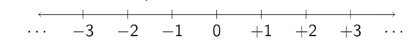

# Natural Numbers and Integers

---
## Natural Numbers

- Numbers keep a count of objects
- $1,2,3,4, \cdots$
- $0$ to represent no objects at all
- Natural numbers, $  \mathbb{N} = \{0,1,2, 3 ,\cdots \} $
  - Sometimes $ \mathbb{N}_0$ to emphasize $0$ is inlcuded
- Addition, subtraction, multiplication, division
  - Which of these always produce a natural number as the answer?
    - Addition
    - multiplication

---
## Integers

- $5-6$ is not a natural number
- Extend the natural number with negative numbers
- $-1,-2,-3,\cdots$
- Integers: $\mathbb{Z} = \{\cdots, -3,-2,-1,0,1,2,3,\cdots \}$
- Number line 

---
## Multiplication and Exponentiation

### Multiplication
- $7 \times 4$ - make 4 groups of 7
- $m \times n = \underbrace{m+m+m+\cdots+m}_{n \space times}$
  - Notation: $m \times n, m \cdot n, mn$
- multiplication is repeated Addition
- Sign rule for multiplying negative numbers 
  - $-m \times n = -(m \cdot n), -m \times -n = m \cdot n$
- If we have even number of minus sign, we get an positive number and if we have odd number of minus sign we get a negative number.

### Exponentiation

- Just like we have done repeated addition, we can also do repeated multiplication
- $m \times m = m^2$ $\to$ m squared
- $m \times m \times m = m^3$ $\to$ m cubed
- $m^k = \underbrace{m \times m \times \cdots \times m}_{k \space times}$ $\to$ m to the power k 

---
## Division 

- Division is repeated substraction
- 

