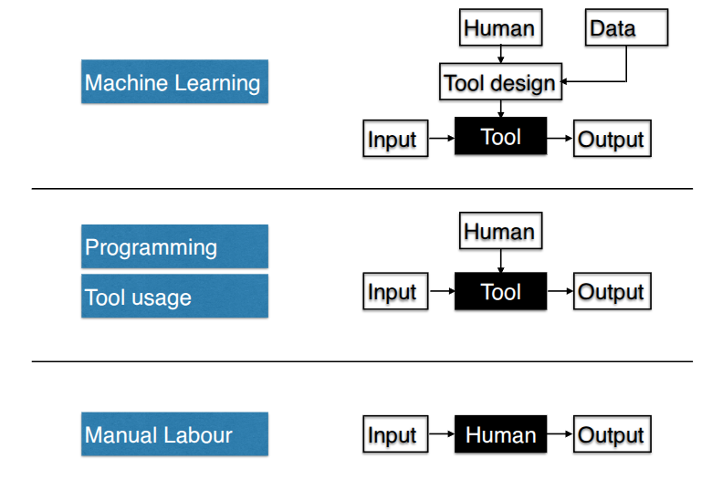
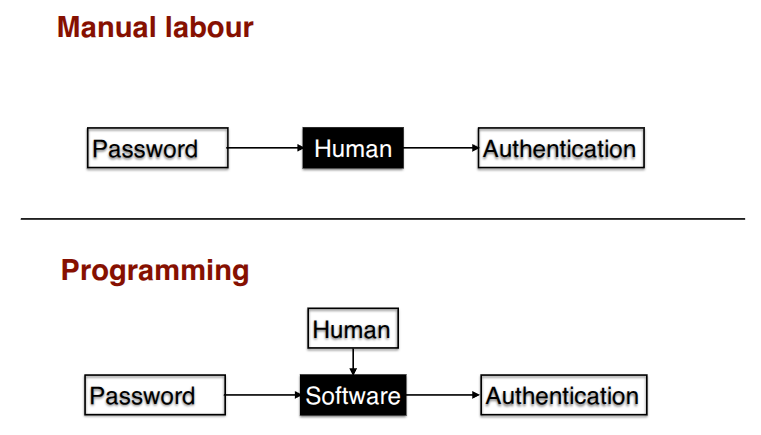
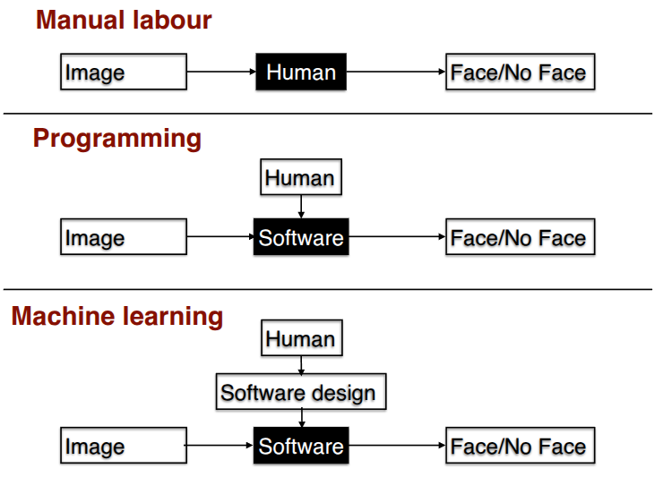
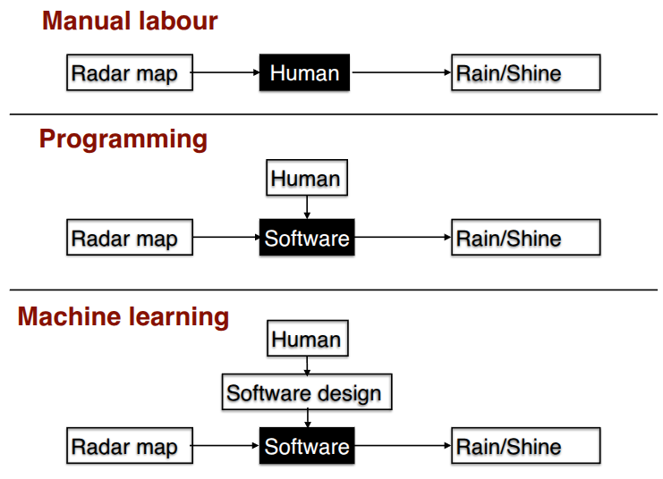
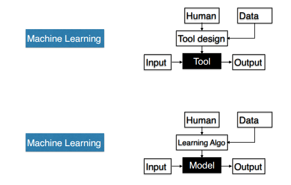

# Introduction to Machine Learning

---
## Definition

- Machine learning is the study of computer algorithms that improve automatically through experience and by the use of data.

---
## Examples of ML Applications

- Weather prediction
- Face Detection
- Spam classifier
- Recommendation engines
- Robotics
- Software assitants
- Game playing
- customer churn 

---
## Task Hierarchy

---
## Why and When Machine Learning?

1. Programming/Human Labour Fails
   1. Scale/Speed/Cost of human labor 
   2. Inability to express rules using language.
   3. Don't know the exact rules transforming input to output
2. Machine Learning can succeed
   1. Have lots of example data
   2. Have some structural idea on the rules

---
## Task Analysis: Password Verify

- Problems with manual labour 
  - Scale: Having humans check login details of every login is impractical
- Problems with Programming
  - None.
- Machine Learning not required

---
## Task Analysis: Face Detection

- Problems with manual labour 
  - Scale: Having humans check all faces of every image is impractical 
- Problems with Programming
  - Expressing face/not face in code is impossible.
- Case for Machine Learning
  - Lots of images available

---
## Task Analysis: Weather prediction

- Problems with manual labour
  - Humans just do not know the full rules and can't process that much information
- Problems with Programming
  - Cannot code unknown rules.
- Case for Machine Learning
  - Lots of weather data available 

---
## What is Data?

- Data is a collection of vectors.
- Metadata is information on the data.

---
## What is a Model ?

- A model is a mathematical simplification of reality

### Some examples

- The Ideal Gas model
- Inverse square law for gravitation attraction
- Moore's Law for semiconductors 
- cobb-Douglas model in Economics

> [!NOTE]
> "All models are wrong, but some are useful"

---
## Types of Models in ML 

- Predictive Model 
  - Regression Model
  - Classification Model 
  - ....
- Probabilistic Model 
  - ...

---
## Probabilistic Models 

### Regression Model 

Model the price of a house on its area and distance to metro

Example good model: 

$$
Price = 0.5 * Area - distance
$$

### Classification Model

Model whether a house is closer than 2kms to a metro based on price and area

Example good model:

$$
Answer = \begin{cases}
          \text{Close}, & \text{if 2 * ROOMS-PRICE < 1 } \\
          \text{Far}, & \text{otherwise} 
         \end{cases}
$$ 

---
## Probabilistic Models 

What is the probability that a randomly chosen person is in lat-long : (25N,30E)?

What is the probability that a given tweet was generated by Mr.Chopra?

---
## Learning Algorithms 

Learning Algorithms: Data $\to$ Models 

Choose from a collection of models, with same structure but different **parameters**.

Example:

$$
Price = a*(area) + b*\text{( \# rooms)} + c * \text{(distance to metro)}
$$

Parameters: a,b,c

Use data to get the "**best**" parameters 

---
## Machine Learning Tasks Revisited 

---
## Notation

- $\mathbb{R}$: Real numbers, $\mathbb{R}_+$: Positive reals, $\mathbb{R}^d$: d-dimensional vector of reals.
- x: vector. $x_j$: j-th co-ordinate. $\|x\|$: length of vector x.
- $x^1, x^2, \cdots, x^n$:Collection of n vectors.
- $x_j^i:j^{th}$ co-ordinate of $i^{th}$ vector.
- $(x_1)^2$: square of the first co-ordinate of the vector x 
- $1(2 \text{ is even)} = 1, 1(2 \text{ is odd}) = 0$

---
### Supervised Learning 

- Supervised learning is curve-fitting.
- Given $\{(x^1, y^1), (x^2, y^2), \cdots,  (x^n, y^n)\}$
- Find a model $f$ such that $f(x^i)$ is close to $y^i$

---
## Regression

- E.g. Predict house price from room, area, distance.
- Training data: $\{(x^1, y^1), (x^2, y^2), \cdots,  (x^n, y^n)\}$
- $x^i \in \mathbb{R}^d, y^i \in \mathbb{R}$
- Algorithm outputs a model $f:\mathbb{R}^d \to \mathbb{R}$
- Loss $= \frac{1}{n} \sum_{i=1}^n(f(x^i)-y^i)^2$
- $f(x) = w^Tx + b = \sum_{j=1}^d w_jx_j + b$

---
## Classification

- Predict if rooms > 3 from area and price
- Training data: $\{(x^1, y^1), (x^2, y^2), \cdots,  (x^n, y^n)\}$
- $x^i \in \mathbb{R}^d, y^i \in \{+1,-1\}$
- Loss $\frac{1}{n} \sum_{i=1}^n 1(f(x^i) \neq y^i)$
- $f(x) = sign(w^Tx + b)$

---
## Model Evaulation: Test Data

- Learning algorithm uses training data  $\{(x^1, y^1), (x^2, y^2), \cdots,  (x^n, y^n)\}$ to get model $f$.
- But evaluating the learned model must **not** be done on the training data itself.
- Use test data that is not in the training data for model evaluation.

---
## Model Selection: Validation Data 

- Learning algorithm just find the "best" model in the collection of models given by the human 
- How to find the right collection of models?
- This is called model selection, and it is done by using another subset of data called **validation data** that is distinct from train and test data.

---
## Unsupervised Learning

- Unsupervised learning is 'understanding data'
- Data: $\{x^1, x^2, \cdots, x^n \}$
- $x^i \in \mathbb{R}^d$
- Build models that compress, explain and group data.

---
## Unsupervised Learning Application

Group the million tweets into 10 manageable groups.

---
## Dimensionality Reduction

- Data: $\{x^1, x^2, x^3, \cdots , x^n\}$
- $x^i \in \mathbb{R}^d$
- Encoder $f: \mathbb{R}^d \to \mathbb{R}^{d^\prime}$
- Decoder $g : \mathbb{R}^{d^\prime} \to \mathbb{R}^d$
- Goal: $g(f(x^i)) \approx x^i$
- Loss $=\frac{1}{n} \sum_{i=1}^n \|g(f(x^i)) - x^i\|^2 $

> [!NOTE]
> $$d^\prime << d$$

---
## Density Estimation

### Example

- Assuming tweets from an account are independently generated randomly. Create a robot account that generates more such tweets.
- To generate such sentences randomly, we need to be able to assign a probability score to every possible 123 character sentence, giving hgih scores to those that are likely to be from the original source.
- A density estimation model takes in several samples from a random source, and outputs a model that assigns a probability score to every possible instance.

### Explanation

- Data: $\{x^1, x^2, \cdots, x^n \}$
- $x^i \in \mathbb{R}^d$
- Probability mapping $P: \mathbb{R}^d \to \mathbb{R}_+$ that sums to one 
- Goal: $P(x)$ is large is $x \in Data$, and low otherwise
- Loss $= \frac{1}{n} \sum_{i-1}^n - log(P(x^i))$

