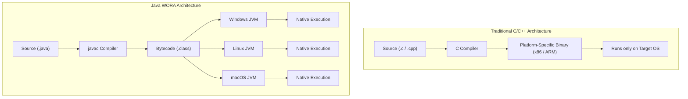

# Introduction to Java & Programming Paradigms

- Programming languages provide abstractions over raw machine hardware
- Evolution of programming paradigms:
  - **Imperative / Procedural Programming**: Step-by-step state modifications (C, Pascal)
  - **Functional Programming**: Pure mathematical functions without mutable state (Lisp, Haskell)
  - **Object-Oriented Programming (OOP)**: Cooperating entities combining data (State) and operations (Behavior) (Java, C++, Python)

---

# Why Java?




- Designed by James Gosling at Sun Microsystems (1995)
- Core Design Philosophy: **"Write Once, Run Anywhere" (WORA)**
- Solved the platform dependency problem of compiled C/C++ binaries:

```text
C/C++ Approach:
Source (.c) ----[C Compiler]----> Platform-Specific Machine Code (x86 / ARM / Windows / Linux)

Java Approach:
Source (.java) ----[javac]----> Bytecode (.class) ----[JVM]----> Native Machine Execution
```

- **Java Virtual Machine (JVM)**: Executes platform-independent bytecode
- High productivity: Automatic memory management (Garbage Collection), strong type safety, rich standard libraries, robust exception handling.

---

# Key Features of Java

- **Simple & Familiar**: Clean C-like syntax while eliminating confusing/unsafe features like explicit pointer arithmetic and manual memory deallocation (`malloc`/`free`).
- **Object-Oriented**: Almost everything in Java revolves around classes and objects.
- **Robust & Secure**: Strict compile-time and runtime type checking, array boundary enforcement, sandboxed execution model.
- **Architecture-Neutral & Portable**: Standardized primitive sizes across all platforms (`int` is always 32-bit two's complement).
- **Multithreaded**: Built-in language-level primitives for concurrent execution (`synchronized`, threads).

---

# Summary

- Programming paradigms determine how we model problems and structure solutions
- Java balances performance and developer productivity using the **JVM Bytecode Architecture**
- Eliminates manual pointer management and memory leaks via the **Garbage Collector**
- Built from the ground up to support object-oriented design and platform independence
