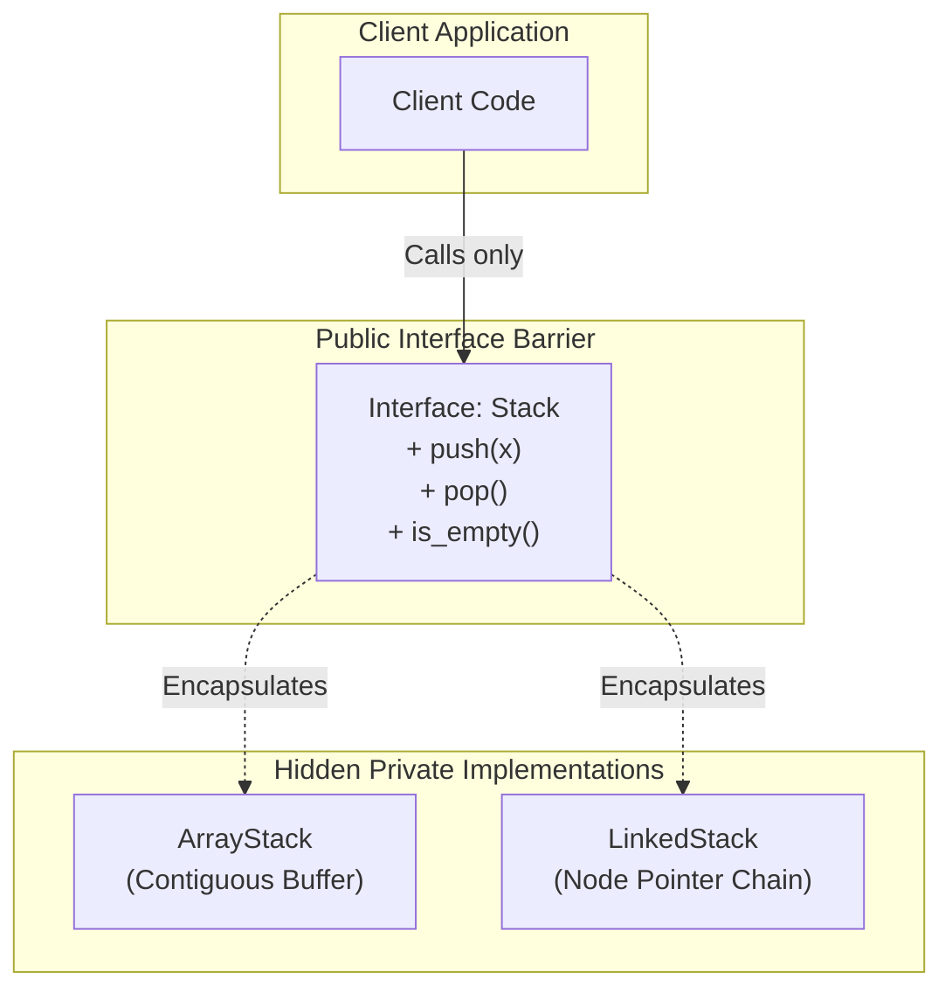

# Managing Software Complexity

- Large software systems contain millions of lines of code
- Two core software engineering principles make large systems manageable:
  1. **Abstraction**
  2. **Modularity**

---

# 1. Abstraction (Separation of Concerns)




- **Abstraction**: Highlighting essential features while hiding background implementation details
- **Interface vs Implementation**:
  - The **Interface** defines *what* an entity does (contract / capabilities)
  - The **Implementation** defines *how* it does it internally

```text
+-------------------------------------------------------+
|                    PUBLIC INTERFACE                   |
|   push(x), pop(), is_empty()                          |
+-------------------------------------------------------+
                           |
                           v
+-------------------------------------------------------+
|                 PRIVATE IMPLEMENTATION                |
|   - Dynamically resized array or linked list          |
|   - Internal pointer tracking                         |
+-------------------------------------------------------+
```

- A client using a `Stack` only cares that `push()` and `pop()` work correctly; they should not care whether it is implemented with an array or a linked list.

---

# 2. Modularity, Cohesion, and Coupling

- **Modularity**: Decomposing a large monolithic system into self-contained, independent units (modules / classes).
- **Cohesion**: How strongly related the responsibilities inside a single module are
  - *Goal*: **High Cohesion** (each class does one cohesive job well).
- **Coupling**: The degree of direct dependency between different modules
  - *Goal*: **Low / Loose Coupling** (changing one module does not break others).

---

# Summary

- **Abstraction** protects consumers from internal implementation changes by establishing stable public contracts
- **Modularity** breaks complex systems into manageable, interchangeable components
- Good system design strives for **High Cohesion** and **Low Coupling**
