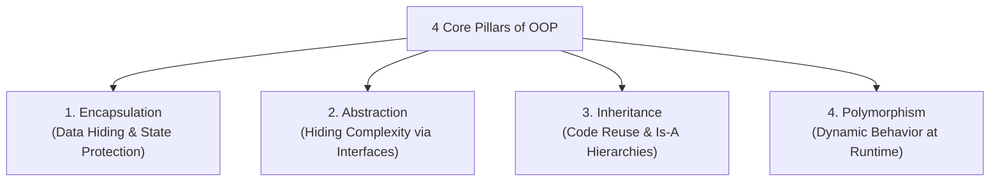

# Core Concepts of Object-Oriented Programming




OOP is built around four fundamental concepts:

```text
         +---------------------------------------+
         |       Object-Oriented Pillars         |
         +---------------------------------------+
          /           |             |                    /            |             |              Encapsulation  Abstraction   Inheritance   Polymorphism
```

---

# The Four Pillars Explained

### 1. Encapsulation (Data Hiding)
- Bundling data (state) and methods (behavior) together inside a single unit (Class)
- Restricting direct external access to internal state using access modifiers (`private`)
- Prevents external code from putting objects into corrupted, inconsistent states.

### 2. Abstraction
- Exposing only relevant high-level operations while hiding complex internal mechanics through interfaces and abstract classes.

### 3. Inheritance (Code Reuse & Hierarchy)
- Mechanism where a new class (subclass) derives properties and behaviors from an existing class (superclass) using `extends`.

### 4. Polymorphism ("Many Forms")
- Ability of different objects to respond to the identical message / method invocation in their own specialized way.

---

# Summary

- **Encapsulation** protects object integrity by hiding state behind public methods
- **Abstraction** simplifies system design by defining clean behavioral contracts
- **Inheritance** enables code reuse and taxonomic hierarchies
- **Polymorphism** allows dynamic, extensible execution at runtime
