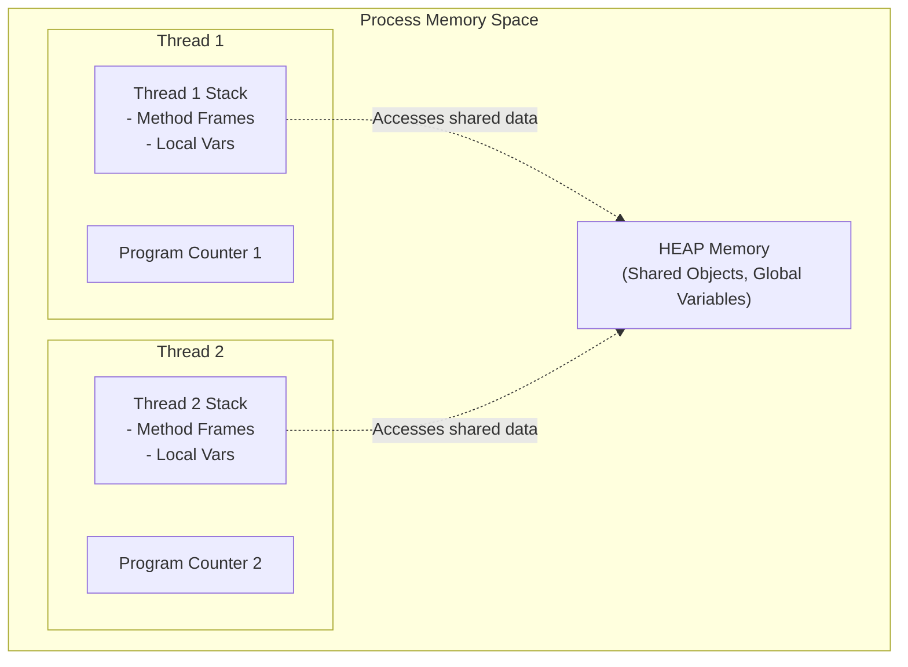

# Concurrency: Threads and Processes




- **Process**: An independent executing program instance with its own isolated address space, memory, and OS resources.
- **Thread ("Lightweight Process")**: An independent path of execution *within* a process sharing the same process memory (Heap), but possessing its own private Stack and Program Counter (PC).

```text
Process Memory Space:
+-------------------------------------------------------------+
|  HEAP (Shared Objects, Global Data)                         |
+------------------------------+------------------------------+
| Thread 1 Stack Frame         | Thread 2 Stack Frame         |
+------------------------------+------------------------------+
```

---

# Concurrency vs Parallelism

- **Concurrency**: Managing multiple tasks at overlapping time periods (interleaved on a single CPU core).
- **Parallelism**: Executing multiple tasks simultaneously at the exact same physical instant across multiple CPU cores.

---

# Interleaving and Non-Determinism

- Because OS thread schedulers switch execution contexts unpredictably, the order of instruction execution across threads is **non-deterministic**.
- Without synchronization, concurrent programs produce intermittent, impossible-to-reproduce bugs.

---

# Summary

- Threads share Heap memory but maintain private execution Stacks
- Concurrent execution introduces non-deterministic thread interleaving
- Thread safety requires explicit synchronization of shared mutable state
