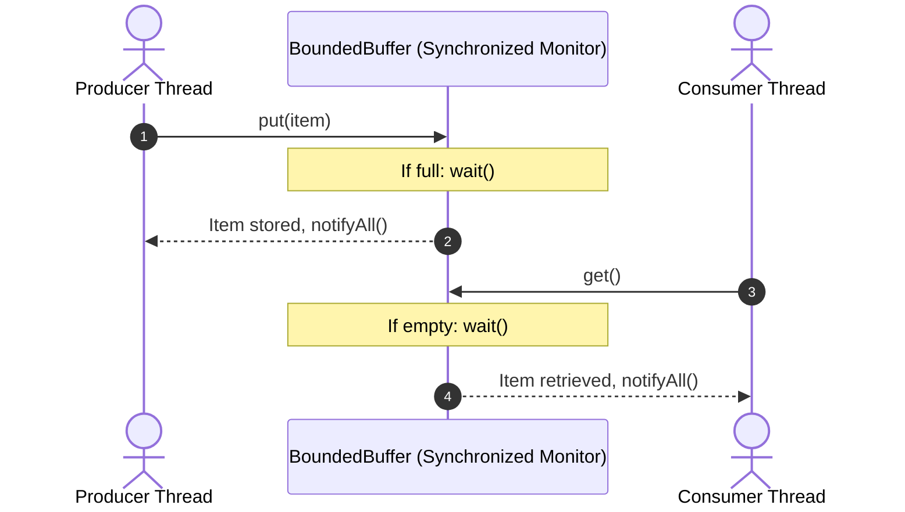

# The Producer-Consumer Bounded Buffer Problem




- A classic concurrent systems problem:
  - **Producers** generate data and place items into a fixed-size buffer.
  - **Consumers** extract and process items from the buffer.
  - **Constraints**: Producer must wait if buffer is full; Consumer must wait if buffer is empty.

---

# Complete Java Monitor Implementation

```java
public class BoundedBuffer {
  private final Object[] buffer;
  private int count = 0;
  private int in = 0;
  private int out = 0;
  private final int capacity;

  public BoundedBuffer(int capacity) {
    this.capacity = capacity;
    this.buffer = new Object[capacity];
  }

  // Producer puts items into the buffer
  public synchronized void put(Object item) throws InterruptedException {
    while (count == capacity) {
      wait(); // Buffer full -> Producer waits
    }
    buffer[in] = item;
    in = (in + 1) % capacity;
    count++;

    notifyAll(); // Notify waiting consumers that data is available
  }

  // Consumer takes items from the buffer
  public synchronized Object get() throws InterruptedException {
    while (count == 0) {
      wait(); // Buffer empty -> Consumer waits
    }
    Object item = buffer[out];
    out = (out + 1) % capacity;
    count--;

    notifyAll(); // Notify waiting producers that space is available
    return item;
  }
}
```

---

# Summary

- Bounded buffer demonstrates circular queue coordination using Java monitors
- `while (count == capacity)` guarantees safety against race conditions and spurious wakeups
