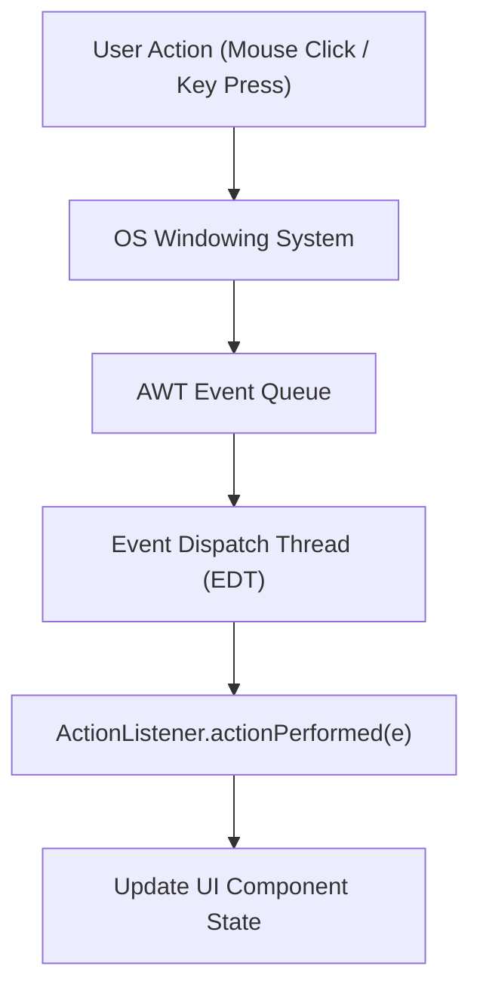

# Event-Driven Programming Paradigm




- Traditional CLI programs follow a **linear execution flow**:
  ```text
  Start ---> Prompt User ---> Read Input ---> Compute ---> Output ---> Terminate
  ```
- **GUI & Event-Driven Applications** invert control (**Inversion of Control**):
  - The application initializes UI components and enters an infinite **Event Loop**
  - The application sits idle waiting for external events (mouse clicks, keystrokes, window resizing, timer alarms)
  - When an event occurs, the system invokes registered **Event Handler callbacks**.

```text
[ User Action: Click Button ]
            |
            v
[ OS / Window Manager Event Queue ]
            |
            v
[ Java Event Dispatch Thread (EDT) ]
            |
            v
[ Calls registered ActionListener.actionPerformed(e) ]
```

---

# Key Concepts

1. **Event Source**: The UI component generating the event (`JButton`, `JTextField`).
2. **Event Object**: Encapsulates event metadata (`ActionEvent` containing timestamp, source).
3. **Event Listener**: An interface defining callback methods that handle the event.

---

# Summary

- Event-driven programming responds reactively to user actions via callback handlers
- UI systems rely on dedicated Event Dispatch Threads to process events sequentially
