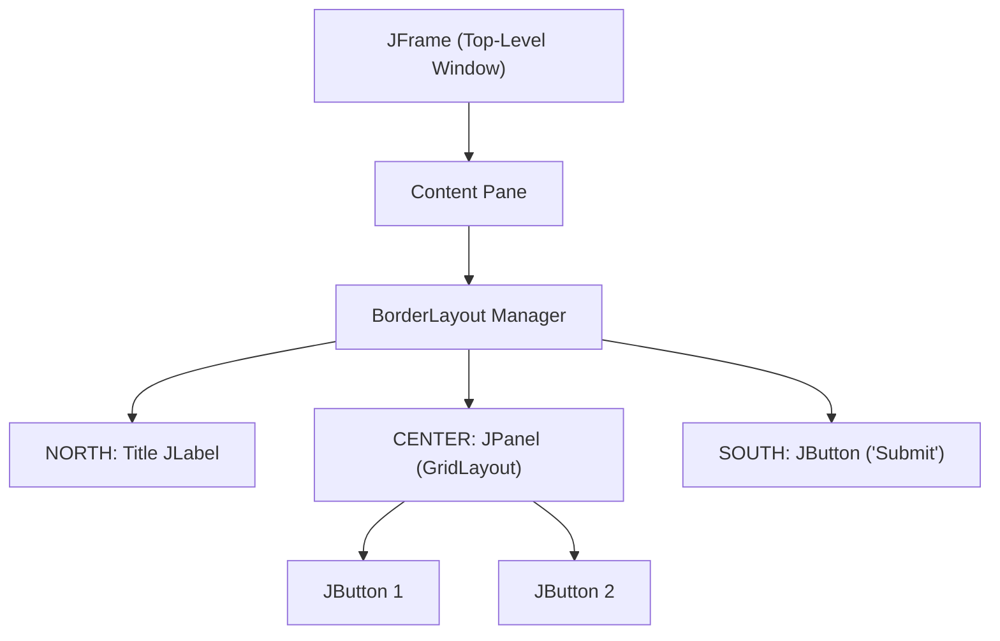

# The Java Swing Toolkit

- **Swing**: Java's standard GUI toolkit built on top of AWT (Abstract Window Toolkit).
- **Lightweight Components**: Written purely in Java, rendered identically across all platforms without relying on native OS peer widgets.

---

# Core Swing Components

### 1. Top-Level Containers:
- `JFrame`: Main desktop application window with title bar and minimize/close buttons.
- `JDialog`: Pop-up dialog window.

### 2. Basic Widgets:
- `JButton`: Clickable action button.
- `JLabel`: Display text or images.
- `JTextField`: Single-line text input.
- `JPanel`: Intermediate container for grouping widgets.

---

# Layout Managers

Swing uses **Layout Managers** to automatically position and size components responsively across different screen resolutions:

| Layout Manager | Behavior |
| :--- | :--- |
| **`FlowLayout`** | Places components left-to-right in a row, wrapping to next line if needed. |
| **`BorderLayout`** | Divides window into 5 regions: `NORTH`, `SOUTH`, `EAST`, `WEST`, `CENTER`. |
| **`GridLayout`** | Arranges components in a strict equal-sized grid of rows and columns. |

---

# Summary

- Swing provides platform-independent lightweight GUI widgets
- Top-level windows (`JFrame`) contain panels and widgets organized by Layout Managers
