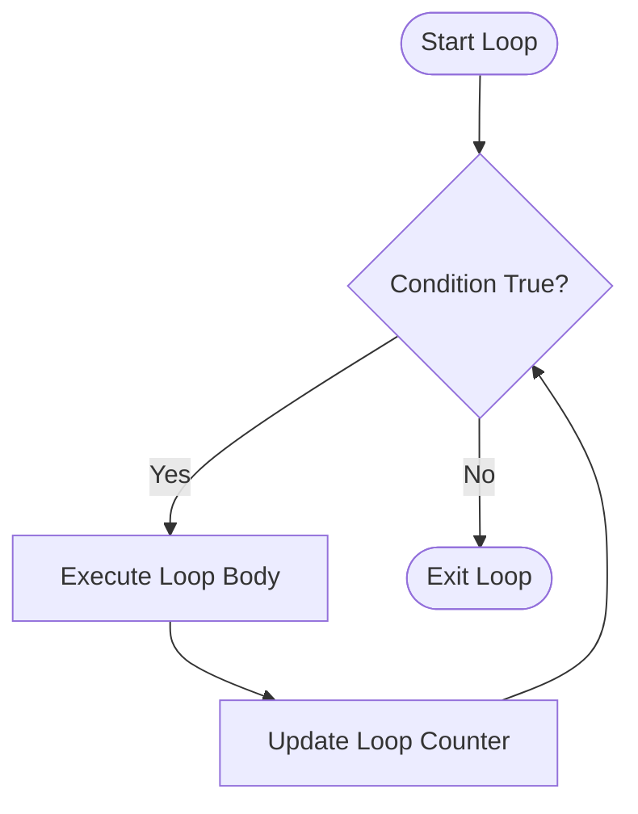

# Control Flow Structures in Java

Java supports standard procedural control flow structures:

---

# 1. Conditionals

### `if-else` Construct:
```java
if (score >= 90) {
  grade = 'A';
} else if (score >= 80) {
  grade = 'B';
} else {
  grade = 'C';
}
```

### `switch` Statement:
```java
switch (day) {
  case 1: dayName = "Monday"; break;
  case 2: dayName = "Tuesday"; break;
  default: dayName = "Weekend"; break;
}
```

---

# 2. Loops




### `while` and `do-while`:
```java
// while: condition checked before body execution
while (n > 0) {
  n /= 2;
}

// do-while: body executed at least once
do {
  processInput();
} while (hasMoreData());
```

### Standard `for` and Enhanced `for-each`:
```java
// Standard for loop
for (int i = 0; i < arr.length; i++) {
  System.out.println(arr[i]);
}

// Enhanced for-each loop (read-only traversal)
for (int val : arr) {
  System.out.println(val);
}
```

---

# Summary

- Control flow in Java mirrors standard C syntax
- `break` exits loops immediately; `continue` jumps to the next iteration
- Enhanced `for-each` provides clean syntax for iterating arrays and collections
