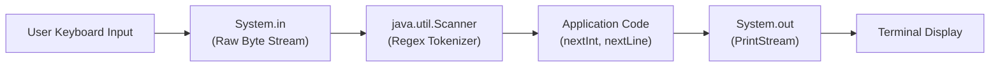

# Basic Input & Output in Java




Java standard library provides robust I/O capabilities through `System.out` and `java.util.Scanner`.

---

# Standard Output (`System.out`)

```java
// Print without newline
System.out.print("Hello ");

// Print with automatic newline
System.out.println("World!");

// Formatted print (similar to printf in C)
String name = "Alice";
int score = 95;
double gpa = 3.85;
System.out.printf("Student: %s | Score: %d | GPA: %.2f%n", name, score, gpa);
```

---

# Standard Input with `Scanner`

- `Scanner` parses primitive types and strings using regular expressions:

```java
import java.util.Scanner;

public class InputExample {
  public static void main(String[] args) {
    Scanner sc = new Scanner(System.in);

    System.out.print("Enter your name: ");
    String name = sc.nextLine(); // Reads full line

    System.out.print("Enter your age: ");
    if (sc.hasNextInt()) {
      int age = sc.nextInt();
      System.out.println("Hello " + name + ", you are " + age + " years old.");
    } else {
      System.out.println("Invalid age input!");
    }

    sc.close();
  }
}
```

---

# Summary

- `System.out.println` and `printf` provide formatted console output
- `java.util.Scanner` reads tokens and lines from `System.in`
- Always validate input with `hasNextInt()`, `hasNextDouble()` before reading
