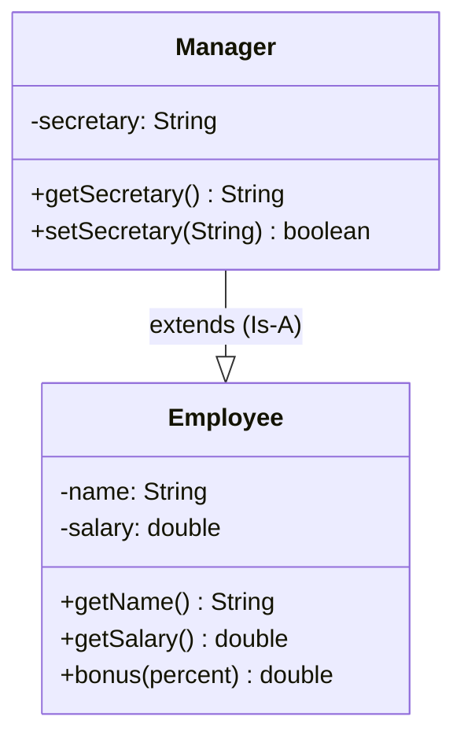

# A Java Class

- Consider a standard `Employee` class in Java:
  - Private instance variables for encapsulation
  - Constructors to initialize state
  - Accessor (`get`) and mutator (`set`) methods
  - Business logic methods (e.g., `bonus`)

```java
public class Employee {
  private String name;
  private double salary;

  // Constructors
  public Employee(String n, double s) {
    name = n;
    salary = s;
  }

  public Employee(String n) {
    this(n, 50000.00); // Constructor chaining using this()
  }

  // Mutator methods
  public boolean setName(String s) { ... }
  public boolean setSalary(double x) { ... }

  // Accessor methods
  public String getName() { return name; }
  public double getSalary() { return salary; }

  // Other methods
  public double bonus(float percent) {
    return (percent / 100.0) * salary;
  }
}
```

---

# Subclasses




- Often, a new category of entity is a specialized version of an existing class
- For example, a `Manager` is an `Employee` with additional responsibilities:
  - Has all attributes of an employee (`name`, `salary`)
  - Has extra attributes (e.g., a `secretary`)
- In Java, we use the keyword **`extends`** to create a subclass:

```java
public class Manager extends Employee {
  private String secretary;

  public boolean setSecretary(String s) {
    secretary = s;
    return true;
  }

  public String getSecretary() {
    return secretary;
  }
}
```

- `Manager` is a **subclass** (child / derived class) of `Employee`
- `Employee` is the **superclass** (parent / base class) of `Manager`
- `Manager` objects automatically inherit public/protected fields and methods from `Employee`

---

# Subclass Visibility and `super`

- **Critical Rule**: Subclasses **cannot** directly access private instance variables of the parent class!
  - `Manager` cannot directly write `name = "Alice";` or read `salary` directly
- How does a `Manager` constructor initialize private variables defined in `Employee`?
  - Use the **`super`** keyword to invoke the parent class constructor!

```java
public class Manager extends Employee {
  private String secretary;

  public Manager(String n, double s, String sn) {
    super(n, s);       // Calls Employee(String, double) constructor
    secretary = sn;    // Initializes Manager's own field
  }
}
```

- `super(...)` must be the **very first statement** inside the subclass constructor
- If no explicit call to `super(...)` is written, Java automatically inserts a call to the default parent constructor `super()`

---

# Type Compatibility and Substitution

- Inheritance models an **"Is-A"** relationship:
  - Every `Manager` is an `Employee`
  - But **not** every `Employee` is a `Manager`!
- Therefore:
  - We can always assign a subclass object to a superclass variable (**Subtyping / Widening**):
    ```java
    Employee e = new Manager("Alice", 80000.0, "Bob"); // Perfectly legal!
    ```
  - But we cannot assign a superclass object to a subclass variable:
    ```java
    Manager m = new Employee("Charlie", 50000.0); // Compilation Error!
    ```

---

# Array Allocation and Inheritance

- Recall array declaration in Java:
  ```java
  int[] a = new int[100];
  ```
- Because `Manager` is a subtype of `Employee`, an array of `Employee` references can hold `Manager` objects:
  ```java
  Employee[] staff = new Employee[3];
  staff[0] = new Employee("Alice", 50000.0);
  staff[1] = new Manager("Bob", 80000.0, "Eve");
  staff[2] = new Employee("Charlie", 45000.0);
  ```
- This enables collections of heterogeneous objects under a unified parent type

---

# Summary

- A subclass extends a parent class using the `extends` keyword
- The subclass inherits all accessible instance variables and methods from the superclass
- The subclass can add new instance variables and methods
- Subclasses cannot directly access `private` fields of the superclass
- Use `super(...)` to invoke the superclass constructor from the subclass constructor
- An object of a subclass can always be assigned to a reference variable of its superclass (`Employee e = new Manager(...)`)
