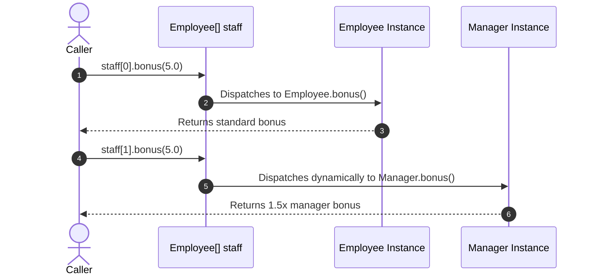

# Method Overriding

- A subclass can redefine a method already present in its superclass
- The method in the subclass must have the **exact same name and parameter signature**
- Example: `Manager` receives a higher bonus calculation (e.g., $1.5\times$ the standard bonus):

```java
public class Manager extends Employee {
  private String secretary;

  // Overriding bonus() method of Employee
  public double bonus(float percent) {
    return 1.5 * super.bonus(percent); // Uses super.bonus() to reuse parent calculation
  }
}
```

- `super.bonus(percent)` explicitly calls the implementation in `Employee` to avoid infinite recursion

---

# Static Type vs Dynamic Type

- Consider the following assignment:
  ```java
  Employee e = new Manager("Alice", 80000.0, "Bob");
  ```
- **Declared (Static) Type**: `Employee` (known at compile-time)
- **Actual (Dynamic) Type**: `Manager` (created at run-time in the heap)

### Compile-Time Static Checking:
- Can we call `e.setSecretary("Bob")`?
  - **No!** The compiler only looks at the declared type (`Employee`), which does not contain `setSecretary()`.

### Run-Time Method Resolution:
- What happens when we call `e.bonus(5.0)`? Which method executes?
  - **Option A (Static Binding)**: Invoke `Employee.bonus()` based on variable type `Employee`.
  - **Option B (Dynamic Binding)**: Invoke `Manager.bonus()` based on actual runtime object `Manager`.
- Java uses **Dynamic Dispatch (Late Method Binding)** by default!

---

# Dynamic Dispatch and Runtime Polymorphism




- **Dynamic Dispatch**: The decision of which method implementation to execute is deferred until run-time, based on the actual type of the object pointed to by the reference.
- **Polymorphism ("Many Forms")**: Different subclasses respond to the same method invocation in their own specialized way.

```java
Employee[] staff = new Employee[3];
staff[0] = new Employee("Alice", 50000.0);
staff[1] = new Manager("Bob", 80000.0, "Eve");
staff[2] = new Employee("Charlie", 45000.0);

for (int i = 0; i < staff.length; i++) {
  // Dynamic dispatch selects Employee.bonus() for staff[0], staff[2]
  // and Manager.bonus() for staff[1] automatically!
  System.out.println(staff[i].getName() + " Bonus: " + staff[i].bonus(5.0f));
}
```

- Every object in the array "knows" how to calculate its own bonus correctly!

---

# Historical Motivation: Simula Event Loop

- The concept of dynamic dispatch originated in **Simula 67** for discrete-event simulations:

```text
Q := make-queue(initial events)
repeat
    remove next event e from Q
    simulate e                     <-- Each event e knows how to simulate itself!
    place new events generated by e on Q
until Q is empty
```

- Without polymorphism, the simulation loop would require massive, error-prone `switch`/`if-else` chains checking event types

---

# Method Overloading vs Method Overriding

| Feature | Method Overloading | Method Overriding |
| :--- | :--- | :--- |
| **Location** | Within the same class | Between Superclass and Subclass |
| **Method Name** | Same | Same |
| **Parameter Signature** | **Must be different** (type/count/order) | **Must be identical** |
| **Binding Mechanism** | **Static (Compile-time)** | **Dynamic (Run-time / Late Binding)** |
| **Example** | `Arrays.sort(int[])`, `Arrays.sort(double[])` | `Manager.bonus()` overriding `Employee.bonus()` |

---

# Type Casting and `instanceof`

- When a subclass object is stored in a superclass reference (`Employee e`), how can we access subclass-specific methods?
- We must perform an explicit **Downcast**:

```java
Employee e = new Manager("Alice", 80000.0, "Bob");

// Cast e from Employee to Manager
Manager m = (Manager) e;
m.setSecretary("David");

// Or directly:
((Manager) e).setSecretary("David");
```

### Safety with `instanceof`:
- If `e` is actually a plain `Employee` (not a `Manager`), downcasting throws a runtime `ClassCastException`!
- Always check the dynamic type using the **`instanceof`** operator before downcasting:

```java
if (e instanceof Manager) {
  Manager m = (Manager) e;
  m.setSecretary("David");
}
```

---

# Summary

- **Overriding**: A subclass redefines a method with the exact same signature as the superclass
- **Dynamic Dispatch**: Java resolves method calls at run-time based on the actual object instance, enabling **Runtime Polymorphism**
- **Overloading** is resolved statically at compile-time using argument types; **Overriding** is resolved dynamically at run-time
- Use `super.methodName()` to invoke the parent class's version of an overridden method
- Use `instanceof` to safely inspect an object's dynamic type before downcasting
