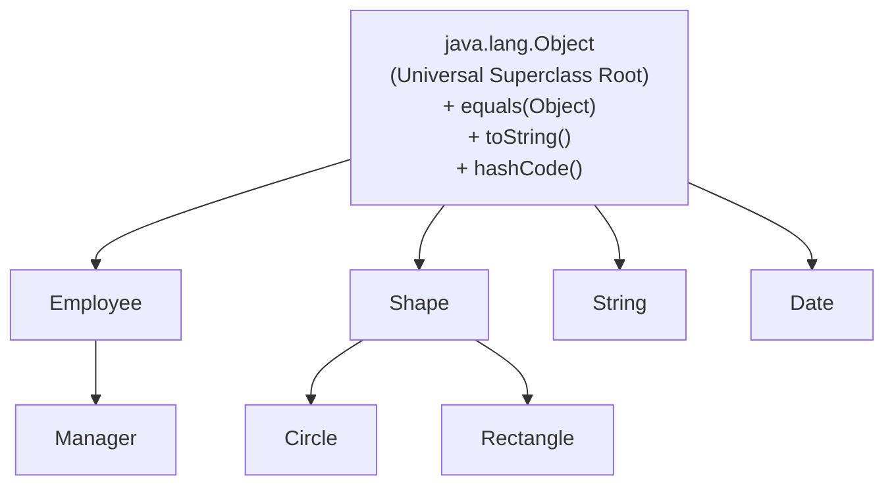

# Multiple Inheritance and The Diamond Problem

- In multiple inheritance, a single class can extend multiple parent classes:
  ```text
      C1 (defines f())     C2 (defines f())
              \             /
               \           /
             C3 extends C1, C2
  ```
- **The Ambiguity**: If `C3` calls `f()` without overriding it, which implementation should it inherit? `C1`'s or `C2`'s?
- **Java's Solution**: Java strictly **disallows multiple inheritance of classes**
  - A class can have only one direct superclass (`extends ClassName`)
  - The Java class hierarchy forms a strict, well-defined **tree**

---

# The Universal Superclass: `java.lang.Object`




- At the root of the entire Java class hierarchy sits a single built-in class: **`java.lang.Object`**
- If a class declaration does not explicitly use `extends`, Java implicitly makes it extend `Object`:
  ```java
  public class MyClass { ... }
  // is identical to:
  public class MyClass extends Object { ... }
  ```
- Every class in Java is a descendant of `Object` and inherits its default methods.

---

# Essential Methods in `Object`

### 1. `public boolean equals(Object o)`
- Intended to test whether two objects are logically equal in value
- **Default implementation**: Compares reference/pointer equality (`this == o`)
  - Two distinct objects with identical field values will evaluate to `false` unless `equals` is overridden!

### 2. `public String toString()`
- Returns a text representation of the object
- **Default implementation**: Returns `ClassName@HexHashCode`
- Implicitly invoked whenever an object is printed:
  ```java
  System.out.println(myObject); // Automatically calls myObject.toString()
  ```

---

# Generic Functions Using `Object[]`

- Because all classes inherit from `Object`, we can write general algorithms that work on arrays of any object type:

```java
public class SearchUtils {
  // Generic linear search for any object array
  public static int find(Object[] objarr, Object target) {
    for (int i = 0; i < objarr.length; i++) {
      if (objarr[i].equals(target)) { // Uses dynamic dispatch to invoke specific equals()
        return i;
      }
    }
    return -1; // Not found
  }
}
```

---

# The Common Trap When Overriding `equals()`

- Suppose we write a `Date` class and want to compare dates by value:

```java
public class Date {
  private int day, month, year;

  // ❌ SUBTLE BUG: This does NOT override Object.equals()!
  public boolean equals(Date d) {
    return (this.day == d.day && this.month == d.month && this.year == d.year);
  }
}
```

### Why is this broken?
- `equals(Date d)` has parameter type `Date`, whereas `Object.equals(Object o)` has parameter type `Object`.
- This is **Method Overloading**, NOT Method Overriding!
- If a generic search function calls `objarr[i].equals(target)` where `objarr[i]` is typed as `Object`, dynamic dispatch will invoke `Object.equals(Object)` (pointer equality), completely skipping `equals(Date)`!

---

# Correct Implementation of `equals()`

- To properly override `equals`, the parameter type must be **`Object`**:

```java
public class Date {
  private int day, month, year;

  // ✅ CORRECT: Exact signature match with Object.equals(Object)
  @Override
  public boolean equals(Object o) {
    // 1. Check if same memory reference
    if (this == o) return true;

    // 2. Check if null or different class type
    if (o instanceof Date) {
      // 3. Safe downcast and field comparison
      Date d = (Date) o;
      return (this.day == d.day && this.month == d.month && this.year == d.year);
    }

    return false;
  }
}
```

---

# Summary

- Java avoids the Diamond Problem by enforcing single class inheritance (a single-rooted tree)
- **`java.lang.Object`** is the universal root superclass for all Java classes
- `Object` provides foundational methods: `equals()`, `toString()`, `hashCode()`, `getClass()`
- Always override `public boolean equals(Object o)` with parameter type `Object` (never subclass type) using `@Override` and `instanceof`
- Generic algorithms can be constructed by accepting `Object` and `Object[]` references
