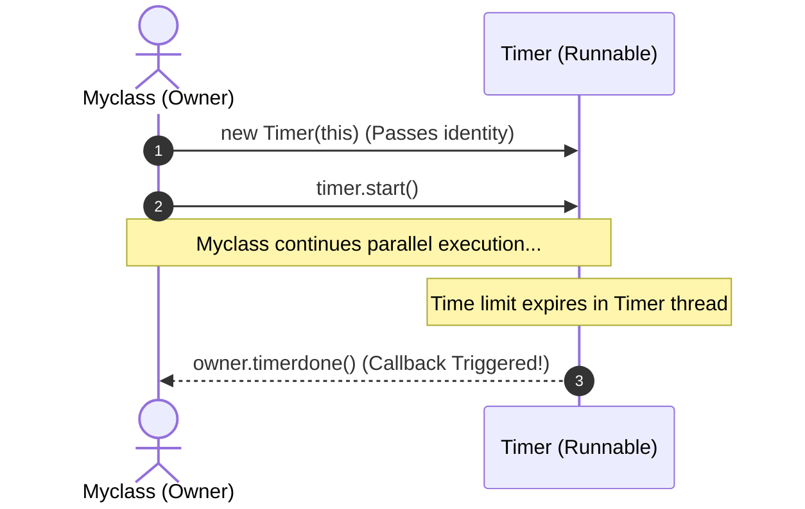
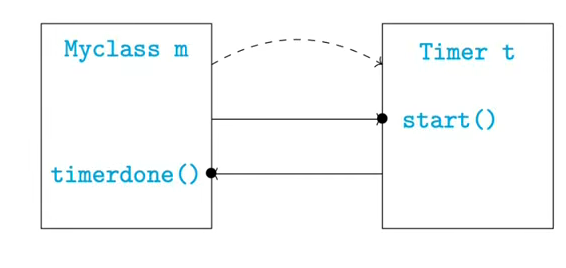

# Implementing a call-back facility




- `Myclass m` creates a `Timer t`



- Start `t` to run in parallel
  - `Myclass m` continues  to run
  - Will see later how to invoke parallel execution in Java!
- `Timer t` notifies `Myclass m` when the time limit expires
  - Assume `Myclass m` has a function `timerdone()`

**Callback**: When we have this kind of function which comes back, so we create an object, we run it in parallel, and then we expect that, that parallel object to call us back when it is done.

---

# Implementing callbacks

- Code for `Myclass`
- `Timer t` should know whom to notify
  - `Myclass m` passes its identity when it creates `Timer t`
- Code for `Timer`
  - Interface `Runnable` indicates that `Timer` can run in parallel

```Java
public class Myclass{
  public void f(){
    Timer t = new Timer(this);
    // this object created t

    t.start(); //Start t
    ...
  }

  public void timerdone(){...}
}
```

```Java
public class Timer implements Runnable{
  // Timer can be invoked in parallel

  private Myclass owner;

  public Timer(Myclass o){
    owner = o; // My creator
  }

  public void start(){
    ...
    owner.timerdone(); // I'm done
  }
}
```

- `Timer` specific to `Myclass`
- Create a generic  `Timer`?

---

# A generic timer

- Use Java class hierarchy
- Parameter of `Timer`constructor of type `Object`
  - Compatible with all caller types
- Need to cast `owner` back to `Myclass`
- This is a limitation and an obstacle to achieve `a generic timer`
  - So, natural thing to use is `Interface`

```java
public class Timer implements Runnable{
  // Timer can be invoked in parallel

  private Object owner;

  public Timer(Object o){
    owner = o; // My creator
  }

  public void start(){
    ...
    ((Myclass) owner).timerdone(); // I'm done
  }
}
```

---

# Use interfaces

- Define an interface for callback

```Java
public interface Timerowner{

  public abstract void timerdone();
}
```

- Modify `Myclass` to implement `Timerowner`

```java
public class Myclass implements Timerowner{
  public void f(){
    Timer t = new Timer(this);
    // this object created t

    t.start(); //Start t
    ...
  }

  public void timerdone(){...}
}
```

- Modify `Timer` so that `owner`is compatible with `Timerowner`

```java
public class Timer implements Runnable{
  // Timer can be invoked in parallel

  private Timerowner owner;

  public Timer(Timerowner o){
    owner = o; // My creator
  }

  public void start(){
    ...
    owner.timerdone(); // I'm done
  }
}
```

---

# Summary

- Callbacks are useful when we spawn a class in parallel
- Spawned object notifies the owner when it is done
- Can also notify some other object when done
  - `owner` in `Timer`need not be the object that create the `Timer`
- Interfaces allow this callback to be generic
  - `owner` has to have the capability to be notified

---

# Assessment

```Java
public class A implements Runnable{
  public void run(){
    System.out.println("t2 thread");
  }
}

public class Example{
  public static void main(String args[]){
    A obj = new A();
    Thread t2 = new Thread();
    t2.start();
    System.out.println("Hello");
  }
}
```

Output: Hello
