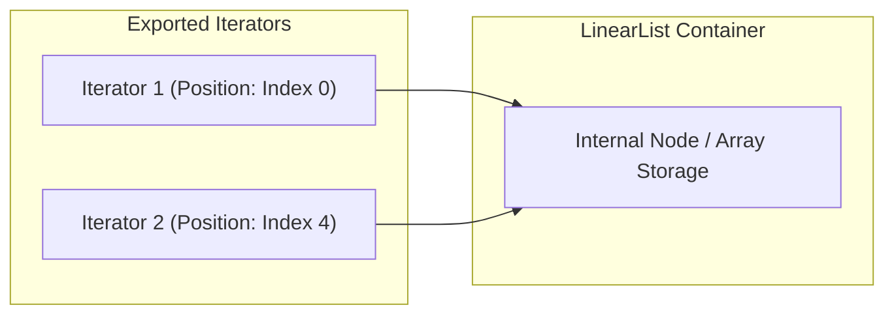

;

# Linear list

- A generic linear list of objects
- Internal implementation may vary
- An array implementation

```Java
public class Linearlist {
  // Array implementation

  private int limit = 100;
  private Object[] data = new Object[limit];
  private int size;	   // Current size

  public Linearlist(){
    size = 0;
  }

  public void append(Object o){
    data[size] = o;
    size++;
    ...
  }
  ...
}
```

- An Linked list implementation

```Java
public class Linearlist{
  private Node head;
  private int size;

  public Linearlist(){
    size = 0;
  }

  void append(Object o){
    Node m;

    for(m = head; m != null, m = m.next){}
    Node n = new Node(o);
    m.next = n;

    size++;
  }

  private class Node{
    ...
  }
}
```

---

# Iteration




- Want a loop to run through all values in a linear list
- If the list is an array with public access, we write this

```Java
int i;
for(i=0; i<data.length; i++){
  .. // do something with data[i]
}
```

- For a linked list with public access, we could write this

```Java
Node m;
for (m=head; m != null ; m=m.next){
  ... // do something with m.data
}
```

- We don't have public access ...
- ... and we don't know which implementation is in use!

---

- Need the following abstraction

```Java
Start at the beginning of the list;
while (there is a next element){
  get the next element;
  do something with it
}
```

- Encapsulate this functionality in an interface called `Iterator`

```Java
public interface Iterator{
  public abstract boolean has_next();
  public abstract Object get_next();
}
```

---

- How do we implement `Iterator` in `Linearlist`?
- Need a "pointer" to remember position of the iterator
- How do we handle nested loops?

```Java
for(i=0;i < data.length; i++){
  for(j=0;j < data.length; j++){
    ... // do something with data[i] and data[j]
  }
}
```

- We don't typically need one iterator, we need multiple iterator which run independently

---

Solution: Create an `Iterator` object and export it!

```Java
public class Linearlist{

  private class Iter implements Iterator{
    private Node position;
    private Iter(){...} //Constructor
    public boolean has_next(){...}
    public Object get_next(){...}
  }

  // Export a fresh Iterator
  public Iterator get_iterator(){
    Iter it = new Iter();
    return it;
  }
}
```

- Definition of `Iter` depends on linear list

---

- Now, we can traverse the list externally as follows:

```Java
Linearlist l = new Linearlist();
...

Object o;
Iterator i = l.get_iterator();

while (i.has_next()){
  o = i.get_next();
  ... //do something with o
}
...
```

- For nested loops, acquire multiple iterators!

```Java
Linearlist l = new Linearlist();
...
Object oi, oj;
Iterator i,j;

i = l.get_iterator();
while(i.has_next()){
  oi = i.get_next();
  j = l.get_iterator();
  while(j.has_next()){
    oj = j.get_next();
    ... // do something with oi, oj
  }
}
...
```

---

# Summary

- Iterators are another example of interaction with state
  - Each iterator needs to remember its position in the list
- Export an object with a prespecified interface to handle the interaction
- The new Java `for` over lists implicitly constructs and uses an iterator

```Java
for( type x : a){
  do something with x;
}
```

---

# Assessment

## 1. Match the following

- Abstract method : It should be overridden
- Interface : It cannot be initialized
- Iterator : It can be used to loop through collections
- Private class : It allows an additional degree of encapsulation

## 2. Output ?

```Java
import java.util.*;
public class Example{
  public static void main (String[] args)
  {
    ArrayList list = new ArrayList();
    String names[] = {"ram", "shyam", "henry", "joker", "mocker", "locker"};
    for (int i =1; i<names.length; i+=2){
      list.add(names[i]);
    }
    Iterator i = list.iterator();
    while(i.hasNext()){
      System.out.println(i.next());
    }
  }
}
```

Output: Shyam "then in next line" Joker

## 3. Output ?

```Java
import java.util.*;
public class Example{
  public static void main(String args[]){
    ArrayList<String> str = new ArrayList<String>();
    str.add("Joker");
    str.add("Locker");
    for (int i:str){
      System.out.println(i);
    }
  }
}
```

<then in next line></then>
