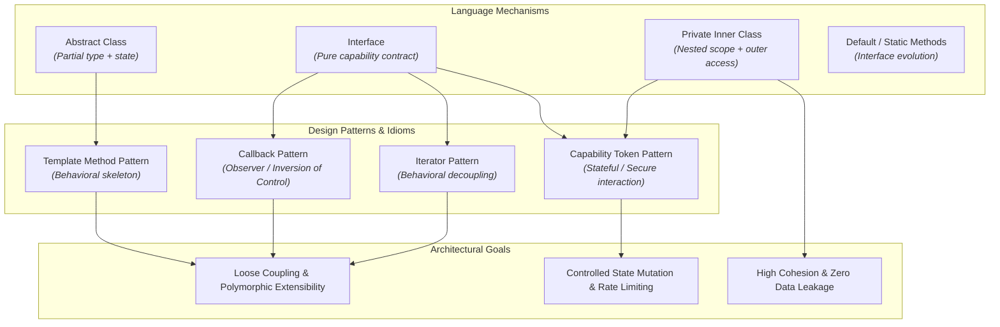
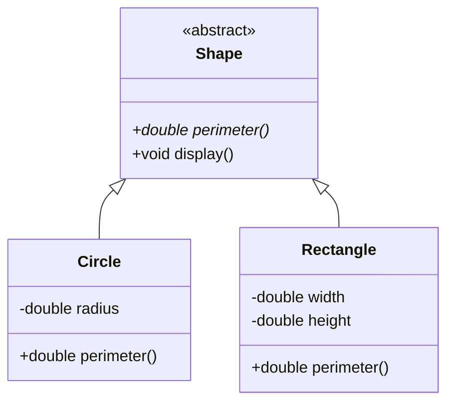
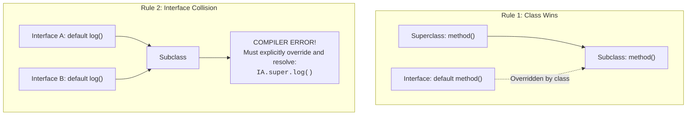
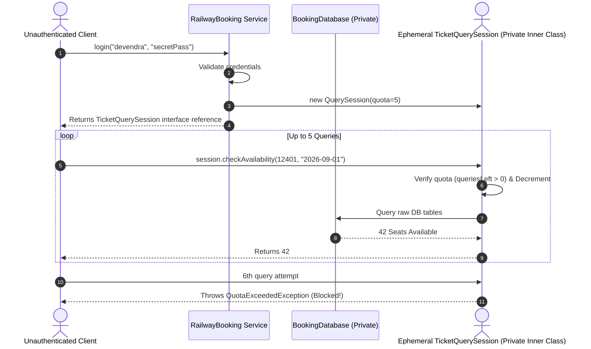
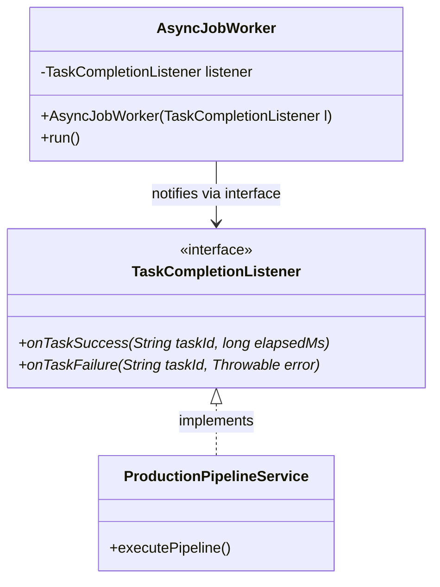
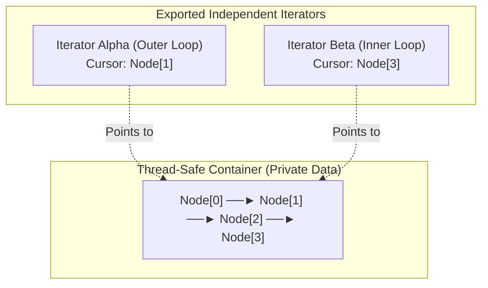

# ☕ Java Week 4 Mastery: Abstract Classes, Interfaces, Inner Classes, Capability Security, Callbacks & Iterators

> **Tag**: `#gennotes` | **Domain**: Java Core, Object-Oriented Architecture, Defensive Design Patterns
> **Source Material**: Week 4 Curriculum (`01_abstract_classes_and_Interfaces.md` through `06_Interators.md`)

---

## 🎯 Learning Objectives

By the end of this study module, you will be able to:
1. **Differentiate & Architect**: Discern precisely when to use an `abstract class` (shared state + partial implementation) versus an `interface` (orthogonal capability contracts).
2. **Resolve API Evolution Conflicts**: Navigate Java 8+ `default` and `static` interface methods, understand the "Class Wins" rule, and resolve multiple-inheritance diamond collisions.
3. **Enforce Zero-Leak Encapsulation**: Use `private inner classes` to hide structural plumbing (e.g., linked list nodes) while preserving public API simplicity.
4. **Implement Capability-Based Security**: Structure stateful, rate-limited object interactions by returning private inner class instances via public interface contracts.
5. **Decouple Asynchronous Systems**: Architect generic, zero-cast callback systems that allow background workers to notify callers without circular dependencies.
6. **Master Decoupled Traversal**: Implement the **Iterator Pattern** from scratch to decouple collection traversal from physical in-memory storage (arrays vs linked chains) and support concurrent, isolated multi-cursor loops.

---

## 🗺️ Conceptual Hierarchy & Taxonomy

Before writing code, we categorize each construct to avoid confusing architectural principles with language mechanisms:



| Construct / Term | Category | Primary Responsibility | Key Invariant |
| :--- | :--- | :--- | :--- |
| **Abstract Class** | Language Feature / Type Skeleton | Defines a base type with optional shared state and mandatory unimplemented method contracts. | Cannot be instantiated directly; exists solely to be extended. |
| **Interface** | Language Feature / Contract | Defines an orthogonal capability or protocol that unrelated classes can implement. | Specifies *what* a component can do, never *how* its internal state is held. |
| **Default Method** | Language Mechanism (Java 8+) | Provides a fallback implementation in an interface to enable backward-compatible API evolution. | Subclass / interface conflicts must be resolved; concrete class methods always take precedence ("Class Wins"). |
| **Private Inner Class** | Encapsulation Mechanism | Binds a helper class strictly to the scope of its enclosing class, granting access to outer private fields. | Completely invisible to outside consumers; prevents internal structural leakage. |
| **Capability Security** | Architectural Pattern | Issues an ephemeral, stateful token (inner object via public interface) that regulates caller actions. | The caller only interacts through the interface; internal database and limits remain shielded. |
| **Callback** | Behavioral Pattern (IoC) | Decouples an asynchronous background task from its originator by passing an interface reference. | The worker does not know the caller's concrete class—only that it satisfies the notification contract. |
| **Iterator** | Behavioral Design Pattern | Decouples collection traversal from underlying data layout (array vs linked nodes) across independent cursors. | Container data structures remain private; each iterator maintains isolated traversal state. |

---

# 1. Abstract Classes vs. Concrete Hacks

## 1.1 The Problem
Suppose we manage geometric objects: `Circle`, `Square`, and `Rectangle`. Every shape must calculate its perimeter:

```java
// Naive approach: Relying on arbitrary dummy defaults
public class Shape {
    public double perimeter() {
        return -1.0; // Magic dummy number: signals "unimplemented"
    }
}
```

### What Goes Wrong
1. **Silent Runtime Bugs**: If a developer creates `Triangle extends Shape` and forgets to override `perimeter()`, the code compiles cleanly. At runtime, calculations propagate negative values (`-1.0`), corrupting physics or rendering engines.
2. **Defeated Discipline**: Correctness relies entirely on human memory rather than compiler enforcement.
3. **Invalid Instantiation**: Code can execute `new Shape()`, which is an incomplete mathematical fiction.

---

## 1.2 The Concept: `abstract class` and `abstract method`
An `abstract method` has no body; it serves as a strict contract that any concrete subclass **must** implement. Any class containing at least one abstract method **must** be declared `abstract`.



### Progressive Implementation
```java
// Production-Aware Base Class
public abstract class Shape {
    private final String id;

    protected Shape(String id) {
        if (id == null || id.isBlank()) {
            throw new IllegalArgumentException("Shape ID cannot be null or blank");
        }
        this.id = id;
    }

    public String getId() {
        return id;
    }

    // MANDATORY CONTRACT: Enforced by the compiler
    public abstract double perimeter();

    // Template Method: Common behavior built on top of abstract contracts
    public void printSummary() {
        System.out.printf("Shape [%s] -> Perimeter: %.2f%n", id, perimeter());
    }
}

public class Circle extends Shape {
    private final double radius;

    public Circle(String id, double radius) {
        super(id);
        if (radius <= 0.0) {
            throw new IllegalArgumentException("Radius must be strictly positive: " + radius);
        }
        this.radius = radius;
    }

    @Override
    public double perimeter() {
        return 2 * Math.PI * radius;
    }
}
```

---

# 2. Interfaces: Orthogonal Capabilities & Multi-Contract Inheritance

## 2.1 The Problem: Single Inheritance Wall
Java strictly enforces **single class inheritance** to prevent the fatal ambiguities of C++ multiple inheritance (e.g., duplicate state fields, pointer offsets).

Suppose we write a generic sorting routine:
```java
public class SortEngine {
    public static void quicksort(Comparable[] items) { ... }
}
```
If `Comparable` were an abstract class, then `Circle` (which already inherits from `Shape`) **cannot** inherit from `Comparable`. Java rejects `class Circle extends Shape, Comparable`.

---

## 2.2 The Solution: `interface`
An interface represents a **pure slice of capability** (a behavioral contract). A class can extend only **one** superclass, but can implement **unlimited** interfaces.

```java
// Pure capability contract
public interface ComparableContract<T> {
    int compareTo(T other);
}

// Circle fulfills two distinct contracts: is-a Shape AND is-a Comparable
public class Circle extends Shape implements ComparableContract<Circle> {
    private final double radius;

    public Circle(String id, double radius) {
        super(id);
        this.radius = radius;
    }

    @Override
    public double perimeter() {
        return 2 * Math.PI * radius;
    }

    @Override
    public int compareTo(Circle other) {
        if (other == null) {
            throw new NullPointerException("Cannot compare with null Circle");
        }
        return Double.compare(this.radius, other.radius);
    }
}
```

---

# 3. Modern Interface Evolution: Default & Static Methods

## 3.1 The Problem: The Legacy API Breaking Hazard
Prior to Java 8, adding a new method to a published interface (e.g., adding `sort()` to `java.util.List`) instantly **broke every implementation on Earth**.

## 3.2 The Mechanisms
1. **`default` methods**: Provide a fallback implementation directly in the interface. Implementing classes inherit this behavior automatically unless they choose to override it.
2. **`static` methods**: Provide utility/factory functions scoped to the interface namespace (e.g., `Comparable.compareDoc()`). They cannot access instance state and are never inherited dynamically.

```java
public interface SmartCollection<E> {
    int size();
    E get(int index);

    // Default method: Added without breaking legacy implementors
    default boolean isEmpty() {
        return size() == 0;
    }

    // Static helper: Scoped utility
    static String getSpecificationVersion() {
        return "v2.4.0-hardened";
    }
}
```

---

## 3.3 Conflict Resolution Rules (The Diamond Problem)

When a class implements multiple interfaces or inherits from a class and an interface that define identical method signatures:



### 1. Rule 1: "Class Wins"
A method declaration in a superclass **always** takes priority over any default method in an interface. (Designed for backward compatibility).

### 2. Rule 2: Sub-interface / More Specific Wins
If `InterfaceB extends InterfaceA`, `InterfaceB`'s default method overrides `InterfaceA`'s default method.

### 3. Rule 3: Unrelated Interface Conflict (Ambiguity)
If two independent interfaces provide the same default signature, the compiler halts with an error. The implementor **must** explicitly override the method and specify the resolution:

```java
public interface Person {
    default String identify() { return "Person Identity"; }
}

public interface Designation {
    default String identify() { return "Designation Identity"; }
}

public class Employee implements Person, Designation {
    // MANDATORY: Must resolve the ambiguity explicitly
    @Override
    public String identify() {
        // Disambiguation syntax:
        return Person.super.identify() + " | " + Designation.super.identify();
    }
}
```

---

# 4. Private Inner Classes & Zero Data Leakage

## 4.1 The Problem: Leaky Internal Structures
Consider building a `LinkedList`. A linked list needs a `Node` structure:

```java
// DANGEROUS: Public Node leaks internal mechanics
public class Node {
    public Object data;
    public Node next;
}
```

### Why Public Helper Classes Destroy Maintainability
1. **Tight Coupling**: External code starts instantiating and mutating `Node` objects directly.
2. **Refactoring Paralyzed**: If the author wants to convert the singly-linked list to a doubly-linked list (`prev` pointer) or an unrolled buffer, external client code breaks.

---

## 4.2 The Solution: Private Inner Class
By scoping `Node` as a `private` inner class inside `LinkedList`:
- Only `LinkedList` can see or instantiate `Node`.
- `Node` has access to enclosing class private state if needed.
- The external world interacts only with clean, high-level collection methods.

```java
public class SecureLinkedList<E> {
    private Node<E> head;
    private int size;

    // Completely hidden from the public API
    private static class Node<T> {
        private T data;
        private Node<T> next;

        private Node(T data) {
            this.data = data;
        }
    }

    public void add(E element) {
        Node<E> newNode = new Node<>(element);
        if (head == null) {
            head = newNode;
        } else {
            Node<E> curr = head;
            while (curr.next != null) {
                curr = curr.next;
            }
            curr.next = newNode;
        }
        size++;
    }

    public int size() {
        return size;
    }
}
```

> [!TIP]
> **Static Nested vs Inner Class**: Always prefer `private static class` for helper structures like `Node` unless you specifically require an implicit reference to the outer class instance (`EnclosingClass.this`). Non-static inner classes retain a hidden pointer to the enclosing instance, causing silent memory leaks if long-lived.

---

# 5. Controlled Interaction & Capability-Based Security

## 5.1 The Problem: Unregulated Object Access & Bot Spam
Suppose a `RailwayBooking` service provides train availability checks. 
If `getStatus(trainNo, date)` is open and public, scrapers and bots will hammer the database with millions of unauthenticated queries.

## 5.2 The Concept: Public Interface + Private Inner Implementation
Instead of allowing direct queries on the root service:
1. The user must authenticate via `login(username, password)`.
2. Upon successful authentication, the service generates an **ephemeral capability object**.
3. This capability object is an instance of a **private inner class** that implements a **public capability interface (`TicketQuerySession`)**.
4. The inner instance maintains stateful session data (e.g., query quota, expiration, user context) and directly queries the private database.



### Complete Defensive Implementation
```java
// 1. The Public Capability Contract
public interface TicketQuerySession {
    int checkAvailability(int trainNo, String travelDate);
    int getRemainingQueries();
}

// 2. The Root Service
public class RailwayBookingSystem {
    private final Map<String, String> userCredentials = new HashMap<>();
    private final Map<Integer, Integer> seatDatabase = new HashMap<>();

    public RailwayBookingSystem() {
        // Pre-populate dummy records
        userCredentials.put("engineer", "hardened_password");
        seatDatabase.put(12001, 35);
    }

    // Authentication Gatekeeper
    public TicketQuerySession authenticate(String username, String password) {
        String expectedPass = userCredentials.get(username);
        if (expectedPass == null || !expectedPass.equals(password)) {
            throw new SecurityException("Invalid credentials provided for user: " + username);
        }
        // Issue stateful capability token with a strict 5-query quota
        return new StatefulQueryToken(username, 5);
    }

    // 3. The Private Inner Capability Implementation
    private class StatefulQueryToken implements TicketQuerySession {
        private final String authenticatedUser;
        private int remainingQueries;

        private StatefulQueryToken(String user, int quota) {
            this.authenticatedUser = user;
            this.remainingQueries = quota;
        }

        @Override
        public synchronized int checkAvailability(int trainNo, String travelDate) {
            if (remainingQueries <= 0) {
                throw new IllegalStateException("Query quota exhausted for session: " + authenticatedUser);
            }
            remainingQueries--;

            // Securely accesses the outer class's private database
            Integer seats = seatDatabase.get(trainNo);
            if (seats == null) {
                return 0;
            }
            return seats;
        }

        @Override
        public synchronized int getRemainingQueries() {
            return remainingQueries;
        }
    }
}
```

---

# 6. Decoupled Callbacks & Asynchronous Coordination

## 6.1 The Problem: Rigid Circular Dependencies
When spawning an asynchronous background task (e.g., a hardware timer, data ingestion, or model training thread), the task must notify the caller when it finishes.

### The Fragile Approach
```java
// DANGEROUS: Rigid coupling
public class HeavyWorker {
    private final AppController controller; // Hardcoded to concrete controller!
    
    public HeavyWorker(AppController controller) {
        this.controller = controller;
    }
    
    public void execute() {
        // do work...
        controller.onComplete(); // Cannot be reused with any other class!
    }
}
```

If we try using `Object owner` and casting `((AppController) owner).onComplete()`, the code fails with `ClassCastException` whenever another class tries to use `HeavyWorker`.

---

## 6.2 The Solution: Interface-Driven Callbacks (Observer / IoC)
Define a generic listener interface. The worker knows **only** that its listener satisfies the contract, making it 100% reusable across different services, CLI tools, or GUI components.



### Production-Grade Implementation
```java
// 1. The Callback Contract
@FunctionalInterface
public interface TaskCallback {
    void onComplete(String taskId, boolean success, String message);
}

// 2. The Decoupled Background Worker
public class AsyncTimerWorker implements Runnable {
    private final String taskId;
    private final long durationMs;
    private final TaskCallback callback;

    public AsyncTimerWorker(String taskId, long durationMs, TaskCallback callback) {
        if (taskId == null || callback == null) {
            throw new IllegalArgumentException("TaskId and Callback must not be null");
        }
        this.taskId = taskId;
        this.durationMs = durationMs;
        this.callback = callback;
    }

    @Override
    public void run() {
        try {
            Thread.sleep(durationMs);
            // Notify caller without knowing its concrete class
            callback.onComplete(taskId, true, "Job executed successfully in " + durationMs + "ms");
        } catch (InterruptedException e) {
            Thread.currentThread().interrupt();
            callback.onComplete(taskId, false, "Execution interrupted: " + e.getMessage());
        }
    }
}
```

---

# 7. The Iterator Pattern: Decoupling Traversal from Storage

## 7.1 The Problem: Storage Exposure & Nested Loop Collision
Suppose we have a `LinearList`. 
- If implemented as an **Array**, the client writes `for (int i = 0; i < len; i++)`.
- If implemented as a **Linked List**, the client writes `for (Node curr = head; curr != null; curr = curr.next)`.

### Why This Fails
1. **Zero Polymorphism**: Changing internal storage from array to tree or linked list breaks every client loop in the codebase.
2. **Nested Loop Cursor Corruption**: If a single internal pointer `currentIndex` is kept inside the list, nested loops (`for x in list: for y in list:`) overwrite each other's cursor, causing infinite loops or premature termination.

---

## 7.2 The Solution: The Iterator Pattern
The container exports a **fresh, stateful Iterator object** (an instance of a private inner class) for every traversal request.



### Complete Custom Iterator Implementation
```java
import java.util.NoSuchElementException;

// 1. The Iterator Contract
public interface CustomIterator<E> {
    boolean hasNext();
    E next();
}

// 2. The Iterable Container Contract
public interface CustomIterable<E> {
    CustomIterator<E> iterator();
}

// 3. Concrete High-Performance Container
public class ResizableArrayContainer<E> implements CustomIterable<E> {
    @SuppressWarnings("unchecked")
    private E[] elements = (E[]) new Object[10];
    private int size = 0;

    public void add(E item) {
        if (size == elements.length) {
            // Resize array
            @SuppressWarnings("unchecked")
            E[] nextArray = (E[]) new Object[elements.length * 2];
            System.arraycopy(elements, 0, nextArray, 0, elements.length);
            elements = nextArray;
        }
        elements[size++] = item;
    }

    public int size() {
        return size;
    }

    @Override
    public CustomIterator<E> iterator() {
        return new ArrayIterator(); // Exports independent cursor
    }

    // Private inner class: encapsulates cursor state per loop instance
    private class ArrayIterator implements CustomIterator<E> {
        private int cursor = 0;

        @Override
        public boolean hasNext() {
            return cursor < size;
        }

        @Override
        public E next() {
            if (!hasNext()) {
                throw new NoSuchElementException("Iterator exhausted at index: " + cursor);
            }
            return elements[cursor++];
        }
    }
}
```

---

# 8. Comprehensive Trade-Off Analysis

| Architectural Decision | Primary Benefit | Inherent Cost / Overhead | When to Choose |
| :--- | :--- | :--- | :--- |
| **Abstract Class vs. Interface** | Abstract class allows shared mutable fields, protected constructors, and private helpers. | Consumes the single-inheritance slot; creates tight vertical hierarchy coupling. | Use abstract class for a strict core family (e.g., `AbstractNeuralLayer`); use interface for behavioral contracts (`Serializable`, `Comparable`). |
| **Default Methods vs. Abstract Class** | Allows interface evolution without breaking implementors; permits multiple inheritance of behavior. | Cannot hold instance state (no fields); subject to complex diamond conflict rules. | Use when adding utility/convenience methods to established public interfaces. |
| **Static Nested vs. Non-Static Inner** | Static nested has zero reference to outer class; smaller memory footprint, no GC leak risks. | Cannot access enclosing instance fields directly without an explicit parameter. | Default to `static nested` for helper objects (`Node`, `Builder`); use `non-static` only when direct outer state access is required (`Iterator`, `CapabilityToken`). |
| **Iterator Abstraction vs. Raw Array Access** | Completely isolates data structure; enables polymorphism; shields against index-out-of-bounds. | Slight method invocation overhead per element (mitigated by JIT inlining). | Use everywhere except extreme micro-benchmarked L1-cache numerical loops in high-frequency trading or tensor kernels. |

---

# 9. When NOT to Use These Concepts

1. **Do NOT use an Interface when there will only ever be ONE implementation**:
   - If a class has a single concrete lifecycle and no polymorphism or testing mock is needed, creating `IUserService` and `UserServiceImpl` is pure boilerplate (Cargo-Cult Abstraction).
2. **Do NOT use Non-Static Inner Classes in Long-Lived Caches**:
   - If an inner class object is cached or stored in a static collection, its hidden reference to `EnclosingClass.this` prevents the entire parent object from being garbage collected (Severe Memory Leak).
3. **Do NOT use Abstract Classes for Orthogonal Concerns**:
   - Never force `Logging` or `Validation` into a base class hierarchy. Use interfaces, composition, or decorators instead.

---

# 10. Common Engineering Mistakes & Failure Modes

### Mistake 1: Concurrent Modification During Iteration
```java
// BUG: Modifying collection while iterating
for (String item : list) {
    if (item.equals("removeMe")) {
        list.remove(item); // THROWS ConcurrentModificationException!
    }
}

// DEFENSIVE FIX: Use Iterator's own remove method or removeIf
Iterator<String> it = list.iterator();
while (it.hasNext()) {
    if (it.next().equals("removeMe")) {
        it.remove(); // Thread-safe / cursor-aware removal
    }
}
```

### Mistake 2: Missing Synchronization on Stateful Capability Tokens
```java
// BUG: Multiple threads sharing a single ticket capability token
private class StatefulQueryToken implements TicketQuerySession {
    private int remainingQueries; // Race condition: two threads query simultaneously!
    
    public int checkAvailability(int trainNo, String date) {
        if (remainingQueries > 0) { // Thread A and B both pass
            remainingQueries--;     // Exceeds quota!
            return queryDB(trainNo, date);
        }
        throw new IllegalStateException();
    }
}

// DEFENSIVE FIX: Use AtomicInteger or synchronized blocks
private final AtomicInteger remainingQueries = new AtomicInteger(5);
```

---

# 11. Architectural Decision Records (ADR)

### ADR-001: Capability-Based Rate Limiting for Railway Booking
- **Status**: Accepted
- **Context**: External clients require train availability checks. Open access causes scraping spikes and denial of service on database backends.
- **Decision**: Authenticate clients via `RailwayBookingSystem.authenticate()` and return a `TicketQuerySession` interface implemented by a private inner class `StatefulQueryToken`.
- **Consequences**:
  - *Positive*: Database credentials and schema details remain private; session quota is tracked at the object level without database lock contention.
  - *Trade-off*: Memory allocation overhead for transient query session objects.

---

# 12. Progressive Practice & Assessment (Levels 1 to 8)

### Level 1: Recognition
Identify the error in this snippet:
```java
public interface DataWorker {
    void process();
    default void reset() {
        count = 0; // Error!
    }
}
```
*Answer*: Interfaces cannot declare mutable instance fields (`count`), so default methods cannot mutate instance state directly.

### Level 2: Explanation
Explain why Java's single inheritance model prevents diamond field ambiguity, but allows default method diamond ambiguity.

### Level 3: Application
Implement a `FilteringIterator<T>` that wraps an existing `Iterator<T>` and takes a `Predicate<T>`, skipping elements that do not match the predicate.

### Level 4: Design
Design a decoupled logging framework where `ApplicationServer` triggers callbacks to multiple `LogObserver` instances (Console, File, Remote Alert) without blocking main transaction threads.

### Level 5: Debugging
Trace why an inner `EventListener` registered with a static UI manager causes the enclosing `Window` object to never be reclaimed by garbage collection.

### Level 6: Trade-Off
Compare implementing `Iterable<T>` on a custom Binary Search Tree versus exposing an array export `toArray()`. Analyze time and space complexity for traversing the first 10 elements of a 1,000,000-node tree.

### Level 7: Production Concurrency
Implement a thread-safe `BoundedBlockingQueue<T>` with an isolated `SnapshotIterator<T>` that guarantees weak consistency without holding locks during iteration.

### Level 8: Interview Defense
*Scenario*: An interviewer asks: *"Why not just put all default logic in an Abstract Class instead of polluting Interfaces with `default` methods?"*
*Defense Strategy*: Explain that abstract classes enforce hierarchical single-parent coupling. Interfaces with default methods allow **multiple orthogonal traits** (e.g., `AutoCloseable`, `Comparable`, `Spliterator`) to be mixed into existing legacy classes without tearing down their class inheritance hierarchy.

---

# 13. "Explain It Yourself" Checkpoint

Can you answer these in your own words without looking at the notes?
1. What is the fundamental difference between an `abstract class` and an `interface` in terms of design responsibility?
2. What is the "Class Wins" rule, and why did the Java language architects design it that way?
3. Why does an `Iterator` need to be a separate object rather than methods directly on the `List` class?

---

# 14. Retrieval Practice & Spaced-Repetition Hooks

### 📅 Tomorrow (Day 1)
- [ ] Write a 10-line Java snippet defining an interface with a `default` method and resolve a diamond conflict.
- [ ] Explain how a `private static class` differs in memory layout from a `private class` (non-static).

### 📅 In 1 Week (Day 7)
- [ ] Implement the Capability Token pattern from memory (authenticate $\rightarrow$ return interface token $\rightarrow$ execute quota queries).
- [ ] Explain why passing `this` to a constructor in a multi-threaded context can cause a race condition (publishing an unconstructed object).

### 📅 In 1 Month (Day 30)
- [ ] Design a full producer-consumer pipeline with custom iterators, callback listeners, and defensive error boundaries.

---

# 15. What I Should Now Be Able To Do

- [x] Architect clean class hierarchies where abstract classes enforce compile-time method contracts.
- [x] Use interfaces to expose specific, minimal capability slices to calling clients.
- [x] Safely add default methods to interfaces while resolving multi-interface collision ambiguities.
- [x] Implement the Capability-Based Security pattern to enforce stateful rate limiting without leaking internal databases.
- [x] Construct decoupled, generic asynchronous callback pipelines using functional interfaces.
- [x] Build custom, multi-cursor, thread-aware Iterators that completely shield internal collection storage.
