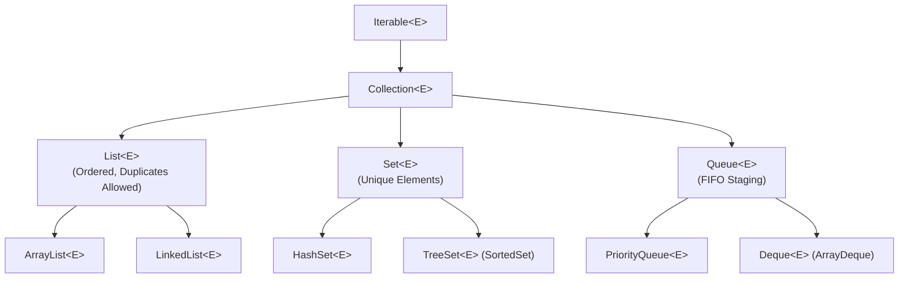

# Java Collections Framework (JCF)




- Prior to Java 2, data structures were ad-hoc (`Vector`, `Hashtable`, raw arrays).
- JCF provides a unified architecture for representing and manipulating collections.

```text
                         Iterable<E>
                              |
                        Collection<E>
                      /       |                            /        |                        List<E>     Set<E>    Queue<E>
                              |          |
                           SortedSet<E> Deque<E>
```

---

# Core Collection Interfaces

| Interface | Characteristics | Key Implementations |
| :--- | :--- | :--- |
| **`Collection<E>`** | Root interface for groups of objects (`add`, `remove`, `contains`, `size`) | All below |
| **`List<E>`** | **Ordered sequence**, allows duplicates, indexed access (`get(i)`) | `ArrayList`, `LinkedList` |
| **`Set<E>`** | **No duplicates**, models mathematical sets | `HashSet`, `TreeSet`, `LinkedHashSet` |
| **`Queue<E>`** | FIFO ordering for staging elements (`offer`, `poll`, `peek`) | `PriorityQueue`, `ArrayDeque` |
| **`Deque<E>`** | Double-ended queue, supports stack and queue operations | `ArrayDeque`, `LinkedList` |

---

# Summary

- The Java Collections Framework provides standardized, reusable data structures
- Built around core interfaces: `List` (ordered), `Set` (unique), `Queue` (buffered)
- All collections implement `Iterable<E>`, allowing enhanced `for-each` traversal
