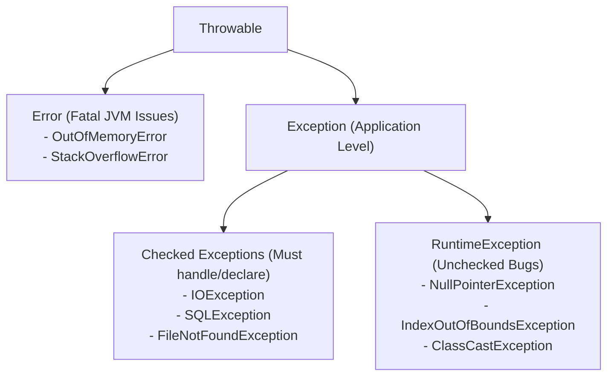

# Java Exception Hierarchy




In Java, all error and exception objects inherit from **`java.lang.Throwable`**:

```text
                          Throwable
                         /                             Error           Exception
                 (Fatal JVM)       /                                    Checked Exceptions  RuntimeException
                           (IOException, etc.) (Unchecked: NPE, IndexOutOfBounds)
```

---

# Checked vs Unchecked Exceptions

| Type | Description | Handling Policy | Examples |
| :--- | :--- | :--- | :--- |
| **Checked Exceptions** | Foreseeable environmental failures | **Must be caught or declared** using `throws` | `IOException`, `SQLException`, `FileNotFoundException` |
| **Unchecked Exceptions** (`RuntimeException`) | Logic errors and programmer bugs | Optional to catch (compiler does not enforce) | `NullPointerException`, `ArrayIndexOutOfBoundsException` |
| **Errors** | Serious internal JVM system failures | Should not be caught (fatal) | `OutOfMemoryError`, `StackOverflowError` |

---

# Exception Handling Syntax: `try-catch-finally`

```java
public void readFile(String path) {
  BufferedReader reader = null;
  try {
    reader = new BufferedReader(new FileReader(path));
    String line = reader.readLine();
    System.out.println(line);
  } catch (FileNotFoundException e) {
    System.err.println("File not found: " + e.getMessage());
  } catch (IOException e) {
    System.err.println("Error reading file: " + e.getMessage());
  } finally {
    // ALWAYS executes (for resource cleanup)
    try {
      if (reader != null) reader.close();
    } catch (IOException e) { ... }
  }
}
```

### Modern `try-with-resources` (Java 7+):
```java
// Automatically closes any resource implementing AutoCloseable
try (BufferedReader reader = new BufferedReader(new FileReader(path))) {
  String line = reader.readLine();
  System.out.println(line);
} catch (IOException e) {
  System.err.println("I/O error: " + e.getMessage());
}
```

---

# Summary

- Checked exceptions force callers to handle recoverable failures at compile-time
- Unchecked `RuntimeException` indicates programming bugs
- `try-with-resources` ensures deterministic resource cleanup without boilerplate
