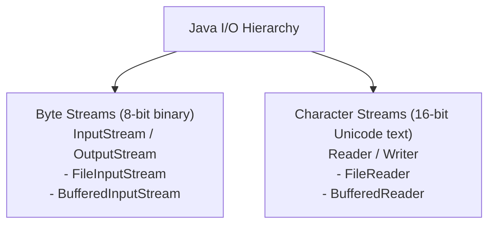

# Java I/O Streams Architecture




- Java models I/O as **Streams** of data flowing sequentially from a source to a destination.
- Separated into two distinct hierarchies:

```text
                  +-----------------------------------+
                  |         JAVA I/O STREAMS          |
                  +-----------------------------------+
                   /                                                   /                                            Byte Streams (8-bit)               Character Streams (16-bit)
         InputStream / OutputStream          Reader / Writer
         (Binary files, images, network)     (Text files, Unicode)
```

---

# Byte Streams vs Character Streams

### 1. Byte Streams (Raw binary data):
- `FileInputStream` / `FileOutputStream`
- Read and write raw bytes (`byte[]`) without character encoding assumptions.

### 2. Character Streams (Unicode text):
- `FileReader` / `FileWriter`
- Automatically decode bytes to 16-bit Java `char` using character encodings (UTF-8).

---

# Buffered Streams for High Performance

- Reading byte-by-byte or char-by-char causes expensive OS disk/network system calls.
- **Buffering** reads/writes large blocks (e.g. 8KB) into memory buffers:

```java
try (BufferedReader reader = new BufferedReader(new FileReader("data.txt"));
     BufferedWriter writer = new BufferedWriter(new FileWriter("output.txt"))) {
  String line;
  while ((line = reader.readLine()) != null) {
    writer.write(line);
    writer.newLine();
  }
}
```

---

# Summary

- Byte streams (`InputStream`/`OutputStream`) handle binary data; Character streams (`Reader`/`Writer`) handle text
- Always wrap I/O streams in **`BufferedReader`** / **`BufferedWriter`** for performance
- Use `try-with-resources` to guarantee stream closure
