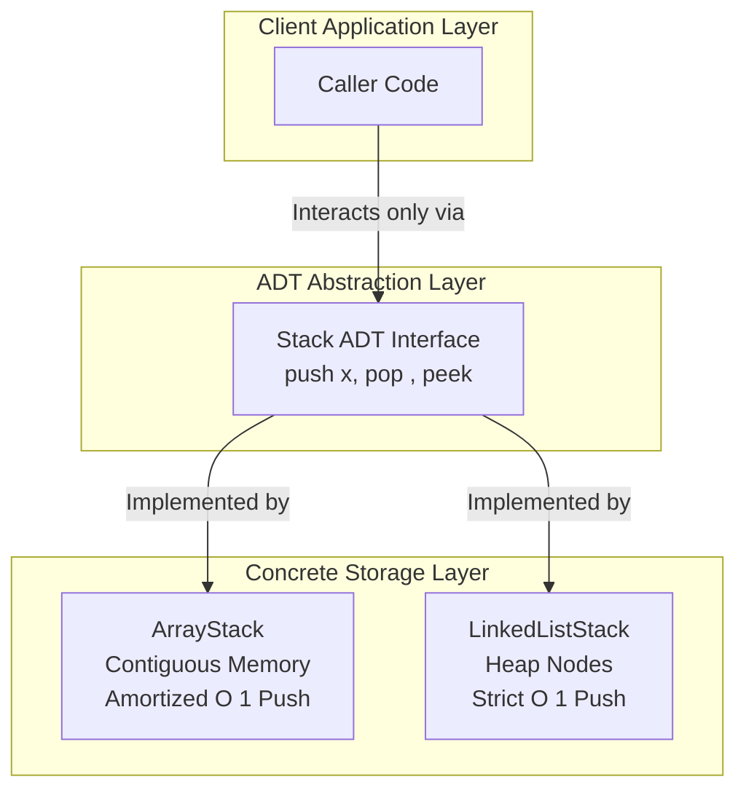

# 📘 Abstract Data Types (ADTs): First-Principles Master Blueprint

> **Category**: Computer Science & Software Engineering  
> **Sub-Domain**: Data Structures & Algorithms (DSA)  
> **Status**: Master Reference  

---

## 📌 Technical Jargon Dictionary & First-Principles Definitions

*   **Abstract Data Type (ADT)**: A formal mathematical specification defining a set of data items and the operations allowed on them. It defines *what* operations are supported without specifying *how* those operations are implemented in memory.
*   **Concrete Data Structure**: The physical implementation of an ADT in memory (RAM), specifying exact memory allocations, node pointer linkages, array indices, and algorithms.
*   **Encapsulation**: The object-oriented and defensive programming principle of hiding internal state and implementation details behind a controlled, public interface.
*   **Interface / Protocol**: A code blueprint that defines function signatures (name, parameters, return type) without providing implementation details.
*   **Amortized Time Complexity**: The average execution time per operation over a worst-case sequence of operations (e.g., dynamic array expansion).
*   **Cache Locality**: The spatial and temporal proximity of memory accesses in CPU L1/L2/L3 caches. Contiguous arrays exhibit high spatial cache locality compared to linked node structures.

---

## 1. Executive Summary & Core Philosophy

In software engineering, an **Abstract Data Type (ADT)** acts as a strict abstraction boundary between a data structure's contract and its underlying physical memory representation.

```
+-------------------------------------------------------------+
|                     ADT Interface Contract                  |
|                 (e.g., Stack: push, pop, peek)               |
+-------------------------------------------------------------+
                              |
                 Enforces Encapsulation Barrier
                              |
        +---------------------+---------------------+
        |                                           |
        v                                           v
+-------------------------------+   +-------------------------------+
|  Array-Based Implementation   |   |  Linked-List Implementation   |
|  (Contiguous Block in RAM)    |   |  (Heap Pointers & Nodes)      |
+-------------------------------+   +-------------------------------+
```

---

## 2. ADT vs. Concrete Data Structure

| Property | Abstract Data Type (ADT) | Concrete Data Structure |
| :--- | :--- | :--- |
| **Domain** | Logical / Theoretical Specification | Physical Memory & CPU Execution |
| **Concern** | *What* operations are permitted | *How* data is arranged and manipulated |
| **Examples** | `Stack`, `Queue`, `Map`, `Priority Queue`, `Set` | `Array`, `Singly-Linked List`, `Hash Table`, `Red-Black Tree` |
| **Language Construct** | Interface, Abstract Class, Protocol, Trait | Class Instance, Struct, Pointer Layout |

---

## 3. Mathematical Formalism

An ADT is mathematically modeled as an algebraic data signature with axioms. For a `Stack` ADT over element domain $T$ and state space $S$:

$$\text{new}: \emptyset \to S$$
$$\text{push}: S \times T \to S$$
$$\text{pop}: S \to S \times T$$
$$\text{peek}: S \to T \cup \{\bot\}$$

### Axiomatic Invariants:
1. $\text{peek}(\text{push}(s, x)) = x$
2. $\text{pop}(\text{push}(s, x)) = (s, x)$
3. $\text{peek}(\text{new}()) = \bot \quad (\text{where } \bot \text{ represents an empty state error})$

---

## 4. Visual Architecture (Mermaid Diagram)



---

## 5. Executable Code Blueprint (Python)

```python
from abc import ABC, abstractmethod
from typing import Generic, TypeVar, Optional, List

T = TypeVar('T')

class StackADT(ABC, Generic[T]):
    """
    Formal Abstract Data Type (ADT) contract for a LIFO (Last-In, First-Out) Stack.
    """

    @abstractmethod
    def push(self, item: T) -> None:
        """Pushes an element onto the stack."""
        pass

    @abstractmethod
    def pop(self) -> T:
        """Removes and returns the top element. Raises IndexError if empty."""
        pass

    @abstractmethod
    def peek(self) -> Optional[T]:
        """Returns the top element without mutating stack state."""
        pass

    @abstractmethod
    def is_empty(self) -> bool:
        """Checks whether the stack contains zero elements."""
        pass


class ArrayStack(StackADT[T]):
    """
    Concrete Data Structure implementation using dynamic arrays.
    """

    def __init__(self) -> None:
        self._data: List[T] = []

    def push(self, item: T) -> None:
        self._data.append(item)

    def pop(self) -> T:
        if self.is_empty():
            raise IndexError("Cannot pop from an empty StackADT")
        return self._data.pop()

    def peek(self) -> Optional[T]:
        return self._data[-1] if not self.is_empty() else None

    def is_empty(self) -> bool:
        return len(self._data) == 0


if __name__ == "__main__":
    stack: StackADT[int] = ArrayStack[int]()
    stack.push(10)
    stack.push(20)
    print(f"Top element: {stack.peek()}")     # 20
    print(f"Popped element: {stack.pop()}")   # 20
    print(f"Is empty: {stack.is_empty()}")   # False
```

---

## 💡 Instructor's Words of Wisdom & Best Practices

> [!NOTE]
> **Instructor Callout Box**
> *   **Vending Machine Analogy**: Pressing a button on a vending machine triggers a defined operation (`Get Snack`). You don't need to know if an electric motor, gear belt, or robotic arm drops the snack. That is the essence of ADTs—separating public operations from internal implementation.
> *   **Golden Rule of System Design**: Never expose internal pointers or mutable datatypes through an ADT interface. Doing so breaks encapsulation and allows external code to corrupt data structure state invariants.

---

## 💥 Vulnerability & Failure Mode Breakdown

1. **Abstraction Leakage**: Returning raw internal array references allows callers to mutate internal state outside ADT control methods, invalidating invariants.
2. **Unbounded Buffer Expansion**: Memory-backed ADTs without fixed capacity constraints invite Denial of Service (DoS) attacks via memory exhaustion ($O(N)$ RAM consumption).
3. **Thread-Safety Data Races**: Concurrent invocations of `push` or `pop` without atomic locking (or mutexes) produce corrupted heap states and unhandled race conditions.
