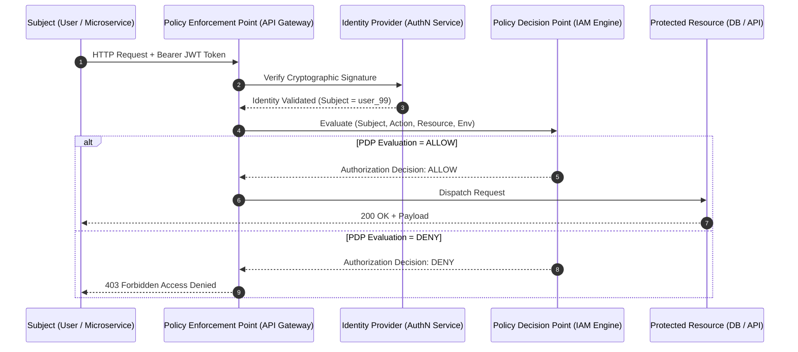

# 🛡️ Identity and Access Management (IAM): Master Blueprint

> **Category**: Computer Science & System Design  
> **Sub-Domain**: Cybersecurity, Cloud Infrastructure & Access Control  
> **Status**: Master Reference  

---

## 📌 Technical Jargon Dictionary & First-Principles Definitions

*   **Identity and Access Management (IAM)**: The security framework, protocol suite, and infrastructure governing digital identity authentication, authorization policies, and resource auditing.
*   **Authentication (AuthN)**: The process of cryptographically validating claimed identity credentials (e.g., passkeys, passwords, MFA tokens, TLS certificates). *"Who are you?"*
*   **Authorization (AuthZ)**: The policy evaluation mechanism enforcing access rights onto authenticated entities for requested actions on target resources. *"What are you allowed to do?"*
*   **Principle of Least Privilege (PoLP)**: The security architecture rule mandating that subjects be granted only the minimum permissions required to perform legitimate tasks.
*   **Role-Based Access Control (RBAC)**: Assigning authorization permissions to pre-configured static roles, which are assigned to subjects.
*   **Attribute-Based Access Control (ABAC)**: Evaluating dynamic rules based on attributes of the subject, action, resource, and real-time environment.
*   **Policy Decision Point (PDP)**: The system component that evaluates authorization requests against stored IAM policies.
*   **Policy Enforcement Point (PEP)**: The gatekeeper component (e.g., API Gateway, Proxy) that intercepts requests and enforces PDP decisions.

---

## 1. Executive Summary & The AAA Framework

IAM forms the security bedrock of modern distributed cloud systems and Zero-Trust networks through the **AAA Architecture**:

$$\text{Request} \longrightarrow \underbrace{\text{Authentication (AuthN)}}_{\text{Verify Identity}} \longrightarrow \underbrace{\text{Authorization (AuthZ)}}_{\text{Evaluate Policy}} \longrightarrow \underbrace{\text{Accounting (Audit)}}_{\text{Immutable Logs}}$$

---

## 2. Access Control Models: RBAC vs. ABAC

| Parameter | Role-Based Access Control (RBAC) | Attribute-Based Access Control (ABAC) |
| :--- | :--- | :--- |
| **Decision Vector** | User $\to$ Assigned Role $\to$ Permission | $f(\text{Subject}, \text{Resource}, \text{Action}, \text{Environment})$ |
| **Flexibility** | Static, structured role hierarchies | Fine-grained dynamic conditional policies |
| **Scalability Issue** | "Role Explosion" in complex enterprise architectures | Higher computational overhead at PDP evaluation |
| **Best Used For** | Standard organizational structure permissions | Zero-trust security, multi-tenant cloud ecosystems |

---

## 3. Mathematical Policy Formalism

An IAM policy decision $D$ is a mapping:

$$D: (S, A, R, E) \to \{\text{Allow}, \text{Deny}\}$$

Where:
*   $S$: Subject Attributes (ID, Roles, Security Clearance)
*   $A$: Action Requested (`READ`, `WRITE`, `EXECUTE`, `DELETE`)
*   $R$: Resource Attributes (Resource ID, Sensitivity Level, Owner)
*   $E$: Environmental Context (Client IP, Access Time, Encryption Protocol)

---

## 4. System Architecture & Request Lifecycle (Mermaid Diagram)



---

## 5. Runnable IAM ABAC Engine (Python)

```python
from dataclasses import dataclass
from typing import List, Literal

@dataclass
class Subject:
    user_id: str
    roles: List[str]
    clearance: int

@dataclass
class RequestContext:
    subject: Subject
    action: Literal["READ", "WRITE", "DELETE"]
    resource_id: str
    resource_sensitivity: int
    client_ip: str

class IAMEngine:
    """
    Zero-Trust Policy Decision Point (PDP) using ABAC rules.
    Default stance: Explicit Deny.
    """

    def evaluate(self, ctx: RequestContext) -> bool:
        # Rule 1: Superadmin role bypass
        if "admin" in ctx.subject.roles:
            return True

        # Rule 2: Clearance level check
        if ctx.subject.clearance < ctx.resource_sensitivity:
            return False

        # Rule 3: Network isolation for destructive actions
        if ctx.action in ["WRITE", "DELETE"] and not ctx.client_ip.startswith("10.0."):
            return False

        # Rule 4: Read permission check
        if ctx.action == "READ" and "reader" in ctx.subject.roles:
            return True

        return False


if __name__ == "__main__":
    iam = IAMEngine()
    user = Subject(user_id="u404", roles=["reader"], clearance=2)

    # Valid Read Request
    req_allow = RequestContext(
        subject=user, action="READ", resource_id="res_a", resource_sensitivity=1, client_ip="10.0.1.20"
    )
    print(f"Read Request Decision: {'ALLOW' if iam.evaluate(req_allow) else 'DENY'}") # ALLOW

    # Invalid Write Request (Insufficient clearance & restricted subnet)
    req_deny = RequestContext(
        subject=user, action="WRITE", resource_id="res_b", resource_sensitivity=4, client_ip="192.168.1.1"
    )
    print(f"Write Request Decision: {'ALLOW' if iam.evaluate(req_deny) else 'DENY'}") # DENY
```

---

## 💡 Instructor's Words of Wisdom & Best Practices

> [!NOTE]
> **Instructor Callout Box**
> *   **Hotel Keycard Analogy**: Showing your passport at check-in is **Authentication** (proving who you are). Receiving a plastic RFID keycard programmed only for Room 404 until 11 AM tomorrow is **Authorization** (IAM policy).
> *   **Zero-Trust Motto**: "Never Trust, Always Verify." Every request must pass through AuthN and AuthZ evaluation regardless of whether it originates outside the firewall or inside an internal pod network.

---

## 💥 Vulnerability & Failure Mode Breakdown

1. **Privilege Escalation**: Flaws in role assignment APIs allowing users to alter clearance flags or inject administrative roles.
2. **Confused Deputy Problem**: A service account with broad permissions executing tasks requested by unverified end-users without identity propagation.
3. **JWT Replay & Token Forgery**: Failure to validate token signatures or expiration timestamps ($t_{\text{exp}}$), allowing compromised tokens to be replayed indefinitely.
