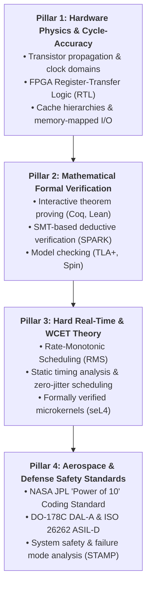

# 👑 Zero-Fail & Hard Real-Time Systems Mastery: The Canonical Curriculum
### Sub-Nanosecond Determinism, Mathematical Formal Verification & Aerospace Engineering
*Authored for the Devendra Systems Engineering Workspace*

---

## 🧭 Executive Overview & Architectural Philosophy

Building software systems that control high-consequence physical environments (orbital spacecraft, hypersonic avionics, nuclear core protection, and sub-nanosecond signal processing) requires an absolute departure from conventional software engineering paradigms.

In high-consequence engineering:
1. **Testing is Insufficient**: Edsger W. Dijkstra established that *"Program testing can be used to show the presence of bugs, but never to show their absence."* Zero-fail systems require **mathematical proof of correctness** via formal verification.
2. **Average Latency is Irrelevant; Zero Jitter is Everything**: A system that responds in $10\text{ ns}$ on average but occasionally spikes to $100\ \mu\text{s}$ due to a cache miss or garbage collector pause is a failed system. **Worst-Case Execution Time (WCET)** bounds the physics of the system.
3. **Hardware and Software are Inseparable**: At the sub-nanosecond boundary ($10^{-9}\text{ s}$), software abstractions disappear. Signal propagation speed ($\sim 20\text{ cm/ns}$ in silicon), cache hierarchies, and pipeline stalls dictate architectural viability.

---

## 🏛️ The Four Pillars of Zero-Fail Architecture



---

## 📚 The Master Reading Canon & Annotated Bibliography

---

### 1. ⚡ Pillar 1: Hardware-Software Boundary & Sub-Nanosecond Execution

#### 📘 *Computer Systems: A Programmer's Perspective (CS:APP)*
* **Authors**: Randal E. Bryant & David R. O'Hallaron (Carnegie Mellon University).
* **Core Focus**: How physical hardware processes instructions, cache hierarchies ($L_1/L_2/L_3$), virtual memory translations, and hardware pipeline hazards.
* **Why Read**: Eliminates the naive belief that code runs instantaneously. Teaches spatial/temporal locality, memory bus contention, and hardware branch prediction.
* **Key Chapters**:
  - Chapter 4: *Processor Architecture (Y86-64 / Sequential vs. Pipelined)*
  - Chapter 5: *Optimizing Program Performance (Instruction-Level Parallelism)*
  - Chapter 6: *The Memory Hierarchy (Caches and Cache Miss Penalties)*

#### 📘 *Digital Design and Computer Architecture (RISC-V / ARM Edition)*
* **Authors**: David Harris & Sarah Harris.
* **Core Focus**: Transistors $\rightarrow$ Logic Gates $\rightarrow$ State Machines $\rightarrow$ Microarchitecture $\rightarrow$ Assembly.
* **Why Read**: Required to write synthesizable VHDL/Verilog for FPGAs and custom ASICs capable of deterministic single-clock-cycle actuation ($<1\text{ ns}$).

#### 📄 *High-Frequency Trading (HFT) Low-Latency Treatises*
* **Key Artifacts**:
  - **OpenOnload / Solarflare Kernel-Bypass Architecture**: Eliminating OS interrupts and socket overhead to process packets directly from NIC ring buffers in $<100\text{ ns}$.
  - **The LMAX Disruptor Architecture Paper** (*Martin Fowler, Mike Barker et al.*): Lock-free, mechanical-sympathy ring buffer design eliminating thread contention and cache-line false sharing.

---

### 2. 🔬 Pillar 2: Mathematical Proofs & Formal Verification

#### 📘 *Software Foundations (5-Volume Comprehensive Series)*
* **Author**: Benjamin C. Pierce et al. (University of Pennsylvania).
* **Availability**: [Open Access / Free Online](https://softwarefoundations.cis.upenn.edu/)
* **Core Focus**: Interactive Theorem Proving in **Coq**.
* **Why Read**: The gold standard for program verification. You do not test code; you write mathematical proofs that the operational semantics of your program satisfy its specification for all possible inputs.
* **Volumes**:
  - *Volume 1: Logical Foundations* (Inductive logic and functional programming).
  - *Volume 2: Programming Language Foundations* (Operational semantics and Hoare Logic).
  - *Volume 3: Verified Functional Algorithms* (Proving search trees, sorting, and graphs).
  - *Volume 4: QuickChick: Property-Based Testing*.
  - *Volume 5: Verifiable C* (Proving C code correct via the Verified Software Toolchain).

#### 📘 *Building High Assurance Applications and Software with SPARK*
* **Author**: John Barnes (Foreword by AdaCore).
* **Core Focus**: **SPARK Ada 2014** contract-based deductive verification.
* **Why Read**: The industrial handbook for zero-fail avionics and defense systems. Teaches how to use automated SMT solvers (Z3, Alt-Ergo) to mathematically prove the total Absence of Runtime Errors (AoRTE), zero array index bounds errors, zero division-by-zero, and zero data races.

#### 📘 *Specifying Systems: The TLA+ Language and Tools*
* **Author**: Leslie Lamport (Turing Award Winner).
* **Availability**: [Leslie Lamport's TLA+ Resource (Free PDF)](https://lamport.azurewebsites.net/tla/book.html)
* **Core Focus**: Formal specification and model checking of concurrent and distributed state machines.
* **Why Read**: Used by NASA and Amazon AWS to verify complex concurrent protocols and spacecraft state engines before writing source code.

---

### 3. ⏱️ Pillar 3: Hard Real-Time Systems & Predictability

#### 📘 *Real-Time Systems Design and Analysis: Tools for the Practitioner*
* **Authors**: Phillip A. Laplante & Seppo J. Ovaska.
* **Core Focus**: Deterministic scheduling, Rate-Monotonic Analysis (RMA), Priority Ceiling Protocols (preventing priority inversion), and hardware timers.
* **Why Read**: Establishes the mathematical theory of deadline guarantees and Worst-Case Execution Time (WCET) bounds.

#### 📄 *seL4: Formal Verification of an OS Microkernel (SOSP Classic Paper)*
* **Authors**: Gerwin Klein, Gernot Heiser et al. (Data61 / CSIRO / UNSW).
* **Availability**: [seL4 Research Papers (Open Access)](https://sel4.systems/Research/Publications/)
* **Core Focus**: The world's first general-purpose operating system microkernel with a **machine-checked formal proof of functional correctness** and timing predictability from abstract specification down to executable binary.

#### 📘 *Synchronous Programming of Reactive Systems*
* **Author**: Nicolas Halbwachs.
* **Core Focus**: The synchronous language model (**Lustre / SCADE / Esterel**).
* **Why Read**: Explains the mathematical execution model used to generate 100% of the flight control software for the Airbus A380/A350 and nuclear reactor control systems.

---

### 4. 🚀 Pillar 4: Aerospace Safety & Zero-Fail Systems Engineering

#### 📘 *Safeware: System Safety and Computers*
* **Author**: Nancy G. Leveson (Professor of Aeronautics and Astronautics, MIT).
* **Core Focus**: Systems safety engineering, software hazard analysis, and historical case studies of software failures (Therac-25, Ariane 5 Flight 501).
* **Why Read**: Teaches the **STAMP (System-Theoretic Accident Model and Processes)** framework to design hazard-tolerant architectures.

#### 📄 *The Power of 10: Rules for Developing Safety-Critical Code*
* **Author**: Gerard J. Holzmann (NASA Jet Propulsion Laboratory / Laboratory for Reliable Software).
* **Core Focus**: The 10 rules governing C flight code on Mars Exploration Rovers.
* **The 10 Core Rules**:
  1. Restrict all code to very simple control flow constructs (no `goto`, no recursion).
  2. Give all loops a fixed compile-time upper bound.
  3. **Do not use dynamic memory allocation after initialization (`malloc`/`free` banned).**
  4. No function should be longer than what can be printed on a single sheet of paper (max 60 lines).
  5. The assertion density of the code should average at least two assertions per function.
  6. Declare data objects at the smallest possible level of scope.
  7. Check the return value of every non-void function.
  8. Limit the use of the C preprocessor to file inclusion and simple macro definitions.
  9. Restrict pointer use to a single dereference (no pointer arithmetic or multi-level pointers).
  10. Compile with all compiler warnings enabled at the most pedantic setting (`-Wall -Wextra -Werror`).

#### 📑 *FAA / RTCA DO-178C (ED-12C) Standard Overview*
* **Title**: *Software Considerations in Airborne Systems and Equipment Certification*.
* **Core Focus**: Design Assurance Levels (**DAL-A** Catastrophic through **DAL-E** No Effect), Modified Condition/Decision Coverage (MC/DC), and structural verification requirements.

---

## 🛠️ The Progressive 4-Tier Practical Mastery Curriculum

To turn this theoretical literature into visceral engineering mastery, execute the following four projects:

```
Level 1: Hardware-Gate Determinism (Sub-Nanosecond)
├── 1. Procure an FPGA development board (e.g., Lattice iCE40, Xilinx Artix-7, or Gowin Tang Nano).
├── 2. Write a cycle-accurate hardware pulse generator in VHDL / Verilog.
└── 3. Measure the output pulse on an oscilloscope to prove zero jitter (±1 clock cycle determinism).

Level 2: Bare-Metal Real-Time Kernel (Microsecond Determinism)
├── 1. Select a bare-metal ARM Cortex-M or RISC-V microcontroller.
├── 2. Implement a Rate-Monotonic static cyclic executive in pure C or `#![no_std]` Rust.
└── 3. Enforce the NASA JPL "Power of 10" rules (zero heap allocation, compile-time static ring buffers).

Level 3: Mathematical Deductive Verification (Zero-Fail Flight Software)
├── 1. Install GNAT Pro / Community Edition with the SPARK 2014 toolset (`gnatprove`).
├── 2. Implement a spacecraft Reaction Control System (RCS) thruster state machine.
└── 3. Formally prove 100% absence of runtime errors and verify all Hoare logic contracts.

Level 4: High-Assurance Formally Verified Microkernel (Full Integration)
├── 1. Deploy the `seL4` microkernel inside QEMU / real target hardware.
├── 2. Implement isolated components communicating over formal capability-based IPC channels.
└── 3. Verify static memory allocation and timing isolation between critical and non-critical tasks.
```

---

## ⚡ The God-Tier Real-Time Memory Pattern (NASA JPL Compliant)

```c
/*
 * Deterministic Zero-Allocation Ring Buffer (NASA JPL Rule #3 Compliant)
 * Time Complexity: O(1) deterministic
 * Space Complexity: Static compile-time allocation (0 Heap / No fragmentation)
 */
#include <stdint.h>
#include <stddef.h>
#include <stdbool.h>

#define MAX_TELEMETRY_CAPACITY 512

typedef struct {
    uint64_t timestamp_ns;
    uint32_t channel_id;
    int32_t  raw_value;
} TelemetryFrame;

typedef struct {
    TelemetryFrame buffer[MAX_TELEMETRY_CAPACITY];
    size_t head;
    size_t tail;
    size_t count;
} StaticRingBuffer;

void ring_buffer_init(StaticRingBuffer *rb) {
    rb->head = 0;
    rb->tail = 0;
    rb->count = 0;
}

bool ring_buffer_push(StaticRingBuffer *rb, const TelemetryFrame *item) {
    if (rb->count >= MAX_TELEMETRY_CAPACITY) {
        return false; /* Bounded overflow: deterministic rejection */
    }
    rb->buffer[rb->tail] = *item;
    rb->tail = (rb->tail + 1) % MAX_TELEMETRY_CAPACITY;
    rb->count++;
    return true;
}

bool ring_buffer_pop(StaticRingBuffer *rb, TelemetryFrame *out_item) {
    if (rb->count == 0) {
        return false; /* Deterministic empty return */
    }
    *out_item = rb->buffer[rb->head];
    rb->head = (rb->head + 1) % MAX_TELEMETRY_CAPACITY;
    rb->count--;
    return true;
}
```

---

## 📖 Systems Architect's Glossary

1. **Worst-Case Execution Time (WCET)**: The absolute maximum time an algorithm takes to execute across all possible inputs and processor microarchitectural states.
2. **Hoare Logic**: A formal mathematical system for reasoning about program correctness using assertions: Pre-condition $\{P\}$, Program $\{S\}$, Post-condition $\{Q\}$.
3. **SMT Solver (Satisfiability Modulo Theories)**: An automated mathematical engine (e.g., Z3, CVC5, Alt-Ergo) that checks whether a set of logical formulas is satisfiable.
4. **Mechanical Sympathy**: Designing software in complete alignment with underlying hardware architecture (CPU caches, memory prefetchers, bus pipelines) to maximize throughput and minimize latency.
5. **Rate-Monotonic Scheduling (RMS)**: An optimal static-priority real-time scheduling algorithm where tasks with shorter cycle periods are assigned higher execution priorities.
6. **Modified Condition/Decision Coverage (MC/DC)**: A white-box testing standard required by DO-178C Level A ensuring every condition in a Boolean decision independently affects the outcome.
7. **Interactive Theorem Prover (ITP)**: A proof assistant (e.g., Coq, Lean 4, Isabelle/HOL) where humans construct mathematical proofs checked step-by-step by a formal logical kernel.

---

## 🧭 Master Resource Quick-Links Table

| Topic / Domain | Primary Foundational Resource | Authors / Organization | Access Link |
| :--- | :--- | :--- | :--- |
| **Interactive Theorem Proving** | *Software Foundations* | Benjamin Pierce et al. (UPenn) | [softwarefoundations.cis.upenn.edu](https://softwarefoundations.cis.upenn.edu/) |
| **SPARK Ada Formal Proofs** | *Building High Assurance Apps with SPARK* | John Barnes / AdaCore | [learn.adacore.com](https://learn.adacore.com/) |
| **Formal System Specification** | *Specifying Systems (TLA+)* | Leslie Lamport | [lamport.azurewebsites.net/tla/book.html](https://lamport.azurewebsites.net/tla/book.html) |
| **Verified OS Microkernel** | *seL4 Research Publications* | Data61 / CSIRO / UNSW | [sel4.systems/Research/Publications](https://sel4.systems/Research/Publications/) |
| **NASA Flight Code Standards** | *The Power of 10 Rules* | Gerard Holzmann (NASA JPL) | [NASA JPL Rules Overview](https://en.wikipedia.org/wiki/The_Power_of_10:_Rules_for_Developing_Safety-Critical_Code) |
| **Systems Safety & Accidents** | *Safeware: System Safety & Computers* | Nancy Leveson (MIT) | [MIT STAMP Resource](http://sunnyday.mit.edu/safer-world.pdf) |
| **Hardware & Cache Architecture**| *CS:APP* (3rd Edition) | Bryant & O'Hallaron (CMU) | [csapp.cs.cmu.edu](http://csapp.cs.cmu.edu/) |

