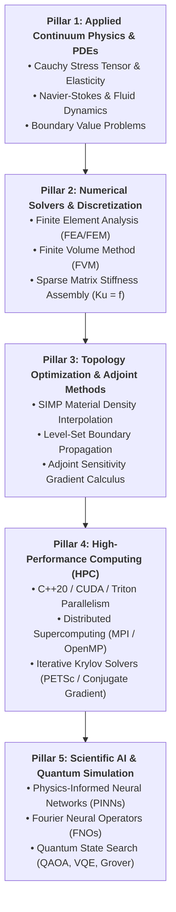
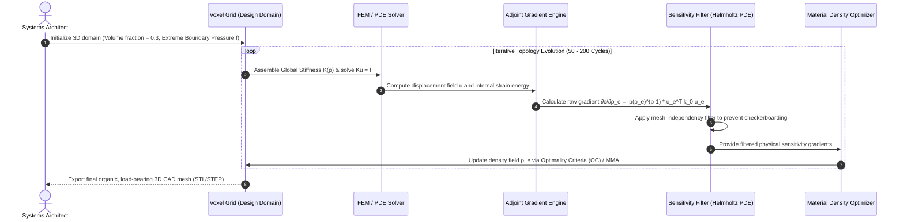
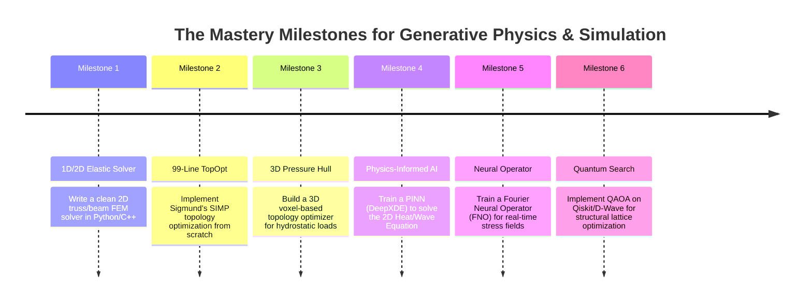

# 👑 Computational Science, Topology Optimization & Quantum Simulation: The Canonical Curriculum
### Inverse Physics Design, High-Performance PDEs, Scientific Machine Learning & State-Space Exploration
*Authored for the Devendra Systems Engineering Workspace*

---

## 🧭 Executive Overview & Architectural Philosophy

When engineers seek to design structures capable of surviving extreme physical environments—such as deep-sea submersible pressure hulls withstanding 1,000 atmospheres, hypersonic rocket brackets bearing multi-axis vibrational loads, or advanced crystal lattices with negative Poisson ratios—traditional engineering intuition collapses.

In high-consequence computational design:
1. **Brute-Force Search is a Mathematical Impossibility**: Searching through all possible 3D configurations across a $1000 \times 1000 \times 1000$ voxel grid yields $2^{10^9}$ states. Even a quantum computer testing a trillion configurations per second cannot brute-force this combinatorial universe.
2. **Inverse Design Inverts the Simulation Loop**: Instead of guessing a shape and testing its failure ($A \to B$), **Inverse Design** sets the desired physical behavior as a mathematical constraint and uses **Adjoint PDE-Constrained Optimization** to mathematically "grow" the optimal geometry ($B \to A$).
3. **The Unification of Physics, HPC, and AI**: The modern engineering stack combines **Continuum Mechanics (PDEs)**, **GPU-Accelerated Finite Element Solvers (HPC)**, and **Neural Operators (SciML)** that evaluate physical fields $100,000\times$ faster than classical supercomputers.

---

## 🏛️ The Five Pillars of Generative Physics & Simulation Mastery

---

## 📚 The Master Reading Canon & Annotated Bibliography

---

### 1. ⚡ Pillar 1: Applied Continuum Mechanics & Partial Differential Equations

#### 📘 *Theory of Elasticity*
* **Authors**: Stephen P. Timoshenko & J. N. Goodier.
* **Core Focus**: Stress and strain tensors, Hooke’s generalized law, Airy stress functions, and 2D/3D elasticity solutions.
* **Why Read**: The absolute foundational bible of solid mechanics. Teaches how continuous matter deforms under pressure without relying on software abstractions.
* **Key Sections**:
  - Chapter 1: *Analysis of Stress and Strain in Three Dimensions*
  - Chapter 2: *Stress-Strain Relations and Generalized Hooke's Law*
  - Chapter 7: *Torsion of Prismatic and Non-Circular Bars*

#### 📘 *Vectors, Tensors, and the Basic Equations of Fluid Mechanics*
* **Author**: Rutherford Aris (University of Minnesota).
* **Core Focus**: Invariant tensor notation, Christoffel symbols, transport theorems, and the Navier-Stokes momentum equations.
* **Why Read**: Eliminates coordinate-system confusion. Teaches how to formulate physical conservation laws in pure geometric tensor language.

#### 📘 *Partial Differential Equations for Scientists and Engineers*
* **Author**: Stanley J. Farlow.
* **Core Focus**: Elliptic (Poisson/Laplace), Parabolic (Diffusion/Heat), and Hyperbolic (Wave/Advection) PDEs.
* **Why Read**: Provides the geometric intuition for boundary conditions (Dirichlet, Neumann, Robin) that govern all physical simulations.

---

### 2. 🔬 Pillar 2: Numerical Methods & Finite Element Analysis (FEM)

#### 📘 *The Finite Element Method: Linear Static and Dynamic Finite Element Analysis*
* **Author**: Thomas J. R. Hughes (Stanford / UT Austin).
* **Core Focus**: Variational formulations, weak forms, isoparametric element stiffness matrices ($\mathbf{k}_e = \int \mathbf{B}^T \mathbf{D} \mathbf{B} \, d\Omega$), and global assembly.
* **Why Read**: Written by the pioneer of modern computational mechanics. Teaches how to translate continuous differential equations into large sparse linear systems $\mathbf{K} \mathbf{u} = \mathbf{f}$.

#### 📘 *Computational Methods for Fluid Dynamics*
* **Authors**: Joel H. Ferziger, Milovan Perić, Robert L. Street.
* **Core Focus**: Finite Volume Method (FVM), pressure-velocity coupling algorithms (SIMPLE / PISO), turbulence modeling, and grid generation.
* **Why Read**: The gold standard for writing custom aerodynamic and hydrodynamic solvers from scratch.

#### 📘 *Understanding and Implementing the Finite Element Method*
* **Author**: Mark S. Gockenbach.
* **Core Focus**: Implementing sparse solvers, numerical quadrature (Gauss-Legendre), and boundary condition enforcement in clean code.

---

### 3. 🧬 Pillar 3: Topology Optimization & Inverse Generative Design

#### 📘 *Topology Optimization: Theory, Methods, and Applications*
* **Authors**: Martin P. Bendsøe & Ole Sigmund (Technical University of Denmark - DTU).
* **Core Focus**: Solid Isotropic Material with Penalization (SIMP), homogenization method, Level-Set geometry representation, and compliance minimization under volume constraints.
* **Why Read**: The undisputed bible of generative design. Explains how mathematical algorithms discover lightweight, bone-like organic structures that maximize structural rigidity under extreme multi-axial forces.

#### 📄 *A 99 Line Topology Optimization Code Written in MATLAB / Python*
* **Authors**: Ole Sigmund / Niels Aage et al.
* **Availability**: [DTU TopOpt Open Code Repository](https://www.topopt.mek.dtu.dk/)
* **Core Focus**: Complete, working implementation of compliance minimization, sensitivity filtering, and optimality criteria (OC) updating in fewer than 100 lines of vectorized code.

#### 📄 *Adjoint Sensitivity Analysis for Multiphysics Engineering*
* **Key Concept**: Computing the exact gradient $\frac{\partial \mathcal{J}}{\partial \boldsymbol{\rho}}$ of an objective function with respect to millions of design parameters in a **single solver pass** by solving the adjoint equation:
  $$\mathbf{K} \boldsymbol{\lambda} = -\frac{\partial \mathcal{J}}{\partial \mathbf{u}}$$

---

### 4. 🏎️ Pillar 4: High-Performance Computing (HPC) & GPU Architecture

#### 📘 *Programming Massively Parallel Processors: A Hands-on Approach (4th Edition)*
* **Authors**: David B. Kirk & Wen-mei W. Hwu.
* **Core Focus**: CUDA memory hierarchies, warp divergence, shared memory tiling, and parallel reduction for sparse matrix-vector multiplication ($SpMV$).
* **Why Read**: Required to write GPU kernels capable of solving $100\text{M} \times 100\text{M}$ stiffness matrices in real-time.

#### 📘 *An Introduction to Parallel Programming*
* **Author**: Peter S. Pacheco.
* **Core Focus**: Message Passing Interface (MPI) for distributed cluster supercomputing and OpenMP for shared-memory multi-core CPU parallelism.

#### 📄 *PETSc: Portable, Extensible Toolkit for Scientific Computation*
* **Developers**: Argonne National Laboratory (ANL).
* **Core Focus**: Scalable Krylov subspace solvers (Preconditioned Conjugate Gradient, GMRES) and algebraic multigrid (AMG) preconditioners for massive linear PDE systems.

---

### 5. 🧠 Pillar 5: Scientific Machine Learning (SciML) & Quantum Optimization

#### 📄 *Physics-Informed Neural Networks: A Deep Learning Framework for Solving Forward and Inverse Problems Involving Nonlinear Partial Differential Equations*
* **Authors**: Maziar Raissi, Paris Perdikaris, George Em Karniadakis (Brown University / MIT).
* **Core Focus**: Embedding differential operators directly into neural network loss functions using automatic differentiation.

#### 📄 *Fourier Neural Operator for Parametric Partial Differential Equations (FNO)*
* **Authors**: Zongyi Li, Kamyar Azizzadenesheli, Anima Anandkumar et al. (Caltech).
* **Core Focus**: Learning mappings between infinite-dimensional function spaces in Fourier frequency domain, solving turbulent fluid flows $1,000\times$ faster than classical FEM/FVM solvers.

#### 📘 *Quantum Computation and Quantum Information*
* **Authors**: Michael A. Nielsen & Isaac L. Chuang.
* **Core Focus**: Qubits, quantum superposition, entanglement, Grover’s unstructured search algorithm ($O(\sqrt{N})$ speedup), and the Quantum Approximate Optimization Algorithm (QAOA) for NP-hard combinatorial search.

---

## 🛠️ Step-by-Step Architecture: How to Find the Perfect Pressure-Resistant Shape

Here is the exact mathematical and computational pipeline used to discover optimal structural geometry:

### The Governing Mathematical Equations:

1. **SIMP Material Interpolation (Solid Isotropic Material with Penalization)**:
   $$E_e(\rho_e) = E_{\min} + \rho_e^p (E_0 - E_{\min})$$
   *(where $\rho_e \in [0, 1]$ is element density, $E_0$ is Young's modulus of solid material, and penalty factor $p=3$ forces densities to binary 0 or 1).*

2. **Compliance Minimization (Maximizing Structural Rigidity)**:
   $$\min_{\boldsymbol{\rho}} \quad c(\boldsymbol{\rho}) = \mathbf{u}^T \mathbf{K}(\boldsymbol{\rho}) \mathbf{u} = \sum_{e=1}^N E_e(\rho_e) \mathbf{u}_e^T \mathbf{k}_0 \mathbf{u}_e$$
   $$\text{Subject to: } \quad \sum_{e=1}^N \rho_e v_e \le V_{\text{target}}, \quad \mathbf{K}(\boldsymbol{\rho}) \mathbf{u} = \mathbf{f}, \quad \mathbf{0} \le \boldsymbol{\rho} \le \mathbf{1}$$

3. **Analytical Sensitivity Gradient (Adjoint Calculus)**:
   $$\frac{\partial c}{\partial \rho_e} = -p \rho_e^{p-1} (E_0 - E_{\min}) \mathbf{u}_e^T \mathbf{k}_0 \mathbf{u}_e$$

---

## 🧪 The Hands-On Implementation Roadmap

---

## 🧰 The Production & Research Software Stack

| Domain | Production Tools & Libraries | Primary Industrial Use Case |
| :--- | :--- | :--- |
| **FEM / PDE Solvers** | **FEniCS**, **CalculiX**, **OpenFOAM** | Multi-physics partial differential equation solving and fluid-structure interaction. |
| **Industrial Topology Optimization** | **TopOpt (DTU)**, **nTopology**, **Altair OptiStruct** | Aerospace generative design for additive manufacturing (3D printing titanium). |
| **Scientific Machine Learning (SciML)** | **DeepXDE**, **NVIDIA Modulus**, **NeuralOperators** | Physics-Informed Neural Networks and Fourier Neural Operator surrogates. |
| **HPC Linear Algebra Solvers** | **PETSc**, **Eigen**, **SuiteSparse**, **BLAS/LAPACK** | Solving billion-variable sparse stiffness matrices on GPU clusters. |
| **Quantum Computation SDKs** | **Qiskit (IBM)**, **Cirq (Google)**, **D-Wave Ocean SDK** | Quantum circuit simulation, QAOA combinatorial optimization, and quantum annealing. |
