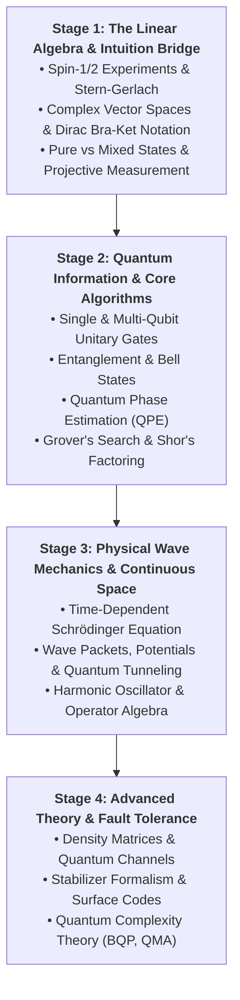
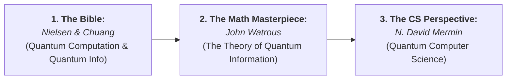

# 👑 Quantum Physics & Quantum Computing: The Canonical Curriculum
### From Zero Knowledge to Complex Linear Algebra, Unitary Quantum Algorithms & Fault-Tolerant Error Correction
*Authored for the Devendra Systems Engineering Workspace*

---

## 🧭 Executive Overview & Architectural Philosophy

Quantum Computing is frequently obscured by mystical pop-science metaphors ("particles being in two places at once" or "infinite parallel universes"). To a serious systems architect and computer scientist, this mysticism is unhelpful.

The first-principles truth is far cleaner:

> **Quantum Mechanics is not a physical theory of matter; it is an alternative framework of probability theory based on the 2-norm ($\|\cdot\|_2$) rather than the 1-norm ($\|\cdot\|_1$), formulated as *Complex Linear Algebra in Finite-Dimensional Hilbert Spaces*.**

In quantum computation:
1. **Qubits are Unit Vectors in $\mathbb{C}^2$**: A qubit state $|\psi\rangle = \alpha |0\rangle + \beta |1\rangle$ is simply a 2D complex column vector with normalization constraint $|\alpha|^2 + |\beta|^2 = 1$.
2. **Logic Gates are Unitary Matrices**: Any valid quantum operation is a square complex matrix $U$ satisfying $U^\dagger U = I$ (reversibility and norm preservation).
3. **Composite Systems are Tensor Products**: Combining $n$ qubits creates a state vector in a $2^n$-dimensional Hilbert space ($\mathbb{C}^{2^n}$) via the Kronecker tensor product ($\otimes$).
4. **Quantum Advantage is Interference & Phase Alignment**: Quantum algorithms do not test all answers simultaneously; they engineer constructive interference for the correct answer and destructive interference for all incorrect states.

---

## 🏛️ The Four-Stage Progressive Mastery Roadmap



---

## 📚 The Master Course Canon & Video Lecture Series

---

### 1. 🥇 Stage 1: Intuition & Mathematical Physics (Start from Zero)

#### 🎥 *Quantum Mechanics: The Theoretical Minimum*
* **Institution**: Stanford University
* **Instructor**: Prof. Leonard Susskind (Founding Father of String Theory & Holographic Principle).
* **Availability**: [Stanford Online & TheoreticalMinimum.com (Free Course)](https://theoreticalminimum.com/courses/quantum-mechanics/2012/fall) | [Stanford YouTube Playlist](https://www.youtube.com/playlist?list=PL701CD11509BE9B08)
* **Accompanying Book**: *Quantum Mechanics: The Theoretical Minimum* by Leonard Susskind & Art Friedman.
* **Why Start Here**: Bypasses the historical baggage of differential wave mechanics. Starts directly with a discrete 2-state quantum system (spin-1/2 electron), introducing Dirac notation, linear operators, eigenvectors, and uncertainty from ground zero.

---

### 2. 👑 Stage 2: The Definitive Quantum Computing Masterclass

#### 🎥 *Understanding Quantum Information and Computation*
* **Institution**: IBM Quantum / Qiskit
* **Instructor**: Prof. John Watrous (Former Technical Director of Quantum Education at IBM, Professor of Computer Science at University of Waterloo).
* **Availability**: [IBM Quantum Learning Portal](https://learning.quantum.ibm.com/) | [Qiskit YouTube Official Playlist](https://www.youtube.com/playlist?list=PLOFEBzvs-Vvp2xg9-POLJhQwtVktlYGbY) | [Director's Cut arXiv Textbook: 2507.11536](https://arxiv.org/abs/2507.11536)
* **Why This is the Gold Standard**: The single highest-yield, mathematically rigorous, no-hand-waving university-grade series in existence.
* **Four Core Units**:
  - **Unit 1: Basics of Quantum Information**: Qubits, standard bases, unitary operations, tensor products, and Bell measurement.
  - **Unit 2: Fundamentals of Quantum Algorithms**: Deutsch-Jozsa, Simon's problem, Quantum Fourier Transform (QFT), Quantum Phase Estimation (QPE), Shor's period-finding, and Grover's search algorithm.
  - **Unit 3: General Formulation of Quantum Information**: Density matrices ($\rho$), partial traces, completely positive trace-preserving (CPTP) maps, and POVM measurements.
  - **Unit 4: Foundations of Quantum Error Correction**: Quantum noise channels, the 9-qubit Shor code, the Stabilizer Formalism, and transversal fault-tolerant gates.

---

### 3. 🔬 Stage 3: Physics Wave Mechanics & MIT Specializations

#### 🎥 *MIT 8.04: Quantum Physics I*
* **Institution**: Massachusetts Institute of Technology (MIT)
* **Instructor**: Prof. Barton Zwiebach (MIT Department of Physics).
* **Availability**: [MIT OpenCourseWare (8.04)](https://ocw.mit.edu/courses/8-04-quantum-physics-i-spring-2016/) | [MIT OCW YouTube](https://www.youtube.com/playlist?list=PLUl4u3cNGP61-9PEhRognw5vryrSEVLPr)
* **Core Focus**: Continuous spatial quantum mechanics: Wave-particle duality, the time-dependent Schrödinger equation ($i\hbar \frac{\partial \Psi}{\partial t} = \hat{H} \Psi$), wave packets, probability density/currents, step potentials, tunneling, and the delta-function well.

#### 🎥 *MIT 8.370x / 8.371x: Quantum Information Science*
* **Institution**: MIT Open Learning Library / edX
* **Instructors**: Prof. Peter Shor, Prof. Isaac Chuang, Prof. Aram Harrow.
* **Core Focus**: Taught by the legends who founded the field. Covers quantum complexity theory ($\mathbf{BQP}$ vs $\mathbf{BPP}$ vs $\mathbf{NP}$), state tomography, and error-correcting surface codes.

---

### 4. 🚀 Stage 4: Frontier Graduate Theory

#### 📄 *Caltech Ph219: Quantum Computation and Information*
* **Institution**: California Institute of Technology (Caltech)
* **Instructor**: Prof. John Preskill (Richard P. Feynman Professor of Theoretical Physics).
* **Availability**: [Caltech Preskill Course Notes (Free Open PDF)](http://theory.caltech.edu/~preskill/ph219/index.html)
* **Core Focus**: The global reference text for PhD researchers: Quantum entanglement measures, quantum channels, topological quantum computation (anyons, braiding), and fault-tolerant threshold theorems.

---

## 📖 The Master Reading Canon & Textbooks



1. **📘 *Quantum Computation and Quantum Information* ("Mike & Ike")**
   - *Authors*: Michael A. Nielsen & Isaac L. Chuang (Cambridge University Press).
   - *Why Read*: Known across academia as "The Bible". It covers everything from basic quantum gates to fault-tolerant physical implementations.
2. **📘 *The Theory of Quantum Information***
   - *Author*: John Watrous (Cambridge University Press).
   - *Why Read*: The definitive pure-mathematics treatise on finite-dimensional quantum systems, density operators, spectral decompositions, and channel capacities.
3. **📘 *Quantum Computer Science: An Introduction***
   - *Author*: N. David Mermin (Cornell University).
   - *Why Read*: Written specifically for computer scientists and programmers with zero physics background.

---

## 🧮 Quantum Mathematical Cheat Sheet (The Core Formalism)

### 1. Dirac Bra-Ket Notation
- **Ket (Column Vector in $\mathbb{C}^2$)**: $|0\rangle = \begin{bmatrix} 1 \\ 0 \end{bmatrix}, \quad |1\rangle = \begin{bmatrix} 0 \\ 1 \end{bmatrix}$
- **Bra (Conjugate Transpose Row Vector in $\mathbb{C}^2$)**: $\langle 0| = \begin{bmatrix} 1 & 0 \end{bmatrix}, \quad \langle 1| = \begin{bmatrix} 0 & 1 \end{bmatrix}$
- **Inner Product (Scalar $\in \mathbb{C}$)**: $\langle \phi | \psi \rangle = \phi_0^* \psi_0 + \phi_1^* \psi_1$ (Probability amplitude of measuring state $|\phi\rangle$ given $|\psi\rangle$).
- **Outer Product (Operator Matrix $\in \mathbb{C}^{2 \times 2}$)**: $|\phi\rangle \langle\psi| = \begin{bmatrix} \phi_0 \psi_0^* & \phi_0 \psi_1^* \\ \phi_1 \psi_0^* & \phi_1 \psi_1^* \end{bmatrix}$

---

### 2. Fundamental Single-Qubit Quantum Gates

| Gate | Symbol | Matrix Representation | Physical Action |
| :--- | :---: | :---: | :--- |
| **Pauli-X (Bit Flip)** | $X$ (NOT) | $\begin{bmatrix} 0 & 1 \\ 1 & 0 \end{bmatrix}$ | Swaps $|0\rangle \leftrightarrow |1\rangle$ (Rotates $\pi$ radians around X-axis). |
| **Pauli-Z (Phase Flip)** | $Z$ | $\begin{bmatrix} 1 & 0 \\ 0 & -1 \end{bmatrix}$ | Maps $|0\rangle \to |0\rangle$ and $|1\rangle \to -|1\rangle$. |
| **Hadamard** | $H$ | $\frac{1}{\sqrt{2}}\begin{bmatrix} 1 & 1 \\ 1 & -1 \end{bmatrix}$ | Creates equal **Superposition**: $H|0\rangle = \frac{|0\rangle + |1\rangle}{\sqrt{2}} = |+\rangle$. |
| **Phase Gate** | $S$ | $\begin{bmatrix} 1 & 0 \\ 0 & i \end{bmatrix}$ | Rotates state by $\pi/2$ ($90^\circ$) around Z-axis ($S = \sqrt{Z}$). |
| **T-Gate** | $T$ | $\begin{bmatrix} 1 & 0 \\ 0 & e^{i\pi/4} \end{bmatrix}$ | Universal non-Clifford gate ($T = \sqrt{S}$), required for universal quantum computing. |

---

### 3. Multi-Qubit Entanglement: The Bell State
The **Controlled-NOT (CNOT)** gate acts on 2 qubits:
$$\text{CNOT} = \begin{bmatrix} 1 & 0 & 0 & 0 \\ 0 & 1 & 0 & 0 \\ 0 & 0 & 0 & 1 \\ 0 & 0 & 1 & 0 \end{bmatrix}$$

Applying a Hadamard on Qubit 0 followed by CNOT creates the maximally entangled **EPR Bell State**:
$$|\Phi^+\rangle = \text{CNOT}(H \otimes I)|00\rangle = \frac{|00\rangle + |11\rangle}{\sqrt{2}}$$
*(Measuring Qubit 0 instantly collapses Qubit 1 to the exact same value across arbitrary distances).*

---

## 🛠️ Hands-On SDK: Running Real Quantum Circuits

```python
# Complete Executable Qiskit 1.x Script: Creating & Simulating a Bell State
from qiskit import QuantumCircuit
from qiskit_aer import AerSimulator

# 1. Instantiate a 2-qubit, 2-classical-bit circuit
qc = QuantumCircuit(2, 2)

# 2. Apply Hadamard to Qubit 0 -> Superposition
qc.h(0)

# 3. Apply CNOT with Control=0, Target=1 -> Entanglement
qc.cx(0, 1)

# 4. Measure both qubits into classical register bits
qc.measure([0, 1], [0, 1])

# 5. Execute 1024 shots on local quantum statevector simulator
simulator = AerSimulator()
job = simulator.run(qc, shots=1024)
counts = job.result().get_counts()

print("Quantum State Measurement Distribution:", counts)
# Output: {'00': ~512, '11': ~512} -> Zero '01' or '10' states (Pure Entanglement)
```

---

## 🗓️ Structured 4-Month Self-Study Plan

| Phase | Core Objective | Primary Material | Practical Milestone |
| :--- | :--- | :--- | :--- |
| **Month 1** | **Quantum Foundations & Linear Algebra** | Stanford / Susskind *Quantum Mechanics: Theoretical Minimum* | Solve all Stern-Gerlach spin state projections by hand; master Dirac Bra-Ket algebra. |
| **Month 2** | **Quantum Algorithms & Qiskit** | IBM / John Watrous *Units 1 & 2* | Implement Deutsch-Jozsa, Quantum Phase Estimation, and Grover's search in Python. |
| **Month 3** | **Density Matrices & Continuous Wave Mechanics** | IBM / John Watrous *Unit 3* + MIT 8.04 (Barton Zwiebach) | Calculate partial traces of entangled states; solve particle-in-a-box tunneling in Python. |
| **Month 4** | **Quantum Error Correction & Fault Tolerance** | IBM / John Watrous *Unit 4* + Nielsen & Chuang Ch. 10 | Implement the 9-qubit Shor error-correcting stabilizer code in Qiskit. |
