# 🧠 Masterclass: Deep Learning Foundations, Neural Architectures & PyTorch Engineering (Week 01)

> **Role & Perspective**: Principal AI Scientist & Deep Learning Systems Architect
> **Tag**: `#gennotes` | **Domain**: Artificial Neural Networks, Optimization Theory, PyTorch Engineering
> **Source Synthesis**: Lecture Slides (`Introduction to ANN`), Notebooks (`Pytorch Fundamentals`, `Pytorch Workflow`, `XOR Problem`, `Customer Churn Prediction`, `Fashion MNIST Classification`), and `Telco-Customer-Churn.csv`.

---

## 🎯 Executive Summary & Learning Objectives

Welcome to the foundational masterclass on Artificial Neural Networks (ANNs) and PyTorch. 

We do not treat Deep Learning as a collection of magical black boxes. Instead, we build every concept from **first principles**—starting with biological intuition, walking through the mathematical crises that shaped AI history, understanding the geometric mechanics of high-dimensional space warping, and writing hardened, production-grade PyTorch code that runs on modern GPU clusters.

By the end of this masterclass, you will be able to:
1. **Explain the Representation Learning Paradigm**: Understand why traditional Machine Learning hit a wall with manual feature engineering and how Deep Learning extracts hierarchical representations directly from raw signals.
2. **Master the 4 Foundational Inventions ("Tricks")**: Deeply grasp the *Numerization*, *Learn-the-Function*, *Parameterization*, and *Loss Landscape Optimization* tricks that make all modern AI (from simple perceptrons to GPT-4) possible.
3. **Trace the 80-Year Neuron Evolution**: Deconstruct the McCulloch-Pitts neuron, Rosenblatt's Perceptron, and mathematically prove why single-layer linear models suffered a catastrophic failure on the **XOR problem** (triggering the first AI Winter).
4. **Demystify Non-Linearity & Activation Functions**: Prove why stacking linear layers without activation functions is mathematically useless, and navigate the trade-offs of Sigmoid, Tanh, ReLU, Leaky ReLU, and Softmax.
5. **Derive Forward & Backward Propagation by Hand**: Trace exact scalar and matrix gradients using computational graphs and the multivariate Chain Rule of Calculus.
6. **Architect High-Performance PyTorch Systems**: Master N-dimensional tensor striding, memory layouts (`view` vs `reshape`), broadcasting laws, CUDA streaming multiprocessors, and zero-leak GPU memory management.
7. **Execute the Canonical 5-Step PyTorch Workflow**: Build, train, defensively evaluate, and serialize production models for regression, tabular customer churn prediction, and Fashion-MNIST computer vision.
8. **Avoid the Top 10 Junior ML Engineer Traps**: Recognize and eliminate silent bugs like VRAM leaks, ghost gradient accumulation, data leakage, and numerical instability.

---

## 🗺️ The Complete Conceptual Roadmap

```mermaid
graph TD
    subgraph Theoretical_Foundations["🏛️ Theoretical Foundations & History"]
        P1["1. The Great Paradigm Shift<br><i>(Handcrafted Features vs Representation Learning)</i>"]
        P2["2. The 4 Grand Inventions<br><i>(Numerization, Function Approx, Parameters, Loss)</i>"]
        P3["3. Neuron Evolution<br><i>(McCulloch-Pitts ──► Perceptron ──► Differentiable Neuron)</i>"]
        P4["4. The XOR Barrier & Geometry<br><i>(Linear Inseparability & Space Warping)</i>"]
        P5["5. Activation Function Zoo<br><i>(Sigmoid, Tanh, ReLU, Dying ReLU, Softmax)</i>"]
        P6["6. Loss Landscapes & Backprop<br><i>(Chain Rule, Computational Graphs, Gradient Descent)</i>"]
    end

    subgraph PyTorch_Engineering["⚙️ PyTorch Systems Engine"]
        E1["7. Tensor Memory & Architecture<br><i>(Strides, Contiguity, CUDA, Host-Device PCIe)</i>"]
        E2["8. The Canonical 5-Step Pipeline<br><i>(Dataset/Loader ──► nn.Module ──► Loss/Opt ──► Loop ──► Persist)</i>"]
    end

    subgraph Production_Applications["🚀 Production Implementations"]
        A1["9. Synthetic Linear Regression<br><i>(Parameter Recovery)</i>"]
        A2["10. Tabular Churn Classifier<br><i>(Telco CSV, Imbalance, BatchNorm, Dropout)</i>"]
        A3["11. Computer Vision MLP<br><i>(Fashion-MNIST, 784-D Flattening, CrossEntropy)</i>"]
    end

    subgraph Mastery_Audits["🛡️ Defensive Engineering"]
        M1["12. The Junior ML Engineer Hall of Shame<br><i>(Top 10 Silent Bugs & Fixes)</i>"]
        M2["13. 8-Level Progressive Practice<br><i>(Recognition to Interview Defense)</i>"]
    end

    Theoretical_Foundations --> PyTorch_Engineering
    PyTorch_Engineering --> Production_Applications
    Production_Applications --> Mastery_Audits
```

---

# 1. The Great Paradigm Shift: Traditional ML vs. Deep Learning

## 1.1 The Problem: The Handcrafted Feature Bottleneck

Imagine you are tasked with building an image classifier to detect whether an image contains a **Cat** or a **Dog**.

### How Traditional Machine Learning Approaches This:
In classical ML (Logistic Regression, Support Vector Machines, Random Forests), the algorithm cannot look at raw pixels ($1024 \times 1024 \times 3 = 3.14\text{ million numbers}$) and make sense of them. If you feed raw pixels into an SVM, it fails miserably because pixels have high variance: changing the lighting, rotating the cat by $5^\circ$, or changing the background completely scrambles the pixel values.

Therefore, human engineers had to spend months acting as **artisan feature crafters**:
- Extract edge histograms using **Sobel filters**.
- Compute corner descriptors using **Harris Corner Detectors**.
- Calculate texture representations using **SIFT** (Scale-Invariant Feature Transform) or **HOG** (Histogram of Oriented Gradients).
- Extract color histograms.

```
Traditional ML:
[Raw Pixels] ──► [Human Domain Expert Crafts Features (SIFT/HOG)] ──► [Shallow Model (SVM/Tree)] ──► "Cat"
```

### What Goes Wrong:
1. **Fragility & Brittleness**: If the lighting changes or the cat is upside down, your hand-crafted SIFT rules break.
2. **Domain Silos**: A feature pipeline hand-crafted for medical X-rays is 100% useless for autonomous driving or satellite imagery.
3. **The Human Bottleneck**: Human intuition is fundamentally limited to 3 dimensions. We cannot hand-engineer mathematical features that capture subtle 12th-order statistical correlations across millions of pixels.

---

## 1.2 The Deep Learning Revolution: Representation Learning

Deep Learning throws away manual feature engineering. Instead, we feed **raw signals** directly into a deep neural network, and the network **learns its own hierarchy of features automatically**:

```
Deep Learning:
[Raw Pixels] ──► [Layer 1: Edges] ──► [Layer 2: Textures] ──► [Layer 3: Parts (Ears/Noses)] ──► [Layer 4: Full Objects] ──► "Cat"
```

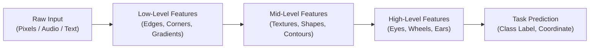

> [!TIP]
> **The Mental Model: The Artisan Sculptor vs. Self-Tuning Clay**
> - **Traditional ML** is like an artisan sculptor meticulously carving marble with tiny chisels (handcrafted rules). If the stone changes slightly, the chisel breaks.
> - **Deep Learning** is like placing intelligent, self-tuning clay into a wind tunnel (the loss function) and letting the aerodynamics shape the clay automatically into the optimal aerodynamic vehicle.

---

# 2. The 4 Grand Inventions ("Tricks") of Deep Learning

Every deep learning model on the planet—whether a simple 2-layer network or a 500-billion parameter transformer like GPT-4—is built on **four universal mathematical inventions**:

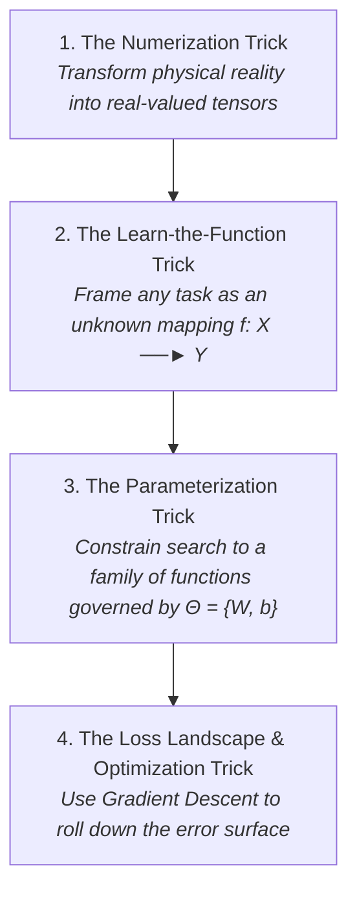

---

## 2.1 Invention 1: The Numerization Trick (From Reality to Tensors)

Computers cannot process sensations, concepts, or emotions. They can only multiply arrays of floating-point numbers.
Therefore, the first rule of AI is: **Everything must be converted into a continuous, real-valued tensor ($\mathbb{R}^n$).**

### How Different Modalities Are Numerized:
1. **Images**: A 2D grid of pixels. A color photo of resolution $224 \times 224$ becomes a 3D tensor of shape $(3, 224, 224)$ representing Red, Green, and Blue channels, with values normalized from $[0, 255]$ to $[0.0, 1.0]$.
2. **Audio**: Continuous pressure waves are sampled at $16\text{ kHz}$ (16,000 numbers per second) or transformed via Fourier Transforms into 2D time-frequency **Spectrogram matrices**.
3. **Tabular Data**: Continuous numbers (e.g., Salary, Age) are standardized ($\mu=0, \sigma=1$). Categorical text (e.g., "Male", "Female", "Unknown") is converted into **One-Hot Vectors** or mapped into continuous multi-dimensional **Embedding vectors**.
4. **Text / Language**: Text is broken into tokens (sub-words), and each token ID is mapped to a dense vector (e.g., a 768-dimensional float array in BERT).

---

## 2.2 Invention 2: The "Learn the Function" Trick (Universal Approximation)

Any intelligent task in the universe can be expressed as a mathematical mapping:
$$f: \mathcal{X} \longrightarrow \mathcal{Y}$$

- **Medical Diagnosis**: $f(\text{Patient MRI Scan}) \longrightarrow \text{Probability of Tumor}$
- **Autonomous Driving**: $f(\text{Camera Feed} + \text{LiDAR}) \longrightarrow (\text{Steering Angle}, \text{Braking Force})$
- **Language Translation**: $f(\text{English Sentence}) \longrightarrow \text{Hindi Sentence}$

### The Universal Approximation Theorem (Cybenko 1989, Hornik 1991)
> **Theorem**: A standard feedforward neural network with a single hidden layer containing a finite number of neurons and non-linear activation functions can approximate **any continuous function** on compact subsets of $\mathbb{R}^n$ to arbitrary precision $\epsilon > 0$.

> [!NOTE]
> **Analogy: Building Any Curve with Lego Bricks**
> Just as you can approximate any smooth curved sculpture (like a sphere) using enough tiny rectangular Lego bricks, a neural network can approximate any wildly complex mathematical curve by combining enough simple non-linear steps.

---

## 2.3 Invention 3: The Parameterization Trick (Constraining the Infinite)

You cannot search through the infinite mathematical universe of all possible functions. That is an uncomputable problem.

**The Solution**: We define a specific mathematical architecture whose behavior is completely controlled by a finite collection of adjustable numbers called **Parameters ($\Theta$)**:
$$f(x; \Theta) \quad \text{where } \Theta = \{W^{[1]}, b^{[1]}, W^{[2]}, b^{[2]}, \dots, W^{[L]}, b^{[L]}\}$$

- $W$ (**Weights**): Scaling knobs that decide how strongly each input affects the output.
- $b$ (**Biases**): Offsets that decide how easily a neuron fires regardless of the input.

> [!TIP]
> **Analogy: The Master Audio Mixing Console**
> Imagine sitting in front of a giant music mixing console with 10,000 rotary knobs. By adjusting those knobs to the exact right positions, you can make the orchestra sound like a masterpiece. Deep learning is the automated process of tuning those knobs.

---

## 2.4 Invention 4: The Loss Landscape & Optimization Trick

Once we have knobs ($\Theta$), how do we know where to turn them?
1. We define a scalar **Loss Function $\mathcal{L}(\Theta)$** that measures the error between our model's prediction $\hat{y} = f(x; \Theta)$ and the true ground-truth label $y$.
2. This creates a multi-dimensional **Loss Landscape** (a terrain of hills and valleys).
3. We place our parameters at a random starting point on this terrain.
4. Using **Calculus (Partial Derivatives / Gradients)**, we determine the direction of steepest descent and take small steps downhill using **Gradient Descent**:
$$\Theta_{\text{new}} = \Theta_{\text{old}} - \eta \nabla_{\Theta} \mathcal{L}(\Theta)$$

> [!NOTE]
> **Analogy: The Blindfolded Hiker in Dense Fog**
> Imagine being blindfolded on a foggy mountain in the Himalayas. You want to reach the lowest valley (minimum error). You cannot see the landscape. What do you do? You feel the slope of the ground under your boots with your feet. The ground slopes downward to your left, so you take a small step to the left. You repeat this step 10,000 times until the ground under your feet is completely flat. That is Gradient Descent.

---

# 3. The 80-Year Evolution of the Artificial Neuron

To truly understand modern AI, we must trace how we got here and why earlier approaches failed.

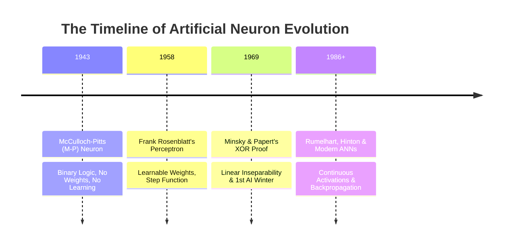

---

## 3.1 The Biological Inspiration vs. Mathematical Reality

```
Biological Neuron:
  Dendrites (Input fibers) ──► Cell Body / Soma (Summation) ──► Axon (Transmission Line) ──► Synapse (Connection Gate)

Artificial Neuron:
  Input Features (x₁, x₂, ...) ──► Weighted Sum (Σ wᵢxᵢ + b) ──► Non-Linear Activation σ(z) ──► Output (a)
```

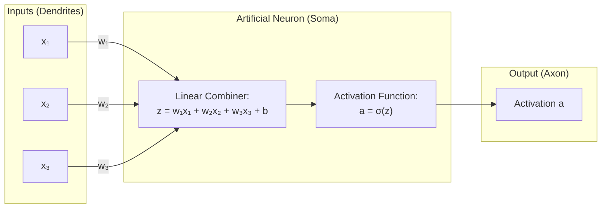

---

## 3.2 Stage 1: The McCulloch-Pitts (M-P) Neuron (1943)

Warren McCulloch (neurophysiologist) and Walter Pitts (logician) created the first mathematical model of a biological neuron.

### Mathematical Definition:
- **Inputs**: Exclusively binary: $x_i \in \{0, 1\}$.
- **Weights**: Non-existent (all inputs are equally weighted with value $1$).
- **Inhibitory Inputs**: If any single inhibitory input is $1$, the output is immediately forced to $0$.
- **Firing Rule**:
  $$y = \begin{cases} 1 & \text{if } \sum_{i=1}^n x_i \ge \theta \text{ and NO inhibitory input is active} \\ 0 & \text{otherwise} \end{cases}$$

### Why the M-P Neuron Failed:
1. **Zero Learning**: There were no weights to update. The threshold $\theta$ and network wiring had to be hand-calculated by a human engineer.
2. **Boolean-Only**: It could only compute basic Boolean logic gates (AND, OR, NOT). It could not process real numbers like temperature, audio, or continuous pixel brightness.

---

## 3.3 Stage 2: Frank Rosenblatt's Perceptron (1958)

Frank Rosenblatt introduced the critical breakthrough that birthed machine learning: **Learnable Synaptic Weights ($w_i$) and an Automatic Learning Algorithm**.

### Mathematical Formulation:
$$z = \sum_{i=1}^n w_i x_i + b = \mathbf{w}^T \mathbf{x} + b$$
$$\hat{y} = f(z) = \begin{cases} 1 & \text{if } z \ge 0 \\ 0 & \text{if } z < 0 \end{cases}$$

Here, $f(z)$ is the **Heaviside Step Function**.

### The Perceptron Learning Rule:
For every training sample $(\mathbf{x}, y)$ where $y \in \{0, 1\}$:
1. Compute prediction $\hat{y} = f(\mathbf{w}^T \mathbf{x} + b)$.
2. Compute the error: $e = (y - \hat{y})$.
3. Update weights and bias:
   $$\mathbf{w} \longleftarrow \mathbf{w} + \eta (y - \hat{y}) \mathbf{x}$$
   $$b \longleftarrow b + \eta (y - \hat{y})$$
   *(where $\eta \in (0, 1]$ is the learning rate).*

### The Behavior of the Update Rule:
- If prediction is correct ($\hat{y} = y$), error is $0 \implies$ **No change**.
- If $\hat{y}=0$ but true $y=1$ (False Negative), $(y - \hat{y}) = +1 \implies$ **Weights increase**, pulling the decision boundary closer to classifying $\mathbf{x}$ as positive.
- If $\hat{y}=1$ but true $y=0$ (False Positive), $(y - \hat{y}) = -1 \implies$ **Weights decrease**, pushing the boundary away.

### The Perceptron Convergence Theorem
> **Theorem**: If the training dataset is **linearly separable**, Rosenblatt's Perceptron learning algorithm is mathematically guaranteed to converge to a separating hyperplane in a **finite number of steps**.

---

# 4. The Catastrophe That Caused the First AI Winter: The XOR Problem

In 1969, MIT pioneers Marvin Minsky and Seymour Papert published the book *Perceptrons*. In it, they proved a devastating mathematical limitation that froze global AI research funding for over a decade.

## 4.1 What is Linear Separability?

A dataset in $N$-dimensional space is **linearly separable** if you can separate the positive classes ($y=1$) from negative classes ($y=0$) using a single $(N-1)$-dimensional flat hyperplane (a straight line in 2D, a flat sheet of paper in 3D, a hyperplane in $N$-D).

### Let us test basic Boolean Logic gates in 2D space:

```
AND Gate: (Only (1,1) is True)       OR Gate: (Any 1 is True)           XOR Gate: (Odd 1s are True)
  x₂                                   x₂                                 x₂
   ▲                                    ▲                                  ▲
 1 │   ○ (0)       ● (1)              1 │   ● (1)       ● (1)            1 │   ● (1)       ○ (0)
   │        \                           │    \                             │
 0 │   ○ (0) \     ○ (0)              0 │   ○ (0) \     ● (1)            0 │   ○ (0)       ● (1)
   └───┴───────\───┴────► x₁            └───┴───────\───┴────► x₁          └───┴───────────┴────► x₁
       0           1                        0           1                      0           1
 [Linearly Separable! ✅]             [Linearly Separable! ✅]           [IMPOSSIBLE TO SEPARATE WITH 1 LINE! ❌]
```

---

## 4.2 The Rigorous Mathematical Impossibility Proof

Let us prove rigorously why **no combination of weights ($w_1, w_2$) and bias ($b$) can EVER solve XOR using a single perceptron**.

### The Setup:
Recall the decision rule for a perceptron:
- $\hat{y} = 1 \iff w_1 x_1 + w_2 x_2 + b \ge 0$
- $\hat{y} = 0 \iff w_1 x_1 + w_2 x_2 + b < 0$

Now plug in the 4 truth table rows of XOR:

| Point $(x_1, x_2)$ | Target $y$ | Perceptron Requirement | Resulting Inequality |
| :---: | :---: | :---: | :---: |
| $(0, 0)$ | $0$ | $w_1(0) + w_2(0) + b < 0$ | **Inequality 1: $b < 0$** |
| $(0, 1)$ | $1$ | $w_1(0) + w_2(1) + b \ge 0$ | **Inequality 2: $w_2 + b \ge 0$** |
| $(1, 0)$ | $1$ | $w_1(1) + w_2(0) + b \ge 0$ | **Inequality 3: $w_1 + b \ge 0$** |
| $(1, 1)$ | $0$ | $w_1(1) + w_2(1) + b < 0$ | **Inequality 4: $w_1 + w_2 + b < 0$** |

### The Algebraic Contradiction:
1. Add Inequality 2 and Inequality 3 together:
   $$(w_2 + b) + (w_1 + b) \ge 0 + 0$$
   $$\mathbf{w_1 + w_2 + 2b \ge 0}$$

2. Group the terms strategically:
   $$\mathbf{(w_1 + w_2 + b) + b \ge 0}$$

3. Now inspect what our other inequalities tell us:
   - Inequality 4 states: $(w_1 + w_2 + b) < 0$ (a strictly negative quantity).
   - Inequality 1 states: $b < 0$ (a strictly negative quantity).

4. **The Contradiction**:
   $$\underbrace{(w_1 + w_2 + b)}_{\text{Strictly Negative}} + \underbrace{b}_{\text{Strictly Negative}} \text{ MUST BE } < 0$$
   Yet step (2) asserts that their sum is $\ge 0$.

It is mathematically impossible for the sum of two negative real numbers to be greater than or equal to zero.
$$\therefore \text{No single-layer perceptron can solve the XOR problem. } \blacksquare$$

---

## 4.3 The Breakthrough: The Multi-Layer Perceptron & Space Warping

How do we solve XOR? By adding an **intermediate (Hidden) Layer** with non-linear activation functions!

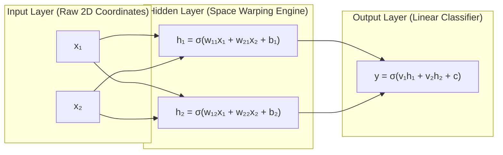

### The Geometric Intuition: The Origami Fold
Think of the 2D input plane as a flat sheet of paper with two blue dots at $(0,1)$ and $(1,0)$ and two red dots at $(0,0)$ and $(1,1)$. You cannot separate them with a single straight scissor cut.
**What does the hidden layer do?**
The non-linear hidden neurons **fold the sheet of paper in 3D space**. By folding $(1,1)$ down near $(0,0)$, the red dots are now on one side, and the blue dots are on the other. Now, a single straight scissor cut (the output neuron) easily separates them!

---

## 4.4 Hand Calculation: Solving XOR with Specific Hand-Selected Weights

Let us prove this works by manually calculating a 2-2-1 network on all 4 XOR inputs using step-like thresholds:
- Hidden Neuron 1 ($h_1$ acts as an **OR** gate): $w_{11}=1, w_{21}=1, b_1=-0.5$. Firing rule: $h_1 = 1$ if $x_1 + x_2 - 0.5 \ge 0$.
- Hidden Neuron 2 ($h_2$ acts as a **NAND** gate): $w_{12}=-1, w_{22}=-1, b_2=1.5$. Firing rule: $h_2 = 1$ if $-x_1 - x_2 + 1.5 \ge 0$.
- Output Neuron ($y$ acts as an **AND** gate on hidden features): $v_1=1, v_2=1, c=-1.5$. Firing rule: $y = 1$ if $h_1 + h_2 - 1.5 \ge 0$.

| Input $(x_1, x_2)$ | $h_1 = \text{OR}(x_1, x_2)$ | $h_2 = \text{NAND}(x_1, x_2)$ | $h_1 + h_2$ | Output $y = (h_1 + h_2 \ge 1.5)$ | Target XOR |
| :---: | :---: | :---: | :---: | :---: | :---: |
| $(0, 0)$ | $0$ | $1$ | $1.0$ | **0** | **0** ✅ |
| $(0, 1)$ | $1$ | $1$ | $2.0$ | **1** | **1** ✅ |
| $(1, 0)$ | $1$ | $1$ | $2.0$ | **1** | **1** ✅ |
| $(1, 1)$ | $1$ | $0$ | $1.0$ | **0** | **0** ✅ |

**XOR is solved perfectly!** The hidden layer mapped non-linear inputs into a transformed latent space $(h_1, h_2)$ where the problem became trivially linearly separable!

---

# 5. Activation Functions: The Soul of Non-Linearity

## 5.1 The Mathematical Proof of Linear Collapse

What happens if you build a deep neural network with 100 hidden layers, but **do not use non-linear activation functions** (or use purely linear functions $f(z) = z$)?

Let us write out the math:
- Layer 1: $h_1 = W_1 x + b_1$
- Layer 2: $h_2 = W_2 h_1 + b_2 = W_2 (W_1 x + b_1) + b_2 = (W_2 W_1) x + (W_2 b_1 + b_2)$
- Layer 3: $h_3 = W_3 h_2 + b_3 = W_3 ((W_2 W_1) x + (W_2 b_1 + b_2)) + b_3 = (W_3 W_2 W_1) x + (W_3 W_2 b_1 + W_3 b_2 + b_3)$

For any depth $L$:
$$\hat{y} = \underbrace{(W_L W_{L-1} \cdots W_1)}_{W_{\text{net}}} x + \underbrace{(W_L \cdots W_2 b_1 + \dots + b_L)}_{b_{\text{net}}}$$

Because matrix multiplication is associative, the product of $L$ matrices is simply **one single combined matrix $W_{\text{net}}$**.
$$\hat{y} = W_{\text{net}} x + b_{\text{net}}$$

> [!CAUTION]
> **The Takeaway**: A 1,000-layer neural network with linear activations has the exact same mathematical capacity as a **single linear regression model**. Non-linear activation functions are the ONLY thing that unlocks deep representation learning!

---

## 5.2 The Complete Activation Function Zoo & Decision Matrix

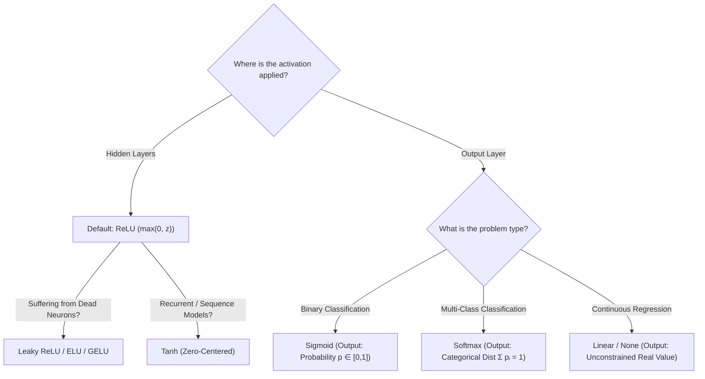

---

### 1. The Sigmoid Function
$$\sigma(z) = \frac{1}{1 + e^{-z}} \quad \text{Derivative: } \sigma'(z) = \sigma(z)(1 - \sigma(z))$$

- **Output Range**: $(0, 1)$ — Great for binary probabilities.
- **Fatal Flaw 1: The Vanishing Gradient Catastrophe**:
  The derivative $\sigma'(z)$ peaks at $z=0$ with a maximum value of $0.25$. For $|z| > 4$, $\sigma'(z) \to 0$. When backpropagating through 10 layers, gradients are scaled by $(0.25)^{10} \approx 9.5 \times 10^{-7}$. The earliest layers receive zero gradient and **stop learning completely**.
- **Fatal Flaw 2: Non-Zero-Centered**:
  Since $\sigma(z) > 0$ always, gradients on weights $W$ all take the same sign (all positive or all negative), forcing parameter updates into an inefficient zig-zag trajectory.

---

### 2. The Hyperbolic Tangent (Tanh) Function
$$\tanh(z) = \frac{e^z - e^{-z}}{e^z + e^{-z}} \quad \text{Derivative: } \tanh'(z) = 1 - \tanh^2(z)$$

- **Output Range**: $(-1, 1)$.
- **Advantage**: **Zero-Centered**! The mean activation is centered around $0$, preventing zig-zag gradient dynamics and speeding up optimization.
- **Drawback**: Still saturates at extreme values, causing vanishing gradients for large $|z|$.

---

### 3. Rectified Linear Unit (ReLU) — The Modern King
$$\text{ReLU}(z) = \max(0, z) \quad \text{Derivative: } \text{ReLU}'(z) = \begin{cases} 1 & \text{if } z > 0 \\ 0 & \text{if } z < 0 \end{cases}$$

- **Why ReLU Changed Deep Learning**:
  1. **Non-Saturating Gradient**: For all positive values ($z > 0$), the gradient is **exactly $1.0$**. It never vanishes, allowing models with hundreds of layers (like ResNet) to train efficiently.
  2. **Computational Velocity**: Evaluating $\max(0, z)$ requires a single CPU/GPU comparison instruction, whereas computing $e^{-z}$ in Sigmoid requires expensive floating-point transcendental hardware routines.
  3. **Sparse Representations**: When $z \le 0$, the neuron outputs $0$, producing sparse representations where only relevant sub-networks activate.
- **The "Dying ReLU" Problem (Zombie Neurons)**:
  If a neuron receives a massive negative gradient update that pushes its bias heavily negative, $z = Wx + b$ will be $< 0$ for *all* inputs in the dataset. Because the gradient for $z \le 0$ is $0$, **the neuron will never receive a gradient again and dies permanently**.

---

### 4. Leaky ReLU, PReLU & ELU (Curing the Zombies)
- **Leaky ReLU**: $\max(\alpha z, z)$ with fixed slope $\alpha \approx 0.01$. Gradients are never zero for $z < 0$, keeping dead neurons alive.
- **Parametric ReLU (PReLU)**: $\alpha$ is a learnable parameter optimized by backpropagation.
- **Exponential Linear Unit (ELU)**: Smooth curve for negative values ($\alpha(e^z - 1)$), pulling mean activations closer to zero.

---

### 5. Softmax (Multi-Class Probability Normalization)
For a vector of raw unnormalized logits $\mathbf{z} = [z_1, z_2, \dots, z_K]$ across $K$ classes:
$$p_i = \text{Softmax}(z_i) = \frac{e^{z_i}}{\sum_{j=1}^K e^{z_j}}$$
- **Properties**: $\forall i, p_i \in (0, 1)$ and $\sum_{i=1}^K p_i = 1.0$.

---

# 6. Loss Functions & Backpropagation Derivation

## 6.1 Loss Functions: Measuring Model Error

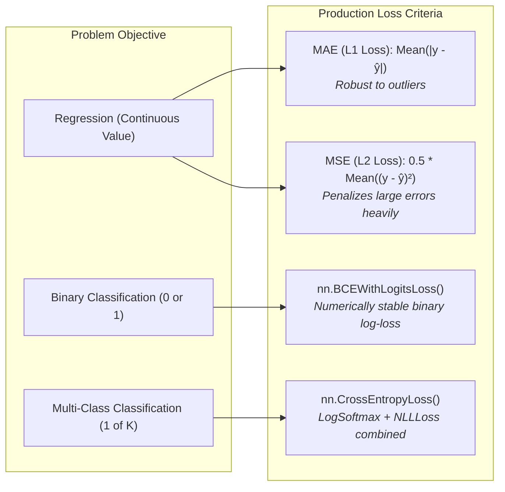

---

## 6.2 Backpropagation: The Multivariate Chain Rule on Computational Graphs

Backpropagation is simply an automated implementation of the **Chain Rule of Calculus** propagating backward through a directed acyclic graph (DAG).

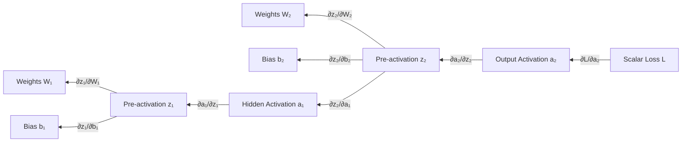

### The 4 Universal Equations of Backpropagation:
For a layer $l$ receiving input $a^{[l-1]}$ and computing $z^{[l]} = W^{[l]} a^{[l-1]} + b^{[l]}$, with activation $a^{[l]} = \sigma(z^{[l]})$:

1. **Error Vector at Output Layer ($L$)**:
   $$\delta^{[L]} = \frac{\partial \mathcal{L}}{\partial z^{[L]}} = \frac{\partial \mathcal{L}}{\partial a^{[L]}} \odot \sigma'(z^{[L]})$$
2. **Error Vector at Hidden Layer ($l$)**:
   $$\delta^{[l]} = \left( (W^{[l+1]})^T \delta^{[l+1]} \right) \odot \sigma'(z^{[l]})$$
3. **Gradient with Respect to Weights**:
   $$\frac{\partial \mathcal{L}}{\partial W^{[l]}} = \delta^{[l]} (a^{[l-1]})^T$$
4. **Gradient with Respect to Biases**:
   $$\frac{\partial \mathcal{L}}{\partial b^{[l]}} = \delta^{[l]}$$

---

# 7. PyTorch Engineering & Tensor Memory Architecture

## 7.1 What is a Tensor Really?

In PyTorch, a `torch.Tensor` is not just a mathematical matrix. Under the hood in C++ (`libtorch`), a tensor consists of:
1. **Storage Buffer (`Storage`)**: A 1D flat, contiguous block of allocated memory (e.g., in CPU RAM or GPU VRAM).
2. **Size / Shape**: An array indicating dimensions (e.g., `[3, 224, 224]`).
3. **Stride**: The number of memory elements to skip to move one step along each dimension.
4. **Offset**: Where the data starts in storage.

```
Logical 2D Matrix (2x3):
[[1, 2, 3],
 [4, 5, 6]]

Physical 1D Memory Layout:
[ 1 | 2 | 3 | 4 | 5 | 6 ]
Shape: (2, 3) | Strides: (3, 1) -> To go to next row, skip 3 floats. To go to next col, skip 1 float.
```

---

## 7.2 Crucial Tensor Operations: `view()` vs. `reshape()`

```python
import torch

x = torch.tensor([[1, 2, 3], [4, 5, 6]]) # Shape: (2, 3)

# view() shares the EXACT same memory pointer!
v = x.view(3, 2)
v[0, 0] = 999
print(x[0, 0]) # Outputs 999! (Underlying buffer was mutated!)

# reshape() returns a view if contiguous, but silently copies if not contiguous!
t = x.t() # Transposing swaps strides without rearranging memory (non-contiguous!)
# t.view(6) -> CRASHES with RuntimeError!
r = t.reshape(6) # Works safely by creating a new memory allocation and copying!
```

> [!WARNING]
> **Senior Architect Rule**: Always use `.reshape()` if you aren't 100% certain of tensor contiguity, or call `.contiguous().view()` to be explicit about memory allocation.

---

## 7.3 CPU vs. GPU (CUDA) Hardware Architecture

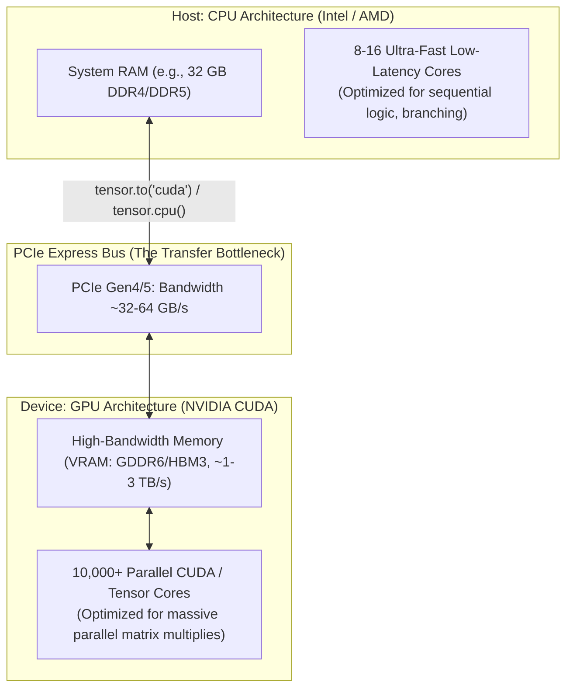

### The 3 Golden Rules of CUDA Device Management:
1. **Device Isolation Rule**: Operations cannot combine CPU tensors and GPU tensors. Both operands must reside on the same device (`device = "cuda" if torch.cuda.is_available() else "cpu"`).
2. **PCIe Transfer Minimization**: Moving tensors across the PCIe bus (`.to('cuda')`) is slow. Keep batches on GPU as long as possible; do not transfer intermediate activations back to CPU during training loops.
3. **The NumPy Detach Law**: GPU tensors and tensors with autograd graphs (`requires_grad=True`) cannot be converted directly to NumPy. You must call:
   ```python
   numpy_array = gpu_tensor.detach().cpu().numpy()
   ```

---

# 8. The Production 5-Step PyTorch Workflow

Every world-class PyTorch engineer follows this exact 5-step lifecycle:

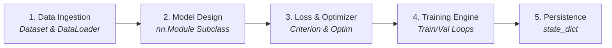

---

## 8.1 Complete Production Code Template

```python
import torch
import torch.nn as nn
import torch.optim as optim
from torch.utils.data import DataLoader, TensorDataset
from pathlib import Path

# ─────────────────────────────────────────────────────────────────────────────
# 1. HARDWARE AGNOSTIC SETUP
# ─────────────────────────────────────────────────────────────────────────────
device = torch.device("cuda" if torch.cuda.is_available() else "cpu")
torch.manual_seed(42)
if torch.cuda.is_available():
    torch.cuda.manual_seed_all(42)

# ─────────────────────────────────────────────────────────────────────────────
# 2. DATA PIPELINE (Dataset & DataLoader)
# ─────────────────────────────────────────────────────────────────────────────
# Synthetic regression: y = 0.7 * X + 0.3
X = torch.arange(0, 1, 0.02, dtype=torch.float32).unsqueeze(dim=1)
y = 0.7 * X + 0.3

split = int(0.8 * len(X))
X_train, y_train = X[:split], y[:split]
X_test, y_test = X[split:], y[split:]

# Production DataLoader with batching & shuffling
train_loader = DataLoader(
    dataset=TensorDataset(X_train, y_train),
    batch_size=8,
    shuffle=True,
    drop_last=False
)
test_loader = DataLoader(
    dataset=TensorDataset(X_test, y_test),
    batch_size=8,
    shuffle=False
)

# ─────────────────────────────────────────────────────────────────────────────
# 3. ARCHITECTURE DESIGN (nn.Module)
# ─────────────────────────────────────────────────────────────────────────────
class ProductionLinearModel(nn.Module):
    def __init__(self, in_features: int = 1, out_features: int = 1):
        super().__init__()
        # nn.Linear encapsulates W and b automatically
        self.layer = nn.Linear(in_features=in_features, out_features=out_features)

    def forward(self, x: torch.Tensor) -> torch.Tensor:
        return self.layer(x)

model = ProductionLinearModel().to(device)

# ─────────────────────────────────────────────────────────────────────────────
# 4. LOSS CRITERION & OPTIMIZER
# ─────────────────────────────────────────────────────────────────────────────
loss_fn = nn.L1Loss() # Mean Absolute Error (MAE)
optimizer = optim.SGD(params=model.parameters(), lr=0.01, momentum=0.9)

# ─────────────────────────────────────────────────────────────────────────────
# 5. THE ROBUST 5-STEP TRAINING & EVALUATION LOOP
# ─────────────────────────────────────────────────────────────────────────────
epochs = 150

for epoch in range(1, epochs + 1):
    # --- TRAINING PHASE ---
    model.train() # Enable Dropout & BatchNorm training behavior
    running_train_loss = 0.0

    for batch_X, batch_y in train_loader:
        batch_X, batch_y = batch_X.to(device), batch_y.to(device)

        # 1. Forward pass
        y_pred = model(batch_X)

        # 2. Compute loss
        loss = loss_fn(y_pred, batch_y)

        # 3. Flush accumulated gradients
        optimizer.zero_grad()

        # 4. Backward pass (Autograd DAG traversal)
        loss.backward()

        # 5. Optimizer step (Update weights)
        optimizer.step()

        # CRITICAL: Use .item() to avoid VRAM memory leak!
        running_train_loss += loss.item() * batch_X.size(0)

    train_loss = running_train_loss / len(train_loader.dataset)

    # --- EVALUATION PHASE ---
    model.eval() # Disable Dropout & freeze BatchNorm running stats
    running_test_loss = 0.0

    with torch.inference_mode(): # Fastest inference mode, zero autograd overhead
        for test_X, test_y in test_loader:
            test_X, test_y = test_X.to(device), test_y.to(device)
            test_pred = model(test_X)
            t_loss = loss_fn(test_pred, test_y)
            running_test_loss += t_loss.item() * test_X.size(0)

    test_loss = running_test_loss / len(test_loader.dataset)

    if epoch % 30 == 0 or epoch == 1:
        print(f"Epoch {epoch:03d} | Train Loss: {train_loss:.5f} | Test Loss: {test_loss:.5f}")

# ─────────────────────────────────────────────────────────────────────────────
# 6. PRODUCTION SERIALIZATION
# ─────────────────────────────────────────────────────────────────────────────
SAVE_DIR = Path("saved_models")
SAVE_DIR.mkdir(parents=True, exist_ok=True)
SAVE_PATH = SAVE_DIR / "linear_model_weights.pth"

# Industry Standard: Save state_dict dictionary, NEVER the Python class object
torch.save(obj=model.state_dict(), f=SAVE_PATH)
print(f"✅ Model weights saved to {SAVE_PATH}")
```

---

# 9. Applied Production Case Studies

## 9.1 Case Study 1: Tabular Churn Classification (`Telco-Customer-Churn.csv`)

### Problem Anatomy:
- Dataset: 7,043 customer records with 20 features (tenure, internet service type, contract terms, payment methods).
- Objective: Predict binary customer churn ($y \in \{0, 1\}$).
- Real-World Challenge: **Class Imbalance** ($\approx 73\%$ retained, $27\%$ churned). Accuracy is a deceptive vanity metric. We must optimize for **Recall, Precision, and F1-Score**.

```python
import torch
import torch.nn as nn

class ProductionTabularMLP(nn.Module):
    def __init__(self, input_features: int):
        super().__init__()
        self.net = nn.Sequential(
            nn.Linear(input_features, 64),
            nn.BatchNorm1d(64), # Stabilizes internal activations across mini-batches
            nn.ReLU(),
            nn.Dropout(p=0.3),  # Randomly zeroes 30% of neurons to prevent overfitting

            nn.Linear(64, 32),
            nn.BatchNorm1d(32),
            nn.ReLU(),
            nn.Dropout(p=0.2),

            nn.Linear(32, 1)    # Output: 1 raw logit
        )

    def forward(self, x: torch.Tensor) -> torch.Tensor:
        return self.net(x)

# Industry Standard Loss for Imbalanced Binary Classification:
# pos_weight penalizes false negatives on churned customers heavily!
pos_weight = torch.tensor([73.0 / 27.0]) # ~2.7x penalty on missing a churner
criterion = nn.BCEWithLogitsLoss(pos_weight=pos_weight)
```

---

## 9.2 Case Study 2: Computer Vision Multi-Class on Fashion-MNIST

### Problem Anatomy:
- Dataset: 70,000 $28 \times 28$ grayscale images across 10 clothing classes (T-Shirt, Sneaker, Bag, Ankle Boot, etc.).
- Spatial Transformation: Flatten 2D image matrix into a 1D vector ($28 \times 28 = 784\text{ features}$).

```python
class FashionMNISTMLP(nn.Module):
    def __init__(self):
        super().__init__()
        self.flatten = nn.Flatten() # Flattens (Batch, 1, 28, 28) -> (Batch, 784)
        self.classifier = nn.Sequential(
            nn.Linear(784, 128),
            nn.ReLU(),
            nn.Linear(128, 64),
            nn.ReLU(),
            nn.Linear(64, 10) # 10 raw class logits
        )

    def forward(self, x: torch.Tensor) -> torch.Tensor:
        return self.classifier(self.flatten(x))

loss_fn = nn.CrossEntropyLoss() # Automatically computes Softmax + NLLLoss internally!
```

---

# 10. The Junior ML Engineer Hall of Shame: Top 10 Fatal Mistakes

These are the silent, insidious bugs that plague beginners and junior AI practitioners:

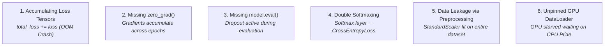

---

### 🐛 Bug 1: The Silent VRAM Memory Leak
```python
# FATAL JUNIOR BUG:
total_loss = 0.0
for X_b, y_b in dataloader:
    loss = loss_fn(model(X_b), y_b)
    total_loss += loss # 💥 BOOM! Retains entire autograd graph in VRAM every batch!

# 🛡️ DEFENSIVE FIX: Extract raw Python float using .item()
total_loss += loss.item() * X_b.size(0)
```

---

### 🐛 Bug 2: Missing `optimizer.zero_grad()`
```python
# FATAL JUNIOR BUG:
for X_b, y_b in dataloader:
    loss = loss_fn(model(X_b), y_b)
    loss.backward() # Gradients add to previous batch's gradients!
    optimizer.step()

# 🛡️ DEFENSIVE FIX: Always flush gradients before backprop
optimizer.zero_grad()
loss.backward()
optimizer.step()
```

---

### 🐛 Bug 3: Evaluating with Active Dropout
```python
# FATAL JUNIOR BUG:
# Running inference while model is still in training mode
with torch.inference_mode():
    preds = model(X_test) # Dropout is still randomly zeroing 30% of features!

# 🛡️ DEFENSIVE FIX: Always toggle model.eval() before evaluation
model.eval()
with torch.inference_mode():
    preds = model(X_test)
```

---

### 🐛 Bug 4: The Double-Softmax / Double-Sigmoid Trap
```python
# FATAL JUNIOR BUG:
class BrokenModel(nn.Module):
    def forward(self, x):
        return torch.softmax(self.linear(x), dim=1) # Manual Softmax

# AND using nn.CrossEntropyLoss()
criterion = nn.CrossEntropyLoss() # 💥 CrossEntropyLoss computes LogSoftmax internally!
# Result: Taking log(softmax(softmax(x))) -> Corrupted, squashed gradients!

# 🛡️ DEFENSIVE FIX: Output raw unbounded logits from the model!
```

---

### 🐛 Bug 5: Data Leakage During Feature Normalization
```python
# FATAL JUNIOR BUG:
scaler = StandardScaler()
X_scaled = scaler.fit_transform(X) # 💥 LEAKAGE! Test distribution leaked into training stats!
X_train, X_test = train_test_split(X_scaled)

# 🛡️ DEFENSIVE FIX: Fit ONLY on training data!
X_train, X_test = train_test_split(X)
scaler = StandardScaler()
X_train = scaler.fit_transform(X_train)
X_test = scaler.transform(X_test) # Pure transform using training mean and std!
```

---

# 11. Architectural Decision Records (ADR)

### ADR-001: Standardization on `BCEWithLogitsLoss` over `Sigmoid + BCELoss`
- **Status**: Mandatory Standard
- **Context**: Computing `torch.sigmoid()` followed by `torch.log()` suffers from floating-point underflow when logits exceed $|z| > 15$, resulting in `NaN` losses during training.
- **Decision**: All binary classification pipelines must output raw linear logits and use `nn.BCEWithLogitsLoss()`, which leverages the mathematically equivalent Log-Sum-Exp formulation: $\log(1 + e^{-|z|}) + \max(z, 0) - z \cdot y$.
- **Consequence**: Guaranteed numerical stability and faster kernel execution on CUDA cores.

---

# 12. Progressive Practice & Assessment (Levels 1 to 8)

### Level 1: Recognition
What is the rank and shape of `torch.zeros(size=(16, 3, 224, 224))`?
*Answer*: Rank 4 tensor (Batch of 16 RGB images of size $224 \times 224$).

### Level 2: Explanation
Why does adding an explicit bias parameter $b$ allow a linear model to learn decision boundaries that do not pass through the origin $(0, 0)$?

### Level 3: Application
Write a one-line PyTorch vectorized command that converts a batch of multi-class probability vectors of shape `(Batch, 10)` into discrete class index predictions `(Batch,)`.
*Answer*: `preds = torch.argmax(probs, dim=1)`

### Level 4: Design
Design a 3-layer neural network architecture for a low-power IoT microcontroller that processes 10-channel sensor readings at 100 Hz, with a maximum model parameter footprint of $< 50\text{ KB}$.

### Level 5: Debugging
A junior engineer reports that their model loss starts at $0.6931$ and stays exactly $0.6931$ across 100 epochs. Diagnose the root cause.
*Diagnosis*: $0.6931 = -\ln(0.5)$. The network is outputting a constant prediction of $0.5$ for all inputs. The learning rate is likely $0$, gradients are detached/zeroed, or all weights initialized to zero with symmetric gradients.

### Level 6: Trade-Off
Analyze the latency vs accuracy trade-offs of using `float16` (Half Precision) vs `float32` (Single Precision) on an NVIDIA Tensor Core GPU during inference.

### Level 7: Custom Autograd Implementation
Implement a custom PyTorch autograd function (`torch.autograd.Function`) that implements the forward and backward passes for the Hard-Sigmoid function: $\text{HardSigmoid}(z) = \text{clamp}\left(\frac{z + 3}{6}, 0, 1\right)$.

### Level 8: High-Stakes Interview Defense
*Scenario*: An interviewer asks: *"Why does ReLU cause sparsity in neural networks, and why is sparsity computationally desirable?"*
*Defense Strategy*: Explain that when $z \le 0$, $\text{ReLU}(z) = 0$. In a trained network, a large percentage (typically 30–70%) of neurons output an exact zero activation for any given sample. Sparsity reduces activation memory footprints, allows compiler optimizations to prune zero-multiply compute paths, and produces disentangled representations where specialized sub-networks activate for distinct feature domains.

---

# 13. "Explain It Yourself" Checkpoint

Can you answer these in your own words without checking the notes?
1. Explain the XOR failure of a single perceptron using the "detective looking for an impossible alibi" analogy.
2. What are the 5 sacred steps that must be executed inside every PyTorch training loop?
3. Why does `tensor.view()` require contiguous memory while `tensor.reshape()` handles non-contiguous memory?

---

# 14. Retrieval Practice & Spaced-Repetition Hooks

### 📅 Tomorrow (Day 1)
- [ ] Write out the 4 inequalities of the XOR contradiction proof on a sheet of paper without looking.
- [ ] Write a 10-line PyTorch script defining an `nn.Module` with a single linear layer and verifying its `state_dict()`.

### 📅 In 1 Week (Day 7)
- [ ] Implement the complete 5-step training loop with train/val loaders from scratch.
- [ ] Explain why `nn.CrossEntropyLoss` expects raw logits rather than `torch.softmax()` probabilities.

### 📅 In 1 Month (Day 30)
- [ ] Build an end-to-end binary classifier on a real tabular dataset with proper train/test isolation, `BatchNorm1d`, `Dropout`, `BCEWithLogitsLoss`, and `state_dict` checkpointing.

---

# 15. What I Should Now Be Able To Do

- [x] Confidently explain the transition from manual feature crafting to deep representation learning.
- [x] Prove linear inseparability mathematically and explain how hidden layers warp feature space.
- [x] Choose the mathematically optimal activation function and loss criterion for any supervised ML task.
- [x] Write hardened, bug-free, device-agnostic PyTorch pipelines.
- [x] Diagnose and eliminate silent memory leaks, gradient accumulation bugs, and data leakage traps.
- [x] Build, evaluate, and serialize production-grade neural networks on tabular and vision data.
