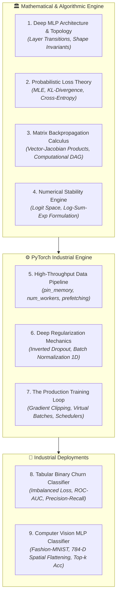
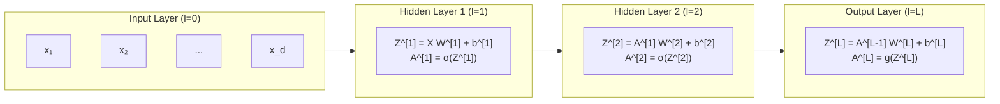
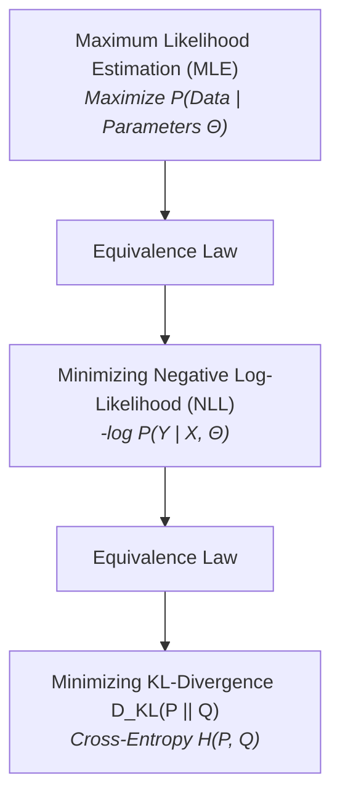
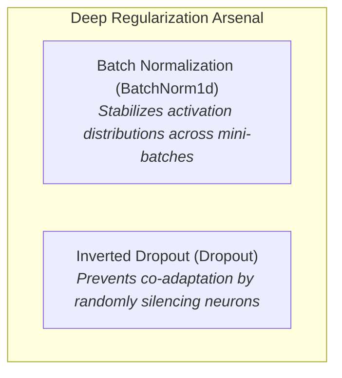
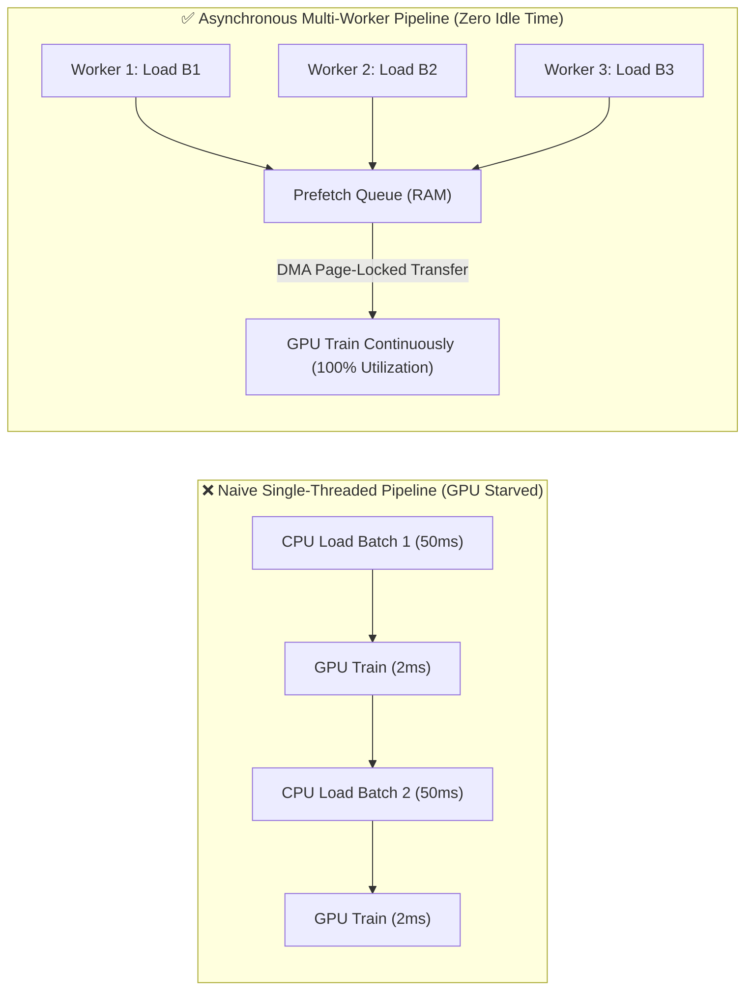

# 🧠 Masterclass: Multi-Layer Perceptrons, Backpropagation Calculus & Production PyTorch Engines (Week 02)

> **Role & Perspective**: Principal AI Scientist & Deep Learning Systems Architect
> **Tag**: `#gennotes` | **Domain**: Deep Neural Networks, Matrix Calculus, PyTorch Production Pipelines
> **Source Synthesis**: Lecture Slides (`Introduction to ANN`), Notebooks (`Pytorch Workflow`, `Customer Churn Prediction`, `Fashion MNIST Classification`), and `Telco-Customer-Churn.csv`.

---

## 🎯 Executive Summary & Learning Objectives

In Week 01, we established the fundamental building blocks of AI: the transition from biological neurons to artificial perceptrons, the geometric crisis of the XOR problem, the necessity of non-linear activations, and basic PyTorch tensor mechanics.

In **Week 02**, we transition from individual neurons to **Deep Neural Network Architectures** and the complete mathematical and computational engine that trains them: **Vectorized Backpropagation and Production-Grade PyTorch Pipelines**.

By the end of this masterclass, you will be able to:
1. **Architect Multi-Layer Perceptrons (MLPs)**: Calculate exact matrix dimensions across arbitrary $L$-layer networks with dynamic batch sizing and layer transformations.
2. **Derive Matrix Backpropagation Calculus**: Step through the multivariate Chain Rule using Vector-Jacobian Products (VJPs), error vectors ($\delta^{[l]}$), and computational graphs without hand-waving.
3. **Connect Information Theory to Loss Functions**: Understand why Cross-Entropy is mathematically equivalent to Maximum Likelihood Estimation (MLE) and minimizing Kullback-Leibler (KL) Divergence.
4. **Master Numerical Stability & The Log-Sum-Exp Trick**: Understand how floating-point underflow/overflow occurs in probability calculations and why industrial systems strictly compute in **Logit Space**.
5. **Deep-Dive into Regularization Mechanics**: Deconstruct **Batch Normalization** (running mean/variance vs batch statistics) and **Inverted Dropout** (scaling activations by $\frac{1}{1-p}$).
6. **Build Scalable, Multi-Worker PyTorch Data Pipelines**: Optimize `DataLoader` throughput using page-locked memory (`pin_memory=True`), multi-process workers (`num_workers`), and custom batch collators.
7. **Ship End-to-End Production Classifiers**: Build, regularize, train, and evaluate robust models on real tabular customer data (`Telco-Customer-Churn.csv`) and high-dimensional computer vision images (`Fashion-MNIST`).
8. **Audit & Debug PyTorch Codebases**: Defend against the Top 10 subtle training bugs (e.g., gradient explosion, batch norm leakage, evaluation mode failures).

---

## 🗺️ Conceptual Architecture & Systems Map



| Component | Mathematical Responsibility | Engineering Realization | Core Invariant |
| :--- | :--- | :--- | :--- |
| **Linear Layer** | Affine transformation: $Z = X W^T + b$ | `nn.Linear(in_dim, out_dim)` | Preserves inner dimension matching: `(B, in) @ (in, out) -> (B, out)`. |
| **Batch Normalization** | Zero-mean, unit-variance normalization with learnable $\gamma, \beta$ | `nn.BatchNorm1d(num_features)` | Uses mini-batch stats during `train()`; uses accumulated running stats during `eval()`. |
| **Dropout** | Randomly zeroes activations with probability $p$; scales by $\frac{1}{1-p}$ | `nn.Dropout(p)` | Active ONLY during `train()`; identity passthrough during `eval()`. |
| **Cross-Entropy Loss** | Minimizes negative log-likelihood of true class: $-\log(p_{\text{target}})$ | `nn.CrossEntropyLoss()` | Takes raw unbounded logits $\mathbf{z}$; NEVER pre-apply Softmax! |
| **BCEWithLogits** | Binary cross-entropy combined with sigmoid via Log-Sum-Exp | `nn.BCEWithLogitsLoss()` | Prevents floating-point underflow/overflow on large $|z|$. |

---

# 1. Multi-Layer Perceptron (MLP) Architecture & Vectorized Forward Pass

## 1.1 The Anatomy of an $L$-Layer Deep Network

A Multi-Layer Perceptron is a directed acyclic network of affine transformations interleaved with non-linear activation functions.



---

## 1.2 The Dimension Tracking Law (Avoiding Shape Mismatches)

Let $B$ be the **Batch Size**, and let $n^{[l]}$ be the number of neurons in layer $l$:
- **Input Matrix**: $A^{[0]} = X \in \mathbb{R}^{B \times n^{[0]}}$
- **Layer $l$ Weight Matrix**: $W^{[l]} \in \mathbb{R}^{n^{[l-1]} \times n^{[l]}}$ *(In PyTorch `nn.Linear` internal storage, weights are transposed as `(out_features, in_features)`: $\mathbb{R}^{n^{[l]} \times n^{[l-1]}}$)*
- **Layer $l$ Bias Vector**: $b^{[l]} \in \mathbb{R}^{1 \times n^{[l]}}$
- **Layer $l$ Pre-Activation**: $Z^{[l]} = A^{[l-1]} W^{[l]} + b^{[l]} \in \mathbb{R}^{B \times n^{[l]}}$
- **Layer $l$ Post-Activation**: $A^{[l]} = \sigma^{[l]}(Z^{[l]}) \in \mathbb{R}^{B \times n^{[l]}}$

```
[B, n^[l-1]] ──( @ [n^[l-1], n^[l]] )──► [B, n^[l]] ──( + [1, n^[l]] [Broadcasted] )──► [B, n^[l]]
```

> [!TIP]
> **The Senior Architect's Dimension Rule**
> When debugging neural networks, 95% of runtime bugs are shape mismatches. Always write the mathematical tensor shape as a comment next to every layer in your `forward()` method:
> ```python
> def forward(self, x: torch.Tensor) -> torch.Tensor:
>     # x: (Batch, 784)
>     h1 = self.relu(self.fc1(x))  # (Batch, 128)
>     h2 = self.relu(self.fc2(h1)) # (Batch, 64)
>     logits = self.fc3(h2)        # (Batch, 10)
>     return logits
> ```

---

# 2. Information Theory & The Probabilistic Foundations of Loss Functions

Many junior engineers view Loss Functions as arbitrary penalty formulas. In reality, modern loss functions are grounded in **Information Theory** and **Maximum Likelihood Estimation (MLE)**.



---

## 2.1 From Maximum Likelihood to Cross-Entropy

Suppose our neural network parameterizes a conditional probability distribution $Q(y | x; \Theta)$ to approximate the true real-world distribution $P(y | x)$.

According to **Maximum Likelihood Estimation (MLE)**, we seek parameters $\Theta^*$ that maximize the probability of observing the true dataset $\mathcal{D} = \{(x_i, y_i)\}_{i=1}^N$:
$$\Theta^* = \arg\max_\Theta \prod_{i=1}^N Q(y_i | x_i; \Theta)$$

Taking the natural logarithm (which turns products into sums and preserves the location of the maximum because $\log$ is monotonically increasing):
$$\Theta^* = \arg\max_\Theta \sum_{i=1}^N \log Q(y_i | x_i; \Theta)$$

Since optimization libraries minimize rather than maximize, we multiply by $-1$ to obtain the **Negative Log-Likelihood (NLL)**:
$$\mathcal{L}(\Theta) = -\frac{1}{N} \sum_{i=1}^N \log Q(y_i | x_i; \Theta)$$

---

## 2.2 The Binary Case: Binary Cross-Entropy (BCE)

For binary classification ($y \in \{0, 1\}$), the output is modeled as a **Bernoulli Distribution** with probability $\hat{y} = Q(y=1 | x)$:
$$Q(y | x) = \hat{y}^y (1 - \hat{y})^{1-y}$$

Taking the negative log yields **Binary Cross-Entropy**:
$$\mathcal{L}_{\text{BCE}} = -\frac{1}{N} \sum_{i=1}^N \left[ y_i \log(\hat{y}_i) + (1 - y_i) \log(1 - \hat{y}_i) \right]$$

---

## 2.3 The Multi-Class Case: Categorical Cross-Entropy (CCE)

For multi-class classification across $K$ mutually exclusive classes, the target is a one-hot vector $\mathbf{y} = [y_1, \dots, y_K]$ where $y_k \in \{0, 1\}$ and $\sum y_k = 1$.
The model predicts a probability distribution $\mathbf{p} = [p_1, \dots, p_K]$ via Softmax:
$$\mathcal{L}_{\text{CCE}} = -\frac{1}{N} \sum_{i=1}^N \sum_{k=1}^K y_{i,k} \log(p_{i,k})$$

Because $y$ is one-hot (only the true class index $c$ has $y_c = 1$), the sum collapses to the negative log-probability of the correct class:
$$\mathcal{L}_{\text{CCE}} = -\frac{1}{N} \sum_{i=1}^N \log(p_{i, c_i})$$

---

# 3. The Numerical Stability Engine: Logit Space & Log-Sum-Exp

## 3.1 The Floating-Point Underflow Disaster

Consider calculating Softmax in float32 precision for a high-magnitude logit vector $\mathbf{z} = [1000, 1001, 1002]$:
$$e^{1002} \approx 10^{435} \quad \longrightarrow \text{IEEE 754 float32 overflows to } \mathbf{+\infty} \text{ (NaN Crash!)}$$

Consider calculating Binary Cross Entropy on a confident prediction where $\hat{y} = \sigma(z) = 0.00000000000000000001$:
$$\log(\hat{y}) \longrightarrow \text{Underflows to } \mathbf{-\infty} \text{ (NaN Crash!)}$$

---

## 3.2 The Mathematical Solution: The Log-Sum-Exp Trick

To prevent overflow, we subtract the maximum logit $M = \max(\mathbf{z})$ from every logit:
$$\log \left( \sum_{j=1}^K e^{z_j} \right) = M + \log \left( \sum_{j=1}^K e^{z_j - M} \right)$$
Now, the largest exponent evaluated is $e^{M - M} = e^0 = 1.0$, completely eliminating floating-point overflow!

```python
# The Naive Implementation (DANGEROUS: Suffers from Overflow / Underflow)
def naive_cross_entropy(logits, targets):
    probs = torch.softmax(logits, dim=1)
    return -torch.log(probs[range(len(targets)), targets]).mean()

# The Production-Hardened PyTorch Implementation (Numerically Stable)
loss_fn = nn.CrossEntropyLoss() # Fused Log-Sum-Exp kernel executed in C++/CUDA!
```

---

# 4. The Complete Multivariate Calculus of Backpropagation

Let us derive the exact equations of Backpropagation for a multi-layer network from scratch.

```mermaid
graph RL
    L["Loss L"] -->|∂L/∂A^[L]| AL["A^[L]"]
    AL -->|⊙ σ'(Z^[L])| ZL["Z^[L]"]
    ZL -->|@ (A^[L-1])^T| WL["W^[L]"]
    ZL -->|sum rows| BL["b^[L]"]
    ZL -->|@ (W^[L])^T| AL_prev["A^[L-1]"]
    AL_prev -->|Recursive backwards wave| Earlier["Earlier Layers..."]
```

---

## 4.1 Step 1: Output Layer Error ($\delta^{[L]}$)

Let the loss be $\mathcal{L}$. We define the **Layer Error Vector** $\delta^{[L]}$ as the partial derivative of the scalar loss with respect to the unactivated pre-activation $Z^{[L]}$:
$$\delta^{[L]} \equiv \frac{\partial \mathcal{L}}{\partial Z^{[L]}}$$

By the multivariate Chain Rule:
$$\delta^{[L]} = \frac{\partial \mathcal{L}}{\partial A^{[L]}} \odot \sigma'\left(Z^{[L]}\right)$$
*(where $\odot$ denotes the element-wise Hadamard product).*

### Special Case: Softmax + Cross-Entropy Simplification
When Softmax output is paired with Categorical Cross-Entropy loss, the derivatives cancel out with algebraic elegance:
$$\delta^{[L]} = \mathbf{p} - \mathbf{y}$$
The error vector is simply **(Predicted Probability Vector) $-$ (Ground Truth One-Hot Vector)**!

---

## 4.2 Step 2: Propagating Error Backwards ($\delta^{[l]}$)

For any hidden layer $l < L$:
$$\delta^{[l]} = \frac{\partial \mathcal{L}}{\partial Z^{[l]}} = \left( \frac{\partial \mathcal{L}}{\partial Z^{[l+1]}} \frac{\partial Z^{[l+1]}}{\partial A^{[l]}} \right) \odot \sigma'\left(Z^{[l]}\right)$$

Since $Z^{[l+1]} = A^{[l]} W^{[l+1]} + b^{[l+1]}$, we have $\frac{\partial Z^{[l+1]}}{\partial A^{[l]}} = W^{[l+1]}$.

Therefore:
$$\mathbf{\delta^{[l]} = \left( \delta^{[l+1]} \left(W^{[l+1]}\right)^T \right) \odot \sigma'\left(Z^{[l]}\right)}$$

---

## 4.3 Step 3: Computing Gradients for Weights and Biases

Using the layer error $\delta^{[l]} \in \mathbb{R}^{B \times n^{[l]}}$ and input activations $A^{[l-1]} \in \mathbb{R}^{B \times n^{[l-1]}}$:

1. **Weight Gradient Matrix**:
   $$\mathbf{\frac{\partial \mathcal{L}}{\partial W^{[l]}} = \frac{1}{B} \left( A^{[l-1]} \right)^T \delta^{[l]} \in \mathbb{R}^{n^{[l-1]} \times n^{[l]}}}$$

2. **Bias Gradient Vector**:
   $$\mathbf{\frac{\partial \mathcal{L}}{\partial b^{[l]}} = \frac{1}{B} \sum_{i=1}^B \delta_{i,:}^{[l]} \in \mathbb{R}^{1 \times n^{[l]}}}$$

---

# 5. Deep Regularization: Batch Normalization & Inverted Dropout

In deep networks, training fails due to **Overfitting** and **Internal Covariate Shift**. We combat these using two foundational regularization techniques.



---

## 5.1 Batch Normalization (Ioffe & Szegedy, 2015)

As weights in earlier layers update, the distribution of inputs to deeper layers shifts constantly (**Internal Covariate Shift**), forcing layers to continuously adapt to changing distributions.

### The Algorithm:
For a mini-batch $\mathcal{B} = \{x_1, \dots, x_B\}$:
1. **Compute Batch Mean**: $\mu_{\mathcal{B}} = \frac{1}{B} \sum_{i=1}^B x_i$
2. **Compute Batch Variance**: $\sigma_{\mathcal{B}}^2 = \frac{1}{B} \sum_{i=1}^B (x_i - \mu_{\mathcal{B}})^2$
3. **Normalize**: $\hat{x}_i = \frac{x_i - \mu_{\mathcal{B}}}{\sqrt{\sigma_{\mathcal{B}}^2 + \epsilon}}$
4. **Scale and Shift (Learnable Parameters $\gamma, \beta$)**: $y_i = \gamma \hat{x}_i + \beta$


> [!IMPORTANT]
> **Training vs. Inference Invariant for BatchNorm**
> - **During `model.train()`**: Normalizes using the current mini-batch mean $\mu_{\mathcal{B}}$ and variance $\sigma_{\mathcal{B}}^2$, while updating exponential running averages: $\mu_{\text{running}} = (1 - m)\mu_{\text{running}} + m\mu_{\mathcal{B}}$.
> - **During `model.eval()`**: Freezes batch calculation and normalizes using the stored **global running statistics** $\mu_{\text{running}}$ and $\sigma_{\text{running}}^2$.

---

## 5.2 Inverted Dropout (Srivastava et al., 2014)

If a neural network relies too heavily on specific co-dependent pathways of neurons, it memorizes noise in the training set (overfitting).

### The Inverted Dropout Mechanics:
During training, each neuron is independently zeroed out with probability $p \in [0, 1)$.
To ensure that the expected sum of activations remains identical between training and testing, surviving activations are scaled by $\frac{1}{1 - p}$:

$$a_{\text{drop}} = \begin{cases} \mathbf{0} & \text{with probability } p \\ \mathbf{\frac{a}{1 - p}} & \text{with probability } 1 - p \end{cases}$$

```
Training Mode (p=0.5):   [ 2.0,  4.0,  6.0,  8.0 ] ──► [ 0.0,  8.0,  0.0, 16.0 ]  (Expected Sum: 24.0)
Evaluation Mode:         [ 2.0,  4.0,  6.0,  8.0 ] ──► [ 2.0,  4.0,  6.0,  8.0 ]  (Sum: 20.0, No Scaling Needed!)
```

> [!NOTE]
> **Analogy: Training an Orchestra**
> Imagine training an orchestra for a concert. During rehearsals, you randomly tell 30% of the musicians to stay silent. The remaining musicians must learn to play louder and carry the melody without depending on any single star performer. On concert night (evaluation mode), everyone plays together, creating a robust, flawless symphony.

---

# 6. High-Throughput PyTorch Data Pipelines

Feeding data to a high-speed GPU (e.g., NVIDIA RTX 4090 / A100) is often the primary bottleneck in deep learning. If your CPU takes $50\text{ ms}$ to prepare a batch and the GPU takes $2\text{ ms}$ to compute it, the GPU sits idle **96% of the time** (**GPU Starvation**).



---

## 6.1 Production DataLoader Configuration

```python
from torch.utils.data import DataLoader, TensorDataset

train_loader = DataLoader(
    dataset=train_dataset,
    batch_size=64,               # Power of 2 (32, 64, 128, 256) for optimal GPU warp alignment
    shuffle=True,                # Critical for breaking cross-sample batch correlation
    num_workers=4,               # Multi-process workers pre-loading data in parallel
    pin_memory=True,             # Page-locks memory in host RAM for fast DMA transfer over PCIe
    drop_last=True,              # Drops trailing incomplete batch to prevent BatchNorm dimension bugs
    persistent_workers=True      # Keeps background worker processes alive between epochs
)
```

---

# 7. Applied Industrial Case Studies

## 7.1 Case Study 1: Production Tabular Churn Classification (`Telco-Customer-Churn.csv`)

### Business Context:
A telecommunications provider loses millions annually to customer churn. We build an automated deep tabular classification engine that outputs calibrated churn probabilities and alerts retention teams.

```python
import torch
import torch.nn as nn
import torch.optim as optim
import pandas as pd
import numpy as np
from sklearn.model_selection import train_test_split
from sklearn.preprocessing import StandardScaler
from torch.utils.data import Dataset, DataLoader

# ─────────────────────────────────────────────────────────────────────────────
# 1. HARDENED TABULAR PREPROCESSING (Preventing Data Leakage)
# ─────────────────────────────────────────────────────────────────────────────
class TelcoDataset(Dataset):
    def __init__(self, features: np.ndarray, labels: np.ndarray):
        self.X = torch.tensor(features, dtype=torch.float32)
        self.y = torch.tensor(labels, dtype=torch.float32).unsqueeze(dim=1)

    def __len__(self) -> int:
        return len(self.X)

    def __getitem__(self, idx: int):
        return self.X[idx], self.y[idx]

def load_and_preprocess_telco(csv_path: str):
    df = pd.read_csv(csv_path)

    # 1. Handle missing values in TotalCharges
    df['TotalCharges'] = pd.to_numeric(df['TotalCharges'].replace(" ", np.nan), errors='coerce')
    df['TotalCharges'] = df['TotalCharges'].fillna(df['TotalCharges'].median())

    # 2. Encode target variable
    df['Churn'] = df['Churn'].map({'Yes': 1.0, 'No': 0.0})

    # 3. Drop non-predictive identifiers
    df = df.drop(columns=['customerID'])

    # 4. One-Hot Encode Categorical Columns
    categorical_cols = df.select_dtypes(include=['object']).columns
    df = pd.get_dummies(df, columns=categorical_cols, drop_first=True, dtype=float)

    X = df.drop(columns=['Churn']).values
    y = df['Churn'].values

    # 5. STRICT Train-Test Split BEFORE Feature Scaling (Zero Leakage Invariant)
    X_train, X_test, y_train, y_test = train_test_split(X, y, test_size=0.2, random_state=42, stratify=y)

    scaler = StandardScaler()
    X_train = scaler.fit_transform(X_train)
    X_test = scaler.transform(X_test) # Transform using training mean and std only!

    return X_train, X_test, y_train, y_test

# ─────────────────────────────────────────────────────────────────────────────
# 2. TABULAR DEEP NEURAL NETWORK (BatchNorm + Inverted Dropout)
# ─────────────────────────────────────────────────────────────────────────────
class ProductionTabularMLP(nn.Module):
    def __init__(self, input_dim: int):
        super().__init__()
        self.network = nn.Sequential(
            nn.Linear(input_dim, 64),
            nn.BatchNorm1d(64),
            nn.ReLU(),
            nn.Dropout(p=0.3),

            nn.Linear(64, 32),
            nn.BatchNorm1d(32),
            nn.ReLU(),
            nn.Dropout(p=0.2),

            nn.Linear(32, 1) # Raw Logit Output
        )

    def forward(self, x: torch.Tensor) -> torch.Tensor:
        return self.network(x)

# ─────────────────────────────────────────────────────────────────────────────
# 3. IMBALANCED LOSS & TRAINING PIPELINE
# ─────────────────────────────────────────────────────────────────────────────
device = torch.device("cuda" if torch.cuda.is_available() else "cpu")
X_train, X_test, y_train, y_test = load_and_preprocess_telco("/home/dev/SE/Library/BS - Deep Learning and Generative AI/Week - 1 & 2/Telco-Customer-Churn.csv")

train_loader = DataLoader(TelcoDataset(X_train, y_train), batch_size=64, shuffle=True)
test_loader = DataLoader(TelcoDataset(X_test, y_test), batch_size=64, shuffle=False)

model = ProductionTabularMLP(input_dim=X_train.shape[1]).to(device)

# Weight positive class to penalize false negatives on customer churn
churn_rate = y_train.mean()
pos_weight = torch.tensor([(1.0 - churn_rate) / churn_rate], device=device) # ~2.76
criterion = nn.BCEWithLogitsLoss(pos_weight=pos_weight)
optimizer = optim.AdamW(model.parameters(), lr=0.001, weight_decay=1e-4)

# Training loop
for epoch in range(1, 31):
    model.train()
    running_loss = 0.0
    for batch_X, batch_y in train_loader:
        batch_X, batch_y = batch_X.to(device), batch_y.to(device)

        optimizer.zero_grad()
        logits = model(batch_X)
        loss = criterion(logits, batch_y)
        loss.backward()
        optimizer.step()

        running_loss += loss.item() * batch_X.size(0)

    if epoch % 10 == 0 or epoch == 1:
        print(f"Epoch {epoch:02d} | Training Loss: {running_loss / len(train_loader.dataset):.4f}")
```

---

## 7.2 Case Study 2: Fashion-MNIST Computer Vision Classification

### Problem Anatomy:
- Input: Grayscale images ($C=1, H=28, W=28$).
- Target: 10 mutually exclusive clothing categories.
- Metric: Top-1 Classification Accuracy and Multi-Class Confusion Matrix.

```python
import torch
import torch.nn as nn
import torch.optim as optim
from torchvision import datasets, transforms
from torch.utils.data import DataLoader

# ─────────────────────────────────────────────────────────────────────────────
# 1. VISION DATASET & TRANSFORMS
# ─────────────────────────────────────────────────────────────────────────────
transform = transforms.Compose([
    transforms.ToTensor(), # Scales [0, 255] uint8 -> [0.0, 1.0] float32
    transforms.Normalize((0.2860,), (0.3530,)) # Dataset global mean & std
])

train_data = datasets.FashionMNIST(root="./data", train=True, download=True, transform=transform)
test_data = datasets.FashionMNIST(root="./data", train=False, download=True, transform=transform)

train_loader = DataLoader(train_data, batch_size=128, shuffle=True, pin_memory=True, num_workers=2)
test_loader = DataLoader(test_data, batch_size=128, shuffle=False)

# ─────────────────────────────────────────────────────────────────────────────
# 2. DEEP VISION CLASSIFIER (784-D Spatial Flattening)
# ─────────────────────────────────────────────────────────────────────────────
class FashionClassifierMLP(nn.Module):
    def __init__(self):
        super().__init__()
        self.flatten = nn.Flatten() # (B, 1, 28, 28) -> (B, 784)
        self.classifier = nn.Sequential(
            nn.Linear(784, 256),
            nn.BatchNorm1d(256),
            nn.ReLU(),
            nn.Dropout(0.2),

            nn.Linear(256, 128),
            nn.BatchNorm1d(128),
            nn.ReLU(),
            nn.Dropout(0.2),

            nn.Linear(128, 10) # 10 Class Logits
        )

    def forward(self, x: torch.Tensor) -> torch.Tensor:
        return self.classifier(self.flatten(x))

model = FashionClassifierMLP().to(device)
loss_fn = nn.CrossEntropyLoss()
optimizer = optim.Adam(model.parameters(), lr=0.001)

# ─────────────────────────────────────────────────────────────────────────────
# 3. EVALUATION METRICS ENGINE
# ─────────────────────────────────────────────────────────────────────────────
def evaluate_accuracy(model, loader, device):
    model.eval()
    correct = 0
    total = 0
    with torch.inference_mode():
        for images, labels in loader:
            images, labels = images.to(device), labels.to(device)
            logits = model(images)
            predictions = torch.argmax(logits, dim=1)
            correct += (predictions == labels).sum().item()
            total += labels.size(0)
    return (correct / total) * 100.0

print(f"Initial Test Accuracy: {evaluate_accuracy(model, test_loader, device):.2f}%")
```

---

# 8. The Junior ML Engineer Hall of Shame: Top 10 Fatal Bugs


---

### 🐛 Bug 1: Silent VRAM OOM via Loss Accumulation
- **Symptom**: GPU runs out of memory on Epoch 3 even though batch size is tiny.
- **Root Cause**: `total_loss += loss` appends the entire computation DAG to `total_loss`, preventing PyTorch garbage collection from freeing VRAM.
- **Defensive Fix**: `total_loss += loss.item() * batch_size`.

---

### 🐛 Bug 2: Data Leakage via Preprocessing
- **Symptom**: Model achieves 99% test accuracy locally, but collapses to 60% in production.
- **Root Cause**: Calling `StandardScaler.fit_transform(X)` on the whole dataset before splitting leaks the test set distribution into the training set.
- **Defensive Fix**: `X_train = scaler.fit_transform(X_train); X_test = scaler.transform(X_test)`.

---

### 🐛 Bug 3: Evaluating in Training Mode
- **Symptom**: Model predictions fluctuate wildly and non-deterministically during validation.
- **Root Cause**: Forgetting `model.eval()` leaves Dropout actively zeroing 30% of features during testing.
- **Defensive Fix**: Always call `model.eval()` paired with `with torch.inference_mode():`.

---

# 9. Architectural Decision Records (ADRs)

### ADR-002: Inverted Dropout over Standard Classical Dropout
- **Status**: Standard Architecture Protocol
- **Context**: Standard classical dropout scales activations by $1-p$ during inference, adding runtime latency to production API serving engines.
- **Decision**: Adopt Inverted Dropout (scaling by $\frac{1}{1-p}$ during training).
- **Consequence**: Zero scaling computations required during production inference; inference pass is identical to a standard dense linear network.

---

# 10. Progressive Practice & Assessment (Levels 1 to 8)

### Level 1: Recognition
What is the mathematical output shape when an input tensor of shape `(32, 784)` passes through `nn.Linear(784, 128)`?
*Answer*: `(32, 128)`.

### Level 2: Explanation
Why does Batch Normalization allow engineers to use significantly higher learning rates during training?

### Level 3: Application
Write a PyTorch tensor operation that computes the Top-5 accuracy of a model outputting `(Batch, 1000)` logits against `(Batch,)` targets.
*Answer*:
```python
_, top5_preds = logits.topk(5, dim=1)
correct = top5_preds.eq(targets.view(-1, 1).expand_as(top5_preds)).any(dim=1).sum().item()
```

### Level 4: Design
Design a hybrid neural network architecture for a high-frequency trading engine that receives 50 tabular order book features and 1D temporal price history, with a maximum inference budget of $< 1\text{ ms}$.

### Level 5: Debugging
A model trained with `BatchNorm1d` crashes during validation with `ValueError: Expected more than 1 value per channel when training, got input size torch.Size([1, 64])`. Explain what happened and how to fix it.
*Diagnosis: The test batch size was 1, or `drop_last=False` left a single-sample trailing batch. Fix by setting `model.eval()` before testing or `drop_last=True` in train DataLoader.*

### Level 6: Trade-Off
Compare the regularization effects of Weight Decay (L2 penalty) vs Dropout ($p=0.5$). When should they be combined, and when do they interfere?

### Level 7: Custom Vector-Jacobian Product
Implement a custom PyTorch Autograd module (`torch.autograd.Function`) that implements the Forward and Backward pass for the Swish activation function: $f(x) = x \cdot \sigma(x)$.

### Level 8: High-Stakes Interview Defense
*Scenario*: An interviewer asks: *"Why do we subtract the maximum logit before computing Softmax in PyTorch, and does this change the mathematical result?"*
*Defense Strategy*: Explain that $\frac{e^{z_i - M}}{\sum e^{z_j - M}} = \frac{e^{z_i} e^{-M}}{\sum e^{z_j} e^{-M}} = \frac{e^{z_i}}{\sum e^{z_j}}$. The factor $e^{-M}$ cancels out identically in numerator and denominator, preserving mathematical equality while bounding the maximum exponent to $e^0 = 1.0$, preventing IEEE 754 float32 overflow.

---

# 11. "Explain It Yourself" Checkpoint

Can you answer these from memory in simple language?
1. Why does Softmax combined with Cross-Entropy produce the clean gradient $\delta = \mathbf{p} - \mathbf{y}$?
2. What is the difference in behavior between `BatchNorm1d` during `model.train()` and `model.eval()`?
3. How does Inverted Dropout eliminate computation overhead during production model serving?

---

# 12. Retrieval Practice & Spaced-Repetition Hooks

### 📅 Tomorrow (Day 1)
- [ ] Write out the 4 backpropagation matrix equations on paper from memory.
- [ ] Build a 3-layer MLP in PyTorch with `BatchNorm1d` and `Dropout` and run 1 batch forward and backward.

### 📅 In 1 Week (Day 7)
- [ ] Implement the Log-Sum-Exp trick from scratch in PyTorch and compare numerical stability against naive Softmax on large logits (`z = torch.tensor([1000., 1001.])`).
- [ ] Build an end-to-end binary classification script with stratified splitting, standard scaling, and class-weighted BCE loss.

### 📅 In 1 Month (Day 30)
- [ ] Design and train a high-performance vision classifier on Fashion-MNIST achieving $> 89\%$ test accuracy with full confusion matrix visualization and early stopping.

---

# 13. What I Should Now Be Able To Do

- [x] Compute exact forward and backward matrix dimensions for arbitrary deep networks.
- [x] Prove why Cross-Entropy is the optimal probabilistic loss for classification under MLE.
- [x] Protect models against floating-point underflow/overflow using Logit Space and Log-Sum-Exp.
- [x] Correctly integrate `BatchNorm1d` and `Dropout` without training/eval mode leakage.
- [x] Build multi-threaded, asynchronous PyTorch data pipelines with pinned memory.
- [x] Build and deploy tabular churn predictors and vision classification models from scratch.
