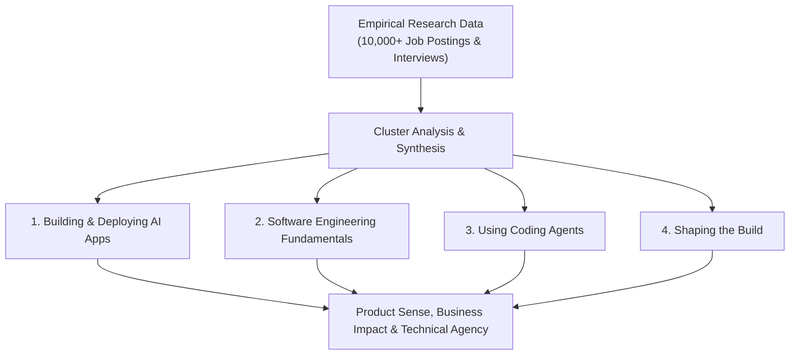

# 🗺️ Andrew Ng's AI Engineering Skills Map: Key Learnings & Research Findings

> **Source**: Andrew Ng (DeepLearning.AI) — *The AI Engineering Skills Map*  
> **Research Scope**: Analysis of 10,000+ job postings, structured expert interviews (AI experts, hiring managers, recruiters), and community survey synthesis.  
> **Target Audience**: All software engineers, ML engineers, data engineers, full-stack developers, and technical leaders.

---

## 📌 Executive Overview & Paradigm Shift

AI has fundamentally transformed software development compared to the pre-2022 paradigm. The shift is not merely about using autocomplete; it represents an architectural transformation in how software is conceptualized, designed, verified, and shipped.

---

## 🧭 Critical Distinction: "AI Engineering Skills" vs. "The AI Engineer Title"

- **Ubiquitous Skillset (The Cloud Analogy)**: In modern engineering, nearly every developer must understand cloud infrastructure and APIs, even though only a dedicated subset holds the formal title *"Cloud Engineer"*.
- **Cross-Discipline Impact**: AI engineering skills are foundational requirements across **all** roles:
  - Full-Stack Engineers
  - Data Engineers
  - DevOps / SRE Engineers
  - Machine Learning Engineers
  - Product & System Architects

---

## 🏛️ The Four Core AI Engineering Pillars

### 1. ⚡ Building and Deploying AI Applications
*Managing Non-Determinism with Statistical Rigor*

- **The Core Difference**: Traditional software is deterministic ($f(x) \rightarrow y$). AI systems (LLMs, neural networks) are inherently non-deterministic and probabilistic.
- **Key Competencies**:
  - **Foundational Building Blocks**: Mastery of LLMs, Context Engineering, Retrieval-Augmented Generation (RAG), Agentic Workflows, and Deep Learning models.
  - **Statistical Governance & Steering**: Employing statistical measurement techniques to constrain, calibrate, and guide model behavior toward predictable outcomes.
  - **Disciplined Evals & Error Analysis Loops**: Building systematic test benches, benchmark datasets, and continuous error-analysis pipelines rather than relying on qualitative ad-hoc prompts.

---

### 2. 🧱 Software Engineering Fundamentals
*Trade-Off Analysis & Grounded Architecture*

- **The Danger of "Vibe Coding"**: Inexperienced developers who blindly accept agentic outputs without understanding architectural fundamentals produce fragile, unscalable, and insecure systems.
- **The Power of Precision**: Deep software engineering knowledge allows you to communicate with coding agents in the precise vocabulary of systems architecture.
- **Key Competencies**:
  - **Trade-Off Optimization**: Balancing latency, memory footprint, compute cost, scalability, fault tolerance, reliability, and security/privacy.
  - **System Design & Data Store Selection**: Deciding relational vs. vector vs. document databases, cache tiering, and asynchronous queue architectures.
  - **Defensive Testing**: Structuring unit tests, integration tests, contract testing, and CI/CD automation.

---

### 3. 🤖 Using Coding Agents
*Agentic Orchestration, Context Control & Closed-Loop Verification*

- **Mental Model of Agents**: Deeply understanding agent capabilities, probabilistic limitations, token economics, and failure modes.
- **Key Competencies**:
  - **Context Management**: Curating concise, highly relevant project context, type definitions, and rule blueprints without polluting the model's active attention window.
  - **Closed-Loop Feedback (Verifiers & Evals)**: Providing automated test harnesses, linters, and runtime validators so agents can autonomously test, detect errors, and self-correct.
  - **Multi-Agent Orchestration**: Coordinating specialized subagents (e.g., researcher, planner, test runner) while preventing race conditions, loops, and destructive database overwrites.
  - **Adaptive Tooling & Workflows**: Maintaining structured routines to evaluate emerging agentic IDEs, CLI tools, and model capabilities.

---

### 4. 🎯 Shaping the Build
*Product Sense, Business Context & Engineer Agency*

- **From Ticket Implementer to Technical Shaper**: As coding agents rapidly fulfill explicit specifications, the bottleneck shifts from *writing code* to *deciding what should be built*.
- **Key Competencies**:
  - **Product Sense & Customer Empathy**: Understanding business domain constraints, user friction points, and ROI metrics.
  - **Agile Execution Velocity**: Knowing when to deploy a lightweight MVP for immediate user feedback versus when to slow down for architectural hardening.
  - **Engineering Ownership & Proactive Agency**: Identifying high-leverage opportunities and taking end-to-end technical responsibility.

---

## 🔬 Andrew Ng's Research Methodology & Insights

1. **Dataset Synthesis**:
   - Clustered requirements across **10,000+ active engineering job postings**.
   - Conducted dozens of structured qualitative interviews with AI industry leaders, engineering managers, and technical recruiters.
2. **Key Research Finding**:
   - The industry is pivoting from pure prompt engineering toward **Evals-Driven Development (EDD)**, **Agentic Tool Orchestration**, and **Disciplined Software Architecture**.
   - Hype-chasing and fragile "vibe coding" are rapidly being weeded out in favor of rigorous engineering fundamentals.

---

## 📋 Comprehensive Skills Matrix

| Pillar | Novice / Naive Pattern | God-Tier / Production Pattern |
| :--- | :--- | :--- |
| **AI Applications** | Ad-hoc prompt tweaking ("vibe check") | Statistical evals, golden test suites, error analysis loops |
| **Software Fundamentals** | Blindly copy-pasting agent code without review | Architecting for scale, verifying database migrations, evaluating latency/cost trade-offs |
| **Coding Agents** | Overloading agent with entire codebase dump | Precise context engineering, automated test verifiers for self-healing loops |
| **Shaping the Build** | Passively waiting for Jira tickets and Figma designs | Defining product specs, identifying user friction, driving rapid MVP iterations |

---

## 🚀 Continuous Learning Action Items

1. **Implement Automated Evals**: Build evaluation harnesses for any LLM feature before putting it into production.
2. **Master Context Engineering**: Structure workspace rule files (`GEMINI.md`), architectural blueprints, and prompt boundaries cleanly.
3. **Strengthen CS Foundations**: Double down on algorithms, distributed system design, operating systems, and network I/O.
4. **Develop Product Sense**: Measure the business impact and user latency of every technical decision.
