# 🧠 Module 1: Introduction to Artificial Neural Networks (ANNs)

**Course**: BS in Data Science & Applications — Deep Learning & Generative AI  
**Instructors**: Prof. Balaji Srinivasan & Prof. Ganapathy Krishnamurthi  
*Wadhwani School of AI, IIT Madras*

  <a class="md-button md-button--primary" href="../I%20ANN.pdf" target="_blank">↗ Open Fullscreen PDF</a>
  <a class="md-button" href="../I%20ANN.pdf" download>⬇ Download PDF Compendium</a>

---

## 🗺️ Table of Contents & Roadmap

* [🏛️ Part 1: From Machine Learning to Deep Learning (Slides 1–15)](#part-1-from-machine-learning-to-deep-learning)
* [🧬 Part 2: Biological Inspiration to Modern Neurons (Slides 16–22)](#part-2-biological-inspiration-to-modern-neurons)
* [🪄 Part 3: Fundamental Tricks in Deep Learning (Slides 23–29)](#part-3-fundamental-tricks-in-deep-learning)
* [🕸️ Part 4: Feedforward Network Architecture & Forward Pass (Slides 30–37)](#part-4-feedforward-network-architecture-forward-pass)
* [📈 Part 5: Activation Functions (Sigmoid, Tanh, ReLU, LeakyReLU, ELU) (Slides 38–48)](#part-5-activation-functions)
* [📉 Part 6: Loss Functions & Optimization (MSE, BCE, Gradient Descent) (Slides 49–58)](#part-6-loss-functions-optimization)
* [🔄 Part 7: Backpropagation Foundations & Computational Graphs (Slides 59–70)](#part-7-backpropagation-foundations-computational-graphs)
* [⚡ Part 8: The XOR Problem & Why Linear Models Fail (Slides 71–75)](#part-8-the-xor-problem-why-linear-models-fail)
* [✍️ Part 9: Full End-to-End Mathematical Hand Calculation (Slides 76–92)](#part-9-full-end-to-end-mathematical-hand-calculation)
* [🔮 Part 10: Non-linear Activation & Feature Space Transformation (Slide 93)](#part-10-non-linear-activation-feature-space-transformation)

---

## 🏛️ Part 1: From Machine Learning to Deep Learning

### Slide 01: Course Overview & Introduction
* **Module**: Introduction to Artificial Neural Networks (ANNs)
* **Goal**: Understand the conceptual, algorithmic, and mathematical foundations that take us from classical machine learning to deep hierarchical representation learning.

---

### Slide 02: Getting Ready for the Course
#### Knowledge Prerequisites
* **Python Programming**: Python, NumPy, Pandas, Object-Oriented Design.
* **Mathematics**:
  * **Linear Algebra**: Matrix operations, vectors, dot products, eigenvalues, matrix transformations.
  * **Multivariable Calculus**: Partial derivatives, vector gradients, Jacobian matrices, chain rule.
  * **Probability & Statistics**: Random variables, distributions, expectation, variance, maximum likelihood estimation.
* **Machine Learning Foundations**: Supervised learning, regression, binary & multiclass classification, overfitting, underfitting, cross-validation.

---

### Slide 03: Outline of this Module
1. **From Machine Learning to Deep Learning**: The paradigm shift, representations, limitations of classical ML.
2. **From Biology to Mathematics**: Biological neuron anatomy, McCulloch-Pitts model, Rosenblatt Perceptron, Modern artificial neuron.
3. **Fundamental Tricks in Deep Learning**: Numerization, function approximation, parameterization, loss landscapes.
4. **Network Topology & Forward Propagation**: Layered feedforward architectures, vectorized matrix notation.
5. **Activation Functions**: Non-linearities (Sigmoid, Tanh, ReLU, Leaky ReLU, ELU, GELU, Swish).
6. **Loss Functions & Gradient Descent**: Quantifying error (MSE, BCE, Cross-Entropy), navigating loss surfaces (Batch, Mini-batch, SGD).
7. **Backpropagation**: Analytical derivations, computational graphs, reverse-mode automatic differentiation.
8. **The XOR Proof & Hand Calculation**: Mathematical proof why single-layer models fail, and a step-by-step hand calculation of forward + backward pass on an MLP.

---

### Slide 04: Machine Learning Landscape
* Transitioning from rule-based symbolic AI to statistical pattern recognition, and ultimately to end-to-end deep neural representations.

---

### Slide 05: What is Machine Learning?
> *"Field of study that gives computers the ability to learn without being explicitly programmed."*  
> — **Arthur Samuel (1959)**

  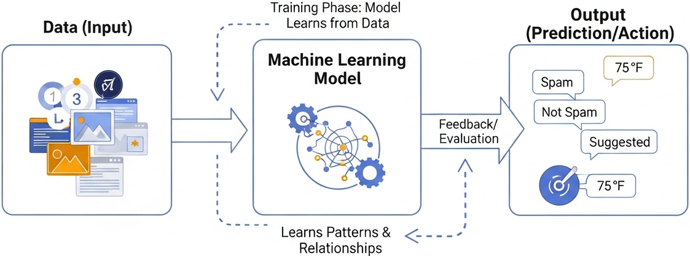

---

### Slides 06–07: Common Machine Learning Applications
* **Supervised Learning**:
  * **Regression**: Continuous output prediction (e.g., Housing price prediction based on square footage, location, rooms).
  * **Classification**: Discrete category prediction (e.g., Spam email classification, medical disease diagnosis).
* **Unsupervised Learning**: Clustering, dimensionality reduction, anomaly detection.

  
  
  

---

### Slide 08: Machine Learning: Key Concepts
* **The Dataset**: Feature matrix $\mathbf{X} \in \mathbb{R}^{N 	imes D}$ and target vector $\mathbf{y} \in \mathbb{R}^N$.
* **The Hypothesis / Model**: A parameterized mapping function $f_	heta(\mathbf{x}): \mathcal{X} 	o \mathcal{Y}$.
* **The Loss Function**: Objective metric quantifying error $\mathcal{L}(f_	heta(\mathbf{x}), \mathbf{y})$.
* **The Optimization Algorithm**: Procedure to update parameters $	heta \leftarrow 	heta - lpha 
abla_	heta \mathcal{L}$.

---

### Slide 09: Limitations of Traditional Machine Learning
* **Manual Feature Engineering**: Classical models (SVMs, Logistic Regression, Random Forests) rely heavily on handcrafted domain-specific features (SIFT, HOG, bag-of-words).
* **Brittleness**: Handcrafted features fail when environmental conditions, lighting, or semantics shift.
* **Curse of Dimensionality**: High-dimensional raw inputs (raw pixels, audio waveforms) require intractable numbers of samples for shallow models.

  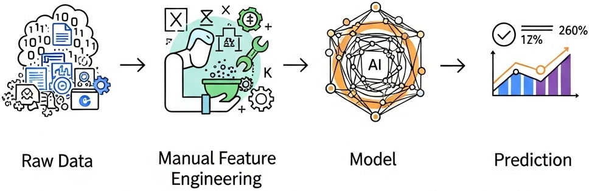

---

### Slides 10–11: The Deep Learning Revolution & Paradigm Shift
* **Classical ML Workflow**: Raw Data $	o$ **Human Expert Handcrafted Feature Extraction** $	o$ Shallow Classifier $	o$ Output.
* **Deep Learning Workflow**: Raw Data $	o$ **End-to-End Hierarchical Representation Learning (Automatic Feature Extraction)** $	o$ Output.

  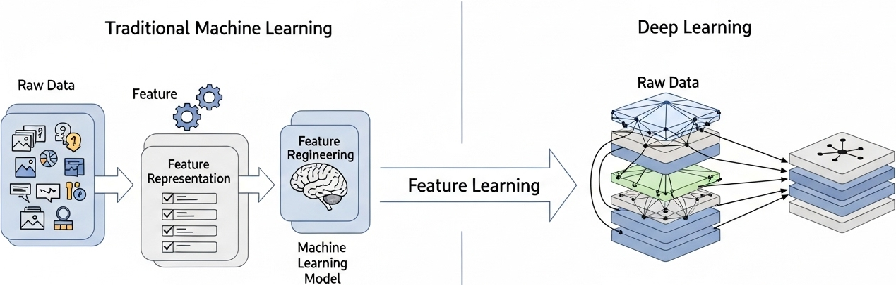

---

### Slide 12: Popular Deep Learning Applications
* **Computer Vision**: Object detection (YOLO), semantic segmentation, facial recognition, autonomous vehicle perception.
* **Natural Language Processing**: Large language models (GPT, BERT), neural machine translation, speech recognition.
* **Healthcare & Biology**: Protein structure prediction (AlphaFold), radiological image diagnosis.

  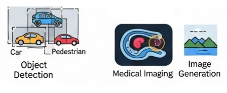
  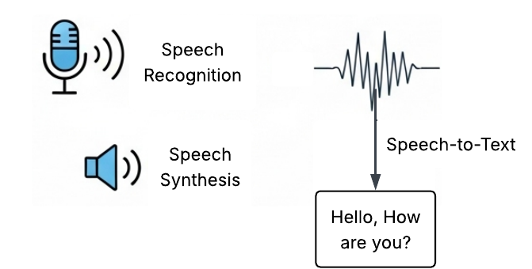
  
  

---

### Slide 13: Key Differences: Classical ML vs. Deep Learning

| Dimension | Traditional Machine Learning | Deep Learning |
| :--- | :--- | :--- |
| **Feature Extraction** | Handcrafted by domain experts | Learned automatically from raw data |
| **Data Dependency** | Performs well on small/medium tabular datasets; plateaus on big data | Scales monotonically with massive datasets |
| **Hardware Requirement** | Standard CPU execution | Massively parallel GPU/TPU accelerators required |
| **Interpretability** | High (coefficients, decision tree splits) | Complex black-box latent representations |
| **Training Time** | Seconds to minutes | Hours to weeks of compute |

---

### Slide 14: What Enabled the Deep Learning Revolution?
1. **Big Data**: Digitization, internet scale datasets (ImageNet, Common Crawl).
2. **Compute Power**: Parallel hardware acceleration via GPUs and dedicated TPUs.
3. **Algorithmic Innovations**: Better activation functions (ReLU overcoming vanishing gradients), adaptive optimizers (Adam, RMSprop), normalization techniques (BatchNorm, LayerNorm), and deep architectures (ResNet, Transformers).

---

### Slide 15: The AI Venn Diagram

  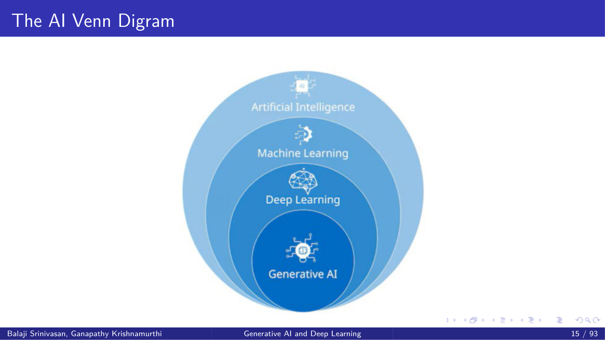

* **Artificial Intelligence (AI)**: The broad discipline of creating machines capable of intelligent behavior.
* **Machine Learning (ML)**: A subset of AI where systems learn statistical patterns from data.
* **Deep Learning (DL)**: A subset of ML utilizing multi-layered artificial neural networks for hierarchical feature extraction.
* **Generative AI (GenAI)**: Deep learning models trained to generate novel synthetic content (text, images, audio, video, code).

---

## 🧬 Part 2: Biological Inspiration to Modern Neurons

### Slide 16–17: Inspiration from the Biological Brain
* The human biological brain consists of $pprox 86 	imes 10^9$ interconnected biological neurons communicating through electrochemical pulses.

  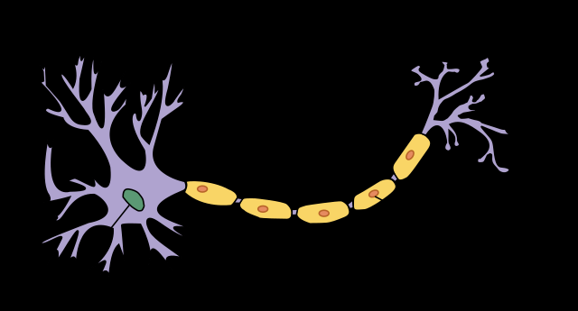

* **Biological to Artificial Mapping**:
  * **Dendrites** $\longleftrightarrow$ Input signals ($x_1, x_2, \dots, x_d$)
  * **Synaptic Strengths** $\longleftrightarrow$ Multiplicative weights ($w_1, w_2, \dots, w_d$)
  * **Soma (Cell Body)** $\longleftrightarrow$ Linear summation aggregator ($\sum_{i} w_i x_i + b$)
  * **Axon Hillock / Action Potential** $\longleftrightarrow$ Non-linear activation threshold function ($\sigma(z)$)
  * **Axon Terminals** $\longleftrightarrow$ Output transmission to downstream layers ($a$)

---

### Slide 18: The McCulloch-Pitts Neuron (1943)
* First simplified mathematical abstraction of a biological neuron proposed by Warren McCulloch and Walter Pitts.

  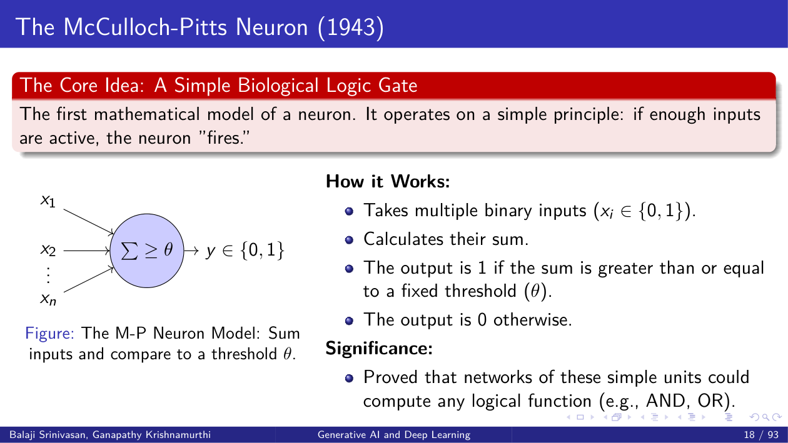

* **Mathematical Model**:
  * Binary inputs: $x_i \in \{0, 1\}$
  * Unweighted inputs (all weights equal to $+1$ for excitatory or $-\infty$ for inhibitory)
  * Output rule:
    $$y = egin{cases} 1 & 	ext{if } \sum_{i=1}^n x_i \ge 	heta \ 0 & 	ext{otherwise} \end{cases}$$
* Can implement basic logical gates (AND, OR, NOT).

---

### Slide 19: Critical Limitations of the M-P Neuron
* **No Learning Mechanism**: Threshold $	heta$ and connections had to be manually hand-designed.
* **Strict Binary Inputs**: Cannot handle continuous real-valued measurements ($x_i \in \mathbb{R}$).
* **Equal Significance**: Lacked individual weights to assign higher importance to specific inputs.

---

### Slide 20: The Leap to Learning: Rosenblatt's Perceptron (1958)
* Frank Rosenblatt introduced learnable weights and continuous real-valued inputs.

  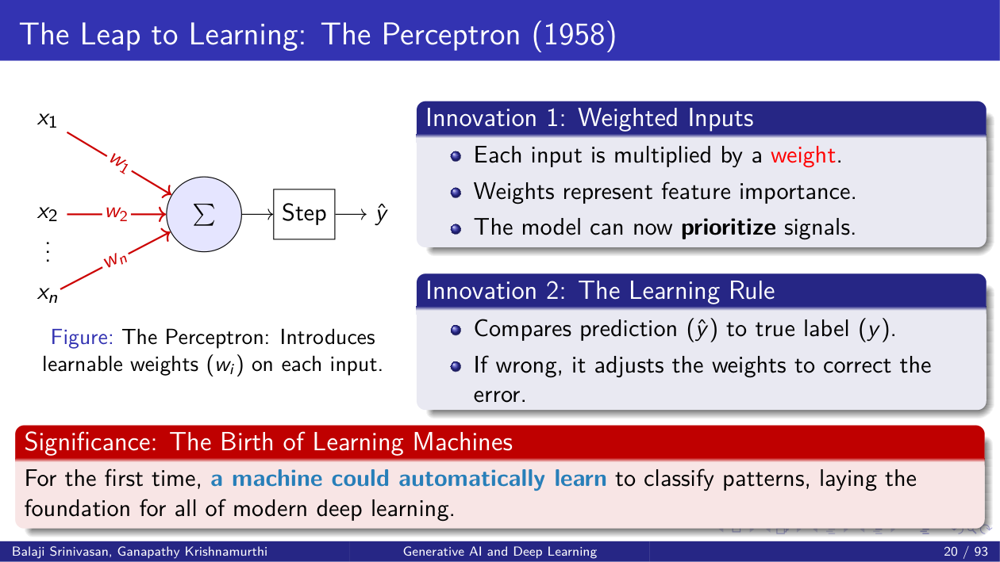

* **Mathematical Formulation**:
  $$z = \sum_{i=1}^d w_i x_i + b = \mathbf{w}^T \mathbf{x} + b$$
  $$\hat{y} = f(z) = egin{cases} +1 & 	ext{if } z \ge 0 \ -1 	ext{ (or } 0	ext{)} & 	ext{if } z < 0 \end{cases}$$
* **Perceptron Learning Rule**:
  $$w_i \leftarrow w_i + lpha (y - \hat{y}) x_i$$
  $$b \leftarrow b + lpha (y - \hat{y})$$

---

### Slide 21: Perceptron: Strengths & Limitations
* **Perceptron Convergence Theorem**: If the data is **linearly separable**, the perceptron learning algorithm is guaranteed to converge to a separating hyperplane in finite steps.
* **Fatal Flaw (Minsky & Papert, 1969)**: A single-layer perceptron **cannot solve non-linearly separable problems** (such as the simple XOR logical function). This publication triggered the first "AI Winter".

---

### Slide 22: The Modern Neuron: Engine of Deep Learning
* The building block of modern deep networks combines learnable real-valued weights, additive bias, and continuous, differentiable non-linear activation functions.

  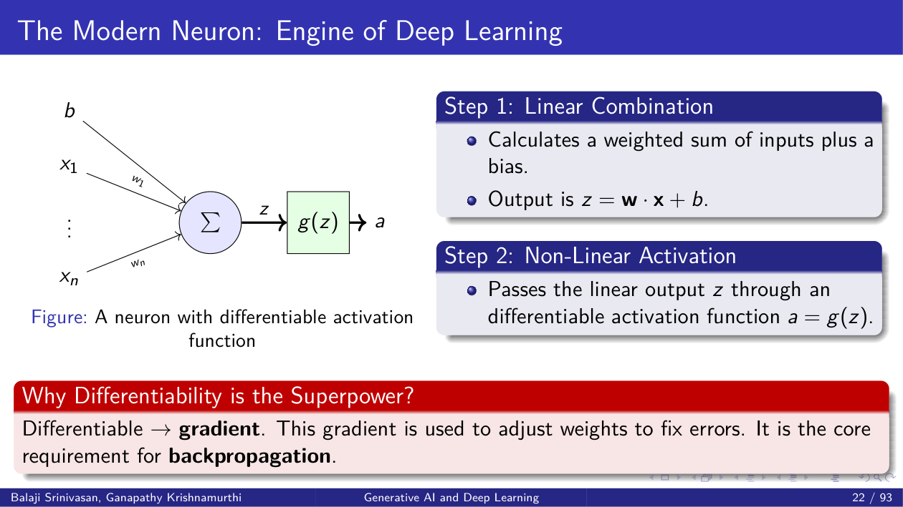

* **Two-Step Computation**:
  1. **Linear Pre-Activation**:
     $$z = \sum_{i=1}^d w_i x_i + b = \mathbf{w}^T \mathbf{x} + b$$
  2. **Non-linear Activation**:
     $$a = \sigma(z)$$

---

## 🪄 Part 3: Fundamental Tricks in Deep Learning

### Slide 23: The Four Core Tricks
Deep learning achieves universal function approximation through four foundational principles:
1. **The Numerization Trick**: Converting real-world sensory inputs into quantitative numeric tensors.
2. **The Function Approximation Trick**: Formulating real-world tasks as mathematical mappings $y = f(x)$.
3. **The Parameterization Trick**: Representing functions via parameterized tensor transformations ($W, b$).
4. **The Optimization / Loss Landscape Trick**: Searching parameter space by descending differentiable loss gradients.

---

### Slides 24–26: The Numerization Trick
* Everything fed to a neural network must be converted into tensors of numbers:
  * **Images**: 2D/3D grids of pixel intensity values $[0, 255]$ normalized to $[0, 1]$ or $[-1, 1]$.
  * **Text**: Tokenization $	o$ Vocabulary Indices $	o$ Continuous Dense Embeddings ($\mathbb{R}^D$).
  * **Audio**: Waveform samples $	o$ Short-Time Fourier Transform (STFT) $	o$ Mel-Spectrograms.
  * **Categorical Data**: One-Hot Encoding or learned Entity Embeddings.

  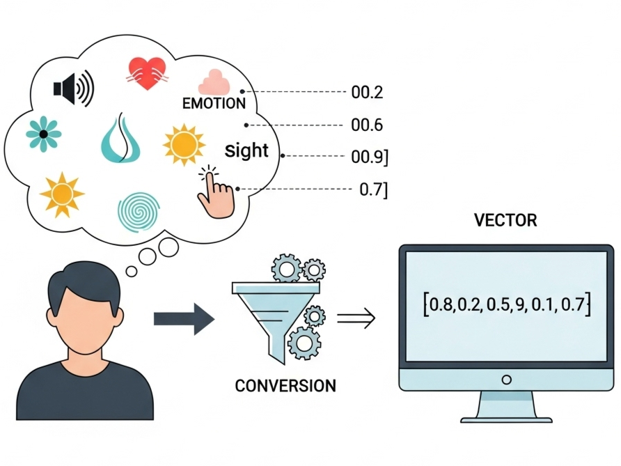
  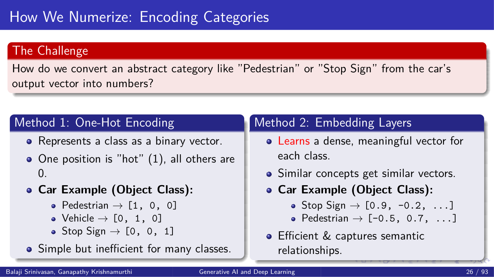

---

### Slide 27: Learn the Function Trick
* Any cognitive task can be expressed as finding an unknown mapping $f^*: \mathcal{X} 	o \mathcal{Y}$:
  * Image Classification: $f: \mathbb{R}^{H 	imes W 	imes C} 	o \{1, \dots, K\}$
  * Machine Translation: $f: \mathcal{V}_{	ext{src}}^T 	o \mathcal{V}_{	ext{tgt}}^{T'}$
  * Steering Angle: $f: 	ext{Camera Frame} 	o 	heta_{	ext{steering}} \in \mathbb{R}$

---

### Slide 28: The Parameterization Trick
* Instead of searching through an infinite space of arbitrary functions, we define a fixed computational architecture whose behavior is completely dictated by a finite set of adjustable weights $\mathbf{W}$ and biases $\mathbf{b}$:
  $$f_	heta(\mathbf{x}) = \sigma_L(\mathbf{W}_L \sigma_{L-1}(\dots \sigma_1(\mathbf{W}_1 \mathbf{x} + \mathbf{b}_1) \dots ) + \mathbf{b}_L)$$

---

### Slide 29: From Learning to Optimization: The Loss Landscape
* Learning is transformed from an abstract cognitive problem into a mathematical optimization problem: finding the global minimum on a high-dimensional loss surface.

  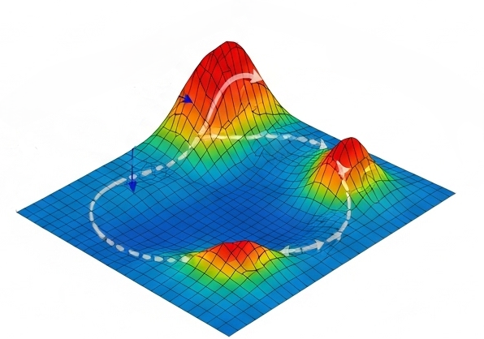

---

## 🕸️ Part 4: Feedforward Network Architecture & Forward Pass

### Slides 30–31: Feedforward Network Topology
* An Artificial Neural Network consists of stacked layers of neurons where information flows strictly in one direction from input to output (no feedback cycles).

  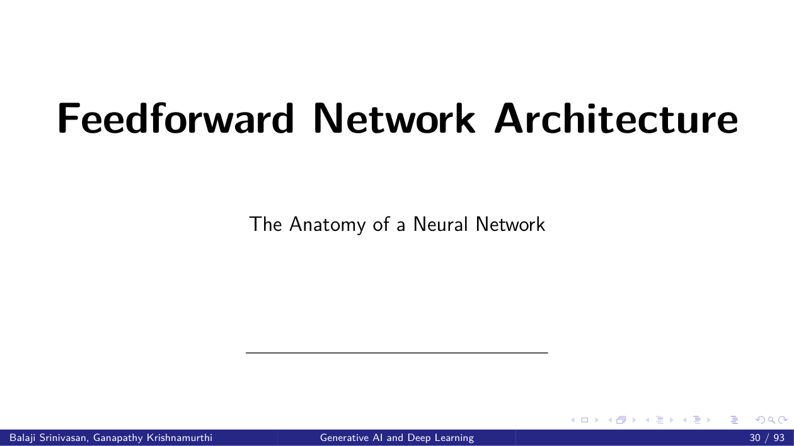

* **Structural Components**:
  * **Input Layer ($l=0$)**: Receives feature vector $\mathbf{x} \in \mathbb{R}^{n_0}$.
  * **Hidden Layers ($l=1 \dots L-1$)**: Intermediate representations learning abstract feature combinations.
  * **Output Layer ($l=L$)**: Produces final predictions $\hat{\mathbf{y}} \in \mathbb{R}^{n_L}$.

---

### Slide 32: The Standard Forward Model: Single Neuron View
For neuron $i$ in layer $l$:
$$z_i^{[l]} = \sum_{j=1}^{n_{l-1}} w_{ij}^{[l]} a_j^{[l-1]} + b_i^{[l]}$$
$$a_i^{[l]} = \sigma(z_i^{[l]})$$
where:
* $w_{ij}^{[l]}$ is the weight connecting neuron $j$ of layer $l-1$ to neuron $i$ of layer $l$.
* $b_i^{[l]}$ is the bias of neuron $i$ in layer $l$.
* $a_j^{[l-1]}$ is the activation output of neuron $j$ in layer $l-1$.
* $\sigma(\cdot)$ is the activation function.

  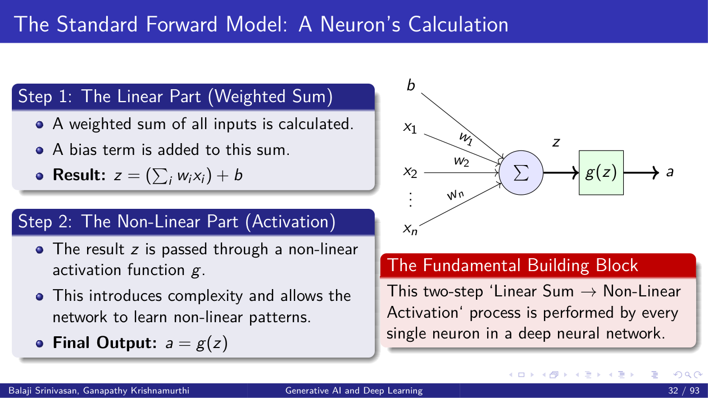

---

### Slide 33: Linear Model vs. Artificial Neural Network

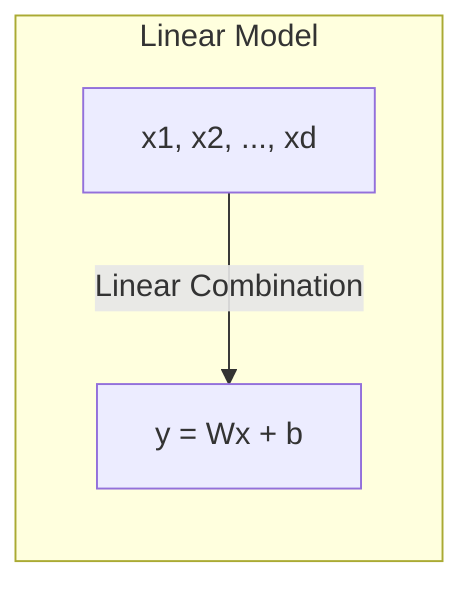
```mermaid
graph LR
    subgraph Linear Model
        X[x1, x2, ..., xd] -->|Linear Combination| Y[y = Wx + b]
    end
```

```mermaid
graph LR
    subgraph Deep Artificial Neural Network
        In[x1, x2] -->|W1, b1| H1[Hidden Layer 1: a1 = σ(z1)]
        H1 -->|W2, b2| H2[Hidden Layer 2: a2 = σ(z2)]
        H2 -->|WL, bL| Out[Output: y_hat = σ(zL)]
    end
```

---

### Slides 34–35: The Vectorized Layer View (Matrix Notation)
Matrix notation allows computation of an entire layer in parallel across batches on GPUs:

$$\mathbf{z}^{[l]} = \mathbf{W}^{[l]} \mathbf{a}^{[l-1]} + \mathbf{b}^{[l]}$$
$$\mathbf{a}^{[l]} = \sigma(\mathbf{z}^{[l]})$$

* **Dimensionality Invariants**:
  * $\mathbf{W}^{[l]} \in \mathbb{R}^{n_l 	imes n_{l-1}}$
  * $\mathbf{a}^{[l-1]} \in \mathbb{R}^{n_{l-1} 	imes 1}$
  * $\mathbf{b}^{[l]} \in \mathbb{R}^{n_l 	imes 1}$
  * $\mathbf{z}^{[l]} \in \mathbb{R}^{n_l 	imes 1}$
  * $\mathbf{a}^{[l]} \in \mathbb{R}^{n_l 	imes 1}$

  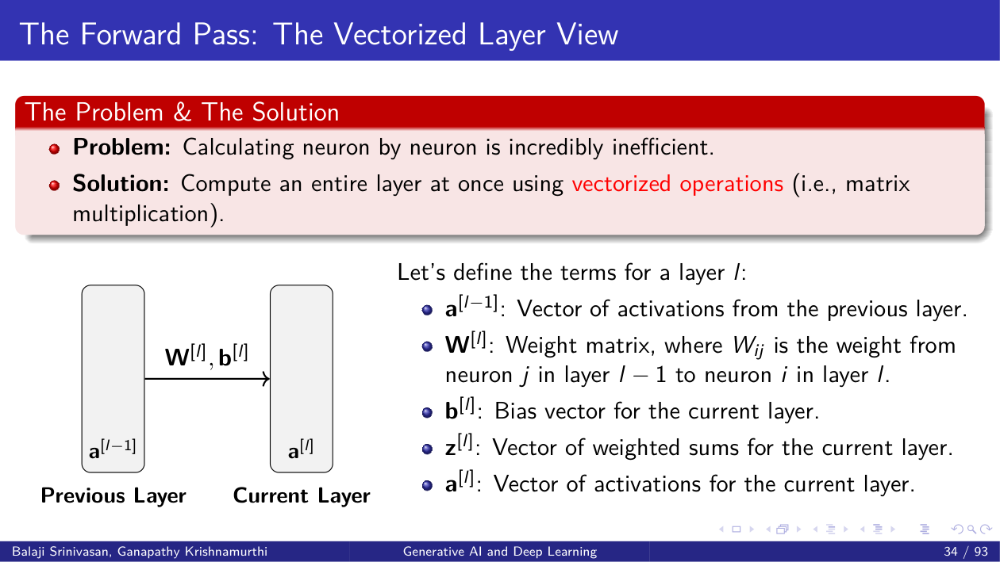

---

### Slide 36: Layer Computation Concrete Example
* Given 2 inputs ($n_0=2$) feeding into a hidden layer of 3 neurons ($n_1=3$):

$$egin{bmatrix} z_1^{[1]} \ z_2^{[1]} \ z_3^{[1]} \end{bmatrix} = egin{bmatrix} w_{11} & w_{12} \ w_{21} & w_{22} \ w_{31} & w_{32} \end{bmatrix} egin{bmatrix} x_1 \ x_2 \end{bmatrix} + egin{bmatrix} b_1 \ b_2 \ b_3 \end{bmatrix}$$

$$egin{bmatrix} a_1^{[1]} \ a_2^{[1]} \ a_3^{[1]} \end{bmatrix} = egin{bmatrix} \sigma(z_1^{[1]}) \ \sigma(z_2^{[1]}) \ \sigma(z_3^{[1]}) \end{bmatrix}$$

---

### Slide 37: The Multilayer Perceptron (MLP)
* An MLP consists of an input layer, one or more non-linear hidden layers, and an output layer.
* **Universal Approximation Theorem (Cybenko, 1989; Hornik, 1991)**: A feedforward neural network with a single hidden layer containing a finite number of non-linear neurons can approximate any continuous function on compact subsets of $\mathbb{R}^n$ to arbitrary precision.

---

## 📈 Part 5: Activation Functions

### Slide 38–39: Why Do We Need Activation Functions?
> [!IMPORTANT]
> **Without non-linear activation functions, deep networks collapse into a single linear transformation!**
> 
> Proof: Let $f_1(\mathbf{x}) = \mathbf{W}_1 \mathbf{x} + \mathbf{b}_1$ and $f_2(\mathbf{h}) = \mathbf{W}_2 \mathbf{h} + \mathbf{b}_2$.
> $$f_2(f_1(\mathbf{x})) = \mathbf{W}_2(\mathbf{W}_1 \mathbf{x} + \mathbf{b}_1) + \mathbf{b}_2 = (\mathbf{W}_2 \mathbf{W}_1)\mathbf{x} + (\mathbf{W}_2 \mathbf{b}_1 + \mathbf{b}_2) = \mathbf{W}' \mathbf{x} + \mathbf{b}'$$
> Stacking 1,000 linear layers is mathematically equivalent to a single linear layer! Non-linear activations introduce the non-linear decision boundaries essential for complex tasks.

---

### Slides 40–41: The Sigmoid (Logistic) Function
$$\sigma(z) = rac{1}{1 + e^{-z}}$$
$$\sigma'(z) = \sigma(z)(1 - \sigma(z))$$

  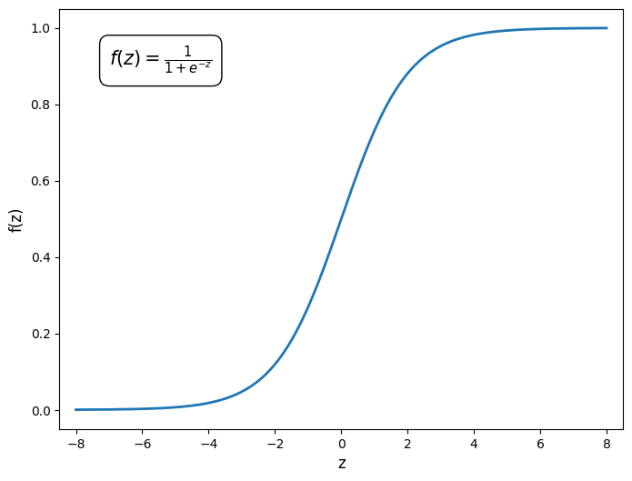

* **Output Range**: $(0, 1)$ — ideal for interpreting outputs as Bernoulli probabilities.
* **Disadvantages**:
  1. **Vanishing Gradient Problem**: For $|z| > 4$, derivative $\sigma'(z) pprox 0$, stopping gradient flow in deep networks.
  2. **Not Zero-Centered**: Output is always positive, leading to zig-zagging gradient updates for weights.
  3. **Computationally Expensive**: Exponential function $e^{-z}$.

---

### Slides 42–43: The Hyperbolic Tangent (Tanh) Function
$$	anh(z) = rac{e^z - e^{-z}}{e^z + e^{-z}} = 2\sigma(2z) - 1$$
$$	anh'(z) = 1 - 	anh^2(z)$$

  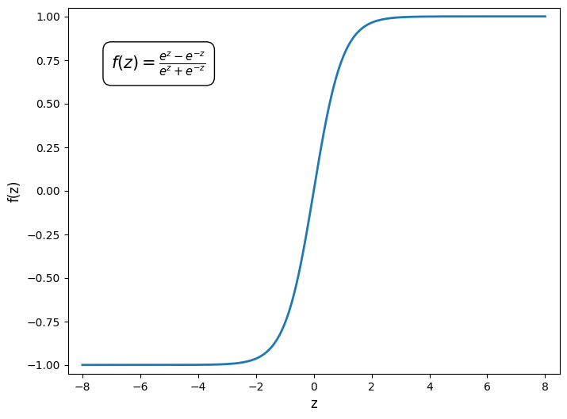

* **Output Range**: $(-1, 1)$
* **Advantages**: **Zero-centered**, making optimization faster and smoother than Sigmoid.
* **Disadvantage**: Still suffers from vanishing gradients for large $|z|$.

---

### Slides 44–45: The Rectified Linear Unit (ReLU)
$$	ext{ReLU}(z) = \max(0, z) = egin{cases} z & 	ext{if } z \ge 0 \ 0 & 	ext{if } z < 0 \end{cases}$$
$$	ext{ReLU}'(z) = egin{cases} 1 & 	ext{if } z > 0 \ 0 & 	ext{if } z < 0 \end{cases}$$

  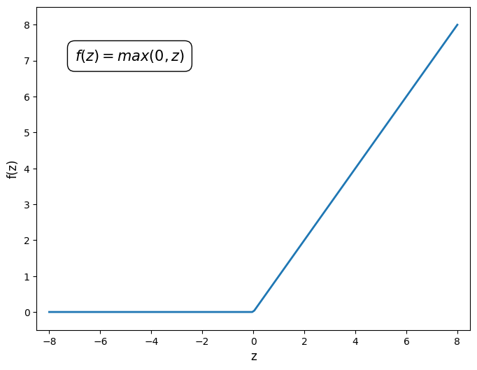

* **Advantages**:
  1. **Solves Vanishing Gradient**: Derivative is constant $1$ for all positive inputs $z > 0$.
  2. **Computational Efficiency**: Simple thresholding operation ($\max(0, z)$).
  3. **Sparse Activation**: Generates true zero representations.
* **Disadvantage**: **Dying ReLU Problem** — if a neuron's activation falls into the negative region, its gradient becomes $0$ forever.

---

### Slide 46: The ReLU Family (Fixing the "Dying ReLU" Problem)
1. **Leaky ReLU**:
   $$	ext{LReLU}(z) = \max(lpha z, z) \quad (	ext{typically } lpha = 0.01)$$
2. **Parametric ReLU (PReLU)**: Slope $lpha$ is a learnable parameter updated via backpropagation.
3. **Exponential Linear Unit (ELU)**:
   $$	ext{ELU}(z) = egin{cases} z & 	ext{if } z \ge 0 \ lpha(e^z - 1) & 	ext{if } z < 0 \end{cases}$$

---

### Slide 47–48: Practical Guide to Activation Selection

  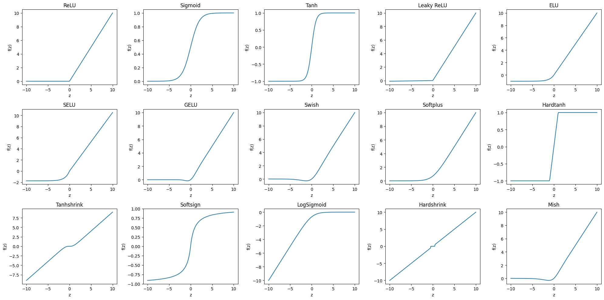

| Layer Type | Task Nature | Recommended Activation |
| :--- | :--- | :--- |
| **Hidden Layers** | Standard Deep Networks | **ReLU** (default), **Leaky ReLU**, or **GELU / Swish** (Transformers/LLMs) |
| **Output Layer** | Binary Classification ($y \in \{0, 1\}$) | **Sigmoid** ($\sigma(z)$) |
| **Output Layer** | Multi-Class Classification ($K$ classes) | **Softmax** ($rac{e^{z_i}}{\sum_j e^{z_j}}$) |
| **Output Layer** | Continuous Regression ($y \in \mathbb{R}$) | **Linear / Identity** ($a = z$) |

---

## 📉 Part 6: Loss Functions & Optimization

### Slides 49–52: Quantifying Error with Loss Functions
1. **Mean Squared Error (MSE)** *(Regression)*:
   $$L_{	ext{MSE}}(y, \hat{y}) = rac{1}{2} (y - \hat{y})^2 \quad 	ext{or} \quad rac{1}{N}\sum_{i=1}^N (y_i - \hat{y}_i)^2$$
2. **Binary Cross-Entropy (BCE) / Log Loss** *(Binary Classification)*:
   $$L_{	ext{BCE}}(y, \hat{y}) = -[y \log(\hat{y}) + (1 - y) \log(1 - \hat{y})]$$
3. **Categorical Cross-Entropy** *(Multi-Class Classification)*:
   $$L_{	ext{CE}}(\mathbf{y}, \hat{\mathbf{y}}) = -\sum_{k=1}^K y_k \log(\hat{y}_k)$$

---

### Slides 53–55: Gradient Descent: The Intuition
* Gradient Descent iteratively adjusts parameters in the direction of steepest descent (negative gradient of the loss):

$$\mathbf{w}_{t+1} = \mathbf{w}_t - lpha 
abla_{\mathbf{w}} L(\mathbf{w}_t)$$

where $lpha > 0$ is the **learning rate**.

  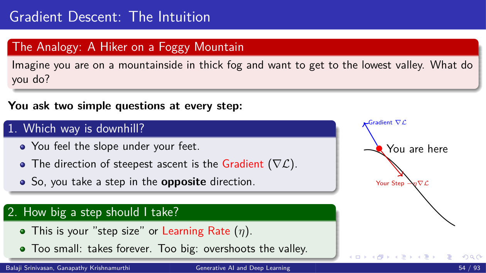

* **Impact of Learning Rate ($lpha$)**:
  * **Too Small ($lpha \ll 1$)**: Extremely slow convergence, risks getting trapped in shallow local minima.
  * **Too Large ($lpha \gg 1$)**: Overshoots the minimum, oscillates, and diverges.
  * **Optimal $lpha$**: Rapid, monotonic convergence to the optimal parameter configuration.

---

### Slides 56–58: Practical Comparison of Gradient Descent Variants

  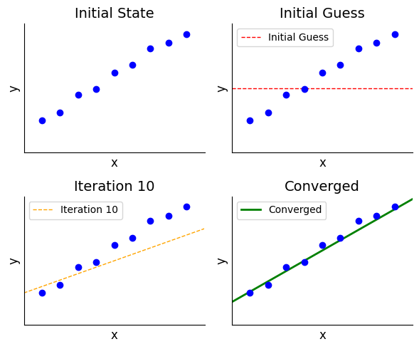
  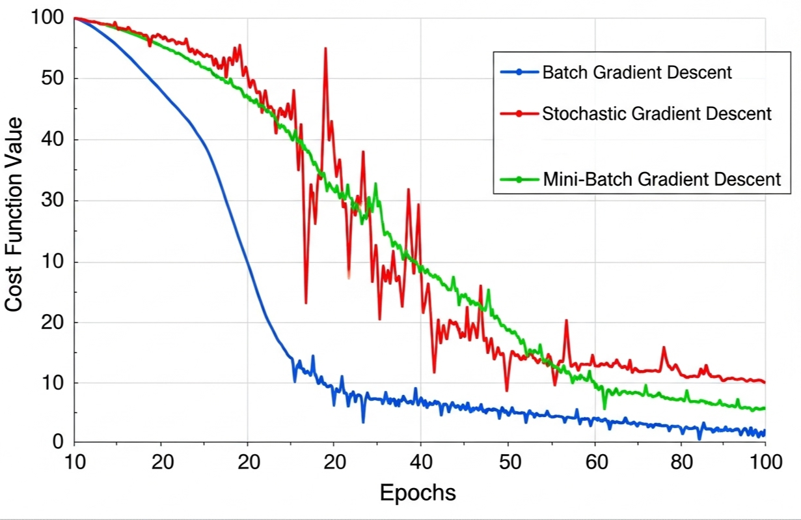

| Variant | Batch Size | Pros | Cons |
| :--- | :--- | :--- | :--- |
| **Batch Gradient Descent** | All $N$ samples | Exact gradient, stable monotonic convergence | Intolerable memory footprint on big datasets; computationally slow |
| **Stochastic Gradient Descent (SGD)** | 1 sample | Extremely fast updates; noise helps escape shallow local minima | Highly erratic, noisy loss oscillations; poor vectorization |
| **Mini-Batch Gradient Descent** | $B \in [32, 512]$ | **Industry standard**: leverages GPU vectorization with stable convergence | Requires tuning batch size hyperparameter |

---

## 🔄 Part 7: Backpropagation Foundations & Computational Graphs

### Slides 59–61: Backpropagation’s Engine: The Chain Rule
* Backpropagation is the systematic application of the multivariable calculus chain rule to compute $rac{\partial L}{\partial w_{ij}^{[l]}}$ for all weights and biases.

* **Scalar Chain Rule**: If $y = f(u)$ and $u = g(x)$:
  $$rac{dy}{dx} = rac{dy}{du} \cdot rac{du}{dx}$$

---

### Slides 62–65: Visualizing Computations via Computational Graphs

  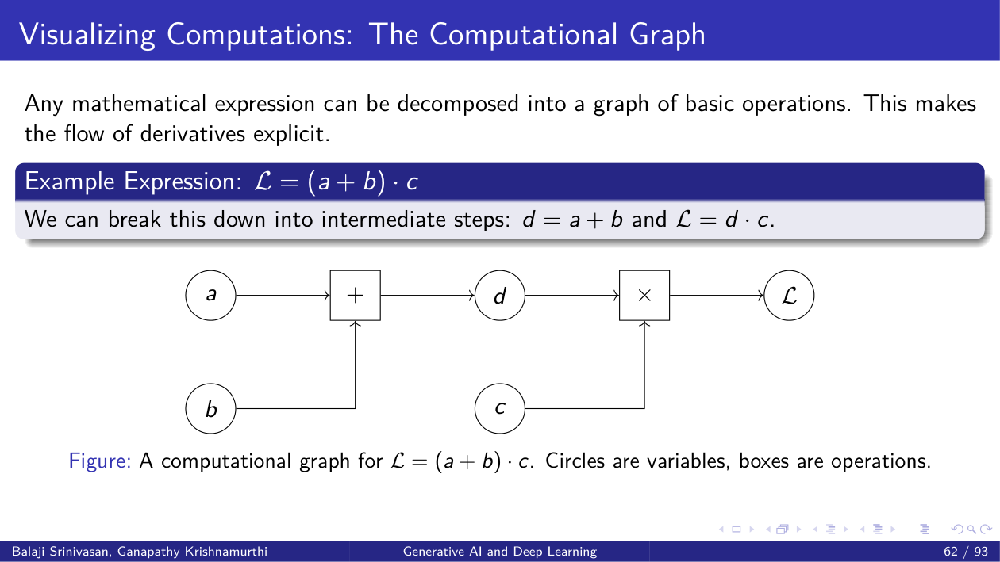

#### Concrete Hand Example: Scalar Graph
Let $L = (a + b) \cdot c$ with inputs $a = 2, b = 3, c = 6$.
* Let intermediate node $d = a + b$. Then $L = d \cdot c$.

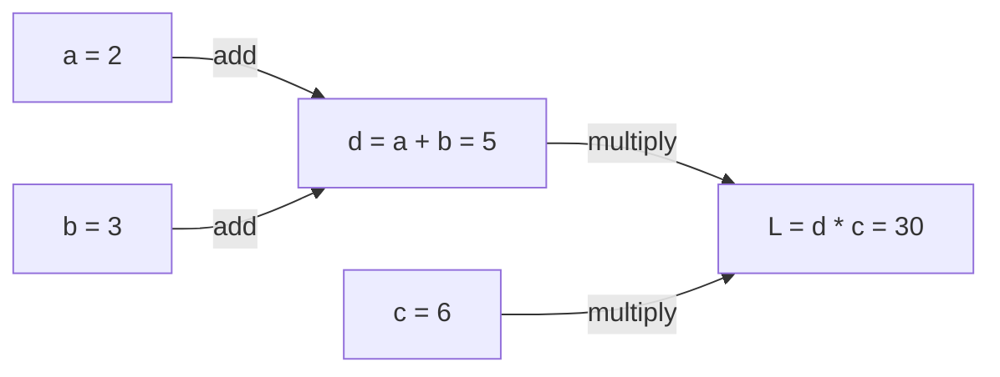
```mermaid
graph LR
    A["a = 2"] -->|add| D["d = a + b = 5"]
    B["b = 3"] -->|add| D
    D -->|multiply| L["L = d * c = 30"]
    C["c = 6"] -->|multiply| L
```

* **1. Forward Pass**:
  * $d = 2 + 3 = 5$
  * $L = 5 \cdot 6 = 30$

* **2. Backward Pass (Gradients Flowing Right to Left)**:
  * Output Seed: $rac{\partial L}{\partial L} = 1$
  * Gradient w.r.t $c$: $rac{\partial L}{\partial c} = rac{\partial L}{\partial L} \cdot rac{\partial L}{\partial c} = 1 \cdot d = 5$
  * Gradient w.r.t $d$: $rac{\partial L}{\partial d} = rac{\partial L}{\partial L} \cdot rac{\partial L}{\partial d} = 1 \cdot c = 6$
  * Gradient w.r.t $a$: $rac{\partial L}{\partial a} = rac{\partial L}{\partial d} \cdot rac{\partial d}{\partial a} = 6 \cdot 1 = 6$
  * Gradient w.r.t $b$: $rac{\partial L}{\partial b} = rac{\partial L}{\partial d} \cdot rac{\partial d}{\partial b} = 6 \cdot 1 = 6$

  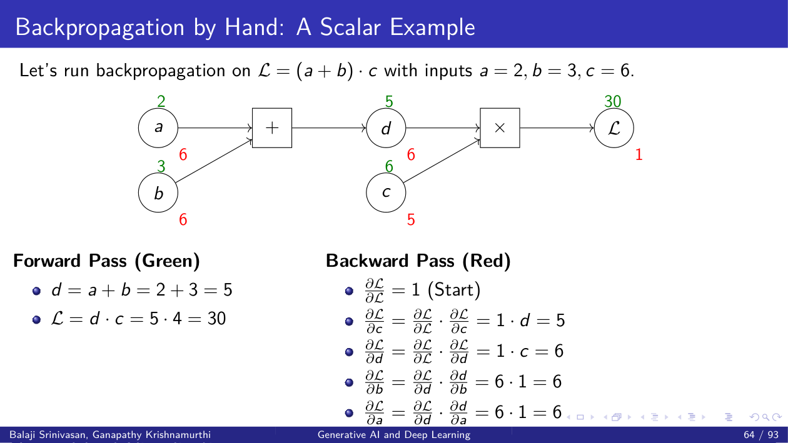

---

### Slides 66–70: The 4 Master Backpropagation Equations for an MLP

  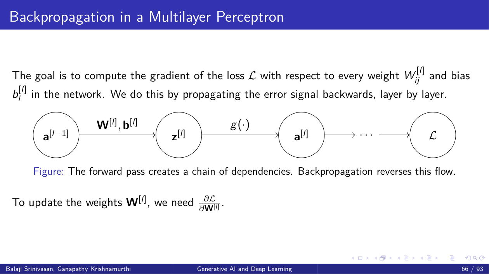

1. **Output Layer Error Vector ($oldsymbol{\delta}^{[L]}$)**:
   $$oldsymbol{\delta}^{[L]} = 
abla_{\mathbf{a}^{[L]}} L \odot \sigma'(\mathbf{z}^{[L]})$$
   *(For BCE with Sigmoid or Cross-Entropy with Softmax, this simplifies to $oldsymbol{\delta}^{[L]} = \mathbf{a}^{[L]} - \mathbf{y}$)*

2. **Hidden Layer Error Propagation ($oldsymbol{\delta}^{[l]}$)**:
   $$oldsymbol{\delta}^{[l]} = \left( (\mathbf{W}^{[l+1]})^T oldsymbol{\delta}^{[l+1]} 
ight) \odot \sigma'(\mathbf{z}^{[l]})$$

3. **Gradient w.r.t. Weights Matrix ($rac{\partial L}{\partial \mathbf{W}^{[l]}}$)**:
   $$rac{\partial L}{\partial \mathbf{W}^{[l]}} = oldsymbol{\delta}^{[l]} (\mathbf{a}^{[l-1]})^T$$

4. **Gradient w.r.t. Bias Vector ($rac{\partial L}{\partial \mathbf{b}^{[l]}}$)**:
   $$rac{\partial L}{\partial \mathbf{b}^{[l]}} = oldsymbol{\delta}^{[l]}$$

---

## ⚡ Part 8: The XOR Problem & Why Linear Models Fail

### Slides 71–72: The XOR Truth Table & Geometry

  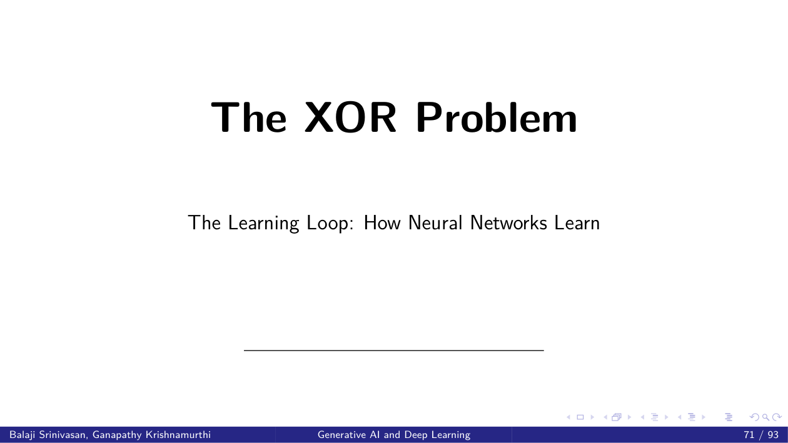

| $x_1$ | $x_2$ | $y = x_1 \oplus x_2$ |
| :---: | :---: | :---: |
| 0 | 0 | 0 |
| 0 | 1 | 1 |
| 1 | 0 | 1 |
| 1 | 1 | 0 |

---

### Slides 73–74: Mathematical Proof: Why Linear Models Fail on XOR
Let a linear model with sigmoid classification be:
$$f(x_1, x_2) = w_1 x_1 + w_2 x_2 + b$$
For the model to classify all four XOR points correctly:
1. $f(0, 0) = b \le 0 \implies b pprox 0$
2. $f(0, 1) = w_2 + b > 0 \implies w_2 > 0$
3. $f(1, 0) = w_1 + b > 0 \implies w_1 > 0$
4. $f(1, 1) = w_1 + w_2 + b \le 0$

* **The Contradiction**:
  * From (1), (2), and (3): Since $w_1 > 0$ and $w_2 > 0$ and $b pprox 0$, their sum MUST be positive:
    $$w_1 + w_2 + b > 0$$
  * But requirement (4) demands $w_1 + w_2 + b \le 0$.
  * **$1 + 1 + 0 = 2 \le 0$ is a mathematical impossibility.**
  * Thus, **no linear model can ever solve XOR**.

  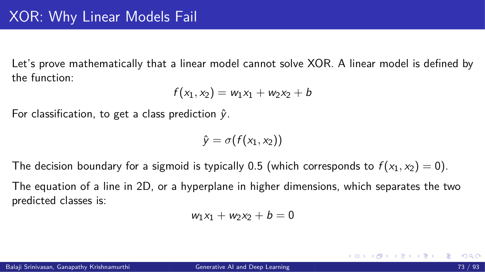

---

### Slide 75: The Solution: Multilayer Perceptron (MLP)
* By adding a hidden layer with non-linear activations, the network learns to combine two separating lines to isolate the non-linear XOR region.

  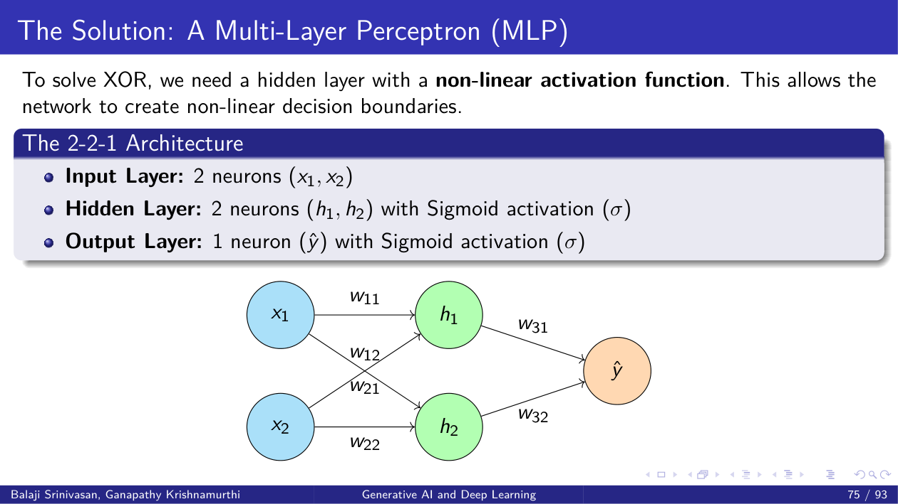

---

## ✍️ Part 9: Full End-to-End Mathematical Hand Calculation

### Slide 76–77: Network Setup & Chosen Initial Parameters
* **Architecture**: 2 Inputs $	o$ 2 Hidden Neurons ($h_1, h_2$ with Sigmoid) $	o$ 1 Output Neuron ($\hat{y}$ with Sigmoid).
* **Training Sample**: Input $\mathbf{x} = [1, 0]^T$, Target $y = 1$.
* **Initial Weights & Biases**:
  * Hidden Weights $\mathbf{W}_1 = egin{bmatrix} 1.0 & -1.0 \ 1.0 & -1.0 \end{bmatrix} \implies w_{11}=1.0, w_{21}=1.0, w_{12}=-1.0, w_{22}=-1.0$
  * Hidden Biases $\mathbf{b}_1 = [b_1, b_2]^T = [0.0, 1.0]^T$
  * Output Weights $\mathbf{W}_2 = [w_{31}, w_{32}] = [2.0, -1.0]$
  * Output Bias $b_3 = -1.0$

  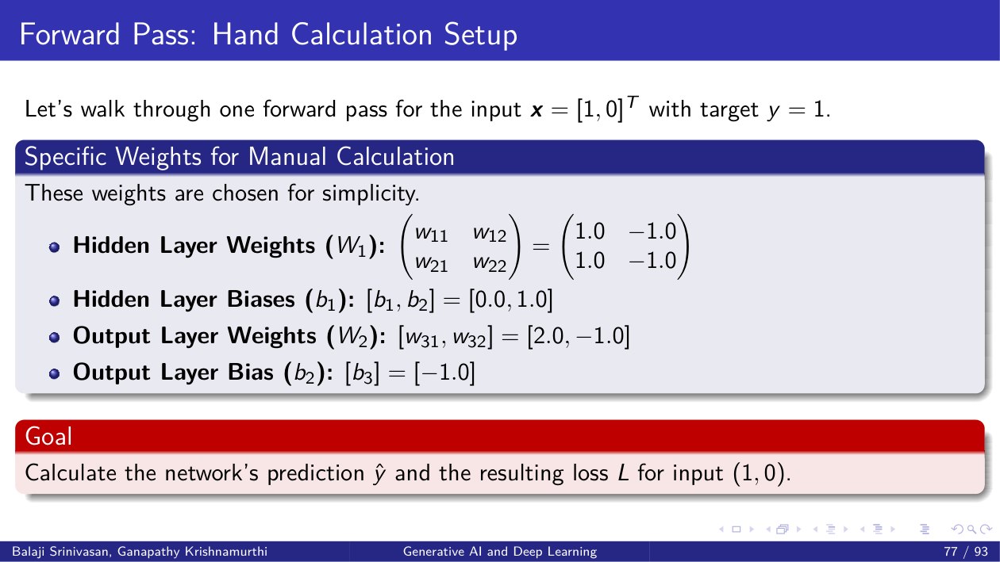

---

### Slide 78: Forward Pass — Step 1: Hidden Layer Pre-Activations
For hidden neuron 1 ($h_1$):
$$z_1 = w_{11} x_1 + w_{21} x_2 + b_1 = (1.0 	imes 1) + (1.0 	imes 0) + 0.0 = 1.0$$

For hidden neuron 2 ($h_2$):
$$z_2 = w_{12} x_1 + w_{22} x_2 + b_2 = (-1.0 	imes 1) + (-1.0 	imes 0) + 1.0 = 0.0$$

---

### Slide 79: Forward Pass — Step 2: Hidden Layer Activations
Apply Sigmoid activation $\sigma(z) = rac{1}{1 + e^{-z}}$:
$$h_1 = \sigma(z_1) = \sigma(1.0) = rac{1}{1 + e^{-1.0}} pprox 0.731$$
$$h_2 = \sigma(z_2) = \sigma(0.0) = rac{1}{1 + e^{0.0}} = 0.500$$

---

### Slide 80: Forward Pass — Steps 3 & 4: Output Layer Pre-Activation & Prediction
* **Step 3: Output Pre-Activation ($z_3$)**:
  $$z_3 = w_{31} h_1 + w_{32} h_2 + b_3 = (2.0 	imes 0.731) + (-1.0 	imes 0.500) + (-1.0) = 1.462 - 0.500 - 1.000 = -0.038$$

* **Step 4: Output Activation ($\hat{y}$)**:
  $$\hat{y} = \sigma(z_3) = \sigma(-0.038) = rac{1}{1 + e^{0.038}} pprox 0.491$$

---

### Slide 81: Forward Pass — Step 5: Loss Calculation
Using Binary Cross-Entropy Loss for target $y = 1$:
$$L = -[y \log(\hat{y}) + (1 - y) \log(1 - \hat{y})] = -[1 	imes \ln(0.491) + 0] = -(-0.712) = \mathbf{0.712}$$

---

### Slides 82–84: Backward Pass — Output Layer Gradients
* **Step 1: Output Error Term ($\delta_3$)**:
  $$\delta_3 = rac{\partial L}{\partial z_3} = \hat{y} - y = 0.491 - 1.0 = \mathbf{-0.509}$$

* **Step 2: Gradients for Output Weights ($w_{31}, w_{32}$) & Bias ($b_3$)**:
  $$rac{\partial L}{\partial w_{31}} = \delta_3 \cdot h_1 = (-0.509) 	imes 0.731 = \mathbf{-0.372}$$
  $$rac{\partial L}{\partial w_{32}} = \delta_3 \cdot h_2 = (-0.509) 	imes 0.500 = \mathbf{-0.255}$$
  $$rac{\partial L}{\partial b_3} = \delta_3 \cdot 1 = \mathbf{-0.509}$$

---

### Slides 85–86: Backward Pass — Propagating Error to Hidden Layer
* Hidden Error Terms:
  $$\delta_1 = rac{\partial L}{\partial z_1} = (\delta_3 \cdot w_{31}) \cdot \sigma'(z_1) = (-0.509 	imes 2.0) \cdot (h_1(1 - h_1)) = -1.018 	imes (0.731 	imes 0.269) = \mathbf{-0.200}$$
  $$\delta_2 = rac{\partial L}{\partial z_2} = (\delta_3 \cdot w_{32}) \cdot \sigma'(z_2) = (-0.509 	imes -1.0) \cdot (h_2(1 - h_2)) = 0.509 	imes (0.500 	imes 0.500) = \mathbf{0.127}$$

---

### Slides 87–91: Backward Pass — Hidden Layer Weight & Bias Gradients
* **For Neuron $h_1$**:
  $$rac{\partial L}{\partial w_{11}} = \delta_1 \cdot x_1 = -0.200 	imes 1 = \mathbf{-0.200}$$
  $$rac{\partial L}{\partial w_{21}} = \delta_1 \cdot x_2 = -0.200 	imes 0 = \mathbf{0.0}$$
  $$rac{\partial L}{\partial b_1} = \delta_1 = \mathbf{-0.200}$$

* **For Neuron $h_2$**:
  $$rac{\partial L}{\partial w_{12}} = \delta_2 \cdot x_1 = 0.127 	imes 1 = \mathbf{0.127}$$
  $$rac{\partial L}{\partial w_{22}} = \delta_2 \cdot x_2 = 0.127 	imes 0 = \mathbf{0.0}$$
  $$rac{\partial L}{\partial b_2} = \delta_2 = \mathbf{0.127}$$

---

### Slide 92: Weight Updates via Gradient Descent
Using learning rate $lpha = 0.1$:
$$w_{	ext{new}} = w_{	ext{old}} - lpha rac{\partial L}{\partial w}$$

* **Output Layer Updates**:
  $$w_{31} \leftarrow 2.0 - 0.1 	imes (-0.372) = \mathbf{2.0372}$$
  $$w_{32} \leftarrow -1.0 - 0.1 	imes (-0.255) = \mathbf{-0.9745}$$
  $$b_3 \leftarrow -1.0 - 0.1 	imes (-0.509) = \mathbf{-0.9491}$$

* **Hidden Layer Updates**:
  $$w_{11} \leftarrow 1.0 - 0.1 	imes (-0.200) = \mathbf{1.0200}$$
  $$w_{12} \leftarrow -1.0 - 0.1 	imes (0.127) = \mathbf{-1.0127}$$
  $$b_1 \leftarrow 0.0 - 0.1 	imes (-0.200) = \mathbf{0.0200}$$
  $$b_2 \leftarrow 1.0 - 0.1 	imes (0.127) = \mathbf{0.9873}$$
  *(Weights $w_{21}$ and $w_{22}$ remain unchanged because input $x_2 = 0 \implies 	ext{gradient} = 0$)*

---

## 🔮 Part 10: Non-linear Activation & Feature Space Transformation

### Slide 93: Feature Space Warping
* The fundamental reason non-linear hidden layers succeed is that they **warp and fold the input coordinate space**.

  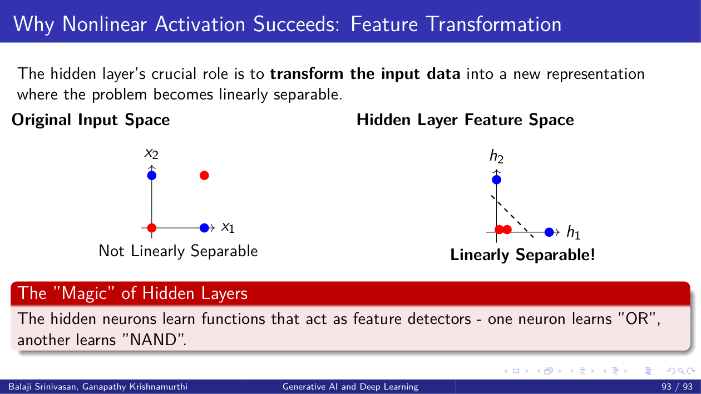

* **Input Space $(x_1, x_2)$**: The four XOR points $(0,0), (0,1), (1,0), (1,1)$ cannot be divided by a single straight line.
* **Hidden Feature Space $(h_1, h_2)$**:
  * Neuron $h_1$ acts as an OR feature detector ($h_1 pprox 1$ for $(0,1), (1,0), (1,1)$).
  * Neuron $h_2$ acts as a NAND feature detector.
  * In the mapped $(h_1, h_2)$ space, the positive and negative points become **strictly linearly separable**, enabling the output neuron to achieve $100\%$ accuracy with a simple linear boundary!

---

  Built for <b>BS Deep Learning & Generative AI</b> | Verified against Lecture Slides 1–93

