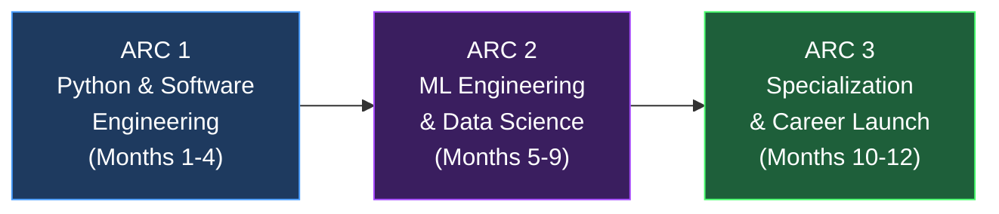

# 🚀 The 12-Month Path: Software Engineer → ML Engineer

> **Start Date:** September 2026
> **Goal:** Employable ML Engineer with real income, real projects, real skills.
> **Commitment:** Full-time (10-14 hours/day, 6 days/week, 1 rest day)

---

## 📋 Overview — The Three Arcs



| Arc | Months | Focus | Freelance Earning Potential |
|-----|--------|-------|---------------------------|
| **1: Python & Software Engineering** | 1–4 | Python mastery, scripting, automation, web apps, databases, APIs, deployment | ₹5K–30K/month (scripts, bots, scraping) |
| **2: ML Engineering** | 5–9 | Math, ML algorithms, deep learning, Kaggle, real-world pipelines | ₹20K–60K/month (data work, ML prototypes) |
| **3: Specialization & Career** | 10–12 | Advanced projects, MLOps, portfolio polish, job applications | ₹40K–1L+/month (ML consulting, full projects) |

---

## ⏰ Daily Schedule Template

> Treat this like a job. Wake up at the same time every day. No negotiations.

| Time | Block | Activity |
|------|-------|----------|
| **6:00 – 6:30** | 🧘 | Wake up, cold water, 10 min walk — no phone |
| **6:30 – 7:00** | 📖 | Review yesterday's notes, plan today's targets |
| **7:00 – 10:00** | 🎓 **Deep Study** | New concepts — courses, books, tutorials (3 hrs) |
| **10:00 – 10:30** | ☕ | Break — food, stretch, away from screen |
| **10:30 – 13:00** | 💻 **Build** | Code what you learned — projects, exercises, implementations (2.5 hrs) |
| **13:00 – 14:00** | 🍽️ | Lunch + rest — no screens |
| **14:00 – 16:00** | 🧩 **DSA / Problem Solving** | LeetCode, HackerRank, NeetCode (2 hrs) |
| **16:00 – 16:30** | ☕ | Break |
| **16:30 – 19:00** | 💼 **Freelance / Portfolio** | Upwork proposals, client work, GitHub projects (2.5 hrs) |
| **19:00 – 20:00** | 🍽️ | Dinner + family time |
| **20:00 – 22:00** | 📚 **Review & Extend** | Revise notes, read docs, watch conference talks, write blog (2 hrs) |
| **22:00 – 22:30** | 📝 | Journal what you learned, plan tomorrow |
| **22:30** | 😴 | Sleep — non-negotiable |

> **Total: ~12.5 hours/day focused work**
> **Rest Day: Every Sunday** — go outside, exercise, recharge. Burnout is real.

---

---

# 🔷 ARC 1: PYTHON & SOFTWARE ENGINEERING (Months 1–4)

---

## Month 1: Python Core Mastery & Linux/Git

> **Goal:** Write Python fluently. Be comfortable with the terminal. Version control everything.

### Week 1-2: Python Fundamentals

**Course:** [CS50P — Harvard (free on YouTube/edX)](https://cs50.harvard.edu/python/)

Cover these topics — don't just watch, **code every example yourself**:

- [ ] Variables, types, type casting
- [ ] Strings — slicing, methods, f-strings, regex basics
- [ ] Control flow — if/elif/else, match-case
- [ ] Loops — for, while, break, continue, enumerate, zip
- [ ] Functions — args, kwargs, return values, scope, lambda
- [ ] Data structures — lists, tuples, sets, dictionaries (DEEP understanding)
- [ ] List comprehensions, dict comprehensions, generator expressions
- [ ] File I/O — read, write, CSV, JSON
- [ ] Error handling — try/except/finally, custom exceptions
- [ ] Modules and packages — import system, `__name__`, pip

**Daily Practice:** Solve 5 problems on [HackerRank Python track](https://www.hackerrank.com/domains/python)

**Mini Projects:**
1. A CLI calculator with history
2. A password generator with strength checker
3. A personal expense tracker that saves to CSV

### Week 3: Object-Oriented Python

- [ ] Classes and objects — `__init__`, self, instance vs class attributes
- [ ] Methods — instance, class (`@classmethod`), static (`@staticmethod`)
- [ ] Inheritance — single, multiple, MRO, `super()`
- [ ] Dunder methods — `__str__`, `__repr__`, `__len__`, `__eq__`, `__lt__`, `__add__`
- [ ] Properties — `@property`, getters, setters
- [ ] Abstract base classes — `abc` module
- [ ] Dataclasses — `@dataclass` decorator
- [ ] Composition vs Inheritance — when to use which

**Course:** Corey Schafer's OOP playlist (YouTube — free, excellent)

**Project:** Build a **Library Management System** (CLI)
- Book, Member, Loan classes
- Search, borrow, return, overdue tracking
- Save/load state from JSON files
- Proper error handling

### Week 4: Git, Linux & Developer Tools

**Git (Essential — this is your resume):**
- [ ] `git init`, `add`, `commit`, `log`, `diff`, `status`
- [ ] Branching — `branch`, `checkout`, `merge`, `rebase`
- [ ] Remote — `push`, `pull`, `fetch`, `clone`
- [ ] `.gitignore`, commit message conventions
- [ ] GitHub — repos, PRs, issues, GitHub Pages
- [ ] **Resource:** [Git & GitHub for Beginners — freeCodeCamp (YouTube)](https://www.youtube.com/watch?v=RGOj5yH7evk)

**Linux & Terminal:**
- [ ] Navigation — `cd`, `ls`, `pwd`, `mkdir`, `cp`, `mv`, `find`
- [ ] File ops — `cat`, `head`, `tail`, `grep`, `wc`, `sort`, `awk`
- [ ] Permissions — `chmod`, `chown`, users
- [ ] Processes — `ps`, `top`, `kill`, `bg`, `fg`
- [ ] Shell scripting basics — variables, loops, conditionals in Bash
- [ ] SSH basics
- [ ] **Resource:** [Linux Journey](https://linuxjourney.com/) (free)

**Dev Environment:**
- [ ] VS Code setup — extensions (Python, Pylint, GitLens, Jupyter)
- [ ] Virtual environments — `venv`, `pip`, `requirements.txt`
- [ ] Linting — `ruff`, `black`, `isort`
- [ ] Basic Makefile usage

> ### ✅ Month 1 Checkpoint
> - [ ] Can write Python programs from scratch without looking up basic syntax
> - [ ] Comfortable with classes, inheritance, file I/O
> - [ ] GitHub account with 3+ repositories
> - [ ] Comfortable navigating terminal

---

## Month 2: Scripting, Automation & Freelance Foundations

> **Goal:** Build scripts people will pay for. Start earning on Upwork.

### Week 5-6: Python Scripting & Automation

**Topics:**
- [ ] `os`, `sys`, `pathlib` — file system operations
- [ ] `subprocess` — running system commands
- [ ] `shutil` — file/directory operations
- [ ] `argparse` / `click` / `typer` — CLI argument parsing
- [ ] `schedule` / `cron` — task scheduling
- [ ] Regular expressions — `re` module deep dive
- [ ] `logging` module — proper logging (not print statements)
- [ ] Configuration files — `configparser`, YAML, TOML, `.env` files

**Web Scraping (HIGH FREELANCE VALUE):**
- [ ] `requests` — HTTP methods, headers, sessions, cookies
- [ ] `BeautifulSoup` — HTML parsing, CSS selectors
- [ ] `Selenium` / `Playwright` — browser automation for dynamic sites
- [ ] Handling pagination, rate limiting, anti-bot measures
- [ ] **Resource:** [Web Scraping with Python — freeCodeCamp](https://www.youtube.com/watch?v=XVv6mJpFOb0)

**Automation Projects:**
1. **File Organizer** — watches a folder, sorts files by type/date into subfolders
2. **Web Scraper** — scrapes product prices from e-commerce sites, saves to CSV, sends email alerts on price drops
3. **PDF Report Generator** — reads data from CSV/Excel, generates formatted PDF reports using `reportlab` or `fpdf`
4. **Social Media Bot** — auto-posts content to Twitter/LinkedIn at scheduled times (using APIs)
5. **Bulk Email Sender** — reads contacts from spreadsheet, sends personalized emails via SMTP

### Week 7: APIs & Data Processing

**APIs — Both Consuming and Building:**
- [ ] REST fundamentals — HTTP methods, status codes, headers
- [ ] `requests` library — GET, POST, PUT, DELETE
- [ ] Authentication — API keys, OAuth basics, Bearer tokens
- [ ] JSON parsing and construction
- [ ] Rate limiting and error handling
- [ ] Working with popular APIs: OpenAI, Google Maps, Twitter, GitHub

**Data Processing:**
- [ ] `pandas` — DataFrames, Series, reading/writing CSV/Excel/JSON
- [ ] Data cleaning — missing values, duplicates, type conversion
- [ ] Data transformation — groupby, merge, pivot, apply
- [ ] `openpyxl` — Excel automation
- [ ] `matplotlib` + `seaborn` — basic data visualization

**Project:** **Automated Data Pipeline**
- Scrape data from 3 sources → clean with pandas → generate Excel report with charts → email it → schedule daily via cron

### Week 8: Start Freelancing

**Upwork Profile Setup:**
- [ ] Professional photo (or get one taken cheaply)
- [ ] Title: "Python Developer | Automation & Web Scraping Specialist"
- [ ] Portfolio: Link 3-4 GitHub projects from above
- [ ] Write 3-4 specialized profiles (scraping, automation, data processing)
- [ ] Set rate low initially: $8-12/hour (₹650-1000/hr) — raise after 5 reviews

**First Gigs to Target (Easiest to Land):**
1. Web scraping projects (huge demand, easy to deliver)
2. Data cleaning / Excel automation
3. Python scripts for file processing
4. Bot development (Telegram, Discord)
5. PDF generation / report automation

**Proposal Template:**
> Hi [name], I read your requirement for [specific task]. I've built similar [specific example] — here's my GitHub repo showing [link]. I can deliver this in [timeline] and will include [bonus value]. I'm available to discuss details on a quick call.

**Target:** Send 10-15 proposals per day for the first 2 weeks. Expect ~2-5% acceptance rate initially.

> ### ✅ Month 2 Checkpoint
> - [ ] Built 5+ automation scripts
> - [ ] Can scrape any website (static and dynamic)
> - [ ] Upwork profile live with portfolio
> - [ ] First freelance job landed (or 50+ proposals sent)
> - [ ] GitHub has 6+ repositories

---

## Month 3: Web Development with Python

> **Goal:** Build full-stack web applications. This is where the serious freelance money is.

### Week 9-10: Backend Development — FastAPI & Django

**Start with FastAPI (Modern, Fast to Learn):**
- [ ] Routes, path parameters, query parameters
- [ ] Request/response models with Pydantic
- [ ] CRUD operations
- [ ] Middleware, CORS
- [ ] Authentication — JWT tokens
- [ ] File uploads
- [ ] Background tasks
- [ ] **Resource:** [FastAPI Official Tutorial](https://fastapi.tiangolo.com/tutorial/) (best docs in Python ecosystem)

**Then Django (Industry Standard, More Freelance Jobs):**
- [ ] Project structure — apps, settings, URLs
- [ ] Models — ORM, migrations, relationships (1:1, 1:N, M:N)
- [ ] Views — function-based and class-based
- [ ] Templates — Django template language, template inheritance
- [ ] Forms — ModelForms, validation, CSRF
- [ ] Admin panel — customization
- [ ] Authentication — login, registration, password reset
- [ ] Django REST Framework — serializers, viewsets, routers
- [ ] **Resource:** [Django for Beginners (book by William Vincent)](https://djangoforbeginners.com/) + [Dennis Ivy Django playlist (YouTube)](https://www.youtube.com/watch?v=PtQiiknWUcI)

### Week 11: Databases

- [ ] **SQL Fundamentals** — SELECT, INSERT, UPDATE, JOIN, GROUP BY, subqueries
- [ ] **PostgreSQL** — setup, psql CLI, data types, indexing
- [ ] **SQLAlchemy** — Python ORM, sessions, queries
- [ ] **Redis** — caching, sessions, task queues
- [ ] **Database design** — normalization, ER diagrams, relationships
- [ ] **Resource:** [SQLBolt](https://sqlbolt.com/) (interactive, free) + [PostgreSQL Tutorial](https://www.postgresqltutorial.com/)

### Week 12: Frontend Basics & Deployment

**Frontend (Enough to Build Full Apps):**
- [ ] HTML5 — semantic elements, forms
- [ ] CSS3 — Flexbox, Grid, responsive design
- [ ] **Tailwind CSS** — utility-first (fast development)
- [ ] JavaScript basics — DOM manipulation, fetch API, async/await
- [ ] **HTMX** (optional but powerful with Django/FastAPI)
- [ ] **Resource:** [freeCodeCamp Responsive Web Design](https://www.freecodecamp.org/learn/2022/responsive-web-design/)

**Deployment (Critical Skill):**
- [ ] **Docker** — Dockerfile, docker-compose, containers, volumes, networks
- [ ] **Cloud basics** — AWS EC2 / DigitalOcean droplet / Railway / Render
- [ ] **Nginx** — reverse proxy, SSL with Let's Encrypt
- [ ] **CI/CD** — GitHub Actions basics
- [ ] Domain names, DNS basics

**Project:** **Full-Stack Web Application**
Build a **Job Application Tracker** or **Invoice Generator for Freelancers:**
- User auth (register/login/logout)
- CRUD for entries (jobs, invoices, clients)
- Dashboard with charts
- PDF export
- REST API
- Deployed live on the internet
- Docker containerized

> ### ✅ Month 3 Checkpoint
> - [ ] Can build a complete web application from scratch
> - [ ] Comfortable with SQL and database design
> - [ ] At least 1 app deployed live
> - [ ] Freelance income: ₹5,000-20,000 earned
> - [ ] GitHub has 8+ repositories

---

## Month 4: Advanced Software Engineering & Desktop/Mobile

> **Goal:** Level up engineering quality. Explore desktop and mobile development.

### Week 13: Software Engineering Practices

- [ ] **Testing** — `pytest`, unit tests, fixtures, mocking, coverage
- [ ] **Type hints** — annotations, `mypy`, `typing` module
- [ ] **Design patterns** — Singleton, Factory, Observer, Strategy, Repository
- [ ] **SOLID principles** — understand and apply each one
- [ ] **Clean Code** — naming, function size, DRY, KISS, separation of concerns
- [ ] **Documentation** — docstrings, README writing, Sphinx/MkDocs
- [ ] **Packaging** — `pyproject.toml`, building distributable packages

### Week 14: Desktop Applications

**Choose one framework:**
- [ ] **PyQt6 / PySide6** — most powerful, professional desktop apps
  - Widgets, layouts, signals/slots
  - QML for modern UIs
  - Database integration
  - Packaging with PyInstaller
- [ ] **Tkinter** — simple, built-in (good for quick tools)
- [ ] **Flet** — Flutter-based, modern, cross-platform (web + desktop + mobile)

**Project:** Build a **Personal Finance Manager** desktop app
- Track income/expenses with categories
- Charts and graphs for spending analysis
- SQLite database backend
- Export reports to PDF/CSV
- System tray integration

### Week 15: Mobile Development

**Option A — Flet (Recommended for Python developers):**
- Write once in Python, deploy to iOS, Android, Web, Desktop
- Material Design components
- **Resource:** [Flet Official Docs](https://flet.dev/docs/)

**Option B — Kivy / KivyMD:**
- Python-native mobile framework
- Touch-friendly widgets

**Project:** Build a **Habit Tracker** or **Daily Task Manager** mobile app

### Week 16: Capstone & Portfolio Polish

**Build a Capstone Project** that combines everything:
- **SaaS Web Application** (e.g., URL Shortener with Analytics, or a Client Portal for Freelancers)
- Full authentication system
- REST API with documentation
- Background task processing (Celery + Redis)
- Payment integration (Stripe — test mode)
- Deployed with Docker on cloud
- Comprehensive README, tests, CI/CD

**Portfolio Website:**
- Build a personal portfolio site (Django or static with GitHub Pages)
- Showcase all projects with screenshots, live links, GitHub links
- Add a blog section — write about what you learned

> ### ✅ Month 4 Checkpoint (END OF ARC 1)
> - [ ] Can build web, desktop, and mobile applications
> - [ ] Write tested, documented, production-quality code
> - [ ] Portfolio website live
> - [ ] 10+ GitHub repositories with proper READMEs
> - [ ] Freelance income established: ₹15,000-40,000/month
> - [ ] 2-5 Upwork reviews collected

---

---

# 🔮 ARC 2: ML ENGINEERING & DATA SCIENCE (Months 5–9)

---

## Month 5: Mathematics for ML

> **Goal:** Build the math intuition. You don't need a PhD — you need to understand WHY algorithms work.

### Week 17-18: Linear Algebra & Calculus

**Linear Algebra (Most Important for ML):**
- [ ] Vectors — operations, dot product, cross product
- [ ] Matrices — multiplication, transpose, inverse, determinant
- [ ] Linear transformations — geometric intuition
- [ ] Eigenvalues and eigenvectors
- [ ] Matrix decomposition — SVD, PCA connection
- [ ] **Resource:** [3Blue1Brown — Essence of Linear Algebra (YouTube)](https://www.youtube.com/playlist?list=PLZHQObOWTQDPD3MizzM2xVFitgF8hE_ab) — **WATCH THIS FIRST, it's a masterpiece**
- [ ] **Practice:** [Khan Academy Linear Algebra](https://www.khanacademy.org/math/linear-algebra)
- [ ] **Code it:** Implement matrix operations from scratch in NumPy

**Calculus:**
- [ ] Derivatives — chain rule, partial derivatives
- [ ] Gradients — gradient vector, directional derivatives
- [ ] Gradient descent — intuition and implementation from scratch
- [ ] **Resource:** [3Blue1Brown — Essence of Calculus](https://www.youtube.com/playlist?list=PLZHQObOWTQDMsr9K-rj53DwVRMYO3t5Yr)

### Week 19-20: Probability & Statistics

- [ ] Probability basics — conditional, Bayes' theorem, independence
- [ ] Distributions — Normal, Binomial, Poisson, Uniform
- [ ] Descriptive stats — mean, median, mode, variance, std dev
- [ ] Hypothesis testing — p-values, confidence intervals, A/B testing
- [ ] Correlation vs causation
- [ ] Maximum likelihood estimation
- [ ] **Resource:** [StatQuest with Josh Starmer (YouTube)](https://www.youtube.com/c/joshstarmer) — **This channel alone is better than most textbooks**
- [ ] **Resource:** [Think Stats (free book)](https://greenteapress.com/thinkstats2/)

**NumPy Deep Dive (You'll Use This Daily):**
- [ ] Arrays — creation, indexing, slicing, reshaping
- [ ] Broadcasting rules
- [ ] Linear algebra with NumPy
- [ ] Random number generation
- [ ] Vectorization — why loops are slow

> ### ✅ Month 5 Checkpoint
> - [ ] Can explain gradient descent mathematically and intuitively
> - [ ] Comfortable with matrix operations
> - [ ] Understand probability distributions
> - [ ] NumPy is second nature

---

## Month 6-7: Classical Machine Learning

> **Goal:** Understand every major ML algorithm deeply — math, intuition, and code.

### Week 21-24: Supervised Learning

**Course:** [Andrew Ng's Machine Learning Specialization (Coursera — free audit)](https://www.coursera.org/specializations/machine-learning-introduction)

**Algorithms to Master (understand math + implement from scratch + use sklearn):**

| Algorithm | Learn | From Scratch | sklearn |
|-----------|-------|:------------:|:-------:|
| Linear Regression | ✅ | ✅ | ✅ |
| Logistic Regression | ✅ | ✅ | ✅ |
| Decision Trees | ✅ | ✅ | ✅ |
| Random Forests | ✅ | — | ✅ |
| Gradient Boosting (XGBoost, LightGBM) | ✅ | — | ✅ |
| Support Vector Machines | ✅ | — | ✅ |
| K-Nearest Neighbors | ✅ | ✅ | ✅ |
| Naive Bayes | ✅ | ✅ | ✅ |

**For each algorithm, do this cycle:**
1. Watch/read the theory (StatQuest + Andrew Ng)
2. Implement from scratch in NumPy (for key algorithms)
3. Use sklearn on a real dataset
4. Evaluate properly — don't just check accuracy

**ML Engineering Skills (Not Just Modeling):**
- [ ] Data preprocessing — scaling, encoding, imputation
- [ ] Feature engineering — creation, selection, importance
- [ ] Train/test split, cross-validation, stratification
- [ ] Evaluation metrics — accuracy, precision, recall, F1, ROC-AUC, RMSE, MAE
- [ ] Hyperparameter tuning — GridSearch, RandomSearch, Optuna
- [ ] Handling imbalanced data — SMOTE, class weights
- [ ] Pipeline construction with sklearn Pipelines

### Week 25-28: Unsupervised Learning & Practical ML

- [ ] K-Means clustering — implement from scratch
- [ ] DBSCAN, Hierarchical clustering
- [ ] PCA — dimensionality reduction
- [ ] t-SNE, UMAP — visualization
- [ ] Anomaly detection — Isolation Forest, LOF

**Kaggle — Start Competing:**
- [ ] Complete the [Titanic competition](https://www.kaggle.com/c/titanic) (classification intro)
- [ ] Complete the [House Prices competition](https://www.kaggle.com/c/house-prices-advanced-regression-techniques) (regression intro)
- [ ] Study top notebooks — understand feature engineering tricks
- [ ] Enter 1 active competition — aim for top 30%
- [ ] Earn at least **Kaggle Notebooks Expert** tier

**Book:** [Hands-On Machine Learning with Scikit-Learn, Keras & TensorFlow — Aurélien Géron](https://www.oreilly.com/library/view/hands-on-machine-learning/9781098125974/)
— This single book can take you from zero to professional ML. Read Part 1 during these months.

> ### ✅ Month 6-7 Checkpoint
> - [ ] Can implement Linear Regression, Logistic Regression, KNN from scratch
> - [ ] Comfortable with full sklearn workflow
> - [ ] 2+ Kaggle competitions completed with documented notebooks
> - [ ] Can explain bias-variance tradeoff, overfitting, regularization clearly
> - [ ] Freelance: started taking data analysis / ML gigs

---

## Month 8-9: Deep Learning

> **Goal:** Understand neural networks deeply. Build and deploy DL models.

### Week 29-32: Neural Networks & PyTorch

**Course:** [fast.ai Practical Deep Learning (free)](https://course.fast.ai/) — Top-down approach, excellent

**Core Topics:**
- [ ] Perceptrons, activation functions (ReLU, Sigmoid, Tanh, Softmax)
- [ ] Forward propagation — implement from scratch
- [ ] Backpropagation — implement from scratch (this is crucial)
- [ ] Loss functions — MSE, Cross-Entropy, Binary Cross-Entropy
- [ ] Optimizers — SGD, Adam, learning rate scheduling
- [ ] Regularization — Dropout, Batch Normalization, L1/L2, Early Stopping

**PyTorch (Industry Standard):**
- [ ] Tensors — operations, GPU acceleration
- [ ] `nn.Module` — building custom models
- [ ] `DataLoader`, `Dataset` — data pipelines
- [ ] Training loops — forward, loss, backward, step
- [ ] Saving/loading models
- [ ] **Resource:** [PyTorch Official Tutorials](https://pytorch.org/tutorials/)

### Week 33-36: Architectures & Applications

**Computer Vision:**
- [ ] CNNs — convolution, pooling, architectures
- [ ] Transfer learning — ResNet, EfficientNet, fine-tuning
- [ ] Image classification, object detection basics
- [ ] **Project:** Build an image classifier (real-world: plant disease, product defect, etc.)

**Natural Language Processing:**
- [ ] Text preprocessing — tokenization, embeddings (Word2Vec, GloVe)
- [ ] RNNs, LSTMs, GRUs — understand sequential modeling
- [ ] Attention mechanism and Transformers — the architecture that changed everything
- [ ] Hugging Face Transformers library — use pre-trained models
- [ ] Fine-tuning BERT/GPT for classification, NER, QA
- [ ] **Project:** Sentiment analysis system or document classifier

**Tabular Deep Learning:**
- [ ] When DL beats traditional ML on tabular data (and when it doesn't)
- [ ] TabNet, Neural network feature engineering

**Kaggle Deep Learning Competition:**
- [ ] Enter 1 image or NLP competition
- [ ] Study winning solutions from past competitions

> ### ✅ Month 8-9 Checkpoint (END OF ARC 2)
> - [ ] Implemented a neural network from scratch (NumPy only)
> - [ ] Built and trained models in PyTorch
> - [ ] Completed CV and NLP projects
> - [ ] 3+ Kaggle competitions with documented solutions
> - [ ] Can explain Transformers and attention mechanism
> - [ ] Freelance income: ₹30,000-60,000/month

---

---

# 🏆 ARC 3: SPECIALIZATION & CAREER LAUNCH (Months 10–12)

---

## Month 10: MLOps & Production ML

> **Goal:** Bridge the gap from "notebook ML" to "production ML." This is what separates engineers from students.

- [ ] **MLflow** — experiment tracking, model registry, model serving
- [ ] **Docker for ML** — containerizing models, GPU containers
- [ ] **FastAPI for ML** — serving models as REST APIs
- [ ] **Streamlit / Gradio** — building ML demos rapidly
- [ ] **Data versioning** — DVC basics
- [ ] **Model monitoring** — drift detection, performance tracking
- [ ] **CI/CD for ML** — GitHub Actions for training pipelines
- [ ] **Cloud ML** — AWS SageMaker basics OR GCP Vertex AI basics
- [ ] **Resource:** [Made With ML](https://madewithml.com/) — free, production-focused

**Project: End-to-End ML Pipeline**
- Data ingestion → preprocessing → training → evaluation → serving → monitoring
- Version controlled (code + data + models)
- Dockerized and deployed
- API endpoint with documentation
- Automated retraining pipeline

---

## Month 11: Real-World Projects & Portfolio

> **Goal:** Build 2-3 impressive projects that solve REAL problems.

### Portfolio Projects (Pick 2-3):

**Project A: Predictive System**
- Predict customer churn / loan default / demand forecasting
- Use real-world data (UCI ML Repository, Kaggle datasets, government open data)
- Full pipeline: EDA → feature engineering → modeling → API → dashboard
- Write a blog post explaining your approach

**Project B: Computer Vision Application**
- Real-time object detection / image segmentation / OCR system
- Deployed as web app (upload image → get result)
- Mobile-friendly interface

**Project C: NLP Application**
- Document search engine with semantic similarity
- Chatbot with RAG (Retrieval Augmented Generation)
- Multi-language text classification system

**Project D: Recommendation System**
- Movie/product/content recommendation engine
- Collaborative + content-based filtering
- Deployed with user interface

### Portfolio Requirements:
Every project MUST have:
- [ ] Clean, documented GitHub repository
- [ ] Comprehensive README with screenshots/demo GIF
- [ ] Live demo link (Streamlit Cloud / Hugging Face Spaces / Railway)
- [ ] Blog post explaining the approach
- [ ] Docker support

---

## Month 12: Certification, Interview Prep & Job Hunt

### Certifications (Get 1-2):
- [ ] **TensorFlow Developer Certificate** (~₹8,000) — widely recognized
- [ ] **AWS ML Specialty** (~₹25,000) — high value for cloud ML roles
- [ ] **Google Professional ML Engineer** — top-tier certification

### Interview Preparation:

**ML Theory Questions:**
- [ ] Bias-variance tradeoff
- [ ] Overfitting — causes and solutions
- [ ] Explain every algorithm you've used
- [ ] Evaluation metrics — when to use which
- [ ] Feature engineering techniques
- [ ] How would you approach [X problem]?

**Coding Interviews:**
- [ ] LeetCode — 100+ problems solved (Easy: 50, Medium: 40, Hard: 10)
- [ ] Focus on: Arrays, Strings, Hash Maps, Trees, Graphs, DP basics
- [ ] ML coding: implement algorithms from scratch

**System Design for ML:**
- [ ] Design a recommendation system
- [ ] Design a fraud detection pipeline
- [ ] Design a real-time prediction service
- [ ] **Resource:** [ML System Design by Chip Huyen](https://huyenchip.com/machine-learning-systems-design/toc.html)

### Job Applications:
- [ ] LinkedIn profile optimized — "ML Engineer" headline
- [ ] Resume — 1 page, projects-focused, no mention of incomplete degree (focus on skills and certifications)
- [ ] Apply to 10-15 positions per day
- [ ] Target: startups and mid-size companies (more skills-focused, less credential-focused)
- [ ] Continue freelancing — some freelance clients may offer full-time roles

---

---

# 🧰 Complete Tool Stack to Master

```
LANGUAGES:        Python (primary), SQL, Bash, JavaScript (basic)
VERSION CONTROL:  Git, GitHub
DATA:             pandas, NumPy, SQL, PostgreSQL, Redis
VISUALIZATION:    matplotlib, seaborn, Plotly
ML:               scikit-learn, XGBoost, LightGBM
DL:               PyTorch, Hugging Face Transformers
WEB:              FastAPI, Django, HTML/CSS/JS, Tailwind
MLOPS:            Docker, MLflow, DVC, GitHub Actions
CLOUD:            AWS (EC2, S3, SageMaker) or GCP
TOOLS:            Jupyter, VS Code, Linux, Streamlit, Gradio
```

---

# 📊 Progress Tracker

| Month | Key Milestone | GitHub Repos | Freelance Income | Kaggle |
|-------|--------------|:------------:|:----------------:|:------:|
| 1 | Python fluent, Git/Linux comfortable | 3+ | — | — |
| 2 | Automation expert, Upwork profile live | 6+ | First gig landed | — |
| 3 | Full-stack web app deployed | 8+ | ₹5K-20K | — |
| 4 | Desktop/mobile app + portfolio site | 12+ | ₹15K-40K | — |
| 5 | Math foundations solid | 13+ | ₹20K-40K | — |
| 6 | Classical ML — sklearn mastery | 15+ | ₹25K-50K | 2 competitions |
| 7 | Advanced ML + Kaggle competitor | 17+ | ₹30K-60K | 3 competitions |
| 8 | Deep learning — PyTorch proficient | 19+ | ₹35K-60K | 4 competitions |
| 9 | CV + NLP projects complete | 21+ | ₹40K-70K | 5 competitions |
| 10 | MLOps — production pipelines | 23+ | ₹50K-80K | — |
| 11 | Portfolio projects polished | 25+ | ₹50K-1L | — |
| 12 | Certified, interview-ready, applying | 25+ | ₹60K-1L+ | Expert tier |

---

# 🔥 Rules to Live By for the Next 12 Months

1. **Code every single day.** No zero days. Even 30 minutes on a bad day.
2. **Build, don't just watch.** Tutorials are not learning. Building is learning.
3. **Push to GitHub daily.** Green squares = proof of work.
4. **Teach what you learn.** Write blog posts. Explain concepts in your own words. If you can't explain it simply, you don't understand it.
5. **Don't compare timelines.** Some people took 4 years in university. You're doing it in 12 months. Different path, same destination.
6. **Exercise and sleep.** Your brain is a muscle. Rest is not optional.
7. **One day off per week.** Burnout will destroy your plan faster than laziness.
8. **Document everything.** Your future self (and your parents) will want to see the journey.
9. **Start freelancing in Month 2, not "when I'm ready."** You'll never feel ready. Start anyway.
10. **This is not punishment. This is a second chance.** Treat it with respect.

---

> *"The best time to plant a tree was 20 years ago. The second best time is now."*
>
> You have the roadmap. You have the tools. You have the time. Now execute.
>
> **Day 1 starts tomorrow. September 21, 2026.**
