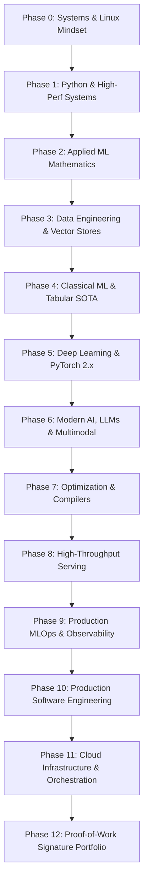

# 🧠 Master Knowledge Vault & ML Engineer Roadmap

> 🎯 **Master Mission**
>
> Become an elite, production-grade **Machine Learning Systems Engineer** and secure a high-impact ML Engineering role before **31 December 2026**.
>
> This repository and roadmap are strictly **engineering-focused**, **portfolio-first**, and **startup/production-oriented**. It bypasses academic fluff in favor of provable software engineering rigor, distributed systems architecture, latency-critical inference optimizations, and production-hardened deployments.

---

## ⚡ Core Guiding Principles

### 1. 🔨 Build More Than You Study
For every theoretical concept encountered:
$$\text{Read} \longrightarrow \text{Implement from Scratch} \longrightarrow \text{Benchmark} \longrightarrow \text{Deploy} \longrightarrow \text{Document} \longrightarrow \text{Publish}$$
Never allow architectural knowledge to remain trapped inside disconnected Jupyter Notebooks.

### 2. 🏗️ Think Like a Systems Engineer
Reject the naive question: *"Can I train a model with 95% accuracy?"*
Always demand: *"Can another engineer deploy, monitor, reproduce, profile, scale, and debug this model under tight latency SLAs?"*

### 3. 📦 Every Repository Must Feel Like Tier-1 Open Source
Every single production project must maintain a spotless repository standard:
```text
project-root/
├── .github/workflows/       # Automated CI/CD (lint, test, build, deploy)
├── .pre-commit-config.yaml  # Ruff, Mypy, Format enforcement
├── README.md                # 5-minute architectural overview & benchmark charts
├── LICENSE                  # Permissive open-source license (MIT / Apache-2.0)
├── pyproject.toml           # Modern PEP 621 package config managed with uv
├── Dockerfile               # Multi-stage, minimal distroless/CUDA image
├── docker-compose.yml       # Reproducible local orchestration
├── Makefile                 # Canonical task runner (make test, make lint, make serve)
├── src/                     # Modular, type-annotated application code
├── tests/                   # Pytest suite with unit, integration, & regression tests
├── docs/                    # Architecture diagrams, API specs, and runbooks
├── benchmarks/              # Latency, throughput, VRAM, and load test scripts
└── assets/                  # High-contrast diagrams, demo GIFs, and benchmark plots
```

### 4. 🔁 Zero-Friction Reproducibility
Any engineer on earth should be able to run:
```bash
git clone <repo-url>
cd <repo-name>
uv sync --all-extras
docker compose up --build
```
...and achieve identical benchmark and inference results on day one.

---

## 🗺️ Domain Stack Architecture & Roadmap Mapping

The repository uses an **Expandable Domain Taxonomy (00 - 90)** based on a Dewey-Zettelkasten hybrid structure. Every note, implementation, and script in this vault directly powers a corresponding phase in your ML Engineering roadmap:

```
Notes/
├── 00_Meta_&_System/             # Tools, VS Code configuration, automation scripts, CLI guides
├── 10_CS_&_Engineering/          # Core languages (Python, Java, Rust), DSA, Web APIs, DevOps & Git
│   ├── 11_Languages/             # Deep dives: Python internals, Modern Java, Rust for ML
│   ├── 12_DSA/                   # Algorithms, trees, graphs, dynamic programming, algorithmic complexity
│   ├── 13_Web_Dev/               # FastAPI, async networking, WebSockets, gRPC
│   ├── 14_DevOps_&_Tools/        # Git/GitHub terminal mastery, Docker, GitHub Actions, Linux tooling
│   └── 15_System_Design/         # Distributed systems, caching, zero-trust security, IAM
├── 20_Mathematics_&_Sciences/     # Applied Linear Algebra, Calculus, Probability, Statistics, Optimization
├── 30_Data_Science_&_Tools/      # High-performance data: Polars, NumPy, DuckDB, Parquet, Feature Stores
├── 40_AI_&_Machine_Learning/     # The ML Engine: Classical ML, PyTorch 2.x, Deep Learning, CV, NLP, GenAI
│   ├── 41_Machine_Learning/      # Scikit-Learn, Gradient Boosters (XGBoost, LightGBM, CatBoost)
│   ├── 42_Deep_Learning/         # PyTorch internals, custom autograd, CUDA/Triton kernels, DDP, FSDP
│   ├── 43_Computer_Vision/       # ViT, SAM 2, YOLO, Multimodal Perception
│   ├── 44_NLP_&_LLMs/            # Transformers, Tokenizers, Attention (FlashAttention), LoRA, PEFT, RAG
│   └── 45_Model_Serving_Ops/     # vLLM, SGLang, Triton Inference Server, ONNX Runtime, TensorRT-LLM
├── 50_Robotics_&_Automation/     # ROS 2, Kinematics, Real-Time Autonomous Systems
├── 80_Humanities_&_Curiosity/    # Deep thought, Biographies (Van Gogh), Physics, Creative breakthroughs
└── 90_Personal_&_Persona/        # Health optimization, Career roadmaps, ML Study Guides, Project blueprints
```

---

## 🚀 The 13-Phase Production ML Engineering Blueprint



---

### 🖥️ Phase 0 — Systems & Engineering Mindset
> *Folder Mapping*: [`00_Meta_&_System`](file:///home/dev/SE/Notes/00_Meta_&_System) & [`10_CS_&_Engineering/14_DevOps_&_Tools`](file:///home/dev/SE/Notes/10_CS_&_Engineering/14_DevOps_&_Tools)

Before training models, achieve complete mastery of the underlying operating system and developer toolchain:

- **Linux Kernel & Systems**:
  - Filesystem hierarchy (`/proc`, `/sys`, `/dev`), file permissions (`chmod`, `chown`, `umask`), process management (`ps`, `htop`, `btop`, `kill`, `pkill`).
  - Terminal multiplexing (`tmux`), automated cron jobs (`crontab`), process supervisors (`systemd`, `systemctl`, `journalctl`).
  - Power text manipulation & log parsing: `grep`, `ripgrep` (`rg`), `sed`, `awk`, `jq`, `fzf`.
  - Networking basics: TCP/UDP, DNS resolution, SSH tunneling, port forwarding, reverse proxies, `curl`, `wget`, `netstat`/`ss`.
- **Advanced Git Workflow**:
  - Interactive rebasing (`git rebase -i`), cherry-picking, stash management, bisecting regression bugs (`git bisect`), worktrees (`git worktree`).
  - Trunk-based development, semantic commit tagging, submodules, resolving intricate merge conflicts.
- **GitHub Production Workflows**:
  - PR templates, branch protection rules, automated GitHub Actions CI/CD, release pipelines, Dependabot security auditing.
- **Documentation Engineering**:
  - Markdown, MyST Markdown, static site generators (`MkDocs Material`, `Sphinx`), automated docstring parsers.

---

### 🐍 Phase 1 — Python & High-Performance Systems Mastery
> *Folder Mapping*: [`10_CS_&_Engineering/11_Languages/Python`](file:///home/dev/SE/Notes/10_CS_&_Engineering/11_Languages/Python)

Python is the lingua franca of AI, but naive Python is a bottleneck. Master writing type-safe, asynchronous, zero-overhead Python:

- **Core & Advanced Python**:
  - Deep memory internals, CPython Object model, garbage collection (reference counting & cyclic GC).
  - Decorators (parameterized & class-based), Context Managers (`__enter__`, `__exit__`, `contextlib`), Generators & Iterators (`yield from`).
  - Closures, Metaclasses, Descriptors (`__get__`, `__set__`), Dunder/Magic methods.
  - Modern typing: `TypeVar`, `Generic`, `ParamSpec`, `Protocol`, `Literal`, `Union` (`|`), runtime validation with `Pydantic v2`.
- **Concurrency & Asynchronous I/O**:
  - `asyncio` event loops, tasks, coroutines, `gather`, semaphores, asynchronous context managers.
  - Multiprocessing (fork vs spawn, shared memory, IPC, `multiprocessing.Queue`) vs Multithreading (GIL implications, I/O-bound tasks).
  - Evolution of free-threaded Python (PEP 703) and subinterpreters.
- **Profiling & Performance Optimization**:
  - Profilers: `cProfile`, `line_profiler`, `memory_profiler`, `py-spy`, `tracemalloc`.
  - CPU, memory, and I/O bottleneck diagnostics; SIMD vectorization.
  - Tooling SOTA: Replace legacy tooling with ultra-fast Rust-backed tools: `uv` (package management), `ruff` (linter/formatter), `mypy`/`pyright` (static type checking).

---

### 📐 Phase 2 — Applied Mathematical Foundations
> *Folder Mapping*: [`20_Mathematics_&_Sciences`](file:///home/dev/SE/Notes/20_Mathematics_&_Sciences)

Focus strictly on the applied mathematics that directly drive optimization, loss surfaces, and tensor transformations:

- **Linear Algebra for Tensors**:
  - Vector spaces, bases, linear transformations, matrix decompositions.
  - Dot products, cross products, tensor contractions, matrix rank.
  - Eigenvalues, Eigenvectors, Eigendecomposition, Singular Value Decomposition (SVD), Principal Component Analysis (PCA).
  - Low-Rank approximations (foundational math behind **LoRA** and weight factorization).
- **Multivariable Calculus & Optimization**:
  - Partial derivatives, gradients, directional derivatives, Jacobians, Hessians.
  - Chain Rule in tensor dimensions (backpropagation calculus).
  - Optimization algorithms: Gradient Descent, Momentum, RMSprop, Adam, AdamW, and modern second-order / non-standard optimizers (Lion, Muon).
- **Probability & Information Theory**:
  - Probability distributions (Gaussian, Bernoulli, Poisson, Dirichlet), joint/conditional probability, Bayes' Theorem.
  - Expectation, Variance, Covariance matrices, Law of Large Numbers, Central Limit Theorem.
  - Entropy, Cross-Entropy Loss, Kullback-Leibler (KL) Divergence (foundational for VAEs, RLHF, DPO).
- **Statistical Inference & Evaluation**:
  - Hypothesis testing (p-values, t-tests, ANOVA), Confidence Intervals, Bootstrap sampling.
  - A/B testing methodology, Multi-Armed Bandits (Thompson Sampling, UCB).

---

### ⚡ Phase 3 — Modern Data Engineering & Fast Processing
> *Folder Mapping*: [`30_Data_Science_&_Tools`](file:///home/dev/SE/Notes/30_Data_Science_&_Tools)

Data preparation and ingestion pipelines are 80% of real-world ML. Shift from legacy in-memory operations to blazing fast column-oriented engines:

- **High-Performance DataFrame Engines**:
  - **Polars**: Lazy evaluation, query plan optimization, zero-copy Apache Arrow memory format, multithreaded SIMD execution.
  - **DuckDB**: Fast in-process analytical SQL on local Parquet files.
  - **NumPy**: Strides, memory layouts (C-contiguous vs Fortran), broadcasting semantics, ufuncs.
- **Storage Formats & Feature Pipelines**:
  - Columnar binary storage: Apache Parquet, Apache Feather/Arrow IPC.
  - Relational querying: PostgreSQL, SQLite, complex joins, window functions, indexing strategies.
  - Scalable preprocessing pipelines: Out-of-core computing, streaming batch aggregations, handling sparse features and missing values defensively.

---

### 🌲 Phase 4 — Classical Machine Learning & Tabular SOTA
> *Folder Mapping*: [`40_AI_&_Machine_Learning/41_Machine_Learning`](file:///home/dev/SE/Notes/40_AI_&_Machine_Learning/41_Machine_Learning)

Tabular and structured data in production is dominated by Tree Ensembles and robust Scikit-Learn pipelines:

- **Scikit-Learn Production Architecture**:
  - `Pipeline`, `ColumnTransformer`, custom `BaseEstimator` and `TransformerMixin` classes.
  - Leak-free cross-validation: `KFold`, `StratifiedKFold`, `TimeSeriesSplit`.
  - Hyperparameter optimization: `Optuna` (Bayesian optimization / TPE sampler) vs `RandomizedSearchCV`.
- **State-of-the-Art Tree Ensembles**:
  - **XGBoost**: Exact vs approximate split finding, histogram-based splits, sparsity awareness.
  - **LightGBM**: Leaf-wise tree growth, GOSS (Gradient-based One-Side Sampling), EFB (Exclusive Feature Bundling).
  - **CatBoost**: Ordered boosting, native categorical feature encoding.
- **Diagnostic Rigor & Explainability**:
  - Bias-Variance tradeoff, over-fitting prevention, L1 (Lasso) / L2 (Ridge) / ElasticNet regularization.
  - Metrics: Precision, Recall, PR-AUC, ROC-AUC, F1, Log-Loss, Calibration Curves (Brier Score).
  - Interpretability: SHAP (SHapley Additive exPlanations), TreeSHAP, Permutation Feature Importance.

---

### 🧠 Phase 5 — Deep Learning & PyTorch 2.x Systems
> *Folder Mapping*: [`40_AI_&_Machine_Learning/42_Deep_Learning`](file:///home/dev/SE/Notes/40_AI_&_Machine_Learning/42_Deep_Learning)

Understand deep learning at the computational graph and GPU kernel level:

- **PyTorch 2.x Internals**:
  - Tensors, storage buffers, memory layouts, views vs copies, `torch.autograd` computational graph engine.
  - Custom `torch.autograd.Function` implementations (forward & backward passes).
  - `torch.utils.data.Dataset`, `IterableDataset`, high-throughput `DataLoader` tuning (`num_workers`, `pin_memory`, `persistent_workers`).
  - PyTorch 2.x compilation stack: `torch.compile`, TorchDynamo, AOTAutograd, TorchInductor.
- **Architectures**:
  - Feedforward Networks, Residual Connections (ResNets).
  - Convolutional Neural Networks (CNNs) & Modern Vision Backbones (ConvNeXt).
  - Recurrent Architectures (RNN, LSTM, GRU).
  - Transformer Foundations: Multi-Head Attention (MHA), Scaled Dot-Product Attention, Positional Encodings (Sinusoidal, Learned, RoPE).
- **Hardened Training Techniques**:
  - Mixed Precision Training: Automatic Mixed Precision (`torch.cuda.amp.autocast`), FP16 vs BF16 vs FP8 arithmetic.
  - Gradient scaling, gradient clipping (`torch.nn.utils.clip_grad_norm_`), gradient accumulation.
  - Distributed Training Paradigms:
    - Distributed Data Parallel (**DDP**): Ring-AllReduce communication.
    - Fully Sharded Data Parallel (**FSDP**) & DeepSpeed (ZeRO Stage 1, 2, 3): Sharding optimizer states, gradients, and model parameters.

---

### 🤖 Phase 6 — Modern AI: LLMs, Multimodal & Agentic Systems
> *Folder Mapping*: [`40_AI_&_Machine_Learning/44_NLP_&_LLMs`](file:///home/dev/SE/Notes/40_AI_&_Machine_Learning/44_NLP_&_LLMs)

Master modern Foundation Models from pre-training dynamics to post-training alignment:

- **Large Language Model (LLM) Architecture**:
  - Byte-Pair Encoding (BPE), SentencePiece, TikToken.
  - Attention Mechanisms: Multi-Head Attention (MHA), Multi-Query Attention (MQA), Grouped-Query Attention (GQA), Multi-Head Latent Attention (MLA).
  - Rotary Position Embeddings (RoPE), YaRN, Long-Context scaling.
  - KV-Cache mechanics: Memory footprint calculation ($2 \times 2 \times n_{\text{layers}} \times d_{\text{model}} \times \text{seq\_len}$), PagedAttention, Prefix Caching.
- **Fine-Tuning & Alignment (Post-Training)**:
  - Parameter-Efficient Fine-Tuning (**PEFT**): LoRA (Low-Rank Adaptation), QLoRA (NF4 quantization), DoRA (Weight-Decomposed LoRA).
  - High-throughput fine-tuning frameworks: `Unsloth`, `Hugging Face TRL` (`SFTTrainer`).
  - Alignment methodologies: Reinforcement Learning from Human Feedback (RLHF), Direct Preference Optimization (**DPO**), Odds Ratio Preference Optimization (**ORPO**), Group Relative Policy Optimization (**GRPO**).
- **Retrieval-Augmented Generation (RAG) & Vector Search**:
  - Vector Databases: `Qdrant`, `Milvus`, `pgvector`.
  - Chunking strategies (semantic, recursive), Hybrid Search (Dense Embeddings + Sparse BM25), Reciprocal Rank Fusion (RRF).
  - Re-ranking models: `ColBERT` (late interaction reranking), BGE-Reranker, Cohere Rerank.
  - Advanced Architectures: GraphRAG (Knowledge Graph + Vector Hybrid), Agentic RAG, Self-RAG.
- **Computer Vision & Multimodal Perception**:
  - Vision Transformers (ViT), Contrastive Language-Image Pre-Training (CLIP).
  - Segment Anything Model (**SAM 2**), Real-Time Object Detection (YOLOv11/RT-DETR).
  - Vision-Language Models (VLMs): Qwen2-VL, LLaVA, Pixtral, Document OCR parsing.
- **AI Agents & Tool Orchestration**:
  - Tool calling, structured output generation (JSON mode via instructor / Outlines).
  - Agentic Frameworks: LangGraph, DSPy (declarative prompt optimization), MCP (Model Context Protocol).

---

### ⚡ Phase 7 — Model Optimization & Compiler Acceleration
> *Folder Mapping*: [`40_AI_&_Machine_Learning/45_Model_Serving_Ops`](file:///home/dev/SE/Notes/40_AI_&_Machine_Learning/45_Model_Serving_Ops)

Compute and memory bandwidth dictate production profitability. Cut inference costs by 70–90%:

- **Precision & Quantization Formats**:
  - IEEE 754 standards: FP32, FP16, BF16.
  - Quantization techniques: INT8, INT4, FP8 (E4M3, E5M2).
  - Post-Training Quantization (PTQ) algorithms: **AWQ** (Activation-aware Weight Quantization), **GPTQ**, **GGUF** (llama.cpp format), SmoothQuant.
  - Weight-only vs Weight-and-Activation quantization.
- **Compilers & Graph Optimizers**:
  - **ONNX & ONNX Runtime**: Graph optimizations (constant folding, node fusions), Execution Providers (CPU, CUDA, TensorRT).
  - **NVIDIA TensorRT / TensorRT-LLM**: Engine generation, kernel auto-tuning, INT8 calibration.
  - FlashAttention-2 / FlashAttention-3 kernel integration.
- **Compression Strategies**:
  - Structured vs Unstructured Pruning, Knowledge Distillation (Student-Teacher network training), Speculative Decoding.

---

### 🌐 Phase 8 — High-Throughput Model Serving & Gateways
> *Folder Mapping*: [`10_CS_&_Engineering/13_Web_Dev`](file:///home/dev/SE/Notes/10_CS_&_Engineering/13_Web_Dev) & [`40_AI_&_Machine_Learning/45_Model_Serving_Ops`](file:///home/dev/SE/Notes/40_AI_&_Machine_Learning/45_Model_Serving_Ops)

Transition from simple scripts to production-grade, low-latency API gateways:

- **API Frameworks & High-Performance Backends**:
  - **FastAPI / LitServe**: Asynchronous endpoints, dependency injection, lifespan handlers, Pydantic data contracts.
  - Streaming protocols: Server-Sent Events (SSE) for token streaming, WebSockets for bidirectional real-time audio/video, gRPC for inter-service RPC.
- **Dedicated Inference Engines**:
  - **vLLM**: PagedAttention memory manager, continuous batching, chunked prefill, tensor parallelism.
  - **SGLang**: RadixAttention (dynamic KV cache reuse across multi-turn and tree calls), high-speed structured generation.
  - **Triton Inference Server**: Dynamic batching, concurrent model execution, model pipelining / ensemble scheduling, multi-framework support (PyTorch, ONNX, TensorRT).
- **Concurrency & GPU Utilization**:
  - Batching strategies (Static, Dynamic, Continuous), Queue management, GPU saturation metrics (Compute vs Memory Bandwidth bound).

---

### 🛡️ Phase 9 — Production MLOps, CI/CD & Observability
> *Folder Mapping*: [`10_CS_&_Engineering/14_DevOps_&_Tools`](file:///home/dev/SE/Notes/10_CS_&_Engineering/14_DevOps_&_Tools)

Deploy reliable systems that self-monitor and gracefully handle drifts and crashes:

- **Containerization & Environment Isolation**:
  - **Docker**: Multi-stage builds, non-root security, layer caching optimization, minimal base images (distroless / Alpine / Ubuntu slim).
  - **GPU Docker**: NVIDIA Container Toolkit (`nvidia-ctk`), passing GPU devices (`--gpus all`).
  - **Docker Compose**: Orchestrating multi-container systems (API + Model Server + Vector DB + Cache).
- **Continuous Integration & Delivery (CI/CD)**:
  - GitHub Actions: Automated workflows for linting (`ruff`), type checking (`mypy`), unit testing (`pytest`), Docker image building, and pushing to container registries (GHCR / AWS ECR).
- **Experiment Tracking & Artifact Registries**:
  - **MLflow** / **Weights & Biases (W&B)**: Hyperparameter logging, loss curves, model artifact versioning, Model Registry transitions.
  - **DVC (Data Version Control)**: Versioning multi-gigabyte datasets with S3 / GCS remote storage.
- **Production Monitoring & LLMOps Observability**:
  - Metrics Collection: **Prometheus** (scraping custom metrics: request counts, error rates, queue depths).
  - Visualization: **Grafana** dashboards (tracking TTFT, ITL, GPU Temperature, VRAM Utilization).
  - LLM Observability & Tracing: **OpenTelemetry**, **Arize Phoenix**, **Langfuse**, **TruLens** (tracing prompt chains, cost per query, latency breakdown, hallucination evaluation).

---

### 📐 Phase 10 — Production Software Engineering & Clean Code
> *Folder Mapping*: [`10_CS_&_Engineering/15_System_Design`](file:///home/dev/SE/Notes/10_CS_&_Engineering/15_System_Design)

Companies hire software engineers who specialize in ML, not notebook experimenters:

- **Architectural Principles**:
  - SOLID Principles: Single Responsibility, Open/Closed, Liskov Substitution, Interface Segregation, Dependency Inversion.
  - Clean Architecture & Hexagonal Architecture (Separation of Domain Entities, Use Cases, and Infrastructure Adapters).
  - Essential Design Patterns: Factory, Strategy, Adapter, Observer, Decorator, Dependency Injection.
- **Robust Automated Testing**:
  - **pytest**: Fixtures, parametrization, markers, test coverage (`pytest-cov`).
  - Mocking: `unittest.mock`, mocking external HTTP requests (`pytest-mock`, `respx`), mocking GPU devices.
  - Property-based testing: `Hypothesis` for generating adversarial input edge cases.
- **Static Quality Enforcement**:
  - Pre-commit hooks (`pre-commit`), Ruff (linting & formatting), Mypy (strict type checking).

---

### ☁️ Phase 11 — Cloud Infrastructure & GPU Orchestration
> *Folder Mapping*: [`10_CS_&_Engineering/14_DevOps_&_Tools`](file:///home/dev/SE/Notes/10_CS_&_Engineering/14_DevOps_&_Tools)

Deploy, scale, and manage distributed compute across cloud providers:

- **Cloud Fundamentals (AWS / GCP)**:
  - AWS Compute & Storage: EC2 (GPU instances: `g5`, `g6`, `p4d`), S3 (object storage lifecycle), IAM (least privilege roles & security policies).
  - Container Registries: AWS ECR, GCP Artifact Registry.
- **Modern Serverless & GPU Cloud Providers**:
  - Serverless GPU computing: **Modal.com**, **RunPod**, **Lambda Labs**, **Together AI**.
- **Container Orchestration**:
  - Kubernetes basics (Pods, Deployments, Services, ConfigMaps, Ingress).
  - ML on K8s: KServe, Ray on Kubernetes (KubeRay) for distributed compute.

---

### 🏆 Phase 12 — Proof-of-Work Portfolio & Signature Projects
> *Folder Mapping*: [`90_Personal_&_Persona`](file:///home/dev/SE/Notes/90_Personal_&_Persona)

Build 5 flagship, production-grade repositories that eliminate any hiring doubt:

```
┌──────────────────────────────────────────────────────────────────────────────────────────────────┐
│                                 5 SIGNATURE PROOF-OF-WORK PROJECTS                                │
├──────────────────────────┬─────────────────────────────────────┬─────────────────────────────────┤
│ Project Name             │ Technology Stack                    │ Key Engineering Proof           │
├──────────────────────────┼─────────────────────────────────────┼─────────────────────────────────┤
│ 1. High-Throughput LLM   │ PyTorch, vLLM / SGLang, FastAPI,    │ PagedAttention, Continuous      │
│    Inference Gateway     │ Redis, Docker, Prometheus           │ Batching, Semantic Cache, Grafana│
├──────────────────────────┼─────────────────────────────────────┼─────────────────────────────────┤
│ 2. Real-Time Multimodal  │ ONNX Runtime / TensorRT, AsyncIO,   │ Zero-Copy Pipelines, WebRTC/SSE,│
│    Streaming Engine      │ FastAPI, SAM 2 / Whisper / YOLOv11  │ Sub-50ms Frame/Audio Latency    │
├──────────────────────────┼─────────────────────────────────────┼─────────────────────────────────┤
│ 3. Two-Tower Production  │ PyTorch, Qdrant / Milvus, Feast,    │ Real-time Vector Retrieval,     │
│    Recommendation System │ FastAPI, Docker Compose, Redis      │ Feature Store, Online Retraining│
├──────────────────────────┼─────────────────────────────────────┼─────────────────────────────────┤
│ 4. Enterprise Agentic    │ Qdrant, Neo4j, ColBERT Reranker,    │ Hybrid Search, GraphRAG,        │
│    GraphRAG Engine       │ DSPy, Langfuse / TruLens            │ Automated Hallucination Eval    │
├──────────────────────────┼─────────────────────────────────────┼─────────────────────────────────┤
│ 5. End-to-End Autonomous │ Ray Train, Hugging Face TRL (DPO),  │ Distributed Training, Artifact  │
│    MLOps Pipeline        │ MLflow, GitHub Actions, Docker      │ Registry, Canary Auto-Deployment│
└──────────────────────────┴─────────────────────────────────────┴─────────────────────────────────┘
```

#### Detailed Breakdown of Signature Projects:

1. **🚀 Project 1: High-Throughput Distributed LLM Inference Gateway**
   - **Stack**: `vLLM` / `SGLang`, `FastAPI`, `Redis`, `Prometheus`, `Grafana`, `Docker`.
   - **Features**: PagedAttention memory allocation, continuous dynamic batching, streaming Server-Sent Events (SSE), semantic prompt response caching with Redis vector similarity, rate limiting, and real-time latency dashboards.
   - **Deliverables**: Comprehensive latency comparison (P50/P95/P99 TTFT and ITL) under concurrent load with Locust / k6.

2. **⚡ Project 2: Real-Time Multimodal Streaming Pipeline**
   - **Stack**: `PyTorch`, `ONNX Runtime` / `TensorRT`, `AsyncIO`, `FastAPI`, `WebSockets`, `SAM 2` / `Whisper` / `YOLOv11`.
   - **Features**: Zero-copy frame decoding, async asynchronous tensor pipelining, TensorRT INT8 acceleration, sub-50ms latency for live video segmentation or real-time audio transcription.
   - **Deliverables**: Live web demo, memory profiling logs, and frame-rate benchmark across GPU architectures.

3. **🎯 Project 3: Production Real-Time Recommendation Engine**
   - **Stack**: `PyTorch`, `Qdrant`, `Feast` (Feature Store), `FastAPI`, `Redis`, `Docker Compose`.
   - **Features**: Two-Tower (User/Item) embedding model, vector indexing (HNSW), online feature retrieval via Redis, dynamic cold-start fallback heuristics, and automated data drift monitoring.
   - **Deliverables**: Reproducible training pipeline, load-tested retrieval latency (<10ms for 100k items), and complete system architecture diagram.

4. **🔍 Project 4: Enterprise Agentic GraphRAG Engine**
   - **Stack**: `Qdrant` (Vector DB), `Neo4j` (Graph DB), `ColBERT` (Late interaction reranker), `DSPy`, `Langfuse` / `TruLens`.
   - **Features**: Multi-hop query decomposition, hybrid keyword + dense vector search, Graph traversal for complex relational queries, declarative prompt optimization via DSPy, and automated hallucination/faithfulness evaluation.
   - **Deliverables**: End-to-end evaluation benchmark against baseline naive RAG showing quantifiable accuracy and recall gains.

5. **🔄 Project 5: Autonomous End-to-End MLOps Pipeline with DPO Alignment**
   - **Stack**: `Ray Train`, `Hugging Face TRL` (`SFTTrainer` + `DPOTrainer`), `MLflow`, `GitHub Actions`, `Docker`, `FastAPI`.
   - **Features**: Automated dataset validation with Great Expectations / Pandera, distributed fine-tuning with Ray, automatic model artifact registry logging, automated unit/integration test gating on GitHub Actions, and zero-downtime container deployment.
   - **Deliverables**: Full CI/CD green-pipeline run history, MLflow experiment tracking dashboard screenshots, and reproducible single-command run script.

---

## 📊 The "Benchmark Everything" Metric Matrix

Every repository and project README must explicitly publish answers to these 7 engineering dimensions:

| Dimension | Metric / SLA | Measurement Tool |
| :--- | :--- | :--- |
| **Time-to-First-Token (TTFT)** | $< 150\text{ ms}$ (P95) | Custom async timer / Locust |
| **Inter-Token Latency (ITL)** | $< 25\text{ ms/token}$ | vLLM engine benchmarks |
| **System Throughput** | Requests/sec & Tokens/sec | `k6` / `wrk` / `vLLM benchmark_serving` |
| **VRAM & Memory Footprint** | Peak allocations & KV Cache % | `nvidia-smi`, `torch.cuda.memory_allocated()` |
| **GPU Compute Saturation** | $> 80\%$ active SM utilization | `dcgmi` / `nvtop` / Prometheus Node Exporter |
| **Compression & Quantization Loss** | Perplexity delta $< 0.1$ | Perplexity evaluation on WikiText-2 |
| **Serving Cost Efficiency** | Cost per $1\text{M}$ inference queries | Cloud GPU cost / Total completed queries |

---

## 💼 Career, Resume & Open-Source Growth Engine

### 📄 One-Page High-Impact Resume Blueprint
- **Format**: Clean single-page LaTeX / Markdown (e.g., Deedy-Resume or Jake's Resume format).
- **Core Focus**: Production systems, quantifiable business & performance impact, GitHub repositories, live demo URLs, Dockerized deployments.
- **Strict Omissions**: No generic coursework lists, no non-accredited certificates, no notebook screenshot collages, no vague "enthusiast" objective statements.
- **Bullet Formula (Google XYZ Pattern)**:
  $$\text{Accomplished }[X]\text{ as measured by }[Y]\text{ by implementing }[Z]$$
  *Example*: *"Reduced LLM inference latency by 42% (P99 TTFT from 380ms to 220ms) and cut cloud GPU spend by 60% by implementing a custom vLLM serving gateway with continuous batching and INT8 AWQ quantization."*

### 🐙 Weekly GitHub Cadence
- Commit code every single week with professional semantic commit messages (`feat:`, `fix:`, `perf:`, `refactor:`, `docs:`).
- Refine one major README per week with updated Mermaid diagrams and fresh benchmark tables.
- Add regression tests and pre-commit checks across all repositories.

### 🤝 Outreach & Networking with Proof-of-Work
Avoid mass-applying blindly. Connect directly with Founders, Staff ML Engineers, and Engineering Directors with undeniable proof:
> *"Hi [Name], I noticed [Company] is scaling low-latency LLM inference pipelines. I recently engineered an open-source inference gateway utilizing vLLM and SGLang that reduced P95 token latency by 38% under high concurrency while preserving model perplexity. Here is the full architectural breakdown, benchmark script, and live demo: [Link]. Would love to share insights if relevant to your engineering roadmap."*

### ⏳ Daily Execution Discipline
```text
┌─────────────────────────────────────────────────────────────┐
│                   DAILY 8-HOUR DISCIPLINE                   │
├───────────────────┬─────────────────────────────────────────┤
│ 2.0 Hours         │ Deep Learning & Systems Theory Reading  │
│ 4.0 Hours         │ Hands-on Architecture & Code Building   │
│ 1.0 Hour          │ Code Review (Reading Top Open-Source)   │
│ 0.5 Hour          │ Documentation, Benchmarks & Diagrams    │
│ 0.5 Hour          │ GitHub Maintenance & Networking         │
└───────────────────┴─────────────────────────────────────────┘
```

---

## 🧭 How to Manage & Grow Your Notes

1. **Sequential Sorting in VS Code**:
   - Folders are strictly numbered (`00_`, `10_`, `20_`, `30_`, `40_`, `50_`, `80_`, `90_`) ensuring alphabetical and logical alignment in your editor sidebar at all times.
2. **Progression-Friendly Structure**:
   - **Current Focus**: Start by solidifying [`10_CS_&_Engineering/14_DevOps_&_Tools/Git_&_GitHub`](file:///home/dev/SE/Notes/10_CS_&_Engineering/14_DevOps_&_Tools/Git_&_GitHub), [`30_Data_Science_&_Tools`](file:///home/dev/SE/Notes/30_Data_Science_&_Tools), and [`40_AI_&_Machine_Learning/41_Machine_Learning`](file:///home/dev/SE/Notes/40_AI_&_Machine_Learning/41_Machine_Learning).
   - **Future Escalation**: As you progress to Deep Learning, Computer Vision, NLP, RL, and Robotics, drop your Jupyter Notebooks (`.ipynb`) or Markdown files directly into [`42_Deep_Learning`](file:///home/dev/SE/Notes/40_AI_&_Machine_Learning), `43_Computer_Vision`, `44_NLP_&_LLMs`, `45_Model_Serving_Ops`, and [`50_Robotics_&_Automation`](file:///home/dev/SE/Notes/50_Robotics_&_Automation).
3. **Interdisciplinary Space**:
   - Keep your creative and curiosity notes (Poetry, Van Gogh, Quantum Physics, Chemistry breakthroughs) clean and organized inside [`80_Humanities_&_Curiosity`](file:///home/dev/SE/Notes/80_Humanities_&_Curiosity).

---

## 🎯 Final Success Criteria (Target: 31 December 2026)

By **31 December 2026**, you will be able to:
- [x] Architect and build end-to-end ML and deep learning systems from first principles.
- [x] Implement, optimize, and profile custom PyTorch 2.x computational graphs.
- [x] Export, compile, and quantize models using ONNX Runtime, TensorRT-LLM, and AWQ/GPTQ.
- [x] Deploy high-throughput serving architectures using FastAPI, vLLM, SGLang, and Triton.
- [x] Containerize complex GPU systems with multi-stage Docker and Docker Compose.
- [x] Implement robust CI/CD pipelines with automated linting, typing, and regression test suites.
- [x] Track experiments, metrics, and models with MLflow / W&B.
- [x] Write clean, type-safe, asynchronous, production-quality Python.
- [x] Maintain 5 tier-1 open-source-quality GitHub signature repositories with live benchmarks.
- [x] Articulate every architectural trade-off and performance bottleneck with precision during technical interviews.
- [x] Demonstrate overwhelming proof-of-work that renders formal academic credentials irrelevant.

---

> 👑 **Core Philosophy**
>
> **Companies do not hire degrees; they hire engineers who consistently solve hard problems, communicate clearly, and ship reliable software. Every repository you build is undeniable proof that you contribute value from day one.**

---

*Maintained by **devkumar70401** • Multi-Repository Workspace*
