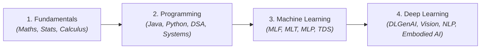

# 🧠 Machine Learning & Systems Knowledge Vault
### *From First-Principles Mathematical Foundations to Frontier Embodied Intelligence*

  <b>Architecting Production ML, Deterministic Hard Real-Time Systems, and Autonomous Robotics.</b> 
  <i>"If a system cannot be understood from its atomic bricks, verified in isolation, and assembled with zero-fail predictability, it is not engineering — it is fragility."</i>

---

## 🗺️ Master Curriculum & Knowledge Index

---

### 🏛️ Track 1: Mathematical & Scientific Fundamentals (`1. Fundamentals/`)
> *Rigorous mathematical derivation, formal proofs, and physical intuition over memorized formulas.*

| Module Code | Course / Domain Title | Focus & Core Invariants | Status |
| :--- | :--- | :--- | :--- |
| **`MATH-1`** | **Mathematics I** | Single-Variable Calculus, Limits, Series, Coordinate Geometry | 🟢 *Active* |
| **`MATH-2`** | **Mathematics II** | Linear Algebra (Matrices, Eigenvalues, SVD), Multivariable Calculus (Jacobians, Hessians) | 🟢 *Active* |
| **`STAT-1`** | **Statistics I** | Descriptive Statistics, Probability Axioms, Discrete & Continuous Distributions | 🔵 *Planned* |
| **`STAT-2`** | **Statistics II** | Inferential Statistics, Hypothesis Testing, Maximum Likelihood Estimation (MLE), Bayesian Inference | 🔵 *Planned* |
| **`CT`** | **Computational Thinking** | Algorithmic Problem Solving, Logic, Invariant Verification | 🟢 *Active* |
| **`PHYS`** | **Physics & Computation** | Quantum Simulation, Classical Dynamics, Dimensional Analysis | 🔵 *Planned* |

---

### 💻 Track 2: Core Programming & Software Engineering (`2.Programming/`)
> *Strict type contracts, zero data leakage, POSIX determinism, and high-performance algorithms.*

| Module Code | Domain Title | Core Stack & Key Topics | Status |
| :--- | :--- | :--- | :--- |
| **`JAVA`** | **Object-Oriented Architecture (Java)** | Abstraction, Interfaces, Polymorphism, JUC Multithreading, Custom Iterators, Capabilities | 🟢 *Complete (W1–12)* |
| **`PYTHON`** | **Python Systems & Vectorization** | Memory internals, CPython GIL, AsyncIO, Metaprogramming, NumPy vectorization | 🟢 *Active* |
| **`PDSA`** | **Data Structures & Algorithms** | ADTs, Trees, Graphs, Dynamic Programming, Amortized Complexity Analysis | 🔵 *Planned* |
| **`TOC`** | **Theory of Computation** | Automata, Regular Languages, Context-Free Grammars, Turing Machines, P vs NP | ⚪ *Upcoming* |
| **`SYSTEMS`** | **Low-Level C & OS Internals** | Memory-mapped I/O, POSIX Threads, Ring Buffers, Zero-Copy Shared Memory, udev | 🟢 *Active (Rose)* |

---

### 📊 Track 3: Machine Learning & Applied Data Science (`3.Machine Learning/`)
> *Loss landscape geometry, generalization bounds, and production data pipelines.*

| Module Code | Domain Title | Core Focus & Artifacts | Status |
| :--- | :--- | :--- | :--- |
| **`MLF`** | **Machine Learning Foundations** | Empirical Risk Minimization, Bias-Variance Trade-off, Convex Optimization | 🟢 *Active* |
| **`MLT`** | **Machine Learning Techniques** | Linear/Logistic Regression, Decision Trees, Random Forests, SVMs, Ensemble Methods | 🔵 *Planned* |
| **`MLP`** | **Machine Learning Practice** | Feature Engineering, Pipeline Auditing, Model Evaluation, Cross-Validation boundaries | 🔵 *Planned* |
| **`TDS`** | **Tools in Data Science** | NumPy, Pandas, Scikit-Learn, Feature Store Architecture, Distributed Data Wrangling | 🟢 *Active* |

---

### ⚡ Track 4: Deep Learning & Frontier AI (`4.Deep Learning/`)
> *Vector calculus backpropagation, transformer architectures, diffusion, and generative intelligence.*

| Module Code | Domain Title | Core Focus & Master Compendiums | Status |
| :--- | :--- | :--- | :--- |
| **`DL`** | **Deep Learning Core** | Backpropagation Derivations, Jacobian Vector Chain Rule, Activation Dynamics | 🟢 *Active* |
| **`DLP`** | **Deep Learning Practice** | PyTorch Workflows, Custom Autograd Functions, Mixed-Precision (FP16/BF16/FP8) | 🟢 *Active* |
| **`DLGenAI`** | **Generative AI & LLMs** | Self-Attention, Multi-Head Attention, Transformers, Diffusion, RAG, PEFT/LoRA Fine-tuning | 🟢 *Active* |
| **`DLCV`** | **Deep Learning for Computer Vision** | CNNs, Residual Networks, U-Net Segmentation, Vision Transformers (ViT) | 🔵 *Planned* |
| **`RL`** | **Reinforcement Learning** | Markov Decision Processes, Q-Learning, Policy Gradients, PPO, Sim-to-Real Control | ⚪ *Upcoming* |

---

## 📑 Content Placeholders & Quick Access

> [!TIP]
> Use these links as bookmarks. As you generate atomic master notes with `#gennotes`, plug the links directly into these categorized sections.

### 📐 1. Fundamentals
* [ ] [`MATH-1`] Single Variable Calculus & Optimization
* [ ] [`MATH-2`] Linear Algebra & Spectral Decompositions (Eigenvalues, SVD)
* [ ] [`MATH-2`] Vector Calculus & Gradient Fields
* [ ] [`STAT-1`] Probability Distributions & Joint Densities
* [ ] [`STAT-2`] Bayesian Inference & Maximum Likelihood

### ☕ 2. Programming & Systems
* [x] [`JAVA`] [Week 01: Intro, Types & Memory Layout](Programming/Java/week_1/01_introduction_to_java_and_programming_paradigms.md)
* [x] [`JAVA`] [Week 02: Syntax, Control Flow & I/O](Programming/Java/week_2/01_a_first_taste_of_java.md)
* [x] [`JAVA`] [Week 03: Inheritance, Dynamic Dispatch & Modifiers](Programming/Java/week_3/01_philosophy_of_object_oriented_programming.md)
* [x] [`JAVA`] [Week 04: Interfaces, Capability Security, Callbacks & Iterators](Programming/Java/week_4/Java_Week_4_Mastery_Notes.md)
* [x] [`JAVA`] [Week 05: Generics, Subtyping (PECS) & Reflection](Programming/Java/week_5/01_polymorphism_revisited.md)
* [x] [`JAVA`] [Week 06: Collections Framework & Maps](Programming/Java/week_6/01_the_benefits_of_indirection.md)
* [x] [`JAVA`] [Week 07: Exceptions, Packages & Structured Logging](Programming/Java/week_7/01_dealing_with_errors.md)
* [x] [`JAVA`] [Week 08: Lambdas, Higher-Order Functions & Stream Pipelines](Programming/Java/week_8/01_object_cloning.md)
* [x] [`JAVA`] [Week 09: Optionals, Stream Collectors & Serialization](Programming/Java/week_9/01_optional_type.md)
* [x] [`JAVA`] [Week 10: Concurrency Foundations & Monitor Abstraction](Programming/Java/week_10/01_concurrency_threads_and_processes.md)
* [x] [`JAVA`] [Week 11: Java Multithreading & Thread-Safe JUC Collections](Programming/Java/week_11/01_monitors_in_java.md)
* [x] [`JAVA`] [Week 12: Event-Driven Programming & Swing GUI Toolkit](Programming/Java/week_12/01_graphical_interfaces_and_event_driven_programming.md)
* [ ] [`PDSA`] Abstract Data Types & Cache-Conscious Memory Layout

### 📈 3. Machine Learning
* [ ] [`MLF`] Empirical Risk Minimization & Regularization
* [ ] [`MLT`] Linear Models, Support Vector Machines & Kernels
* [ ] [`TDS`] NumPy Array Internals & Stride Strides Manipulation

### 🧠 4. Deep Learning & Frontier AI
* [x] [`DL`] [The 4 Master Backpropagation Equations Demystified](Deep_Learning/Core_and_Derivations_DL/The_4_Master_Backpropagation_Equations_Demystified.md)
* [x] [`DL`] [Jacobian Matrices and Vector Chain Rule](Deep_Learning/Core_and_Derivations_DL/Jacobian_Matrices_and_Vector_Chain_Rule.md)
* [x] [`DL`] [Microscopic Mathematical Derivation of Gradients](Deep_Learning/Core_and_Derivations_DL/Microscopic_Mathematical_Derivation_From_3_Gradients_To_Matrix_Formulas.md)
* [x] [`DL`] [XOR Problem Mathematical Proof (Why Linear Models Fail)](Deep_Learning/Core_and_Derivations_DL/The_XOR_Problem_Mathematical_Proof_Why_Linear_Models_Fail.md)
* [x] [`DLP`] [Week 01 Mastery: ANN & PyTorch Fundamentals](Deep_Learning/Core_and_Derivations_DL/Week_01_Mastery_ANN_and_PyTorch.md)
* [x] [`DLP`] [Week 02 Mastery: MLP, Backprop & Production PyTorch](Deep_Learning/Core_and_Derivations_DL/Week_02_Mastery_MLP_Backprop_and_Production_PyTorch.md)
* [x] [`DLGenAI`] [Andrew Ng AI Engineering Skills Map](Deep_Learning/Generative_AI_and_Frontier_DLGenAI/Andrew_Ng_AI_Engineering_Skills_Map.md)
* [ ] [`DLGenAI`] Transformer Multi-Head Attention & KV Cache Architecture
* [ ] [`DLGenAI`] Diffusion Models & Denoising Score Matching
* [ ] [`DLCV`] Convolutional Neural Networks & Feature Extraction

---

  Built with ❤️ using <a href="https://squidfunk.github.io/mkdocs-material/">Material for MkDocs</a> | Powered by <b>The Institute Cognitive Protocol</b>

