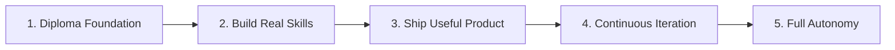

# 🏛️ Polymathic Knowledge Base & Autonomous Builder Blueprint

> **"You are a creator, not a slave."**  
> A unified taxonomy for polymathic mastery, product engineering, and self-directed autonomy.

---

## 🧭 Table of Contents

- [Part I: Master Knowledge Taxonomy](#part-i-master-knowledge-taxonomy)
  - [1. Business & Commerce](#1-business--commerce)
  - [2. Formal Sciences](#2-formal-sciences)
  - [3. Physical & Natural Sciences](#3-physical--natural-sciences)
  - [4. Engineering & Applied Technology](#4-engineering--applied-technology)
  - [5. Humanities & Arts](#5-humanities--arts)
  - [6. Interdisciplinary & Applied Frontiers](#6-interdisciplinary--applied-frontiers)
- [Part II: The Builder's Roadmap](#part-ii-the-builders-roadmap)
  - [Execution Milestones](#execution-milestones)
  - [Creator Manifesto](#creator-manifesto)
- [Part III: Runway & Financial Planning](#part-iii-runway--financial-planning)
  - [Annual Runway Targets](#1-annual-runway-targets--savings-projections)
  - [Monthly Lean Burn Rate](#2-monthly-burn-rate-zero-based-budget)
- [Part IV: Directory Structure](#part-iv-notes-directory-tree)

---

## 🏛️ Part I: Master Knowledge Taxonomy

### 1. Business & Commerce

#### 🏢 Management & Strategy
- **Organizational Leadership** — Organizational culture, team dynamics, and executive decision-making.
- **Strategic Planning** — Competitive advantage, market positioning, and long-term vision.
- **Operations & Logistics** — Systems efficiency, process optimization, and supply chains.

#### 📈 Finance & Accounting
- **Financial Accounting** — Financial statements, ledger mechanics, and reporting standards.
- **Corporate Finance** — Capital budgeting, valuation, and capital allocation.
- **Capital Markets** — Asset classes, equities, fixed income, liquidity, and market microstructure.

#### 🌐 Economics & Commerce
- **Micro & Macroeconomics** — Supply-demand mechanics, fiscal/monetary policies, and market equilibria.
- **Global Trade & Commercial Law** — International contracts, trade policy, and legal structures.

#### 🚀 Marketing & Growth
- **Market Analysis** — Customer segmentation, TAM/SAM/SOM, and competitive intelligence.
- **Brand Strategy & Digital Growth** — Positioning, conversion funnels, CAC/LTV dynamics, and distribution.

#### 💡 Entrepreneurship
- **Product Management** — Opportunity discovery, user experience, roadmapping, and product-market fit.
- **Venture Capital & Startups** — Fundraising dynamics, equity structures, cap tables, and early-stage scaling.

---

### 2. Formal Sciences

#### 📐 Mathematics
- **Pure Mathematics** — Abstract Algebra, Real & Complex Analysis, Geometry, and Topology.
- **Applied Mathematics** — Linear Algebra, Multivariable Calculus, Probability & Mathematical Statistics.

#### 💻 Computer Science
- **Foundations** — Data Structures, Algorithms, Complexity Theory, and Automata.
- **Systems & Engineering** — Operating Systems, Computer Architecture, Networking, and Distributed Systems.
- **Artificial Intelligence** — Machine Learning, Deep Learning, Generative Models, and Autonomous Agents.

---

### 3. Physical & Natural Sciences

#### ⚛️ Physics
- **Classical Mechanics** — Newtonian dynamics, Lagrangian & Hamiltonian mechanics, and fluid dynamics.
- **Thermodynamics & Statistical Mechanics** — Heat engines, entropy, state variables, and microstates.
- **Electromagnetism & Optics** — Maxwell’s equations, wave propagation, and optical phenomena.
- **Modern & Quantum Physics** — Wave-particle duality, Schrödinger equation, and atomic structure.

#### 🧪 Chemistry
- **Physical Chemistry** — Chemical thermodynamics, kinetics, and quantum chemistry.
- **Organic Chemistry** — Reaction mechanisms, functional groups, and molecular synthesis.
- **Inorganic Chemistry** — Coordination complexes, periodic trends, and crystal field theory.
- **Analytical Chemistry** — Spectroscopy, chromatography, and quantitative measurement.

#### 🧬 Biology
- **Molecular & Cellular Biology** — Cell structures, metabolic pathways, and enzymatic regulation.
- **Genetics** — Mendelian genetics, DNA replication, transcription, and translation.
- **Physiology** — Organ systems, neurophysiology, and homeostasis.
- **Evolutionary Biology** — Population genetics, natural selection, and phylogenetics.

#### 🌍 Earth & Environmental Sciences
- **Physical Geography & Geology** — Plate tectonics, geomorphology, and Earth systems.
- **Ecology** — Biomes, ecosystem energy flows, and biodiversity.
- **Climate & Environmental Science** — Atmospheric dynamics, carbon cycles, and conservation science.

---

### 4. Engineering & Applied Technology

#### 🤖 Robotics & Autonomous Systems
- **Kinematics & Robot Dynamics** *(Mechanical)* — Forward/inverse kinematics, Jacobians, and rigid body dynamics.
- **Sensors, Actuators & Embedded Hardware** *(Electrical)* — Microcontrollers, motor drivers, LiDAR, and IMUs.
- **Robot Operating System (ROS / ROS 2)** *(Middleware)* — Node graph, messaging protocols, and packages.
- **Control Systems** *(Engineering)* — PID controllers, state-space representations, and optimal control.
- **Simultaneous Localization and Mapping — SLAM** *(Perception & Software)* — Visual/LiDAR SLAM, Kalman filters, and point clouds.
- **Bio-Robotics** *(Biomimetics)* — Bio-inspired kinematics, soft robotics, and neural interfaces.
- **Autonomous Vehicles** *(Integration)* — Sensor fusion, path planning, obstacle avoidance, and decision architectures.

---

### 5. Humanities & Arts

#### 📜 Philosophy & Moral Science
- **Ethics & Moral Philosophy** — Virtue ethics, deontology, utilitarianism, and moral foundations.
- **Classical Thinkers & Philosophical Traditions**:
  - *Eastern Traditions* — Taoism (Lao Tzu), Confucianism, Vedic and Buddhist philosophies.
  - *Greco-Roman Traditions* — Classical Greek thought (Socrates, Plato, Aristotle) and Stoicism (Marcus Aurelius, Seneca, Epictetus).
  - *Modern Thinkers & Epistemology* — Theory of knowledge, existentialism, and Enlightenment philosophy.

#### ✍️ Literature & Creative Arts
- **Literary Theory** — Critical frameworks, semiotics, structuralism, and narrative analysis.
- **World Literature** — Canonical masterworks across civilizations, cultures, and eras.
- **Poetry** — Metre, verse forms, lyrical traditions, and poetic imagery.
- **Prose** — Narrative fiction, essays, discourse, and expository prose.
- **Creative Writing** — Story craft, dialogue design, world-building, and stylistic voice.

---

### 6. Interdisciplinary & Applied Frontiers

| Frontier Discipline | Foundation Convergence | Primary Synthesis Focus |
| :--- | :--- | :--- |
| **Quantum Computing & Information** | Physics + Computer Science + Linear Algebra | Qubits, quantum gates, entanglement, and algorithmic speedups |
| **Computational Biology / Bioinformatics** | Biology + Computer Science | Genomic sequencing, protein folding (AlphaFold), and structural modeling |
| **Cognitive Science & Robotics** | Artificial Intelligence + Neuroscience + Mechanical Engineering | Embodied cognition, bio-inspired perception, and synthetic intelligence |

---

## 🚀 Part II: The Builder's Roadmap

### Execution Milestones



1. **Diploma Foundation**  
   Master the foundational core and complete formal academic credentials with high rigor.

2. **Develop Real ~~working~~ Building Skills**  
   Shift focus from passive consumption to hands-on engineering, software craft, and hardware fabrication.

3. **Build Your First Useful Product**  
   Architect, validate, and ship a real utility that solves genuine pain points for actual users.

4. **Continuous Iteration & Building**  
   Improvise, gather user feedback, iterate on the code and system design, and compound shipping velocity.

5. **Scale Forward & Never Look Back**  
   Achieve compounding leverage, financial independence, and unbroken creative momentum.

---

### 🛡️ Creator Manifesto

> [!IMPORTANT]
> ### The Sovereign Creator Mindset
> - **Never think about a job:** Reject the default wage-labor paradigm and the employee treadmill.
> - **You are a creator, not a slave:** Maintain total ownership of your time, focus, and equity. Solve real problems and let your products create your leverage.

---

## 💰 Part III: Runway & Financial Planning

### 1. Annual Runway Targets & Savings Projections

| Milestone Date | Accumulated / Projected | Minimum Target Required | Runway Status |
| :--- | :---: | :---: | :---: |
| **Till 31 Dec 2026** | **₹50,000** | ₹48,000 | 🟢 **Target Achieved** *(+₹2,000 Buffer)* |
| **Till 31 Dec 2027** | *TBD* | ₹48,000 | 🟡 **Planned Runway Target** |
| **Till 31 Dec 2028** | *TBD* | ₹48,000 | 🟡 **Planned Runway Target** |

> [!TIP]
> **Runway Multiplier:** At a bare-bones monthly burn rate of **₹3,300**, an annual reserve of **₹48,000** provides **14.5 months** of uninterrupted builder runway.

---

### 2. Monthly Burn Rate (Zero-Based Lean Budget)

| Expense Category | Monthly Allocation (INR) | Allocation Class | Optimization Strategy |
| :--- | :---: | :---: | :--- |
| **Room Rent** | ₹0 | Fixed | Fully leveraged zero-cost lodging |
| **Food & Groceries** | ₹3,000 | Essential | High-efficiency clean nutrition & meal prep |
| **Internet & Connectivity** | ₹300 | Essential | High-speed link for research, updates, & shipping |
| **AI Tools & Compute** | ₹0 | Variable | Open-source weights, free tiers & local inference |
| **Electricity & Utilities** | ₹0 | Fixed | Zero-cost utility allocation |
| **Total Baseline Monthly Burn** | **₹3,300 / mo** | — | **Annualized Baseline: ₹39,600 / yr** |

---

*Last Updated: 2026-09-11 | Autonomous Builder Blueprint*

---

## 📁 Part IV: Notes Directory Tree

<!-- NOTES_TREE_START -->
```text
.
├── README.md
└── scripts
    └── update_tree.py

2 directories, 2 files
```
<!-- NOTES_TREE_END -->
