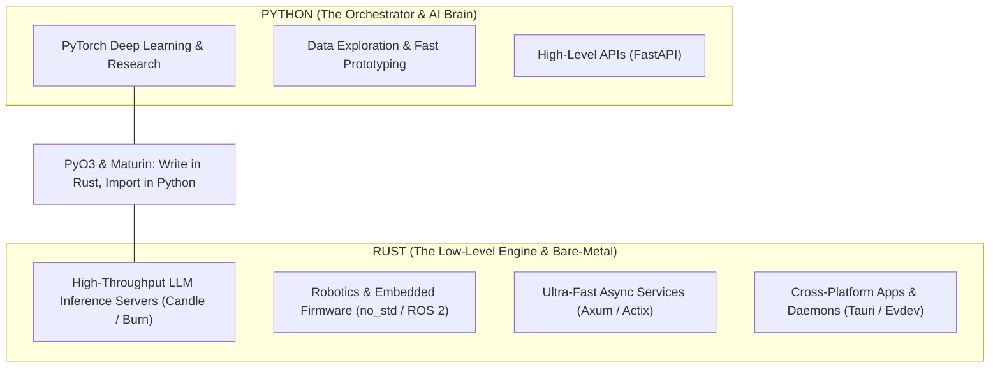

# Rust Engineering Master Guide & Learning Roadmap

---

## 1. The Canonical, Trustable Learning Sources


> Follow Jon Gjengist youtube channel

### 📚 Official & Free Core Stack (Start Here)
* **[The Rust Programming Language ("The Book")](https://doc.rust-lang.org/book/):**
  * *Authors:* Steve Klabnik & Carol Nichols.
  * *Method:* Read Chapters 1 through 10 first. Do not skip ownership and lifetimes.
* **[Rustlings Interactive Exercises](https://github.com/rust-lang/rustlings):**
  * Official hands-on compiler puzzle suite.
  * Fix broken code snippets in your terminal until all 100+ compiler tests pass.
* **[Rust by Example](https://doc.rust-lang.org/rust-by-example/):**
  * Direct, runnable code snippets showing idiomatic patterns for every standard library module.

---

### 📖 The Best Advanced Books (For Systems Architecture)
* **[Programming Rust (2nd Edition - O'Reilly)](https://www.oreilly.com/library/view/programming-rust-2nd/9781492052586/):**
  * *Authors:* Jim Blandy, Jason Orendorff, Leonora Tindall.
  * The definitive deep-dive technical book on memory layouts, concurrency, systems programming, and async.
* **[Rust for Rustaceans](https://nostarch.com/rust-rustaceans):**
  * *Author:* Jon Gjengset.
  * For taking intermediate developers to senior/architect level (covering unsafe Rust, macro mechanics, and API design).
* **[Command-Line Rust](https://www.oreilly.com/library/view/command-line-rust/9781098109424/):**
  * *Author:* Ken Youens-Clark.
  * Practical, test-driven guide building real UNIX utilities (`cat`, `head`, `find`, `grep`, `wc`) from scratch.

---

### 🎥 High-Density Video Deep Dives
* **[Jon Gjengset (YouTube - Crust of Rust Series)](https://www.youtube.com/@jonhoo):** Multi-hour deep architectural breakdowns of standard library internals, atomics, and channels.
* **[No Boilerplate (YouTube)](https://www.youtube.com/@NoBoilerplate):** Fast, 10-minute conceptual overviews explaining the philosophy of Rust.

---

## 2. The 4-Stage Learning Methodology

| Stage | Focus Areas | Primary Resource | Milestone Project |
| :---: | :--- | :--- | :--- |
| **Stage 1<br>(Weeks 1–2)** | • Stack vs. Heap<br>• Ownership & Borrowing (`&`, `&mut`)<br>• Structs & Enums<br>• `Option` & `Result` | *The Book* (Ch 1–9)<br>+ *Rustlings* | CLI Number Guessing Game & CSV File Parser |
| **Stage 2<br>(Weeks 3–4)** | • Generics & Traits<br>• Lifetimes (`'a`)<br>• Iterators & Closures<br>• Smart Pointers (`Box`, `Rc`, `Arc`, `Mutex`) | *The Book* (Ch 10–15)<br>+ *Rust by Example* | Custom In-Memory Key-Value Store |
| **Stage 3<br>(Weeks 5–8)** | • Multi-Threading & Channels<br>• UNIX System Calls (`nix`, sockets)<br>• Error Handling (`thiserror`, `anyhow`)<br>• Cargo Workspaces & Packaging | *Programming Rust*<br>+ *Command-Line Rust* | Multi-threaded Port Scanner / Daemon (like Pomodoro) |
| **Stage 4<br>(Weeks 9–12+)** | • Async with **Tokio**<br>• Web APIs (**Axum**)<br>• Python Extensions via **PyO3**<br>• Embedded / Robotics (`no_std`) | *Tokio Tutorial*<br>+ *PyO3 User Guide* | High-Performance Python Tensor Module / MicroVM |

---

## 3. How to Practice (The Project Ladder)

Do not just read passive theory; practice through **Test-Driven Project Construction**:

```
Level 1: Build `minigrep` (Search string in files using streaming buffers)
   ↓
Level 2: Build `mini-cat` & `mini-wc` (Measure byte offsets and line counts)
   ↓
Level 3: Build a Multi-threaded TCP Chat Server (Using `std::net` + `std::sync::mpsc`)
   ↓
Level 4: Build a High-Speed Python Extension (Write an algorithm in Rust, call it from Python with PyO3)
   ↓
Level 5: Build an Async HTTP Microservice (Using `tokio` + `axum` with SQLx database pooling)
```

* **Interactive Daily Platform:** Complete the free **[Exercism Rust Track](https://exercism.org/tracks/rust)** (provides automated unit tests and free code reviews from human mentors).

---

## 4. Universal Rules & Mindset for Rust Development

### 🧠 Rule 1: Never Fight the Borrow Checker — Understand Its Proof
* When the compiler rejects your code with a borrow error, **it is not being annoying—it is mathematically proving that your design has a potential memory bug or race condition**.
* *Rookie Trap:* Trying to throw `Rc<RefCell<T>>` everywhere to silence the compiler.
* *Senior Mindset:* Restructure your data flow so that data has a **clear single owner** and flows in one direction.

### 📦 Rule 2: "Make Illegal States Unrepresentable" (Use Enums)
Never use loose boolean flags like `is_loading = true`, `has_error = false`. Use algebraic **Enums**:

```rust
// ❌ Fragile / Bug-Prone (Allows invalid states like loading=true AND error=true)
struct WebResponse {
    is_loading: bool,
    data: Option<String>,
    error_msg: Option<String>,
}

// ✅ Idiomatic Rust (Impossible to have an invalid state)
enum WebResponse {
    Loading,
    Success(String),
    Failure(String),
}
```

### 🚫 Rule 3: Zero `.unwrap()` in Production Code
* `.unwrap()` and `.expect()` cause the thread to panic and crash if an error occurs.
* In libraries, background daemons, and enterprise code, **always bubble up errors using `Result<T, E>` and the `?` operator**.
* Only use `.unwrap()` in quick scratch scripts or unit tests.

### ⚡ Rule 4: Prefer Iterators over Manual Index Loops
* In C/Python: `for i in range(len(arr)): ...`
* In Rust: `arr.iter().map(...).filter(...)`
* **Why?** Rust's iterators are **Zero-Cost Abstractions**. The compiler removes bounds-checking and automatically vectorizes (SIMD) iterator chains, making them strictly **faster and safer** than manual indexing.

### 🛡️ Rule 5: Let `cargo clippy` Be Your Free Senior Code Reviewer
Before you commit any Rust code, always run:
```bash
cargo check
cargo clippy -- -D warnings
cargo fmt
```
`clippy` analyzes your code and gives you detailed, pedagogical advice on how to rewrite your functions to be more efficient and idiomatic.

---

## 5. The Ultimate Duo: Python + Rust Architecture



* **Python** gives you maximum speed of thought and the entire global AI/ML ecosystem.
* **Rust** gives you bare-metal speed, memory safety, hardware control, and enterprise resilience.
