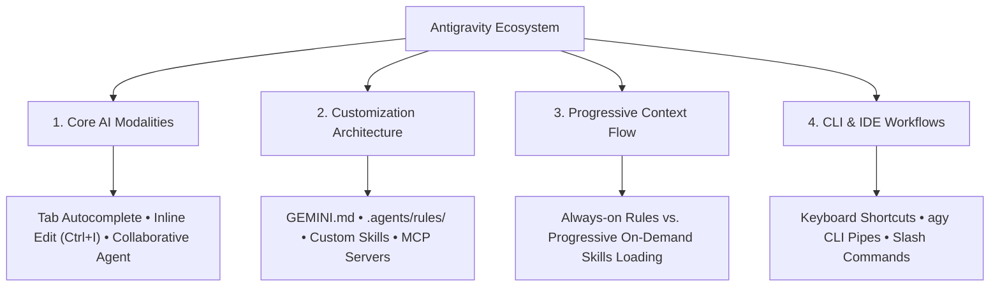
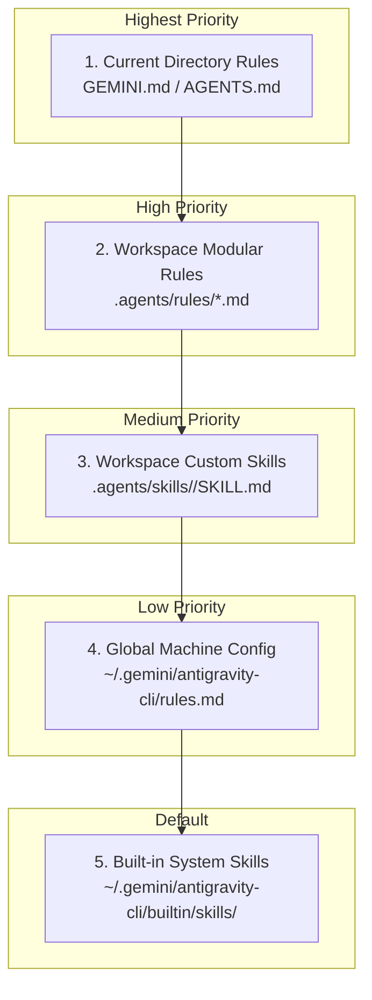

# Comprehensive Guide to Google Antigravity (AGY)

Antigravity is an AI-first agentic pair programming environment and command-line interface (`agy`) designed by Google DeepMind. It bridges direct code intelligence with autonomous agent workflows, terminal orchestration, and granular project customization.

---



---

## 1. Core AI Interaction Modalities

Antigravity operates across three distinct interaction tiers based on the task complexity:

### A. Passive: Antigravity Tab (Autocomplete & Supercomplete)
* **Intent Prediction:** Anticipates code, docstrings, imports, and navigation directly at your cursor with grey ghost text.
* **Supercomplete:** Suggests multi-line code diffs (including refactorings and deletions) in floating inline windows.
* **Keyboard Controls:**
  * <kbd>Tab</kbd> → Accept full suggestion.
  * <kbd>Ctrl</kbd> + <kbd>→</kbd> → Accept suggestion word-by-word.
  * <kbd>Esc</kbd> → Dismiss suggestion.
  * **Tab-to-Import:** Automatically adds missing imports at the top of the file when a new module or library is referenced.

### B. Instructive: Inline Command (<kbd>Ctrl</kbd> + <kbd>I</kbd>)
* **Targeted Refactoring:** Highlight any block of code, comments, or documentation and press <kbd>Ctrl</kbd> + <kbd>I</kbd> *(or `Cmd + I` on macOS)*.
* **Inline Diff Canvas:** Generates a real-time red/green visual diff directly in your editor.
* **Accept / Reject:** Press <kbd>Ctrl</kbd> + <kbd>Enter</kbd> to accept changes in place.
* **Diagnostic Quick-Fix (<kbd>Ctrl</kbd> + <kbd>.</kbd>):** Place your cursor over any compiler/linter error and click *"Fix with Antigravity"* to resolve syntax errors or broken types automatically.

### C. Collaborative: Agent Mode & Sidebar Chat
* **Autonomous Pairing:** Reads and writes project files, executes shell commands, runs test suites, manages background tasks, and performs multi-step codebase refactoring.
* **Pair Programming Console:** Accessed via the sidebar or by pressing <kbd>Ctrl</kbd> + <kbd>L</kbd>.

---

## 2. Customization System & File Hierarchy

You have full control over the agent's persona, constraints, workflows, and tool integrations through a structured file hierarchy.



### A. Workspace Project Rules (`GEMINI.md` / `AGENTS.md`)
* **Primary Scope:** Placed at the root of your workspace (`/home/dev/SE/GEMINI.md`) or in any subdirectory.
* **Implicitly Always On:** These files do not require frontmatter tags; they are **automatically loaded on 100% of conversation turns**.
* **Cascading Inheritance:** Rules placed in subdirectories (e.g., `Devendra/GEMINI.md`) automatically inherit all parent rules and add folder-specific guidelines.
* **Best Use Cases:**
  * Strict constraints (e.g. *"Never delete personal data"*, *"Enforce non-destructive package freeze"*).
  * Project coding standards and architectural patterns.
  * Custom safety triggers (e.g. `#read-only`, `#audit`, `#dry-run`).

### B. Modular Workspace Rules (`.agents/rules/*.md`)
For granular, file-specific, or modular guidelines:
* **Path:** `.agents/rules/<rule-name>.md`
* **Trigger Modes (YAML Frontmatter):**
  ```yaml
  ---
  trigger: always_on        # Loaded unconditionally every turn
  # OR
  trigger: model_decision   # Loaded only when relevant to the user request
  description: "Enforce strict TypeScript types and API error handling"
  ---
  ```

### C. Custom Workspace Skills (`.agents/skills/<name>/SKILL.md`)
Skills teach the agent specialized multi-step procedures, runbooks, and domain workflows:
* **Path:** `.agents/skills/<skill_name>/SKILL.md`
* **Structure:**
  ```markdown
  ---
  name: device-debloat-runbook
  description: Step-by-step procedure to inspect and debloat Android devices safely.
  ---

  # Device Debloat Runbook
  1. Check connected ADB devices via `adb devices -l`.
  2. Inspect memory and NAND swap state.
  3. Freeze non-essential packages using `pm disable-user --user 0`.
  ```
* **Best Use Cases:**
  * Database migration runbooks.
  * Release deployment checklists.
  * Device optimization and diagnostic scripts.

### D. Tool Integrations via Model Context Protocol (`mcp_config.json`)
* **Path:** `mcp_config.json` or `.agents/mcp_config.json`
* Connects the agent to custom local Python scripts, PostgreSQL databases, Docker daemons, or third-party APIs using the open Model Context Protocol.

### E. Lifecycle Hooks (`hooks.json`)
* **Path:** `hooks.json` or `.agents/hooks.json`
* Runs pre-execution commands, linters, or security checks before and after specific tool executions.

---

## 3. Context Flow & Progressive Disclosure

To prevent context bloat and keep response latency minimal, Antigravity uses **Progressive Disclosure**:

| Component | Loading Behavior | Memory / Token Impact |
| :--- | :--- | :--- |
| **`GEMINI.md` Rules** | **Always Injected** on every prompt | Minimal token footprint (~200–500 tokens) |
| **Available Skills** | **Index Only** (Names & 1-sentence summaries) | Tiny (~50 tokens) |
| **Full Skill Documentation** | **Loaded On-Demand Only** when activated | Zero background token waste |
| **Project Source Code** | **Read On-Demand** via read tools (`view_file`) | Clean context window |
| **Session Transcripts** | **Persisted to Disk** in JSONL format | Survives VS Code restarts |

---

## 4. Antigravity CLI (`agy`) Terminal Workflows

You can interact with Antigravity directly from your terminal:

```bash
# 1. Direct instructions & code generation
agy "Review and fix typos in Devendra/profile.md"

# 2. Piping shell output directly to the agent
cat error.log | agy "Explain this stack trace and suggest a patch"

# 3. Interactive pair-programming console
agy
```

### Slash Commands Cheatsheet
Slash commands automate complex pair-programming workflows:
* **`/plan`** — Formulate a detailed step-by-step plan before making file edits.
* **`/goal`** — Execute long-running autonomous tasks without stopping until completion.
* **`/schedule`** — Set recurring cron tasks or one-shot background timers.
* **`/grill-me`** — Run an interactive design interview to resolve architecture decisions.
* **`/learn`** — Persist a newly learned workflow or correction for future conversations.

---

## 5. Local Reference Links & Runbooks

All built-in skill runbooks and reference guides are accessible directly in the system configuration:

### Customization & Rules System
* 📘 **Customization System Guide:** `~/.gemini/antigravity-cli/builtin/skills/agy-customizations/SKILL.md`
* 📜 **Rules & Triggers Architecture:** `~/.gemini/antigravity-cli/builtin/skills/agy-customizations/docs/rules.md`
* 🧠 **Skills Loading & Progressive Disclosure:** `~/.gemini/antigravity-cli/builtin/skills/agy-customizations/docs/skills.md`
* 🔌 **MCP Server Configuration Guide:** `~/.gemini/antigravity-cli/builtin/skills/agy-customizations/docs/mcp_servers.md`
* 🪝 **Lifecycle Hooks Reference:** `~/.gemini/antigravity-cli/builtin/skills/agy-customizations/docs/hooks.md`

### Comprehensive Tooling Manuals
* 🚀 **Antigravity Handbook (Main):** `~/.gemini/antigravity-cli/builtin/skills/antigravity_guide/SKILL.md`
* 💻 **CLI Reference Guide:** `~/.gemini/antigravity-cli/builtin/skills/antigravity_guide/references/cli.md`
* 🛠️ **IDE Reference & Keybindings:** `~/.gemini/antigravity-cli/builtin/skills/antigravity_guide/references/ide.md`
* 🐍 **Python SDK Documentation:** `~/.gemini/antigravity-cli/builtin/skills/antigravity_guide/references/sdk.md`
