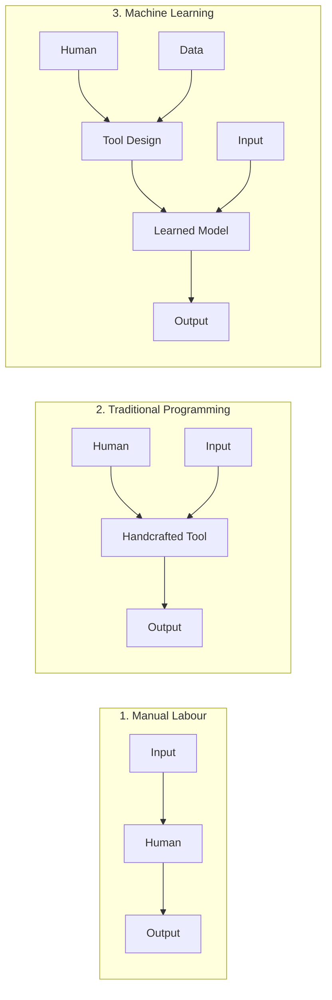
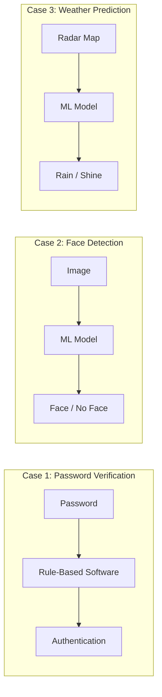
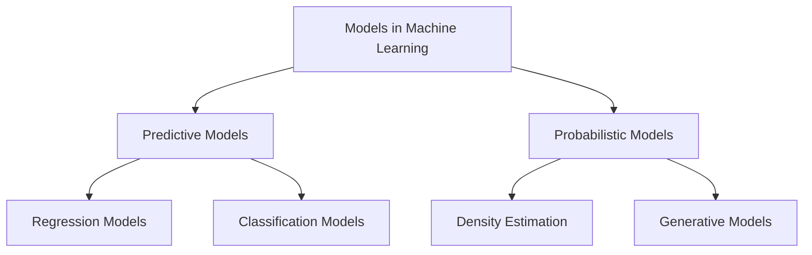
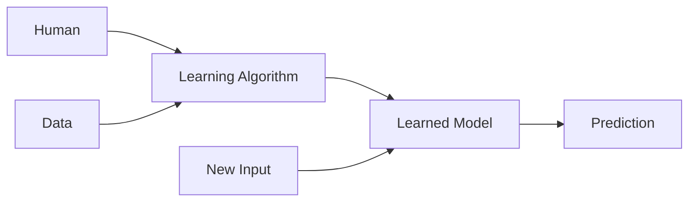
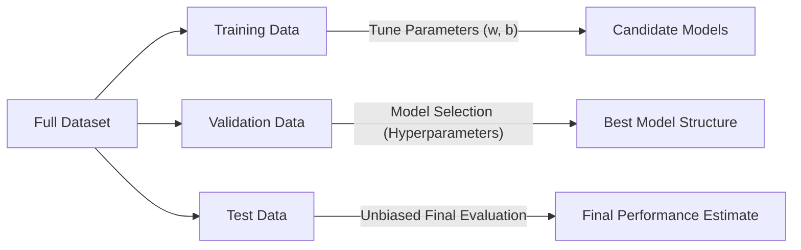
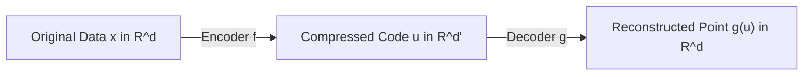
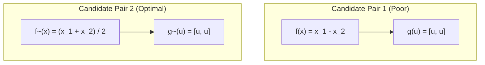
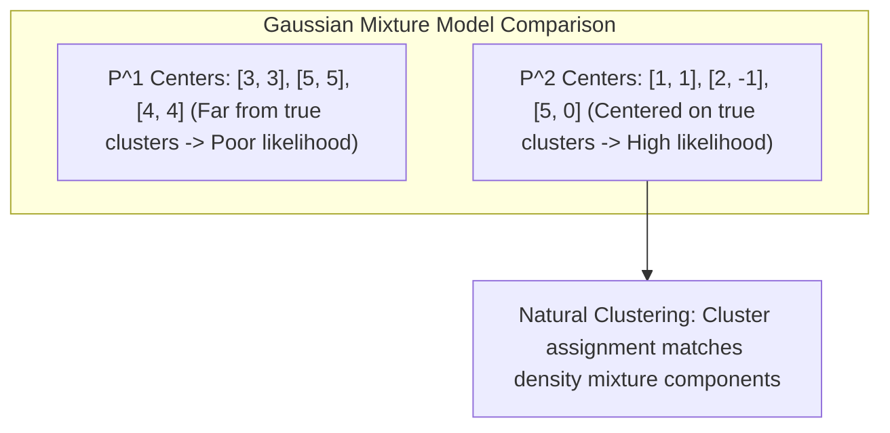

# Machine Learning Foundations: Introduction, Terminology and Setup

---

## 1. What is Machine Learning?

### Definition
**Machine Learning (ML)** is the study of computer algorithms that **improve automatically through experience and by the use of data**.

### Daily Life Touchpoints
Machine learning is embedded in everyday consumer applications:
* **Weather Prediction:** Interpreting atmospheric sensor readings and radar imagery to forecast precipitation and temperature.
* **Face Detection:** Real-time visual bounding boxes on smartphone camera viewfinders and image galleries.

---

## 2. Task Hierarchy & Paradigm Comparison

Historically, computational and physical tasks have been addressed via three distinct paradigms:

### The Three Paradigms:
1. **Manual Labour:**  
   $$\text{Input} \longrightarrow \text{Human} \longrightarrow \text{Output}$$  
   A human directly processes the input and produces the output.
2. **Traditional Programming (Rule-Based):**  
   $$\text{Human} \longrightarrow \text{Tool Design} \implies \text{Input} \longrightarrow \text{Software Tool} \longrightarrow \text{Output}$$  
   A human programmer articulates explicit deterministic rules in code to create a tool that processes inputs.
3. **Machine Learning:**  
   $$(\text{Human} + \text{Data}) \longrightarrow \text{Tool Design (Learning Algorithm)} \implies \text{Input} \longrightarrow \text{Model} \longrightarrow \text{Output}$$  
   Instead of writing rules directly, humans design a learning algorithm which, paired with large datasets, produces the predictive model.

---

## 3. Why and When Machine Learning?

Machine Learning is not universally necessary. It is employed specifically when traditional approaches fail and requisite data conditions are satisfied.

### When Programming / Human Labour Fails
1. **Scale, Speed, & Cost of Human Labour:**  
   Human labor cannot scale to handle millions of transactions per second cost-effectively.
2. **Inability to Express Rules Using Language:**  
   Humans perform certain tasks intuitively (e.g., recognizing human faces, understanding speech), but cannot formally verbalize or code the exact underlying pixel-level or acoustic rules.
3. **Unknown Transformation Rules:**  
   Neither humans nor domain experts know the exact governing analytical formula mapping input to output (e.g., long-range weather systems).

### Preconditions for Machine Learning to Succeed
1. **Abundant Example Data:** A sufficiently large collection of representative input-output pairs or observations must exist.
2. **Structural Idea on the Rules:** We must have some structural or hypothesis-level concept of the problem (e.g., selecting a suitable model class or parameterized function family).

---

## 4. Task-by-Task Case Studies

| Task | Manual Labour Analysis | Traditional Programming Analysis | Machine Learning Verdict |
| :--- | :--- | :--- | :--- |
| **Password Verification** | **Problem:** Scale — Impractical for humans to manually verify millions of login requests. | **Feasibility:** Perfect. Rules (`hash(input) == stored_hash`) are exact, deterministic, and trivial to code. | **ML Not Required:** Traditional software solves this with 100% precision. |
| **Face Detection / Tagging** | **Problem:** Scale — Impractical for humans to tag faces across billions of online photos. | **Problem:** Expressing face vs. no-face rules in code is practically impossible. | **ML Required & Succeeds:** Massive image datasets are available; algorithms learn visual feature representations. |
| **Weather Prediction** | **Problem:** Information overload — Humans cannot process complex radar maps and global atmospheric telemetry in real time. | **Problem:** Scientists do not know the complete deterministic rules transforming radar maps into exact precipitation forecasts. | **ML Required & Succeeds:** Decades of meteorological telemetry provide ample data to train predictive models. |

---

## 5. The Wonders of Machine Learning (Applications)

* **Inbox (Spam Filtering):**
  * Incoming emails pass through an automated classifier separating legitimate correspondence into the `Inbox` and malicious/unwanted email into the `Spam Folder`.
* **Shopping Cart (Recommender Systems):**
  * E-commerce recommendation modules:
    * *"Frequently Bought Together"* (bundle suggestions)
    * *"Customers Who Bought This Item Also Bought"* (collaborative filtering over purchase histories)
* **Smart Assistants:**
  * Voice-activated hardware agents (e.g., Amazon Echo/Alexa, Apple Siri) leveraging speech recognition and natural language processing.
* **Robot AIs:**
  * Autonomous navigation, perception, and obstacle avoidance in extraterrestrial exploration rovers (e.g., Mars Rovers).
* **Games:**
  * AI systems mastering highly complex search spaces.
  * *Landmark Milestone:* **AlphaGo** defeating world champion Lee Sedol in the game of Go (covered globally by news outlets such as BBC News).
* **Marketing:**
  * Multi-platform targeted advertising, behavioral audience segmentation, and personalized customer reach across digital channels.

---

## 6. Data, Models, and Learning Algorithms

### What is Data?
* **Data** is a collection of vectors:  
  $$\mathcal{D} = \{\mathbf{x}^1, \mathbf{x}^2, \dots, \mathbf{x}^n\}$$
* **Metadata** is contextual information explaining the data attributes (features and targets).

#### Running Housing Dataset Example
Consider a dataset of 6 properties:

| Observation | Rooms ($x_1$) | Area in 100 sq.ft ($x_2$) | Distance to Metro in km ($x_3$) | Price in 10 Lakhs ($y$) |
| :---: | :---: | :---: | :---: | :---: |
| **House 1** | $3$ | $9$ | $1.9$ | $5.0$ |
| **House 2** | $2$ | $7$ | $2.1$ | $3.2$ |
| **House 3** | $4$ | $12$ | $2.8$ | $6.6$ |
| **House 4** | $5$ | $16$ | $0.9$ | $9.8$ |
| **House 5** | $5$ | $15$ | $3.1$ | $8.5$ |
| **House 6** | $4$ | $11$ | $1.6$ | $6.9$ |

* **Metadata:** $(\text{\# rooms}, \text{Area in 100 sq.ft}, \text{Distance to metro in km}, \text{Price in 10 lakhs})$.

---

### What is a Model?
A **model** is a mathematical simplification of reality.

#### Classical Scientific Models:
* **The Ideal Gas Model:** $PV = nRT$
* **Inverse Square Law:** Newton’s law of universal gravitational attraction ($F = G \frac{m_1 m_2}{r^2}$)
* **Moore’s Law:** Empirical observation that semiconductor transistor count doubles roughly every two years
* **Cobb–Douglas Model:** Production function in economics ($Y = A L^\alpha K^\beta$)

> [!NOTE] **George Box's Aphorism**
> *"All models are wrong, but some are useful."*

---

### Types of Models in Machine Learning

#### 1. Predictive Models
Map observed input features directly to a target output value:
* **Regression Model:** Target output is continuous.
  * *Example:* Predict house price from area and distance to metro.
  * *Hypothesis:* $\text{Price} = 0.5 \times \text{Area} - \text{Distance}$
* **Classification Model:** Target output is categorical / discrete.
  * *Example:* Determine whether a house is close ($< 2\text{ km}$) to a metro station based on price and rooms.
  * *Hypothesis:*
    $$\text{Answer} = \begin{cases} \text{Close}, & \text{if } 2 \times \text{Rooms} - \text{Price} < 1 \\ \text{Far}, & \text{otherwise} \end{cases}$$

#### 2. Probabilistic Models
Estimate the underlying probability distribution over possible events:
* *Example 1:* What is the probability that a randomly chosen individual is located at GPS coordinates $(25^\circ\text{N}, 30^\circ\text{E})$?
* *Example 2:* What is the probability that a given tweet was generated by Mr. Chopra?

---

### Learning Algorithms
A **Learning Algorithm** defines a functional mapping from Data to Models:
$$\text{Learning Algorithm}: \text{Data} \longrightarrow \text{Model}$$

1. A human defines a **model family** sharing the same functional structure but parameterized by tunable parameters $\mathbf{w}$ (weights) and $b$ (bias).
   $$\text{Price} = a \times (\text{Area}) + b \times (\text{\# Rooms}) + c \times (\text{Distance to Metro})$$
   $$\text{Parameters: } a, b, c$$
2. The learning algorithm ingests the training data to calculate the **"best"** set of parameter values that optimizes a designated objective (loss function).

---

## 7. Mathematical Notation Reference

* $\mathbb{R}$: Set of real numbers.
* $\mathbb{R}_+$: Set of non-negative real numbers ($\{x \in \mathbb{R} \mid x \ge 0\}$).
* $\mathbb{R}^d$: $d$-dimensional Euclidean space (column vectors of $d$ real numbers).
  $$\mathbf{x} = \begin{bmatrix} x_1 \\ x_2 \\ \vdots \\ x_d \end{bmatrix} \in \mathbb{R}^d$$
* $\mathbf{x}$: A vector.
* $x_j$: The $j$-th coordinate (component) of vector $\mathbf{x}$.
  $$\text{If } \mathbf{x} = \begin{bmatrix} 1 \\ 2 \\ 7 \end{bmatrix} \in \mathbb{R}^3 \implies x_3 = 7$$
* $\|\mathbf{x}\|$: Euclidean norm (length) of vector $\mathbf{x}$.
  $$\|\mathbf{x}\|^2 = \sum_{j=1}^d x_j^2 = x_1^2 + x_2^2 + \dots + x_d^2$$
* $\mathbf{x}^1, \mathbf{x}^2, \dots, \mathbf{x}^n$: A collection of $n$ sample vectors (superscripts index data points).
  $$\mathbf{x}^1 = \begin{bmatrix} 1 \\ 2 \\ 3 \end{bmatrix}, \quad \mathbf{x}^2 = \begin{bmatrix} 7 \\ 8 \\ 9 \end{bmatrix}$$
* $x_j^i$: The $j$-th coordinate of the $i$-th vector in the sample set.
  $$\text{From above: } x_2^2 = 8$$
* $(x_1)^2$: The scalar square of the first coordinate of vector $\mathbf{x}$.
* $\mathbf{1}(\cdot)$: Indicator function:
  $$\mathbf{1}(\text{condition}) = \begin{cases} 1, & \text{if condition is True} \\ 0, & \text{if condition is False} \end{cases}$$
  $$\mathbf{1}(2 \text{ is even}) = 1, \quad \mathbf{1}(2 \text{ is odd}) = 0$$

---

## 8. Supervised Learning: Regression

### Formulation
* **Supervised Learning Concept:** Supervised learning can be viewed as multidimensional curve-fitting.
* **Given Training Data:**
  $$\mathcal{D} = \{(\mathbf{x}^1, y^1), (\mathbf{x}^2, y^2), \dots, (\mathbf{x}^n, y^n)\}$$
  where $\mathbf{x}^i \in \mathbb{R}^d$ and target label $y^i \in \mathbb{R}$.
* **Goal:** Discover a model function $f: \mathbb{R}^d \to \mathbb{R}$ such that $f(\mathbf{x}^i)$ is as close as possible to $y^i$ for all $i$.

### Squared Loss (Mean Squared Error)
The quality of a candidate model $f$ is quantified using the **squared loss**:
$$\text{Loss}[f] = \frac{1}{n} \sum_{i=1}^n \left(f(\mathbf{x}^i) - y^i\right)^2$$

### Linear Parameterisation
A standard linear model expresses predictions as an affine transformation:
$$f(\mathbf{x}) = \mathbf{w}^\top \mathbf{x} + b = \sum_{j=1}^d w_j x_j + b$$
For the housing problem:
$$f(\mathbf{x}) = w_1 (\text{\# rooms}) + w_2 (\text{area}) + w_3 (\text{distance}) + b$$

---

### Worked Numerical Examples in Regression

#### Example 1: One-Dimensional ($d=1, n=5$)
Consider 5 observations with a single feature $x$:

| Observation $i$ | $x^i$ | Ground Truth $y^i$ | Candidate Model $f(x) = 2x_1$ | Candidate Model $g(x) = x_1 + 3$ |
| :---: | :---: | :---: | :---: | :---: |
| 1 | $[1]$ | $2.1$ | $2.0$ | $4.0$ |
| 2 | $[2]$ | $3.9$ | $4.0$ | $5.0$ |
| 3 | $[3]$ | $6.2$ | $6.0$ | $6.0$ |
| 4 | $[6]$ | $11.5$ | $12.0$ | $9.0$ |
| 5 | $[7]$ | $13.9$ | $14.0$ | $10.0$ |

**Loss Computation for $f(x) = 2x_1$:**
$$\text{Loss}[f] = \frac{1}{5} \left[(2.0 - 2.1)^2 + (4.0 - 3.9)^2 + (6.0 - 6.2)^2 + (12.0 - 11.5)^2 + (14.0 - 13.9)^2\right]$$
$$\text{Loss}[f] = \frac{1}{5} \left[(-0.1)^2 + (0.1)^2 + (-0.2)^2 + (0.5)^2 + (0.1)^2\right]$$
$$\text{Loss}[f] = \frac{1}{5} [0.01 + 0.01 + 0.04 + 0.25 + 0.01] = \frac{0.32}{5} \approx 0.064$$

**Loss Computation for $g(x) = x_1 + 3$:**
$$\text{Loss}[g] = \frac{1}{5} \left[(4.0 - 2.1)^2 + (5.0 - 3.9)^2 + (6.0 - 6.2)^2 + (9.0 - 11.5)^2 + (10.0 - 13.9)^2\right]$$
$$\text{Loss}[g] = \frac{1}{5} \left[(1.9)^2 + (1.1)^2 + (-0.2)^2 + (-2.5)^2 + (-3.9)^2\right]$$
$$\text{Loss}[g] = \frac{1}{5} [3.61 + 1.21 + 0.04 + 6.25 + 15.21] = \frac{26.32}{5} = 5.264$$

**Conclusion:** Model $f$ incurs significantly lower squared loss than $g$, fitting the linear trend closely.

---

#### Example 2: Multidimensional Housing Price ($d=3, n=6$)
Two candidate regression models evaluated on the housing dataset:
* Model $f$: $f(\mathbf{x}) = 2 \times \text{Rooms} - 0.5 \times \text{Distance}$
* Model $g$: $g(\mathbf{x}) = \text{Rooms} + 2 \times \text{Distance}$

| House | Rooms | Area | Distance | Price ($y$) | Prediction $f(\mathbf{x})$ | Prediction $g(\mathbf{x})$ |
| :---: | :---: | :---: | :---: | :---: | :---: | :---: |
| 1 | $3$ | $9$ | $1.9$ | **$5.0$** | $2(3) - 0.5(1.9) = \mathbf{5.05}$ | $3 + 2(1.9) = \mathbf{6.8}$ |
| 2 | $2$ | $7$ | $2.1$ | **$3.2$** | $2(2) - 0.5(2.1) = \mathbf{2.95}$ | $2 + 2(2.1) = \mathbf{6.2}$ |
| 3 | $4$ | $12$ | $2.8$ | **$6.6$** | $2(4) - 0.5(2.8) = \mathbf{6.60}$ | $4 + 2(2.8) = \mathbf{9.6}$ |
| 4 | $5$ | $16$ | $0.9$ | **$9.8$** | $2(5) - 0.5(0.9) = \mathbf{9.55}$ | $5 + 2(0.9) = \mathbf{6.8}$ |
| 5 | $5$ | $15$ | $3.1$ | **$8.5$** | $2(5) - 0.5(3.1) = \mathbf{8.45}$ | $5 + 2(3.1) = \mathbf{11.2}$ |
| 6 | $4$ | $11$ | $1.6$ | **$6.9$** | $2(4) - 0.5(1.6) = \mathbf{7.20}$ | $4 + 2(1.6) = \mathbf{7.2}$ |

**Conclusion:** Model $f$ closely matches the true house prices, whereas Model $g$ assumes price increases with distance to the metro, leading to large prediction errors.

---

## 9. Supervised Learning: Classification

### Formulation
* **Target:** Discrete labels $y^i \in \{+1, -1\}$.
* **Training Data:** $\mathcal{D} = \{(\mathbf{x}^1, y^1), \dots, (\mathbf{x}^n, y^n)\}$, where $\mathbf{x}^i \in \mathbb{R}^d$.
* **Algorithm Goal:** Output a decision function $f: \mathbb{R}^d \to \{+1, -1\}$.

### 0-1 Classification Loss
The fraction of training instances classified incorrectly by $f$:
$$\text{Loss}[f] = \frac{1}{n} \sum_{i=1}^n \mathbf{1}\left(f(\mathbf{x}^i) \neq y^i\right)$$

### Linear Separator
A hyperplane parameterised by weights $\mathbf{w}$ and scalar threshold/bias $b$:
$$f(\mathbf{x}) = \text{sign}\left(\mathbf{w}^\top \mathbf{x} + b\right)$$
where:
$$\text{sign}(z) = \begin{cases} +1, & \text{if } z \ge 0 \\ -1, & \text{if } z < 0 \end{cases}$$

---

### Worked Numerical Examples in Classification

#### Example 1: 2D Synthetic Classification ($d=2, n=6$)
Data coordinates with positive labels concentrated near the origin and negative labels further out:

| Data Point $\mathbf{x}^i$ | True Label $y^i$ | Candidate $f(\mathbf{x}) = \text{sign}(2 - x_1)$ | Candidate $g(\mathbf{x}) = \text{sign}(x_1 - 2x_2)$ |
| :---: | :---: | :---: | :---: |
| $[0, 0]$ | $+1$ | $\text{sign}(2 - 0) = \mathbf{+1}$ | $\text{sign}(0 - 0) = \mathbf{+1}$ |
| $[0, 1]$ | $+1$ | $\text{sign}(2 - 0) = \mathbf{+1}$ | $\text{sign}(0 - 2) = \mathbf{-1}$ *(Error)* |
| $[1, 0]$ | $+1$ | $\text{sign}(2 - 1) = \mathbf{+1}$ | $\text{sign}(1 - 0) = \mathbf{+1}$ |
| $[4, 4]$ | $-1$ | $\text{sign}(2 - 4) = \mathbf{-1}$ | $\text{sign}(4 - 8) = \mathbf{-1}$ |
| $[3, 4]$ | $-1$ | $\text{sign}(2 - 3) = \mathbf{-1}$ | $\text{sign}(3 - 8) = \mathbf{-1}$ |
| $[4, 3]$ | $-1$ | $\text{sign}(2 - 4) = \mathbf{-1}$ | $\text{sign}(4 - 6) = \mathbf{-1}$ |

**Loss Evaluation:**
* **Model $f$:** $0$ errors out of $6 \implies \text{Loss}[f] = \frac{0}{6} = 0$. (Separating line: vertical boundary $x_1 = 2$).
* **Model $g$:** $1$ error at $[0, 1] \implies \text{Loss}[g] = \frac{1}{6}$. (Separating line: $x_2 = 0.5 x_1$).

---

#### Example 2: Housing Room Classification ($n=6$)
Target: Classify if a property has more than 3 rooms:
$$\text{Rooms } \le 3 \implies -1, \qquad \text{Rooms } > 3 \implies +1$$

| House | Area ($x_1$) | Price ($x_2$) | Label ($y$) | $f(\mathbf{x}) = \text{sign}(\text{Area} - 10)$ | $g(\mathbf{x}) = \text{sign}(\text{Price} - 6)$ | $h(\mathbf{x}) = \text{sign}(\text{Price} - 9)$ |
| :---: | :---: | :---: | :---: | :---: | :---: | :---: |
| 1 | $9$ | $5.0$ | **$-1$** | $\text{sign}(-1) = \mathbf{-1}$ | $\text{sign}(-1.0) = \mathbf{-1}$ | $\text{sign}(-4.0) = \mathbf{-1}$ |
| 2 | $7$ | $3.1$ | **$-1$** | $\text{sign}(-3) = \mathbf{-1}$ | $\text{sign}(-2.9) = \mathbf{-1}$ | $\text{sign}(-5.9) = \mathbf{-1}$ |
| 3 | $12$ | $6.9$ | **$+1$** | $\text{sign}(+2) = \mathbf{+1}$ | $\text{sign}(+0.9) = \mathbf{+1}$ | $\text{sign}(-2.1) = \mathbf{-1}$ *(Error)* |
| 4 | $16$ | $9.7$ | **$+1$** | $\text{sign}(+6) = \mathbf{+1}$ | $\text{sign}(+3.7) = \mathbf{+1}$ | $\text{sign}(+0.7) = \mathbf{+1}$ |
| 5 | $15$ | $8.5$ | **$+1$** | $\text{sign}(+5) = \mathbf{+1}$ | $\text{sign}(+2.5) = \mathbf{+1}$ | $\text{sign}(-0.5) = \mathbf{-1}$ *(Error)* |
| 6 | $11$ | $7.1$ | **$+1$** | $\text{sign}(+1) = \mathbf{+1}$ | $\text{sign}(+1.1) = \mathbf{+1}$ | $\text{sign}(-1.9) = \mathbf{-1}$ *(Error)* |

**Loss Evaluation:**
* $\text{Loss}[f] = \frac{0}{6} = 0$
* $\text{Loss}[g] = \frac{0}{6} = 0$
* $\text{Loss}[h] = \frac{3}{6} = 0.5$ (misclassifies Houses 3, 5, and 6)

---

## 10. Evaluating Learned Models & Data Splits

### The Pitfall of Training Set Evaluation (Overfitting / Memorization)
Evaluating a learned model on the same data used to train it produces a dangerously deceptive measure of performance.

**The Lookup Table Paradox:**  
Consider a memorizing classifier $f_{\text{mem}}$ defined as:
$$f_{\text{mem}}(\mathbf{x}) = \begin{cases}
+1, & \text{if } \mathbf{x} = [0, 0]^\top \\
+1, & \text{if } \mathbf{x} = [1, 0]^\top \\
+1, & \text{if } \mathbf{x} = [0, 1]^\top \\
-1, & \text{otherwise}
\end{cases}$$
* On the training set: $\text{Loss}_{\text{train}}[f_{\text{mem}}] = 0$ (perfect training performance).
* On unseen data: Predicts $-1$ everywhere across the feature space, failing completely to generalize.

**Core Principle:** A model must be evaluated on **Test Data** that is strictly held out and absent from the training set.

---

### Model Selection & Validation Data
* A learning algorithm searches for the best parameters $\mathbf{w}, b$ *within* a specified model family.
* **Model Selection:** How do we choose the right family or complexity of models (e.g., linear vs. polynomial, which feature subset to include)?
* Selecting model structure using test data contaminates the test set. Therefore, data is divided into three distinct sets:

1. **Training Data:** Used by the learning algorithm to fit internal parameters ($\mathbf{w}, b$).
2. **Validation Data:** A distinct holdout used to compare and select the best model family/architecture.
3. **Test Data:** Evaluates the final chosen model to provide an unbiased estimate of real-world generalization performance.

---

## 11. Unsupervised Learning: Dimensionality Reduction

### Concept
* **Unsupervised Learning** is defined as **"understanding data"**.
* **Dataset:** $\mathcal{D} = \{\mathbf{x}^1, \mathbf{x}^2, \dots, \mathbf{x}^n\}$ where $\mathbf{x}^i \in \mathbb{R}^d$.
* **Key Characteristic:** There are **no supervision target labels** ($y^i$).
* **Objectives:** Build models that **compress**, **explain**, and **group** the data.

### Motivating Applications
1. **Clustering Social Media Feeds:** Grouping $1,000,000$ uncategorized tweets into $10$ coherent topic clusters.
2. **Genomic Data Compression:** A person's profile contains $10^6$ gene expression measurements. Dimensionality reduction compresses this to $100$ informative numbers per individual while preserving essential biological variation.

---

### Formal Mathematical Formulation

* Original dimension: $d$
* Reduced / compressed dimension: $d'$ where $d' \ll d$.
* **Encoder:** $f: \mathbb{R}^d \to \mathbb{R}^{d'}$ (maps high-dimensional input to compact representation).
* **Decoder:** $g: \mathbb{R}^{d'} \to \mathbb{R}^d$ (reconstructs original vector from compressed code).
* **Goal:** Ensure the round-trip reconstruction matches the original data:
  $$g(f(\mathbf{x}^i)) \approx \mathbf{x}^i, \quad \forall i$$
* **Reconstruction Loss:**
  $$\text{Loss}[f, g] = \frac{1}{n} \sum_{i=1}^n \|g(f(\mathbf{x}^i)) - \mathbf{x}^i\|^2$$

---

### Worked Numerical Example in Dimensionality Reduction
Compressing $2\text{D}$ data to $1\text{D}$ ($d=2, d'=1, n=4$):

$$\mathbf{x}^1 = [1, 0.8], \quad \mathbf{x}^2 = [2, 2.2], \quad \mathbf{x}^3 = [3, 3.2], \quad \mathbf{x}^4 = [4, 3.8]$$

#### Comparison of the Two Candidate Autoencoder Pairs:

| Data Point $\mathbf{x}^i$ | Pair 1 Encoded $f(\mathbf{x}) = x_1 - x_2$ | Pair 1 Reconstruction $g(f(\mathbf{x}))$ | Pair 2 Encoded $\tilde{f}(\mathbf{x}) = \frac{x_1 + x_2}{2}$ | Pair 2 Reconstruction $\tilde{g}(\tilde{f}(\mathbf{x}))$ |
| :---: | :---: | :---: | :---: | :---: |
| $[1, 0.8]$ | $1 - 0.8 = \mathbf{0.2}$ | $[0.2, 0.2]$ *(Poor: far from $[1, 0.8]$)* | $\frac{1 + 0.8}{2} = \mathbf{0.9}$ | $[\mathbf{0.9}, \mathbf{0.9}]$ *(Very close!)* |
| $[2, 2.2]$ | $2 - 2.2 = \mathbf{-0.2}$ | $[-0.2, -0.2]$ *(Far from $[2, 2.2]$)* | $\frac{2 + 2.2}{2} = \mathbf{2.1}$ | $[\mathbf{2.1}, \mathbf{2.1}]$ *(Very close!)* |
| $[3, 3.2]$ | $3 - 3.2 = \mathbf{-0.2}$ | $[-0.2, -0.2]$ *(Far from $[3, 3.2]$)* | $\frac{3 + 3.2}{2} = \mathbf{3.1}$ | $[\mathbf{3.1}, \mathbf{3.1}]$ *(Very close!)* |
| $[4, 3.8]$ | $4 - 3.8 = \mathbf{0.2}$ | $[0.2, 0.2]$ *(Far from $[4, 3.8]$)* | $\frac{4 + 3.8}{2} = \mathbf{3.9}$ | $[\mathbf{3.9}, \mathbf{3.9}]$ *(Very close!)* |

**Observation:**
* Candidate Pair 1 collapses the points around zero, losing positional information along the line of greatest variance.
* Candidate Pair 2 projects points orthogonally onto the principal line $x_2 = x_1$, minimizing Euclidean reconstruction loss.

---

## 12. Unsupervised Learning: Density Estimation & Clustering

### Motivation & The Wisdom of Chopra Example
* **Scenario:** Analyze a stream of text messages from an author (e.g., Deepak Chopra quotes on `wisdomofchopra.com`) generated from randomly assembled profound-sounding phrases.
* **Goal:** Build an autonomous generator that produces new realistic quotes resembling the original stream.
* **Requirement:** To synthesize realistic instances, the system must assign a **probability score** to every possible sequence of $128$ characters, giving high probabilities to typical sequences and near-zero probabilities to arbitrary gibberish.

### Formal Formulation
* **Input Data:** $\mathcal{D} = \{\mathbf{x}^1, \mathbf{x}^2, \dots, \mathbf{x}^n\}$, with $\mathbf{x}^i \in \mathbb{R}^d$.
* **Probability Model:** A function $P: \mathbb{R}^d \to \mathbb{R}_+$ that sums/integrates to $1$:
  $$\sum_{\mathbf{x}} P(\mathbf{x}) = 1 \quad \left(\text{or } \int_{\mathbb{R}^d} P(\mathbf{x}) \, d\mathbf{x} = 1\right)$$
* **Objective:** $P(\mathbf{x})$ should be large when $\mathbf{x} \in \text{Data}$, and low for arbitrary non-conforming inputs.
* **Negative Log-Likelihood Loss:**
  $$\text{Loss}[P] = \frac{1}{n} \sum_{i=1}^n -\log\left(P(\mathbf{x}^i)\right)$$

---

### Worked Numerical Examples in Density Estimation

#### Example 1: 1D Uniform Density Estimation
Consider 4 one-dimensional data points:
$$\mathbf{x}^1 = [1.2], \quad \mathbf{x}^2 = [1.9], \quad \mathbf{x}^3 = [4.3], \quad \mathbf{x}^4 = [4.8]$$

Evaluate four candidate uniform distributions:
1. $P^1 = \text{Uniform}[3, 10]$:
   * Width $= 7 \implies$ Density height $= \frac{1}{7}$ on $[3, 10]$, $0$ elsewhere.
   * Observed values: $P^1(1.2) = 0$, $P^1(1.9) = 0$, $P^1(4.3) = \frac{1}{7}$, $P^1(4.8) = \frac{1}{7}$.
   * $\text{Loss}[P^1] = \frac{1}{4}[-\log(0) - \log(0) - \log(1/7) - \log(1/7)] = \mathbf{\infty}$.
2. $P^2 = \text{Uniform}[0, 10]$:
   * Width $= 10 \implies$ Density height $= \frac{1}{10}$ on $[0, 10]$.
   * All points lie within interval: $P^2(\mathbf{x}^i) = \frac{1}{10}$ for all $i$.
   * $\text{Loss}[P^2] = -\log\left(\frac{1}{10}\right) = \log(10) \approx \mathbf{2.302}$.
3. $P^3 = \text{Uniform}[1, 5]$:
   * Width $= 4 \implies$ Density height $= \frac{1}{4}$ on $[1, 5]$.
   * All points lie within interval: $P^3(\mathbf{x}^i) = \frac{1}{4}$ for all $i$.
   * $\text{Loss}[P^3] = -\log\left(\frac{1}{4}\right) = \log(4) \approx \mathbf{1.386}$.
4. $P^4 = \text{Uniform}[3, 5]$:
   * Width $= 2 \implies$ Density height $= \frac{1}{2}$ on $[3, 5]$, $0$ elsewhere.
   * $P^4(1.2) = 0$, $P^4(1.9) = 0 \implies \text{Loss}[P^4] = \mathbf{\infty}$.

**Ranking of Models:**
$$\text{Loss}[P^4] = \text{Loss}[P^1] = \infty > \text{Loss}[P^2] \, (2.302) > \text{Loss}[P^3] \, (1.386)$$
**Takeaway:** $P^3$ is the superior model because it concentrates probability mass tightly over the observed points without assigning zero probability to any valid data sample.

---

#### Example 2: 2D Gaussian Mixture Models & The Link to Clustering
Consider nine 2D data points grouping into three natural geometric clusters:
* Cluster 1: $(1.1, 1.3), (0.9, 0.7), (0.9, 1.2) \approx \text{centered near } [1, 1]^\top$
* Cluster 2: $(2.1, -1.0), (2.2, -0.9), (1.9, -1.1) \approx \text{centered near } [2, -1]^\top$
* Cluster 3: $(5.1, 0.1), (5.1, 0.0), (4.8, -0.1) \approx \text{centered near } [5, 0]^\top$

* **Candidate Model $P^1$:** Mixture components centered at $[3, 3]^\top, [5, 5]^\top, [4, 4]^\top$. Incurs heavy negative log-likelihood penalty because data points lie in low-density tails.
* **Candidate Model $P^2$:** Mixture components centered at $[1, 1]^\top, [2, -1]^\top, [5, 0]^\top$. Places probability density directly over data concentrations, minimizing loss.
* **Connection to Clustering:** Fitting a multi-modal probability density (e.g., Gaussian Mixture Model) discovers natural data clusters; each mixture component represents an identifiable data cluster.

---

## 13. Comprehensive ML Paradigm Taxonomy

| Dimension | Supervised: Regression | Supervised: Classification | Unsupervised: Dimensionality Reduction | Unsupervised: Density Estimation |
| :--- | :--- | :--- | :--- | :--- |
| **Data Provided** | $\{(\mathbf{x}^i, y^i)\}_{i=1}^n$ | $\{(\mathbf{x}^i, y^i)\}_{i=1}^n$ | $\{\mathbf{x}^i\}_{i=1}^n$ | $\{\mathbf{x}^i\}_{i=1}^n$ |
| **Target Label $y$** | Continuous: $y \in \mathbb{R}$ | Discrete: $y \in \{+1, -1\}$ | None | None |
| **Model Structure** | $f: \mathbb{R}^d \to \mathbb{R}$ | $f: \mathbb{R}^d \to \{+1, -1\}$ | Encoder $f: \mathbb{R}^d \to \mathbb{R}^{d'}$ Decoder $g: \mathbb{R}^{d'} \to \mathbb{R}^d$ | $P: \mathbb{R}^d \to \mathbb{R}_+$ with $\int P = 1$ |
| **Typical Hypothesis** | $f(\mathbf{x}) = \mathbf{w}^\top \mathbf{x} + b$ | $f(\mathbf{x}) = \text{sign}(\mathbf{w}^\top \mathbf{x} + b)$ | Linear projection / Autoencoder | Uniform, Gaussian Mixture Models |
| **Canonical Loss** | **Squared Loss:** $\frac{1}{n}\sum (f(\mathbf{x}^i) - y^i)^2$ | **0-1 Loss:** $\frac{1}{n}\sum \mathbf{1}(f(\mathbf{x}^i) \neq y^i)$ | **Reconstruction Loss:** $\frac{1}{n}\sum \|g(f(\mathbf{x}^i)) - \mathbf{x}^i\|^2$ | **Negative Log-Likelihood:** $\frac{1}{n}\sum -\log P(\mathbf{x}^i)$ |
| **Core Objective** | Predict real numbers | Separate classes | Compress & simplify ($d' \ll d$) | Assign probability scores & generate samples |
