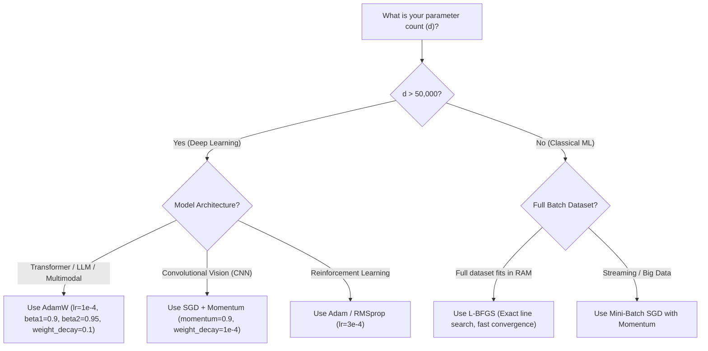

# Machine Learning Foundations: Chapter 2 — Calculus

---

## 1. Sets, Metric Spaces, and Logic

### A. Sets of Numbers and Vectors

#### What is a Set?
In mathematics, a **set** is simply a well-defined collection of distinct objects or numbers, called **elements** or **members**. 
* If a number $x$ is inside the set $S$, we write: $x \in S$ (read as: "$x$ belongs to $S$").
* If a number $x$ is NOT inside the set $S$, we write: $x \notin S$ (read as: "$x$ does not belong to $S$").

---

#### 1. Set of Real Numbers ($\mathbb{R}$)

##### 💡 What is it really? (Deep Intuition & Mental Model)
Think of the real numbers as every single possible number that can sit anywhere on an unbroken, continuous ruler or number line. There are no gaps, no missing spots, and no jumps. It includes whole numbers, fractions (rational numbers), and numbers with infinite, non-repeating decimals (irrational numbers like $\sqrt{2}$ or $\pi$).

##### 🎯 What does it signify in Data Science & Machine Learning?
In machine learning, $\mathbb{R}$ signifies **continuous features and model parameters (weights)**. 
When a neural network learns, its connection weights are not restricted to whole integers like $1$ or $2$; they can be any real value like $0.00341$ or $-1.4829$. Without the continuous nature of $\mathbb{R}$, we could not perform smooth calculus, compute rates of change, or slide smoothly down a loss landscape.

##### 🚀 Real-World Impact & Project Use Cases:
* **Audio Processing & Signal Processing:** Audio waveforms, voltages, and sound frequencies are modeled as real-valued continuous functions $f(t) \in \mathbb{R}$.
* **Neural Network Weights & Biases:** In frameworks like PyTorch or TensorFlow, tensor weights are stored as floating-point numbers (`float32` or `bfloat16`), representing numbers in $\mathbb{R}$.

##### ⚙️ What Happens If It Changes? (Cause and Effect)
If your model weights were restricted to integers ($\mathbb{Z}$) instead of real numbers ($\mathbb{R}$), you would enter the realm of *discrete integer programming*. In discrete spaces, you cannot take derivatives or gradients—a tiny step does not exist because you can only jump by whole units. Training neural networks would become an exponentially hard combinatorial puzzle rather than smooth gradient descent!

* **Plain English Explanation:** Think of the real numbers as every single possible number that can sit anywhere on an unbroken, continuous ruler or number line. This includes regular positive numbers, negative numbers, zero, fractions (rational numbers like $1/2$), and numbers with endless, non-repeating decimals that cannot be written as fractions (irrational numbers like $\sqrt{2}$ or $\pi = 3.14159\dots$).
* **Mathematical Notation:** $\mathbb{R} = (-\infty, \infty)$
* **Example 1:** The number $\pi \approx 3.14159$ is a real number ($\pi \in \mathbb{R}$) because it has an exact position on the number line between $3$ and $4$.
* **Example 2:** The negative fraction $-\frac{7}{4} = -1.75$ is also a real number ($-\frac{7}{4} \in \mathbb{R}$). However, the imaginary unit $\sqrt{-1} = i$ is NOT a real number ($i \notin \mathbb{R}$).

---

#### 2. Set of Non-Negative Real Numbers ($\mathbb{R}_+$)

##### 💡 What is it really?
This is the right-hand half of the real number line, starting exactly at zero and continuing indefinitely to the right. It includes zero and all positive numbers.

##### 🎯 What does it signify in Data Science & Machine Learning?
$\mathbb{R}_+$ signifies **physical measurements, distances, variances, probabilities, and loss functions**. 
In the real world, many quantities cannot physically be negative:
* Distance between two data points cannot be $-5$ meters.
* The square of an error $(y - \hat{y})^2$ cannot be negative.
* Image pixel brightness cannot be negative light.
* Time elapsed, age, and product prices must be non-negative.

##### 🚀 Real-World Impact & Project Use Cases:
* **Loss Functions:** In regression, Mean Squared Error (MSE) loss satisfies $\text{MSE} \in \mathbb{R}_+$. An error of $0$ means a flawless prediction; higher positive values mean larger mistakes.
* **ReLU Activation Function:** The most widely used activation function in modern deep learning, $\text{ReLU}(x) = \max(0, x)$, maps any real number strictly into $\mathbb{R}_+$. This produces sparse representations where deactivated neurons output $0$.

##### ⚙️ What Happens If It Changes?
If an algorithm predicting house prices or customer age produces a negative output (say $-\$50,000$ or $-4$ years old), your model has violated the physical $\mathbb{R}_+$ constraint of the problem. In such cases, ML engineers apply an output transformation—such as wrapping the final layer in an exponential function ($e^{\hat{y}}$) or a softplus function—to force predictions to remain strictly within $\mathbb{R}_+$.

* **Plain English Explanation:** This is the right-hand half of the real number line, starting exactly at zero and going to the right forever. It includes zero and all positive numbers. In machine learning, quantities like distance, speed, image pixel intensities, and price can never be negative, so they live in $\mathbb{R}_+$.
* **Mathematical Definition:**
  $$\mathbb{R}_+ = \{x \in \mathbb{R} \mid x \ge 0\}$$
  *(Read as: "The set of all numbers $x$ in $\mathbb{R}$ such that $x$ is greater than or equal to $0$").*
* **Example 1:** The number $0$ is an element of $\mathbb{R}_+$ ($0 \in \mathbb{R}_+$) because it is greater than or equal to zero.
* **Example 2:** The number $5.82$ belongs to $\mathbb{R}_+$ ($5.82 \in \mathbb{R}_+$), but $-3.5$ does not belong to $\mathbb{R}_+$ ($-3.5 \notin \mathbb{R}_+$) because it is negative.

---

#### 3. Set of Integers ($\mathbb{Z}$)

##### 💡 What is it really?
The integers $\mathbb{Z}$ are the complete set of whole numbers without fractions or decimals ($\dots, -2, -1, 0, 1, 2, \dots$).

##### 🎯 What does it signify in Data Science & Machine Learning?
$\mathbb{Z}$ signifies **discrete counts, categorical levels, indices, and grid offsets**.
* Discrete categorical encodings (e.g., Sentiment: $-1$ for negative, $0$ for neutral, $+1$ for positive).
* Difference in ranks or ranking shifts in recommendation engines.

##### 🚀 Real-World Impact & Project Use Cases:
* **Ranking Metrics:** In search ranking (like Google search or e-commerce search), the position of an item is an integer rank. Changes in ranking positions $\Delta r \in \mathbb{Z}$ determine NDCG and Mean Reciprocal Rank (MRR).

* **Plain English Explanation:** The integers are the whole numbers—numbers without any fractional or decimal parts. This includes positive counting numbers, negative counting numbers, and zero. The symbol $\mathbb{Z}$ comes from the German word *Zahlen* (meaning "numbers").
* **Mathematical Notation:**
  $$\mathbb{Z} = \{\dots, -3, -2, -1, 0, 1, 2, 3, \dots\}$$
* **Example 1:** The number $-42$ is an integer ($-42 \in \mathbb{Z}$) because it is a whole number with no decimals.
* **Example 2:** The number $0$ is an integer ($0 \in \mathbb{Z}$), but $\frac{3}{2} = 1.5$ is NOT an integer ($1.5 \notin \mathbb{Z}$).

---

#### 4. Set of Positive Integers ($\mathbb{Z}_+$)

##### 💡 What is it really?
Natural counting numbers strictly greater than zero ($1, 2, 3, \dots$). Zero is strictly excluded.

##### 🎯 What does it signify in Data Science & Machine Learning?
$\mathbb{Z}_+$ signifies **discrete hyperparameters, sample counts, vocabulary sizes, and network architecture dimensions**:
* You cannot train a model for $3.7$ epochs; the epoch counter $E \in \mathbb{Z}_+$.
* You cannot have $14.2$ hidden layers in a neural network; the layer count $L \in \mathbb{Z}_+$.
* In classification, class labels are discrete integers: $y \in \{0, 1\}$ for spam detection, or $y \in \{0, 1, \dots, 9\}$ for handwritten digit recognition (MNIST).

##### 🚀 Real-World Impact & Project Use Cases:
* **Token IDs in Large Language Models (LLMs):** In models like GPT-4 or Gemini, words and subwords are mapped directly to discrete token integers from a vocabulary dictionary (e.g., token ID $15496 \in \mathbb{Z}_+$).
* **Batch Size & Dimension Hyperparameters:** When training with mini-batch gradient descent, `batch_size = 64` or `batch_size = 128` are positive integers ($\mathbb{Z}_+$).

##### ⚙️ What Happens If It Changes?
Trying to treat a categorical label like Zip Code ($90210$ vs $10001$) as a continuous real number ($\mathbb{R}$) tricks a model into thinking that Zip Code $90210$ is mathematically "nine times larger" than Zip Code $10001$. This causes incorrect distance calculations. Recognizing that labels belong to a discrete integer set $\mathbb{Z}$ forces the engineer to use one-hot encoding or embedding tables instead.

* **Plain English Explanation:** Also known as the natural counting numbers. These are the whole numbers strictly greater than zero ($1, 2, 3, \dots$). Zero is **excluded**. In machine learning, this set represents things you count as discrete items, such as the number of data samples, number of layers in a neural network, or number of iterations.
* **Mathematical Definition:**
  $$\mathbb{Z}_+ = \{1, 2, 3, 4, \dots\} = \{x \in \mathbb{Z} \mid x > 0\}$$
* **Example 1:** The number $100$ is a positive integer ($100 \in \mathbb{Z}_+$).
* **Example 2:** The number $1$ belongs to $\mathbb{Z}_+$ ($1 \in \mathbb{Z}_+$), but $0$ does NOT belong to $\mathbb{Z}_+$ ($0 \notin \mathbb{Z}_+$).

---

#### 5. Intervals of the Real Line

##### 💡 What is it really?
An interval is an unbroken slice of the real number line between two endpoints, $a$ and $b$:
* **Closed Interval $[a, b]$:** Square brackets mean the boundaries $a$ and $b$ are **included**.
* **Open Interval $(a, b)$:** Round parentheses mean the boundaries $a$ and $b$ are **excluded**.

##### 🎯 What does it signify in Data Science & Machine Learning?
Intervals signify **bounded feature scales, probability ranges, and hyperparameter search spaces**:
* **Probabilities:** The output of a classification model (like logistic regression) must be a probability bounded in the closed interval $[0, 1]$.
* **Feature Normalization (Min-Max Scaling):** Raw features (e.g., house square footage from $500$ to $5000$) are rescaled into the normalized interval $[0, 1]$ or $[-1, 1]$ so that large numerical values do not dominate smaller ones.

##### 🚀 Real-World Impact & Project Use Cases:
* **Activation Functions:** 
  * The **Sigmoid** activation function $\sigma(z) = \frac{1}{1 + e^{-z}}$ squashes any input into the open interval $(0, 1)$, ensuring it never hits absolute $0$ or absolute $1$ (preventing infinite log-loss).
  * The **Tanh** activation function $\tanh(z)$ squashes values into $(-1, 1)$, producing zero-centered representations that accelerate neural network convergence.
* **Hyperparameter Tuning:** In Bayesian optimization or Grid Search, an engineer restricts the learning rate search space to a safe interval, such as $\alpha \in [10^{-5}, 10^{-1}]$.

##### ⚙️ What Happens If It Changes?
If an un-normalized feature with range $[0, 100000]$ (e.g., Annual Income) is fed into a distance-based model alongside a feature with range $[0, 10]$ (e.g., Years of Education), the distance calculation will be completely dominated by the Income feature. Education will have virtually zero effect on the model's predictions. Compressing both features into the identical closed interval $[0, 1]$ equalizes their influence!

An **interval** is a continuous chunk or connected slice of the number line between two boundary numbers, say $a$ and $b$ (where $a < b$).

##### Closed Interval $[a, b]$:
* **Explanation:** Square brackets $[ \dots ]$ mean that the boundary numbers $a$ and $b$ are **included** in the set.
* **Definition:** $[a, b] = \{x \in \mathbb{R} \mid a \le x \le b\}$
* **Example 1:** In the closed interval $[2, 5]$, the number $2$ is included ($2 \in [2, 5]$) and $5$ is included ($5 \in [2, 5]$). The number $3.7$ is also included.
* **Example 2:** For $[-1, 1]$, the endpoints $-1$ and $1$ are both included, along with every number in between like $0$ and $-0.5$.

##### Open Interval $(a, b)$:
* **Explanation:** Round parentheses $( \dots )$ mean that the boundary numbers $a$ and $b$ are **excluded** (left out). The set contains everything strictly between them, but not the boundary walls themselves.
* **Definition:** $(a, b) = \{x \in \mathbb{R} \mid a < x < b\}$
* **Example 1:** In the open interval $(2, 5)$, the boundary number $2$ is NOT included ($2 \notin (2, 5)$) and $5$ is NOT included ($5 \notin (2, 5)$). But $2.00001$ is included.
* **Example 2:** For $(0, 1)$, neither $0$ nor $1$ belongs to the set, but numbers like $0.5$ and $0.999$ belong to the set.

##### Half-Open / Half-Closed Intervals:
* **Explanation:** One side is included and the other side is excluded.
  * $[a, b) = \{x \in \mathbb{R} \mid a \le x < b\}$ ($a$ included, $b$ excluded).
  * $(a, b] = \{x \in \mathbb{R} \mid a < x \le b\}$ ($a$ excluded, $b$ included).
* **Example 1:** $[0, \infty)$ represents all non-negative numbers $\mathbb{R}_+$. Here $0$ is included, but $\infty$ is not a number, so it always gets a round parenthesis.
* **Example 2:** $(-3, 4]$ includes $4$, but does NOT include $-3$.

---

#### 6. Multi-Dimensional Vector Spaces ($\mathbb{R}^d$)

##### 💡 What is it really?
While $\mathbb{R}^1$ represents a single position on a 1D line, $\mathbb{R}^d$ packs $d$ distinct numbers into an ordered list called a **vector**:
$$\mathbf{x} = \begin{bmatrix} x_1 \\ x_2 \\ \vdots \\ x_d \end{bmatrix}$$
Geometrically, it represents a single point or arrow in a $d$-dimensional space.

##### 🎯 What does it signify in Data Science & Machine Learning?
$\mathbb{R}^d$ is the **Feature Space** and **Embedding Space**!
* In tabular data: If your dataset has $d$ columns (e.g., Age, Income, Credit Score, Debt), each row is a single vector $\mathbf{x} \in \mathbb{R}^d$.
* In Computer Vision: A grayscale image with $28 \times 28$ pixels is flattened into a vector of $d = 784$ numbers, living in $\mathbb{R}^{784}$.
* In Natural Language Processing: Modern language models map every word, paragraph, or user question into a dense embedding vector in $\mathbb{R}^{768}$, $\mathbb{R}^{1536}$, or $\mathbb{R}^{4096}$.

##### 🚀 Real-World Impact & Project Use Cases:
* **Semantic Search & Vector Databases (Pinecone, Milvus, Chroma):** When you search a company database using an LLM (Retrieval-Augmented Generation / RAG), your query is turned into a vector in $\mathbb{R}^d$. The database searches for stored document vectors that sit close to your query vector in this $d$-dimensional space.
* **Curse of Dimensionality:** As $d$ grows very large (e.g., $d = 10,000$), the volume of space expands exponentially. Data points become isolated and far apart, requiring dimensionality reduction (like PCA) to project the data down into a lower-dimensional subspace $\mathbb{R}^k$ (where $k \ll d$).

##### ⚙️ What Happens If It Changes?
If you increase the dimension $d$ by adding engineered features, your model gains capacity to learn intricate patterns. However, if $d$ becomes too large relative to the number of data points $N$, the model risks **overfitting** (memorizing noise). If $d$ is too small, the model suffers from **underfitting** because it lacks the capacity to represent the true underlying relationship.

* **Plain English Explanation:** When you have a single number, it describes a point on a 1-dimensional line ($\mathbb{R}^1 = \mathbb{R}$). When you pair two numbers together $(x, y)$, you describe a point on a 2-dimensional flat sheet of paper ($\mathbb{R}^2$). When you group three numbers $(x, y, z)$, you describe a point in 3-dimensional physical space ($\mathbb{R}^3$).
  In machine learning, a single data point (like a patient's medical record) might have 10, 50, or 10,000 measurements (age, blood pressure, cholesterol, BMI, etc.). We package these $d$ numbers into an ordered column list called a **vector** living in $d$-dimensional space, denoted $\mathbb{R}^d$.
* **Mathematical Definition:**
  $$\mathbb{R}^d = \underbrace{\mathbb{R} \times \mathbb{R} \times \dots \times \mathbb{R}}_{d \text{ times}} = \left\{ \mathbf{x} = \begin{bmatrix} x_1 \\ x_2 \\ \vdots \\ x_d \end{bmatrix} \;\middle|\; x_1, x_2, \dots, x_d \in \mathbb{R} \right\}$$
* **Example 1 (2D Vector in $\mathbb{R}^2$):** A GPS location with latitude and longitude:
  $$\mathbf{x} = \begin{bmatrix} 13.08 \\ 80.27 \end{bmatrix} \in \mathbb{R}^2$$
  Here $d = 2$, $x_1 = 13.08$ and $x_2 = 80.27$.
* **Example 2 (3D Vector in $\mathbb{R}^3$):** A physical object's coordinates in a room (width, length, height):
  $$\mathbf{p} = \begin{bmatrix} 2.5 \\ 4.0 \\ 1.8 \end{bmatrix} \in \mathbb{R}^3$$
  Here $d = 3$, $p_1 = 2.5$, $p_2 = 4.0$, $p_3 = 1.8$.

---

#### 7. $d$-Dimensional Hypercube ($[a, b]^d$)

##### 💡 What is it really?
A hypercube is a $d$-dimensional box where every single coordinate is constrained to lie within the interval $[a, b]$:
* In 1D: A line segment of length $b - a$.
* In 2D: A flat square of side length $b - a$.
* In 3D: A solid cube of side length $b - a$.
* In $d$-dimensions: A hypercube $[a, b]^d$.

##### 🎯 What does it signify in Data Science & Machine Learning?
Hypercubes signify **bounded multi-dimensional input domains and adversarial perturbation budgets**:
* **Digital Image Representation:** A standard color image with dimensions $H \times W \times 3$ has pixel intensities bounded between $0$ and $255$. When normalized by dividing by $255$, every image in the universe lives inside the unit hypercube $[0, 1]^d$, where $d = H \times W \times 3$.
* **Adversarial Robustness:** In AI safety, an attacker seeks to fool a vision model by adding subtle noise to an image. The noise vector is constrained to an $L_\infty$ hypercube $[-\epsilon, \epsilon]^d$ to ensure the changes remain imperceptible to human eyes.

##### 🚀 Real-World Impact & Project Use Cases:
* **Uniform Random Initialization:** When initializing the weights of a neural network layer, frameworks often sample values uniformly from a hypercube $[-\frac{1}{\sqrt{d}}, \frac{1}{\sqrt{d}}]^d$ to prevent activations from vanishing or exploding during the first forward pass.
* **Volume Concentration Phenomenon:** In high dimensions, almost the entire volume of a hypercube is concentrated in its outer corners! This mathematical property explains why high-dimensional random vectors behave differently than 2D or 3D vectors.

##### ⚙️ What Happens If It Changes?
If an image preprocessing pipeline fails to clamp pixel values to the unit hypercube $[0, 1]^d$, an out-of-range value (like $1.5$ or $-0.2$) entering a convolutional network can destabilize downstream batch normalization layers and lead to corrupted outputs.

* **Plain English Explanation:** 
  * In 1D, $[a, b]^1 = [a, b]$ is a line segment of length $b - a$.
  * In 2D, $[a, b]^2 = [a, b] \times [a, b]$ is a square of side length $b - a$.
  * In 3D, $[a, b]^3 = [a, b] \times [a, b] \times [a, b]$ is a solid cube of side length $b - a$.
  * In $d$-dimensions, $[a, b]^d$ is a $d$-dimensional box where every coordinate is restricted to lie between $a$ and $b$. We call this a **hypercube**.
* **Mathematical Definition:**
  $$[a, b]^d = \{\mathbf{x} \in \mathbb{R}^d \mid a \le x_i \le b \text{ for every coordinate index } i \in \{1, 2, \dots, d\}\}$$
* **Example 1 (The Unit Square in $\mathbb{R}^2$):** Let $a = 0, b = 1, d = 2$.
  $$[0, 1]^2 = \left\{ \begin{bmatrix} x_1 \\ x_2 \end{bmatrix} \in \mathbb{R}^2 \;\middle|\; 0 \le x_1 \le 1 \text{ and } 0 \le x_2 \le 1 \right\}$$
  The point $\begin{bmatrix} 0.5 \\ 0.8 \end{bmatrix}$ is inside this square, but $\begin{bmatrix} 0.5 \\ 1.2 \end{bmatrix}$ is outside.
* **Example 2 (The Centered Box in $\mathbb{R}^3$):** Let $a = -1, b = 1, d = 3$.
  $$[-1, 1]^3 = \left\{ \begin{bmatrix} x_1 \\ x_2 \\ x_3 \end{bmatrix} \in \mathbb{R}^3 \;\middle|\; -1 \le x_1 \le 1, \;-1 \le x_2 \le 1, \;-1 \le x_3 \le 1 \right\}$$
  The origin $\begin{bmatrix} 0 \\ 0 \\ 0 \end{bmatrix}$ is inside this cube, but $\begin{bmatrix} 0 \\ 0 \\ 2 \end{bmatrix}$ is outside because its third coordinate exceeds $1$.

---

### B. Metric Spaces & Neighborhoods

#### What is a Metric Space?
A **metric space** is simply a set of points equipped with a ruler—a specific rule or formula to measure the **distance** between any two points.
To be a valid mathematical distance (metric) $D(\mathbf{x}, \mathbf{y})$, the function must obey three commonsense rules:
1. **Non-negativity:** Distance cannot be negative ($D(\mathbf{x}, \mathbf{y}) \ge 0$), and the distance is $0$ if and only if the two points are identical ($\mathbf{x} = \mathbf{y}$).
2. **Symmetry:** Distance from home to school equals distance from school to home ($D(\mathbf{x}, \mathbf{y}) = D(\mathbf{y}, \mathbf{x})$).
3. **Triangle Inequality:** The direct straight path from $\mathbf{x}$ to $\mathbf{z}$ is always shorter than or equal to taking a detour through $\mathbf{y}$:
   $$D(\mathbf{x}, \mathbf{z}) \le D(\mathbf{x}, \mathbf{y}) + D(\mathbf{y}, \mathbf{z})$$

---

#### 1. The Euclidean Distance Function $D(\mathbf{x}, \mathbf{y})$

##### 💡 What is it really? (Deep Intuition & Mental Model)
A metric is a mathematical ruler. The Euclidean metric is the straight-line ruler distance between two points in space, generalized from the Pythagorean theorem ($c = \sqrt{a^2 + b^2}$).

##### 🎯 What does it signify in Data Science & Machine Learning?
**Distance is the mathematical foundation of Similarity!**
The core hypothesis of machine learning is:
$$\text{"Inputs that are close together in feature space should have similar outputs."}$$
If two customer vectors $\mathbf{x}_A$ and $\mathbf{x}_B$ have a tiny Euclidean distance $D(\mathbf{x}_A, \mathbf{x}_B) \approx 0$, they are nearly identical customers and will likely behave the same way.

##### 🚀 Real-World Impact & Project Use Cases:
* **K-Nearest Neighbors (KNN):** To classify an unknown iris flower, KNN measures the Euclidean distance from the query flower vector to every labeled flower in the dataset, assigning the majority class among the $k$ nearest neighbors.
* **K-Means Clustering:** An unsupervised algorithm that groups millions of customers into clusters by repeatedly assigning each customer to the cluster center with the smallest Euclidean distance.
* **Facial Recognition (FaceNet):** When you unlock your phone with your face, a deep neural network maps your camera image to an embedding vector in $\mathbb{R}^{128}$. The phone unlocks if the Euclidean distance between the live face vector and the stored template vector is below a preset security threshold!

##### ⚙️ What Happens If It Changes?
Switching from Euclidean distance ($L_2$ metric: $\sqrt{\sum (x_i - y_i)^2}$) to Manhattan distance ($L_1$ metric: $\sum |x_i - y_i|$) changes how the model treats outliers. 
Because the Euclidean distance squares coordinate differences ($(x_i - y_i)^2$), a large error in even a single feature is penalized heavily. In contrast, Manhattan distance treats errors linearly, making models like Lasso regression more robust to noise and outliers.

* **Plain English Explanation:** This is the standard straight-line ruler distance between two points that you learned in high school geometry using the Pythagorean theorem ($a^2 + b^2 = c^2$), extended to any number of dimensions $d$.
* **Mathematical Formula:**
  $$D(\mathbf{x}, \mathbf{y}) = \|\mathbf{x} - \mathbf{y}\| = \sqrt{\sum_{i=1}^d (x_i - y_i)^2} = \sqrt{(x_1 - y_1)^2 + (x_2 - y_2)^2 + \dots + (x_d - y_d)^2}$$

* **Example 1 (Distance in 1D $\mathbb{R}$):**
  Let $x = 3$ and $y = 8$.
  * *Formula Used:* $D(x, y) = \sqrt{(x - y)^2} = |x - y|$.
  * *Step-by-step arithmetic:*
    $$D(3, 8) = |3 - 8| = |-5| = 5$$
  The distance between $3$ and $8$ on the number line is $5$.

* **Example 2 (Distance in 2D $\mathbb{R}^2$):**
  Let point $A = \mathbf{x} = \begin{bmatrix} 1 \\ 2 \end{bmatrix}$ and point $B = \mathbf{y} = \begin{bmatrix} 4 \\ 6 \end{bmatrix}$.
  * *Formula Used:* $D(\mathbf{x}, \mathbf{y}) = \sqrt{(x_1 - y_1)^2 + (x_2 - y_2)^2}$.
  * *Step-by-step substitution and arithmetic:*
    $$\begin{aligned}
    D(\mathbf{x}, \mathbf{y}) &= \sqrt{(1 - 4)^2 + (2 - 6)^2} \\
    &= \sqrt{(-3)^2 + (-4)^2} \\
    &= \sqrt{9 + 16} \\
    &= \sqrt{25} = 5
    \end{aligned}$$
  The straight-line distance between the two points is exactly $5$.

---

#### 2. Open Ball (Neighborhood) $B(\mathbf{x}, \epsilon)$

##### 💡 What is it really?
An open ball is a safety bubble of radius $\epsilon$ blown around a central point $\mathbf{x}$. It contains every point whose distance to the center is strictly less than $\epsilon$. A closed ball includes the outer boundary shell as well.

##### 🎯 What does it signify in Data Science & Machine Learning?
Open balls signify **Local Stability, Generalization, and Adversarial Attack Defenses**:
* **Local Continuity:** A machine learning model is locally stable if for any prediction at $\mathbf{x}$, all inputs inside a tiny neighborhood ball $B(\mathbf{x}, \epsilon)$ produce nearly the same prediction.
* **Density-Based Clustering (DBSCAN):** DBSCAN groups points by density: a point $\mathbf{x}$ is deemed a "core cluster point" if its neighborhood ball $B(\mathbf{x}, \epsilon)$ contains at least `MinPts` neighboring data points.

##### 🚀 Real-World Impact & Project Use Cases:
* **Adversarial Robustness Certification:** Self-driving vision systems must be certified so that if an image of a "Stop Sign" is perturbed by sensor noise or rain within an $\epsilon$-ball $B(\mathbf{x}, \epsilon)$, the system is mathematically guaranteed to output "Stop Sign" and not misclassify it as a "Speed Limit 80" sign.
* **Differential Privacy in AI:** When training models on private medical data, privacy algorithms add calibrated noise drawn from an $\epsilon$-ball to ensure an attacker cannot reconstruct individual patient records.

##### ⚙️ What Happens If It Changes?
In DBSCAN clustering, choosing $\epsilon$ too small results in the ball $B(\mathbf{x}, \epsilon)$ capturing almost no neighbors, classifying most of your data as noise/outliers. Choosing $\epsilon$ too large causes the ball to swallow distinct groups, merging unrelated clusters into a single massive blob!

* **Plain English Explanation:** Imagine you stand at a center point $\mathbf{x}$ and blow a bubble of radius $\epsilon$ (epsilon, a positive number). The **open ball** is the collection of all points that are strictly **inside** the bubble, without touching the skin or boundary wall of the bubble. In calculus, this is called an **$\epsilon$-neighborhood** of $\mathbf{x}$.
* **Mathematical Definition:**
  $$B(\mathbf{x}, \epsilon) = \{\mathbf{y} \in \mathbb{R}^d \mid D(\mathbf{x}, \mathbf{y}) < \epsilon\}$$
  Notice the strict inequality symbol "$<$".

* **Example 1 (Open Ball in 1D $\mathbb{R}$ is an Open Interval):**
  Center $x = 3$, radius $\epsilon = 0.5$.
  * *Condition:* All numbers $y$ such that $|y - 3| < 0.5$.
  * *Unpacking the absolute value:*
    $$-0.5 < y - 3 < 0.5 \implies 3 - 0.5 < y < 3 + 0.5 \implies 2.5 < y < 3.5$$
  * *Result:* $B(3, 0.5) = (2.5, 3.5)$. This is an open interval centered at $3$. The boundary number $3.5$ is NOT in the ball because $D(3, 3.5) = 0.5$, which is not strictly less than $0.5$.

* **Example 2 (Open Ball in 2D $\mathbb{R}^2$ is an Open Disk):**
  Center $\mathbf{x} = \begin{bmatrix} 0 \\ 0 \end{bmatrix}$ (origin), radius $\epsilon = 1$.
  * *Condition:* All 2D points $\begin{bmatrix} y_1 \\ y_2 \end{bmatrix}$ such that $\sqrt{(y_1 - 0)^2 + (y_2 - 0)^2} < 1 \iff y_1^2 + y_2^2 < 1$.
  * *Result:* This is the inside of a circular disk of radius $1$. The point $\begin{bmatrix} 0.6 \\ 0.6 \end{bmatrix}$ has distance $\sqrt{0.36 + 0.36} = \sqrt{0.72} \approx 0.848 < 1$, so it is **inside** the ball. The point $\begin{bmatrix} 1 \\ 0 \end{bmatrix}$ sits exactly on the circle rim, so it is **excluded**.

---

#### 3. Closed Ball $\overline{B}(\mathbf{x}, \epsilon)$
* **Plain English Explanation:** The closed ball includes everything inside the bubble **plus** the outer skin/boundary wall of the bubble itself.
* **Mathematical Definition:**
  $$\overline{B}(\mathbf{x}, \epsilon) = \{\mathbf{y} \in \mathbb{R}^d \mid D(\mathbf{x}, \mathbf{y}) \le \epsilon\}$$
* **Example 1 (Closed Ball in 1D):**
  Center $x = 3$, radius $\epsilon = 0.5 \implies \overline{B}(3, 0.5) = [2.5, 3.5]$. Here, both $2.5$ and $3.5$ are included.
* **Example 2 (Closed Ball in 2D):**
  Center at origin $\mathbf{0}$, radius $\epsilon = 1 \implies \{\mathbf{y} \in \mathbb{R}^2 \mid y_1^2 + y_2^2 \le 1\}$. The perimeter circle rim is included.

---

### C. Sets and Propositional Logic

#### 1. Operations on Sets

##### 💡 What is it really?
* **Union ($A \cup B$):** Pool everything from $A$ and $B$ together (Logical **OR**).
* **Intersection ($A \cap B$):** Keep only what is simultaneously in both (Logical **AND**).
* **Complement ($A^c$):** Everything in the universe outside $A$ (Logical **NOT**).

##### 🎯 What does it signify in Data Science & Machine Learning?
Set operations signify **Data Filtering, Feature Selection, and Multi-Criteria Classification**:
* In data engineering: Finding users who bought product A OR product B ($A \cup B$) vs. users who bought product A AND product B ($A \cap B$).
* In evaluation metrics: The **IoU (Intersection over Union)** metric in object detection (YOLO, Faster R-CNN) measures how well a model's predicted bounding box overlaps with the ground-truth bounding box:
  $$\text{IoU} = \frac{\text{Area}(A \cap B)}{\text{Area}(A \cup B)}$$

##### 🚀 Real-World Impact & Project Use Cases:
* **Jaccard Similarity in Recommender Systems:** E-commerce systems calculate similarity between two customers based on their purchased item sets:
  $$J(A, B) = \frac{|A \cap B|}{|A \cup B|}$$
* **De Morgan’s Laws in Rule-Based Filters:**
  $$(A \cup B)^c = A^c \cap B^c$$
  *Significance:* "Flagging transactions that are neither domestic nor verified" is equivalent to "Flagging transactions that are foreign AND unverified". Optimizing these logical query paths speeds up database pipelines.

##### ⚙️ What Happens If It Changes?
In medical diagnosis, if a model requires Symptom A AND Symptom B ($A \cap B$) to trigger a screening, it will be highly specific but may miss patients displaying only one symptom (high false negative rate). Changing the trigger logic to Symptom A OR Symptom B ($A \cup B$) increases sensitivity, catching all potential cases at the expense of more false alarms.

Let $U$ denote the universal set (the entire universe of all objects under discussion).

```
          UNION (A U B)                    INTERSECTION (A ∩ B)               COMPLEMENT (A^c)
    ┌───────────────────────┐           ┌───────────────────────┐           ┌───────────────────────┐
    │  Universe U           │           │  Universe U           │           │  Universe U           │
    │   ┌─────┐   ┌─────┐   │           │   ┌─────┐   ┌─────┐   │           │  ███████████████████  │
    │  ┌│█████│───│█████│┐  │           │   │     │███│     │   │           │  ██ ┌─────┐ ████████  │
    │  ││█████│███│█████││  │           │   │  A  │███│  B  │   │           │  ██ │  A  │ ████████  │
    │  └│█████│───│█████│┘  │           │   │     │███│     │   │           │  ██ └─────┘ ████████  │
    │   └─────┘   └─────┘   │           │   └─────┘   └─────┘   │           │  ███████████████████  │
    └───────────────────────┘           └───────────────────────┘           └───────────────────────┘
      (Everything in A OR B)               (Only shared elements)              (Everything OUTSIDE A)
```

##### Union ($A \cup B$):
* **Meaning:** "A OR B". Collect everything in $A$, everything in $B$, and pool them together into one big set.
* **Definition:** $A \cup B = \{x \in U \mid x \in A \text{ or } x \in B\}$
* **Example 1 (Discrete Numbers):** If $A = \{1, 2, 3\}$ and $B = \{3, 4, 5\}$, then $A \cup B = \{1, 2, 3, 4, 5\}$.
* **Example 2 (Intervals):** If $A = [1, 4]$ and $B = [3, 7]$, then $A \cup B = [1, 7]$.

##### Intersection ($A \cap B$):
* **Meaning:** "A AND B". Keep only the elements that exist simultaneously inside BOTH sets (the overlap).
* **Definition:** $A \cap B = \{x \in U \mid x \in A \text{ and } x \in B\}$
* **Example 1 (Discrete Numbers):** If $A = \{1, 2, 3\}$ and $B = \{3, 4, 5\}$, then $A \cap B = \{3\}$.
* **Example 2 (Intervals):** If $A = [1, 4]$ and $B = [3, 7]$, then $A \cap B = [3, 4]$.

##### Complement ($A^c$ or $U \setminus A$):
* **Meaning:** "NOT A". Everything in the universe $U$ that is outside the boundary of $A$.
* **Definition:** $A^c = \{x \in U \mid x \notin A\}$
* **Example 1 (Coin Tosses):** If universe $U = \{\text{Heads}, \text{Tails}\}$ and $A = \{\text{Heads}\}$, then $A^c = \{\text{Tails}\}$.
* **Example 2 (Intervals):** If universe $U = [0, 10]$ and $A = [3, 8]$, then $A^c = [0, 3) \cup (8, 10]$. Notice how the square brackets of $A$ become round parentheses in the complement!

---

#### 2. De Morgan’s Laws
Augustus De Morgan discovered two fundamental rules showing how union, intersection, and complement interact:

$$\mathbf{(A \cup B)^c = A^c \cap B^c}$$
$$\mathbf{(A \cap B)^c = A^c \cup B^c}$$

* **Intuition in Plain English:**
  * "The opposite of being in (A or B) is: you are NOT in A, AND you are NOT in B."
  * "The opposite of being in (A and B) is: you are NOT in A, OR you are NOT in B."

* **Full Step-by-Step Verification with Concrete Intervals:**
  Let Universe $U = [0, 10]$, with subset $A = [2, 5]$ and subset $B = [4, 7]$.
  1. *Calculate $A \cup B$:*
     $$A \cup B = [2, 7]$$
  2. *Calculate Left Side $(A \cup B)^c$:*
     Everything in $[0, 10]$ outside $[2, 7]$:
     $$(A \cup B)^c = [0, 2) \cup (7, 10]$$
  3. *Calculate Individual Complements:*
     $$A^c = [0, 2) \cup (5, 10]$$
     $$B^c = [0, 4) \cup (7, 10]$$
  4. *Calculate Right Side $A^c \cap B^c$ (The Overlap of $A^c$ and $B^c$):*
     * In the lower region: $[0, 2)$ overlaps with $[0, 4)$ on $[0, 2)$.
     * In the upper region: $(5, 10]$ overlaps with $(7, 10]$ on $(7, 10]$.
     $$A^c \cap B^c = [0, 2) \cup (7, 10]$$
  5. *Conclusion:*
     $$(A \cup B)^c = [0, 2) \cup (7, 10] = A^c \cap B^c \quad \checkmark$$

---

#### 3. Mathematical Logic Quantifiers & Symbols

##### 💡 What is it really?
* $\forall$ ("For all"): A property holds for every candidate without exception.
* $\exists$ ("There exists"): There is at least one instance where the statement holds true.
* $\implies$ ("Implies"): A one-way guarantee (If condition $P$ holds, then outcome $Q$ is guaranteed).
* $\iff$ ("If and only if"): Absolute two-way equivalence ($P$ and $Q$ are identical truths).

##### 🎯 What does it signify in Data Science & Machine Learning?
Quantifiers form the formal grammar of **Machine Learning Guarantees, Loss Bounds, and Convergence Proofs**:
* **PAC Learning (Probably Approximately Correct):** Guarantees that for any error tolerance $\epsilon > 0$ and failure risk $\delta > 0$, there exists a minimum dataset size $N$ such that the trained model will generalize well:
  $$\forall \epsilon > 0, \;\forall \delta > 0, \;\exists N \in \mathbb{Z}_+ \text{ such that } P(\text{Error} \le \epsilon) \ge 1 - \delta$$
* **Convex Optimization:** A function $f$ is strictly convex if and only if for all pairs of points $\mathbf{x}, \mathbf{y}$, the line segment between them sits strictly above the function graph. This mathematical guarantee implies that **any local minimum is guaranteed to be a global minimum**!


| Symbol | Name | Plain English Translation |
| :---: | :---: | :--- |
| $\forall$ | **Universal Quantifier** | "For all", "For every", "For each" |
| $\exists$ | **Existential Quantifier** | "There exists", "There is at least one" |
| $\implies$ | **Implication** | "If... then...", "Implies", "Leads to" |
| $\iff$ | **Biconditional / Equivalence** | "If and only if", "Is mathematically equivalent to" |

* **Quantifier $\forall$ ("For All"):**
  * *Example 1:* $\forall x \in \mathbb{R}, \; x^2 \ge 0$. (Translation: "For every real number $x$, its square is greater than or equal to zero." This statement is true).
  * *Example 2:* $\forall n \in \mathbb{Z}_+, \; n \ge 1$. (Translation: "Every positive integer is greater than or equal to 1." This is true).

* **Quantifier $\exists$ ("There Exists"):**
  * *Example 1:* $\exists x \in \mathbb{R} \text{ such that } x + 5 = 12$. (Translation: "There exists a real number $x$ that satisfies $x+5=12$." True, namely $x=7$).
  * *Example 2:* $\exists x \in \mathbb{R} \text{ such that } x^2 = 2$. (Translation: "There exists a real number whose square is 2." True, namely $x = \sqrt{2}$).

* **Symbol $\implies$ ("Implies"):**
  * *Example 1:* $x = 3 \implies x^2 = 9$. (If $x$ is 3, it necessarily follows that $x^2$ is 9).
  * *Example 2:* It is raining $\implies$ the ground is wet. (Rain causes the ground to be wet).

* **Symbol $\iff$ ("If and Only If"):**
  * *Example 1:* $2x = 10 \iff x = 5$. (Both sides mean the exact same thing; one is true if and only if the other is true).
  * *Example 2:* A triangle is equilateral $\iff$ all three interior angles are $60^\circ$.

---

### D. Sequences and Convergence in $\mathbb{R}^d$

#### 💡 What is it really? (Deep Intuition & Mental Model)
A sequence is an infinite ordered conveyor belt of guesses: $\mathbf{x}_1, \mathbf{x}_2, \mathbf{x}_3, \dots, \mathbf{x}_n, \dots$ marching step-by-step through space.
Convergence means this sequence is zooming in on a specific target destination $\mathbf{x}^*$, getting closer with each step until the remaining gap is virtually zero.

```
                  Step 1 (x_1)
                     \
                      \   Step 2 (x_2)
                       *─────\
                              *───\  Step 3 (x_3)
                                   *───* Target Destination x* (Limit)
                                      /
                                     / (Permanently trapped inside ε-ball!)
```

#### 🎯 What does it signify in Data Science & Machine Learning?
**Convergence signifies Model Training Completion!**
In machine learning, we rarely have a closed-form formula to solve for the best weights in a single step. Instead, we run iterative optimization algorithms like Gradient Descent or Adam. 
* The training loop produces a sequence of weights: $\mathbf{w}_1, \mathbf{w}_2, \dots, \mathbf{w}_n$.
* If the sequence converges ($\lim_{n \to \infty} \mathbf{w}_n = \mathbf{w}^*$), our model has successfully learned and settled into an optimal state!

#### 🚀 Real-World Impact & Project Use Cases:
* **Early Stopping & Convergence Criteria:** Training large models costs thousands of dollars in cloud GPU compute. ML engineers monitor the sequence of validation losses. When the update step $\|\mathbf{w}_{n+1} - \mathbf{w}_n\| < \epsilon$ drops below a preset tolerance, the training loop terminates because the sequence has effectively converged.
* **Detecting Divergence:** If the sequence terms grow exponentially ($\|\mathbf{w}_n\| \to \infty$), the model is diverging due to an unstable learning rate, leading to `NaN` errors.

#### ⚙️ What Happens If It Changes?
If your learning rate is set too high, the sequence will overshoot the valley, oscillate wildly, and diverge away from the minimum. If the learning rate is too small, the sequence converges so slowly that you run out of compute budget before reaching the target!


#### What is a Sequence?
A **sequence** is an infinite, ordered list of items (numbers or vectors) labeled by step numbers $n = 1, 2, 3, 4, \dots$:
$$\mathbf{x}_1, \mathbf{x}_2, \mathbf{x}_3, \dots, \mathbf{x}_n, \dots$$
Each item $\mathbf{x}_n$ is called a **term** of the sequence. In machine learning, optimization algorithms like gradient descent generate a sequence of weight guesses: $\mathbf{w}_1, \mathbf{w}_2, \mathbf{w}_3, \dots$ marching toward the optimal model.

---

#### What is Convergence (Limit)?
We say the sequence $\mathbf{x}_n$ **converges** to a target destination $\mathbf{x}^*$ (written $\lim_{n \to \infty} \mathbf{x}_n = \mathbf{x}^*$ or $\mathbf{x}_n \to \mathbf{x}^*$) if, as the step number $n$ grows larger and larger, the points $\mathbf{x}_n$ get arbitrarily close to $\mathbf{x}^*$ and stay close forever.

#### The Formal $\epsilon-N$ Definition Explained:
$$\forall \epsilon > 0, \quad \exists N \in \mathbb{Z}_+ \quad \text{such that} \quad D(\mathbf{x}_n, \mathbf{x}^*) < \epsilon \quad \forall n \ge N$$

* **Plain English "Challenge-Response Game" Analogy:**
  1. **The Challenger:** An opponent picks an impossibly tiny positive error tolerance, called $\epsilon$ (e.g., $\epsilon = 0.0001$). They draw a tiny ball of radius $\epsilon$ around the target $\mathbf{x}^*$.
  2. **Your Task:** You must find a cutoff step number $N$ (like $N = 10,000$).
  3. **The Guarantee:** Once the sequence reaches and passes step $N$ ($n \ge N$), every single subsequent point $\mathbf{x}_n$ is permanently trapped inside the challenger's tiny ball ($D(\mathbf{x}_n, \mathbf{x}^*) < \epsilon$).
  If you can win this game for **any** positive $\epsilon$, no matter how tiny, the sequence converges to $\mathbf{x}^*$!

---

#### Worked Convergence Example 1: 1D Number Sequence
Show that the sequence $x_n = \frac{1}{n}$ converges to $x^* = 0$.

* **Step 1: Write down the condition to be satisfied:**
  $$D(x_n, x^*) = |x_n - 0| = \left| \frac{1}{n} - 0 \right| = \frac{1}{n} < \epsilon$$
* **Step 2: Solve the inequality for $n$:**
  $$\frac{1}{n} < \epsilon \iff n > \frac{1}{\epsilon}$$
* **Step 3: Choose the cutoff integer $N$:**
  Set $N$ to be any integer strictly greater than $\frac{1}{\epsilon}$ (i.e., $N = \lceil \frac{1}{\epsilon} \rceil$).
* **Step 4: Verify the game:**
  * Suppose the challenger chooses $\epsilon = 0.01$.
  * Then $\frac{1}{\epsilon} = \frac{1}{0.01} = 100$. We pick $N = 101$.
  * For all steps $n \ge 101$, the value $x_n = \frac{1}{n} \le \frac{1}{101} \approx 0.0099 < 0.01$.
  * Therefore, $\lim_{n \to \infty} \frac{1}{n} = 0$. $\checkmark$

---

#### Worked Convergence Example 2: 2D Vector Sequence
Show that the 2D sequence $\mathbf{x}_n = \begin{bmatrix} 1 + \frac{1}{n} \\ 2 - \frac{1}{n^2} \end{bmatrix}$ converges to $\mathbf{x}^* = \begin{bmatrix} 1 \\ 2 \end{bmatrix}$.

* **Step 1: Compute the Euclidean distance between $\mathbf{x}_n$ and $\mathbf{x}^*$:**
  * *Formula Used:* $D(\mathbf{x}_n, \mathbf{x}^*) = \sqrt{(x_{n,1} - x^*_1)^2 + (x_{n,2} - x^*_2)^2}$.
  * *Step-by-step substitution:*
    $$\begin{aligned}
    D(\mathbf{x}_n, \mathbf{x}^*) &= \sqrt{\left(\left(1 + \frac{1}{n}\right) - 1\right)^2 + \left(\left(2 - \frac{1}{n^2}\right) - 2\right)^2} \\
    &= \sqrt{\left(\frac{1}{n}\right)^2 + \left(-\frac{1}{n^2}\right)^2} \\
    &= \sqrt{\frac{1}{n^2} + \frac{1}{n^4}}
    \end{aligned}$$
* **Step 2: Analyze what happens as $n \to \infty$:**
  As $n$ becomes huge, $\frac{1}{n^2} \to 0$ and $\frac{1}{n^4} \to 0$:
  $$\lim_{n \to \infty} D(\mathbf{x}_n, \mathbf{x}^*) = \sqrt{0 + 0} = 0$$
  Since the distance shrinks to zero, the sequence converges:
  $$\lim_{n \to \infty} \mathbf{x}_n = \begin{bmatrix} 1 \\ 2 \end{bmatrix} \quad \checkmark$$

---

### E. Vector Spaces, Inner Products, and Orthogonality

#### 1. What is a Vector?
A **vector** $\mathbf{x} \in \mathbb{R}^d$ is an ordered list of $d$ numbers. Geometrically, you can picture it as an arrow pointing from the origin $\mathbf{0} = \begin{bmatrix} 0 \\ \vdots \\ 0 \end{bmatrix}$ to the coordinates $(x_1, x_2, \dots, x_d)$.
* **Vector Addition:** Add coordinates element by element:
  $$\mathbf{x} + \mathbf{y} = \begin{bmatrix} x_1 \\ x_2 \end{bmatrix} + \begin{bmatrix} y_1 \\ y_2 \end{bmatrix} = \begin{bmatrix} x_1 + y_1 \\ x_2 + y_2 \end{bmatrix}$$
* **Scalar Multiplication:** Multiply every coordinate by a regular number $c$:
  $$c\mathbf{x} = c\begin{bmatrix} x_1 \\ x_2 \end{bmatrix} = \begin{bmatrix} c x_1 \\ c x_2 \end{bmatrix}$$

* **Example 1:** If $\mathbf{x} = \begin{bmatrix} 2 \\ 5 \end{bmatrix}$ and $\mathbf{y} = \begin{bmatrix} 3 \\ -1 \end{bmatrix}$, then $\mathbf{x} + \mathbf{y} = \begin{bmatrix} 2+3 \\ 5+(-1) \end{bmatrix} = \begin{bmatrix} 5 \\ 4 \end{bmatrix}$.
* **Example 2:** If $c = 3$ and $\mathbf{x} = \begin{bmatrix} 4 \\ -2 \end{bmatrix}$, then $3\mathbf{x} = \begin{bmatrix} 3 \times 4 \\ 3 \times (-2) \end{bmatrix} = \begin{bmatrix} 12 \\ -6 \end{bmatrix}$.

---

#### 2. Dot Product (Inner Product) $\mathbf{x}^\top \mathbf{y}$

##### 💡 What is it really? (Deep Intuition & Mental Model)
The dot product multiplies matching components of two vectors and sums them up into a single number. Geometrically, it measures **directional alignment**:
$$\mathbf{x}^\top \mathbf{y} = \|\mathbf{x}\| \|\mathbf{y}\| \cos(\theta)$$
* **Positive ($> 0$):** The vectors point in generally the same direction (acute angle $\theta < 90^\circ$).
* **Zero ($= 0$):** The vectors are completely perpendicular ($\theta = 90^\circ$, no shared direction).
* **Negative ($< 0$):** The vectors point in opposite directions (obtuse angle $\theta > 90^\circ$).

##### 🎯 What does it signify in Data Science & Machine Learning?
**The Dot Product is the fundamental engine of Neural Network Computation and Attention!**
1. **Neuron Activation:** A single artificial neuron computes $z = \mathbf{w}^\top \mathbf{x} + b$. The dot product $\mathbf{w}^\top \mathbf{x}$ measures how strongly the incoming input $\mathbf{x}$ matches the neuron's learned feature template $\mathbf{w}$.
2. **Cosine Similarity:** Normalizing the dot product by the lengths of the vectors gives **Cosine Similarity**:
   $$\text{Cosine Similarity} = \frac{\mathbf{x}^\top \mathbf{y}}{\|\mathbf{x}\| \|\mathbf{y}\|} = \cos(\theta)$$
   It measures whether two documents or concepts mean the same thing, regardless of text length!
3. **The Attention Mechanism in Transformers (GPT, Claude, Gemini):**
   The self-attention score between a Query $\mathbf{q}$ and a Key $\mathbf{k}$ is literally a scaled dot product:
   $$\text{Attention}(\mathbf{q}, \mathbf{k}) = \frac{\mathbf{q}^\top \mathbf{k}}{\sqrt{d_k}}$$
   It computes: *"How much attention should this word pay to that word?"*

##### 🚀 Real-World Impact & Project Use Cases:
* **Recommendation Engines (Netflix, Spotify):** Users and movies are embedded as vectors. The predicted rating user $u$ gives to movie $m$ is the dot product of their embedding vectors: $\hat{r}_{um} = \mathbf{u}^\top \mathbf{v}_m$.
* **Semantic Document Search:** An enterprise search engine computes the dot product between your query embedding and millions of indexed knowledge-base articles to retrieve the most relevant match in milliseconds.

##### ⚙️ What Happens If It Changes?
If two feature vectors are **orthogonal** ($\mathbf{x}^\top \mathbf{y} = 0$), they share zero information—they are completely uncorrelated. Altering one feature has zero projection or impact on the other. This property is actively sought in Principal Component Analysis (PCA) to remove redundant, correlated features!

* **Plain English Explanation:** The dot product takes two vectors of the same length, multiplies their matching elements together, and adds all the results up to produce a **single number (scalar)**. 
  It measures how much the two vectors point in the same direction!
  * If the dot product is **positive**, they point roughly in the same direction (angle $< 90^\circ$).
  * If the dot product is **zero**, they are completely perpendicular ($90^\circ$).
  * If the dot product is **negative**, they point in opposite directions (angle $> 90^\circ$).
* **Formula:**
  $$\mathbf{x}^\top \mathbf{y} = \mathbf{x} \cdot \mathbf{y} = \sum_{i=1}^d x_i y_i = x_1 y_1 + x_2 y_2 + \dots + x_d y_d$$

* **Example 1:**
  Let $\mathbf{x} = \begin{bmatrix} 2 \\ 3 \end{bmatrix}$ and $\mathbf{y} = \begin{bmatrix} 4 \\ 1 \end{bmatrix}$.
  $$\mathbf{x}^\top \mathbf{y} = (2 \times 4) + (3 \times 1) = 8 + 3 = 11$$

* **Example 2:**
  Let $\mathbf{u} = \begin{bmatrix} 1 \\ 0 \\ -2 \end{bmatrix}$ and $\mathbf{v} = \begin{bmatrix} 3 \\ 4 \\ 5 \end{bmatrix}$.
  $$\mathbf{u}^\top \mathbf{v} = (1 \times 3) + (0 \times 4) + (-2 \times 5) = 3 + 0 - 10 = -7$$

---

#### 3. Vector Norm (Length) $\|\mathbf{x}\|$

##### 💡 What is it really?
The norm is the physical length of the vector arrow from the origin.

##### 🎯 What does it signify in Data Science & Machine Learning?
**The Norm is the Backbone of Regularization ($L_2$ Loss / Ridge) and Gradient Clipping!**
* **$L_2$ Regularization (Weight Decay):** To prevent neural networks from overfitting by assigning ridiculously huge weights to noisy features, loss functions add a penalty proportional to the squared norm of the weights:
  $$\text{Loss}_{\text{total}} = \text{Loss}_{\text{data}} + \lambda \|\mathbf{w}\|^2$$
  This forces the network to find simple, robust solutions.
* **Gradient Clipping in LLMs:** During pre-training of massive models, sudden spikes in data can cause gradient norms $\|\mathbf{g}\|$ to blow up. Frameworks clip the gradient if $\|\mathbf{g}\| > c$, dividing it by $\frac{\|\mathbf{g}\|}{c}$ to keep training stable.

* **Plain English Explanation:** The norm is the physical length of the vector arrow from the origin. By the Pythagorean theorem, the square of the length is the dot product of the vector with itself ($\|\mathbf{x}\|^2 = \mathbf{x}^\top \mathbf{x}$).
* **Formula:**
  $$\|\mathbf{x}\| = \sqrt{\mathbf{x}^\top \mathbf{x}} = \sqrt{x_1^2 + x_2^2 + \dots + x_d^2}$$

* **Example 1:**
  Let $\mathbf{x} = \begin{bmatrix} 3 \\ 4 \end{bmatrix}$.
  $$\|\mathbf{x}\| = \sqrt{3^2 + 4^2} = \sqrt{9 + 16} = \sqrt{25} = 5$$

* **Example 2:**
  Let $\mathbf{v} = \begin{bmatrix} 1 \\ 2 \\ 2 \end{bmatrix}$.
  $$\|\mathbf{v}\| = \sqrt{1^2 + 2^2 + 2^2} = \sqrt{1 + 4 + 4} = \sqrt{9} = 3$$

---

#### 4. Orthogonality ($\mathbf{x} \perp \mathbf{y}$)

##### 💡 What is it really?
Two vectors are orthogonal if they meet at a perfect right angle ($90^\circ$). In algebra, this happens if and only if their dot product equals zero!

##### 🎯 What does it signify in Data Science & Machine Learning?
**Orthogonality signifies Zero Redundancy and Non-Interference!**
In deep learning:
* **Orthogonal Weight Initialization:** Initializing weight matrices with orthogonal vectors preserves signal variance across deep layers without exploding or vanishing.
* **Principal Component Analysis (PCA):** Projects data onto mutually orthogonal principal axes, guaranteeing that each new feature captures completely novel variance uncorrelated with previous components!

* **Plain English Explanation:** Two vectors are **orthogonal** if they meet at a perfect right angle ($90^\circ$). In algebra, this happens if and only if their dot product equals zero!
* **Condition:**
  $$\mathbf{x} \perp \mathbf{y} \iff \mathbf{x}^\top \mathbf{y} = 0$$

* **Example 1:**
  Let $\mathbf{x} = \begin{bmatrix} 2 \\ 1 \end{bmatrix}$ and $\mathbf{y} = \begin{bmatrix} -1 \\ 2 \end{bmatrix}$.
  $$\mathbf{x}^\top \mathbf{y} = (2)(-1) + (1)(2) = -2 + 2 = 0$$
  Since the inner product is zero, $\mathbf{x}$ and $\mathbf{y}$ are orthogonal ($\mathbf{x} \perp \mathbf{y}$).

* **Example 2:**
  The standard axis unit vectors in 3D: $\mathbf{e}_1 = \begin{bmatrix} 1 \\ 0 \\ 0 \end{bmatrix}$ (along the x-axis) and $\mathbf{e}_2 = \begin{bmatrix} 0 \\ 1 \\ 0 \end{bmatrix}$ (along the y-axis).
  $$\mathbf{e}_1^\top \mathbf{e}_2 = (1 \times 0) + (0 \times 1) + (0 \times 0) = 0$$
  The x-axis and y-axis are perpendicular!

---

### F. Functions, Graphs, and Visualizations

#### What is a Function?
A **function** $f$ is a mathematical machine: you feed it an input $\mathbf{x}$ from its **domain**, it applies a fixed recipe or formula, and outputs a single value $f(\mathbf{x})$ in its **codomain**:

$$f: \text{Domain} \to \text{Codomain}$$

* **Univariate Function ($f: \mathbb{R} \to \mathbb{R}$):** Takes 1 input number $x$ and outputs 1 number $y = f(x)$. 
  * *Example 1:* $f(x) = x^2$. If input is $3$, output is $9$. Plotted as a curve on a 2D sheet with axes $(x, y)$.
  * *Example 2:* $f(x) = 2x + 1$. If input is $4$, output is $9$. Plotted as a straight line.

---

#### Multivariate Functions ($f: \mathbb{R}^2 \to \mathbb{R}$)

##### 💡 What is it really? (Deep Intuition & Mental Model)
A multivariate function takes multiple inputs (like weights $w_1, w_2$) and outputs a single value (like error/cost). 
Geometrically, it creates a **3D landscape** of hills, valleys, plateaus, and mountain passes.

##### 🎯 What does it signify in Data Science & Machine Learning?
In machine learning, this landscape is the **Loss Surface (Cost Surface)**:
$$J(\mathbf{w}) = \text{Loss}(\text{Predictions}(\mathbf{w}), \text{True Labels})$$
* The horizontal coordinates $\mathbf{w} = (w_1, w_2, \dots, w_d)$ are the adjustable model weights (the knobs).
* The vertical height $z = J(\mathbf{w})$ is the **error rate** of the model.
* The goal of machine learning is to start somewhere high up in the foggy mountains (random initial weights) and navigate down to the bottom of the deepest valley (minimum error)!

##### 🚀 Real-World Impact & Project Use Cases:
* **Visualizing Neural Network Loss Surfaces:** Researchers use dimensionality reduction tools (such as filter normalization) to plot 3D loss landscapes. These visualizations show that modern architectural innovations like **Skip Connections (ResNets)** smooth out chaotic, rugged mountain landscapes into gentle, convex-like bowls that train much faster!

Takes two input numbers $(x, y)$ and outputs one number $z = f(x, y)$. 
Geometrically, this represents a **3D landscape or surface** where $(x, y)$ gives your position on the map (longitude and latitude), and the output $z$ is the **elevation / height** of the mountain or valley at that point.

```
       3D BOWL SURFACE (z = x^2 + y^2)             CONTOUR MAP / LEVEL SETS (Top View)
                  z (elevation)                                    y
                  |                                                |      /----\
               \  |  /                                             |     /  c=4 \
                \ | /                                              |    |  /--\  |
                 \|/                                               |    | |c=1|  |
        ──────────+────────── y                                    +────+-+---+--+──── x
                 /                                                 |    |  \--/  |
                /                                                  |     \      /
               x                                                   |      \----/
```

* **Example 1 (Paraboloid / Bowl Shape):**
  $$z = f(x, y) = x^2 + y^2$$
  * At the center $(0, 0)$, $z = 0^2 + 0^2 = 0$ (the lowest point of the bowl).
  * As you walk away in any direction, $z$ increases quadratically. At $(1, 2)$, $z = 1^2 + 2^2 = 5$.

* **Example 2 (Tilted Flat Plane):**
  $$z = f(x, y) = 3x - 2y + 4$$
  * At $(0, 0)$, $z = 4$.
  * At $(1, 1)$, $z = 3(1) - 2(1) + 4 = 5$. This represents an infinitely wide, flat, tilted ramp.

---

#### What are Contour Lines (Level Sets)?

##### 💡 What is it really?
A contour map slices the 3D mountain horizontally at fixed heights $c$ ($f(x, y) = c$). It is the bird's-eye top view used on hiking maps.

##### 🎯 What does it signify in Data Science & Machine Learning?
**Contour lines reveal how easy or hard an optimization problem will be:**
* **Circular / Spherical Contours:** The loss surface is an isotropic bowl. Gradient descent will point directly toward the center minimum and converge effortlessly.
* **Narrow, Elongated Elliptical Contours (Ravines):** The loss is steep in one direction and very flat in another. Standard gradient descent bounces back and forth between the steep canyon walls while making frustratingly slow progress along the valley floor.

##### 🚀 Real-World Impact & Project Use Cases:
* **Why Momentum and Adam Were Invented:** Seeing gradients oscillate in narrow contour ravines led researchers to invent **Momentum** (which dampens oscillations across the canyon) and **Adam / RMSprop** (which adaptively scales the learning rate per feature).
* **Feature Scaling Impact:** Unscaled features create distorted, razor-thin elliptical contours. Standardizing features to zero mean and unit variance transforms elliptical contours into round circles, dramatically speeding up convergence!

Imagine slicing the 3D mountain horizontally with a giant flat plane at a fixed height $c$, such that $f(x, y) = c$. The curve formed by this slice is called a **contour line** or **level curve**. 
* Hikers use contour lines on topographic maps: every point along a single contour line has the exact same elevation.
* If contour lines are packed very close together, the mountain is very steep! If they are far apart, the ground is gentle and flat.

* **Example 1 (Contours of the Bowl $z = x^2 + y^2$):**
  Set $f(x, y) = c$ for positive heights $c$:
  $$x^2 + y^2 = c = (\sqrt{c})^2$$
  * For $c = 1$, the contour is a circle of radius $\sqrt{1} = 1$.
  * For $c = 4$, the contour is a circle of radius $\sqrt{4} = 2$.
  * For $c = 9$, the contour is a circle of radius $\sqrt{9} = 3$.
  The contour lines are a family of **concentric circles** centered at $(0, 0)$.

* **Example 2 (Contours of a Tilted Ramp $z = 2x + y$):**
  Set $f(x, y) = c$:
  $$2x + y = c \implies y = -2x + c$$
  * For $c = 0$, the contour is the line $y = -2x$.
  * For $c = 2$, the contour is the parallel line $y = -2x + 2$.
  The contour lines are a family of **parallel straight lines**.

---

## 2. Univariate Calculus: Continuity and Differentiability

### A. Continuity of Functions

#### 💡 What is it really? (Deep Intuition & Mental Model)
A function is continuous if its graph is an unbroken line or curve. You can draw it from start to finish without ever lifting your pencil off the paper. Small nudges to the input produce small, predictable nudges to the output.

#### 🎯 What does it signify in Data Science & Machine Learning?
**Continuity signifies Numerical Stability and Predictability!**
If a machine learning model were discontinuous, a tiny, undetectable change in a medical patient's blood pressure (say from $120.000$ to $120.001$) could cause the predicted risk score to suddenly jump from $5\%$ to $99\%$. Discontinuous models are dangerously unpredictable and brittle to noise.

#### 🚀 Real-World Impact & Project Use Cases:
* **Why ML Replaced Step Functions with Continuous Surrogates:**
  Historically, the earliest AI models (Rosenblatt's Perceptron) used a discontinuous step function (0 if wrong, 1 if correct). But the derivative of a flat step is zero everywhere! Because the slope was zero, gradient descent couldn't tell which way to adjust the weights.
  Modern ML replaced the step function with **continuous, smooth surrogates**:
  * Step function $\to$ **Sigmoid / Softmax** function.
  * 0-1 misclassification count $\to$ **Cross-Entropy Loss**.
  Because these loss functions are continuous, gradients exist and models can learn smoothly!

#### ⚙️ What Happens If It Changes?
If your loss function has a discontinuity (a sudden cliff or tear), gradient descent will fail when it hits the cliff edge. The gradient becomes undefined or blows up to infinity, destabilizing model parameters.


#### Intuitive Definition:
A function $f(x)$ is **continuous** if you can draw its entire graph without lifting your pencil off the paper. There are no sudden teleportations (jumps), no missing holes, and no infinitely deep bottomless pits.
In physical terms: if you change the input $x$ by a tiny amount, the output $f(x)$ only changes by a tiny amount.

```
       CONTINUOUS FUNCTION                     DISCONTINUOUS (JUMP)            DISCONTINUOUS (HOLE)
             f(x)                                    f(x)                            f(x)
              |      .--.                             |         *                     |      .--o--.
              |     /    \                            |        /                      |     /   |   \
              |    /      \                           |  *----+                       |    /    x0   \
              +---+--------+-- x                      +--+--------+-- x               +---+--------+-- x
                 x0                                     x0                               x0
         (Pencil never lifts)                   (Pencil must jump)               (Missing point at x0)
```

#### Formal Limit Definition:
A function $f$ is continuous at a specific point $x_0$ if and only if three conditions hold:
1. $f(x_0)$ is defined (the function actually exists at $x_0$).
2. The limit as $x$ approaches $x_0$ exists: $\lim_{x \to x_0} f(x) = L$.
3. The limit equals the actual function value:
   $$\mathbf{\lim_{x \to x_0} f(x) = f(x_0)}$$

---

#### 2 Examples of Continuous Functions:
* **Example 1 (Polynomials):** $f(x) = x^2 - 3x + 2$.
  Let $x_0 = 2$.
  $$\lim_{x \to 2} (x^2 - 3x + 2) = 2^2 - 3(2) + 2 = 4 - 6 + 2 = 0$$
  The actual value is $f(2) = 0$. Since the limit equals the value, $f(x)$ is continuous at $x = 2$ (and in fact, everywhere on $\mathbb{R}$).
* **Example 2 (Sine Function):** $f(x) = \sin(x)$.
  As $x$ smoothly sweeps across the real numbers, $\sin(x)$ traces an unbroken, smooth wave between $-1$ and $+1$ without any breaks or tears.

---

#### 2 Examples of Discontinuous Functions:
* **Example 1 (The Heaviside / Step Function - Jump Discontinuity):**
  $$H(x) = \begin{cases} 0 & \text{if } x < 0 \\ 1 & \text{if } x \ge 0 \end{cases}$$
  * As $x$ approaches $0$ from the left ($x \to 0^-$): $\lim_{x \to 0^-} H(x) = 0$.
  * As $x$ approaches $0$ from the right ($x \to 0^+$): $\lim_{x \to 0^+} H(x) = 1$.
  Because the left-hand limit ($0$) does NOT equal the right-hand limit ($1$), the limit does not exist, and there is a sudden jump of height $1$ at $x = 0$. The function is **discontinuous** at $x = 0$.

* **Example 2 (Rational Function with a Hole):**
  $$f(x) = \frac{x^2 - 4}{x - 2}$$
  At $x = 2$, the denominator is $2 - 2 = 0$, so dividing by zero means $f(2)$ is **undefined**!
  Even though $\lim_{x \to 2} \frac{(x-2)(x+2)}{x-2} = \lim_{x \to 2} (x+2) = 4$, the point $(2, 4)$ is missing—there is a physical hole in the graph. Thus, $f(x)$ is **discontinuous** at $x = 2$.

---

### B. Differentiability of Functions

#### 💡 What is it really? (Deep Intuition & Mental Model)
A function is differentiable if its graph is **smooth**. There are no sharp pointy corners, no jagged spikes, and no vertical cliffs.
If you zoom in with a microscope on any point of a differentiable curve, it flattens out until it looks like a clean, straight line with a well-defined slope (tangent line).

```
          DIFFERENTIABLE (Smooth Curve)                   NON-DIFFERENTIABLE (Sharp Corner)
             f(x)                                            f(x)
              |            .---.                              |            \       /
              |          /       \                            |             \  *  /  <-- Sharp needle point!
              |     . - '         ' - .                       |              \/      (Multiple tangents fit!)
              +───────────────────────────> x                 +───────────────+───────────> x
               (Microscope: Looks like a line)                 (Microscope: Stays a sharp corner!)
```

#### 🎯 What does it signify in Data Science & Machine Learning?
**Differentiability signifies Trainability via Gradient Descent!**
The derivative $f'(x) = \frac{df}{dx}$ is the **compass** of optimization. It tells the computer:
1. Which direction to turn the parameter knobs (left or right).
2. How steep the hill is at that exact moment.
If a function is not differentiable at a point, the compass spins wildly—there is no unique tangent slope, and the algorithm does not know which way is downhill!

#### 🚀 Real-World Impact & Project Use Cases:
* **The ReLU Activation Trade-Off:**
  The popular activation function $\text{ReLU}(x) = \max(0, x)$ is smooth for $x > 0$ (slope $= 1$) and smooth for $x < 0$ (slope $= 0$), but it has a sharp pointy corner at exactly $x = 0$.
  Technically, it is **non-differentiable at $x = 0$**!
  *How does PyTorch solve this in practice?* Frameworks use a **subgradient**: they programmatically choose to set the derivative at $x = 0$ to $0$ (or $1$). Because the probability of an exact floating-point number landing on precisely $0.00000000$ during training is near zero, training proceeds smoothly!

#### ⚙️ What Happens If It Changes?
If an activation function has a vertical tangent (like $f(x) = x^{1/3}$ at $x = 0$), the derivative is infinite ($\infty$). Backpropagating through this point causes the gradient to explode, turning network weights into `NaN` (Not a Number) and destroying the model.


#### What is the Derivative?
The **derivative** measures the **instantaneous rate of change**—how fast the output $f(x)$ is changing at the exact moment the input is passing through $x_0$. 
Geometrically, it is the **slope of the tangent line** that grazes the curve at $(x_0, f(x_0))$.

#### The Difference Quotient and Secant Line:
To find the slope at $x_0$:
1. Pick a nearby point $x_0 + h$ (where $h$ is a small step size).
2. The change in input is $\Delta x = (x_0 + h) - x_0 = h$.
3. The change in output is $\Delta y = f(x_0 + h) - f(x_0)$.
4. The average rate of change (slope of the **secant line** connecting the two points) is:
   $$\text{Slope of Secant} = \frac{\Delta y}{\Delta x} = \frac{f(x_0 + h) - f(x_0)}{h}$$
5. Now, shrink the step size $h$ closer and closer to zero ($h \to 0$). The secant line pivots and becomes the **tangent line**!

```
                  f(x)
                   |                                       Secant Line (Slope = Δy / h)
                   |                                      /
                   |                               * (x0+h, f(x0+h))
                   |                              /|
                   |                             / |  Δy = f(x0+h) - f(x0)
                   |                     *      /  |
                   |                    /|     /   |
                   |         Tangent   / |    /    |
                   |          Line    *──+───*─────+
                   |                 /   |   |
                   +────────────────+────+───+─────────> x
                                   x0    h  x0+h
```

#### Formal Definition of Derivative:
$$f'(x_0) = \frac{df}{dx}(x_0) = \lim_{h \to 0} \frac{f(x_0 + h) - f(x_0)}{h}$$
A function is called **differentiable** at $x_0$ if this limit exists and produces a single finite real number.

---

#### Fundamental Theorem: Differentiability Implies Continuity
> If a function $f$ is differentiable at $x_0$, then it is guaranteed to be continuous at $x_0$.
> *(Warning: The reverse is NOT true! A function can be continuous but fail to be differentiable).*

* **Step-by-Step Proof:**
  We must prove that $\lim_{h \to 0} [f(x_0 + h) - f(x_0)] = 0$.
  * *Step 1 (Multiply and divide by $h$ for $h \ne 0$):*
    $$f(x_0 + h) - f(x_0) = \frac{f(x_0 + h) - f(x_0)}{h} \cdot h$$
  * *Step 2 (Take the limit as $h \to 0$ of both sides):*
    $$\lim_{h \to 0} [f(x_0 + h) - f(x_0)] = \lim_{h \to 0} \left[ \frac{f(x_0 + h) - f(x_0)}{h} \cdot h \right]$$
  * *Step 3 (Apply the Product Law of Limits $\lim (A \cdot B) = (\lim A) \cdot (\lim B)$):*
    $$\lim_{h \to 0} [f(x_0 + h) - f(x_0)] = \left( \lim_{h \to 0} \frac{f(x_0 + h) - f(x_0)}{h} \right) \cdot \left( \lim_{h \to 0} h \right)$$
  * *Step 4 (Substitute the known limits):*
    Since $f$ is differentiable, the first limit is the finite derivative $f'(x_0)$. The second limit is $0$:
    $$\lim_{h \to 0} [f(x_0 + h) - f(x_0)] = f'(x_0) \cdot 0 = 0$$
  * *Step 5 (Conclude continuity):*
    $$\lim_{h \to 0} f(x_0 + h) = f(x_0) \iff \lim_{x \to x_0} f(x) = f(x_0)$$
    Therefore, $f$ is continuous at $x_0$. $\blacksquare$

---

#### 2 Examples of Differentiable Functions:
* **Example 1 ($f(x) = x^2$ computed from the limit definition):**
  * *Formula Used:* $f'(x) = \lim_{h \to 0} \frac{f(x+h) - f(x)}{h}$.
  * *Step-by-step algebra:*
    $$\begin{aligned}
    f(x+h) - f(x) &= (x+h)^2 - x^2 \\
    &= (x^2 + 2xh + h^2) - x^2 \quad \text{[Using }(a+b)^2 = a^2 + 2ab + b^2\text{]} \\
    &= 2xh + h^2 \\
    &= h(2x + h)
    \end{aligned}$$
  * *Divide by $h$ ($h \ne 0$):*
    $$\frac{f(x+h) - f(x)}{h} = \frac{h(2x + h)}{h} = 2x + h$$
  * *Take limit as $h \to 0$:*
    $$f'(x) = \lim_{h \to 0} (2x + h) = 2x + 0 = 2x$$
  The derivative exists everywhere and is $f'(x) = 2x$. At $x = 3$, slope $f'(3) = 6$.

* **Example 2 ($f(x) = 5x - 7$):**
  The slope of a straight line is constant everywhere.
  $$\frac{f(x+h) - f(x)}{h} = \frac{(5(x+h) - 7) - (5x - 7)}{h} = \frac{5x + 5h - 7 - 5x + 7}{h} = \frac{5h}{h} = 5$$
  Thus, $f'(x) = 5$ everywhere.

---

#### 2 Examples of Non-Differentiable Functions:
* **Example 1 ($f(x) = |x|$ at $x = 0$ - Sharp Corner / V-Shape):**
  The absolute value function is continuous everywhere (you never lift your pencil). But look at the difference quotient at $x = 0$:
  $$\frac{f(0 + h) - f(0)}{h} = \frac{|h| - 0}{h} = \frac{|h|}{h}$$
  * If approaching from the right ($h > 0$), $|h| = h$, so $\frac{h}{h} = +1$.
  * If approaching from the left ($h < 0$), $|h| = -h$, so $\frac{-h}{h} = -1$.
  Because the left-hand slope ($-1$) does not match the right-hand slope ($+1$), there is a sharp needle-point corner at the origin. No single tangent line can sit there. Therefore, $f(x) = |x|$ is **not differentiable** at $x = 0$.

* **Example 2 ($f(x) = x^{1/3} = \sqrt[3]{x}$ at $x = 0$ - Vertical Tangent):**
  Using the limit definition at $x = 0$:
  $$\lim_{h \to 0} \frac{f(0 + h) - f(0)}{h} = \lim_{h \to 0} \frac{h^{1/3} - 0}{h} = \lim_{h \to 0} \frac{1}{h^{2/3}} = \infty$$
  The tangent line at $x = 0$ becomes completely vertical. The slope is infinite, which is not a real number. Therefore, $f(x) = \sqrt[3]{x}$ is **not differentiable** at $x = 0$.

---

## 3. Univariate Derivatives and Linear Approximations

### A. The Linear Approximation (Linearization) Formula

#### What is Linear Approximation and Why Do We Need It?

##### 💡 What is it really? (Deep Intuition & Mental Model)
Complicated curves (like square roots, logarithms, and deep neural networks) are hard to compute directly. But straight lines ($y = mx + c$) are the simplest mathematical objects in existence—they require only basic multiplication and addition.
Linear approximation replaces a complex curve with its **tangent line** near a known base point $x^*$:

$$L(x) = f(x^*) + f'(x^*)(x - x^*)$$

* $f(x^*)$: Where you are starting (Base value).
* $f'(x^*)$: How fast you are rising or falling per unit step (Velocity/Slope).
* $(x - x^*)$: How far you step away from home (Distance).
* $f'(x^*)(x - x^*)$: The correction applied to your base value.

##### 🎯 What does it signify in Data Science & Machine Learning?
**Local Linearity is the Core Assumption Behind Every Gradient Step!**
When gradient descent takes a step:
$$\mathbf{w}_{\text{new}} = \mathbf{w}_{\text{old}} - \alpha \nabla L$$
it assumes that the complex, multi-billion-parameter neural network behaves **linearly** over the tiny distance $\alpha$.
If that linear assumption holds true, the loss is guaranteed to decrease!

##### 🚀 Real-World Impact & Project Use Cases:
* **Why the Learning Rate ($\alpha$) Must Be Small:**
  If you take a tiny step ($x \approx x^*$), the tangent line tracks the true curve with near-zero error.
  If you take a massive leap ($x$ far from $x^*$), the linear approximation breaks down. The true loss curve may bend sharply upward while the tangent line predicted it would keep going down, causing the training loss to explode!
* **Fast Model Inference & Quantization:** Linearizing non-linear activation functions around operating points allows edge AI chips (like microcontrollers in smartwatches) to run neural networks using fast integer arithmetic without evaluating expensive exponential functions.

Complicated mathematical functions (like square roots, trigonometric functions, and exponentials) are difficult to compute in your head or on low-power computer chips. 
However, **linear functions** (straight lines: $y = mx + c$) are the easiest functions in the world: you only need to multiply and add!

The big idea of calculus: **Zoom in close enough on any smooth curve, and it looks almost like a straight line.**
Near a reference anchor point $x^*$, we can approximate the difficult curve $f(x)$ with its simple tangent line $L(x)$.

```
                  f(x)
                   |                                           True curve f(x)
                   |                                         .
                   |                                      . '
                   |                          * ─────── '  <-- True f(x)
                   |                        / |        |
                   |            Tangent    /  |        | Error E(x)
                   |            Line L(x) /   |        |
                   |                     *────+────────'   <-- Linear L(x)
                   |                    /|    |
                   |                   / |    |
                   |                  /  |    |
                   +─────────────────+───+────+────────────────> x
                                     x*  dx   x
```

---

#### Step-by-Step Derivation of the Linearization Formula:
1. **Start from the definition of the derivative at anchor point $x^*$:**
   $$f'(x^*) = \lim_{x \to x^*} \frac{f(x) - f(x^*)}{x - x^*}$$
2. **Remove the limit symbol:** When $x$ is close to $x^*$ (so $\Delta x = x - x^*$ is very small), the ratio is *approximately* equal to the derivative:
   $$\frac{f(x) - f(x^*)}{x - x^*} \approx f'(x^*)$$
3. **Multiply both sides by $(x - x^*)$:**
   $$f(x) - f(x^*) \approx f'(x^*) (x - x^*)$$
4. **Add $f(x^*)$ to both sides:**
   $$\mathbf{f(x) \approx f(x^*) + f'(x^*) (x - x^*)}$$

We define the **Linearization function** $L(x)$:
$$\mathbf{L(x) = f(x^*) + f'(x^*) (x - x^*)}$$

Where:
* $f(x^*)$ is the known **base value** at the anchor point.
* $f'(x^*)$ is the **slope** of the function at the anchor point.
* $(x - x^*)$ is the **distance / step** away from the anchor point.
* $f'(x^*)(x - x^*)$ is the **correction / adjustment** to the base value.

---

#### 2 Worked Examples of Linearization:

* **Example 1 (Approximating $\sqrt{x}$ near $x^* = 4$):**
  * *Function:* $f(x) = \sqrt{x} = x^{1/2}$.
  * *Anchor point:* We choose $x^* = 4$ because $\sqrt{4} = 2$ is clean and known!
  * *Step 1: Compute $f(x^*)$:*
    $$f(4) = \sqrt{4} = 2$$
  * *Step 2: Differentiate $f(x)$ using Power Rule ($\frac{d}{dx}[x^n] = n x^{n-1}$):*
    $$f'(x) = \frac{1}{2} x^{-1/2} = \frac{1}{2\sqrt{x}}$$
  * *Step 3: Evaluate slope at $x^* = 4$:*
    $$f'(4) = \frac{1}{2\sqrt{4}} = \frac{1}{2(2)} = \frac{1}{4} = 0.25$$
  * *Step 4: Build linear approximation formula:*
    $$L(x) = f(4) + f'(4)(x - 4) = 2 + \frac{1}{4}(x - 4)$$
  * *Test at $x = 4.2$:*
    $$L(4.2) = 2 + 0.25(4.2 - 4) = 2 + 0.25(0.2) = 2 + 0.05 = 2.05$$
    *(True value: $\sqrt{4.2} \approx 2.04939$. Error is less than $0.0006$!).*

* **Example 2 (Approximating $\ln(x)$ near $x^* = 1$):**
  * *Function:* $f(x) = \ln(x)$.
  * *Anchor point:* We pick $x^* = 1$ because $\ln(1) = 0$.
  * *Step 1: Compute $f(1)$:*
    $$f(1) = \ln(1) = 0$$
  * *Step 2: Differentiate:*
    $$f'(x) = \frac{1}{x} \implies f'(1) = \frac{1}{1} = 1$$
  * *Step 3: Build linear approximation formula:*
    $$L(x) = f(1) + f'(1)(x - 1) = 0 + 1(x - 1) = x - 1$$
  * *Test at $x = 1.05$:*
    $$L(1.05) = 1.05 - 1 = 0.05$$
    *(True value: $\ln(1.05) \approx 0.04879$. Extremely accurate!).*

---

### B. Geometric Meaning: The Tangent Line

In high school geometry, the equation of a straight line passing through a given point $(x_0, y_0)$ with slope $m$ is given by the **point-slope form**:

$$y - y_0 = m(x - x_0) \implies y = y_0 + m(x - x_0)$$

Comparing this directly with our linearization formula:
$$L(x) = f(x^*) + f'(x^*)(x - x^*)$$
We see that:
* $y_0 = f(x^*)$ (the y-coordinate at the anchor point).
* $m = f'(x^*)$ (the derivative is the slope).
* $x_0 = x^*$ (the x-coordinate at the anchor point).

> **Conclusion:** The linear approximation $L(x)$ is **literally the equation of the tangent line** to the curve at the point $(x^*, f(x^*))$.

* **Example 1:** For $f(x) = x^2$ at $x^* = 1$, $f(1) = 1$, $f'(x) = 2x \implies f'(1) = 2$.
  Tangent line equation:
  $$y = 1 + 2(x - 1) = 2x - 1$$
* **Example 2:** For $f(x) = \frac{1}{x}$ at $x^* = 2$, $f(2) = 0.5$, $f'(x) = -\frac{1}{x^2} \implies f'(2) = -\frac{1}{4} = -0.25$.
  Tangent line equation:
  $$y = 0.5 - 0.25(x - 2) = -0.25x + 1$$

---

### C. Standard Library of Linear Approximations (Around $x^* = 0$)

#### 🎯 Why This Standard Library Matters in Machine Learning:
Every function in this library represents a fundamental machine learning operation approximated near zero:
* **$(1+x)^r \approx 1+rx$:** Used in batch normalization variance scaling and power-law scaling laws.
* **$e^x \approx 1+x$:** Approximates softmax probability denominators when logits are small.
* **$\ln(1+x) \approx x$:** Simplifies cross-entropy loss and KL-divergence calculations during theoretical proofs.
* **$\frac{1}{1-x} \approx 1+x$:** Used in Neumann series approximations of inverse Hessian matrices $(I - A)^{-1} \approx I + A$ for fast second-order optimization!


When approximating functions near the origin ($x^* = 0$), the linearization formula simplifies dramatically because $(x - x^*) = (x - 0) = x$:

$$L(x) = f(0) + f'(0)x$$

Here is the master library of fundamental approximations used constantly across machine learning:

#### 1. Power Rule: $(1 + x)^r \approx 1 + rx$
* **Proof:**
  * $f(x) = (1 + x)^r \implies f(0) = (1 + 0)^r = 1^r = 1$.
  * By chain rule and power rule: $f'(x) = r(1 + x)^{r-1} \cdot 1 \implies f'(0) = r(1 + 0)^{r-1} = r$.
  * Formula: $L(x) = f(0) + f'(0)x = 1 + rx$. $\blacksquare$
* **Example 1 (Square Root, $r = 1/2$):**
  $$\sqrt{1 + x} = (1 + x)^{1/2} \approx 1 + \frac{1}{2}x$$
  *Test for $\sqrt{1.04}$ where $x = 0.04$:* $\sqrt{1.04} \approx 1 + \frac{1}{2}(0.04) = 1 + 0.02 = 1.02$. (Exact: $1.0198$).
* **Example 2 (Reciprocal, $r = -1$):**
  $$\frac{1}{1 + x} = (1 + x)^{-1} \approx 1 + (-1)x = 1 - x$$
  *Test for $\frac{1}{1.03}$ where $x = 0.03$:* $\frac{1}{1.03} \approx 1 - 0.03 = 0.97$. (Exact: $0.97087$).

---

#### 2. Exponential Function: $e^x \approx 1 + x$
* **Proof:**
  * $f(x) = e^x \implies f(0) = e^0 = 1$.
  * Derivative of natural exponential: $f'(x) = e^x \implies f'(0) = e^0 = 1$.
  * Formula: $L(x) = 1 + 1x = 1 + x$. $\blacksquare$
* **Example 1:** Approximate $e^{0.03}$ (here $x = 0.03$):
  $$e^{0.03} \approx 1 + 0.03 = 1.03 \quad (\text{Exact: } 1.03045)$$
* **Example 2:** Approximate $e^{-0.02}$ (here $x = -0.02$):
  $$e^{-0.02} \approx 1 + (-0.02) = 0.98 \quad (\text{Exact: } 0.98019)$$

---

#### 3. Natural Logarithm: $\ln(1 + x) \approx x$
* **Proof:**
  * $f(x) = \ln(1 + x) \implies f(0) = \ln(1 + 0) = \ln(1) = 0$.
  * Derivative: $f'(x) = \frac{1}{1 + x} \implies f'(0) = \frac{1}{1 + 0} = 1$.
  * Formula: $L(x) = 0 + 1x = x$. $\blacksquare$
* **Example 1:** Approximate $\ln(1.02)$ (here $x = 0.02$):
  $$\ln(1 + 0.02) \approx 0.02 \quad (\text{Exact: } 0.01980)$$
* **Example 2:** Approximate $\ln(0.96) = \ln(1 - 0.04)$ (here $x = -0.04$):
  $$\ln(1 - 0.04) \approx -0.04 \quad (\text{Exact: } -0.04082)$$

---

#### 4. Sine Function: $\sin(x) \approx x$
* **Proof:**
  * $f(x) = \sin(x) \implies f(0) = \sin(0) = 0$.
  * Derivative: $f'(x) = \cos(x) \implies f'(0) = \cos(0) = 1$.
  * Formula: $L(x) = 0 + 1x = x$. $\blacksquare$
* **Example 1:** For angle $x = 0.05$ radians:
  $$\sin(0.05) \approx 0.05 \quad (\text{Exact: } 0.049979)$$
* **Example 2:** For angle $x = 0.01$ radians:
  $$\sin(0.01) \approx 0.01 \quad (\text{Exact: } 0.0099998)$$

---

#### 5. Cosine Function: $\cos(x) \approx 1$
* **Proof:**
  * $f(x) = \cos(x) \implies f(0) = \cos(0) = 1$.
  * Derivative: $f'(x) = -\sin(x) \implies f'(0) = -\sin(0) = 0$.
  * Formula: $L(x) = 1 + 0x = 1$. $\blacksquare$
  *(Notice: The linear tangent line is completely horizontal at $x = 0$, so to first order, $\cos(x)$ doesn't change!).*
* **Example 1:** For $x = 0.04$ radians: $\cos(0.04) \approx 1$. (Exact: $0.9992$).
* **Example 2:** For $x = -0.02$ radians: $\cos(-0.02) \approx 1$. (Exact: $0.9998$).

---

## 4. Higher-Order Approximations, Advanced Rules & Optimization

### A. Quadratic (Second-Order Taylor) Approximation

#### Why do we need Quadratic Approximations?

##### 💡 What is it really? (Deep Intuition & Mental Model)
A straight line (linear approximation) only knows about **velocity (slope)**. But curves bend!
A quadratic approximation fits a **parabola** that matches both the slope AND the **bending / curvature (acceleration)** of the curve at that point:

$$Q(x) = f(x^*) + f'(x^*)(x - x^*) + \frac{1}{2} f''(x^*)(x - x^*)^2$$

* $f'(x^*)$: The slope (velocity).
* $f''(x^*)$: The second derivative, measuring how fast the slope itself is changing (curvature).
* $\frac{1}{2}$: Cancels the power rule exponent ($2$) so the second derivative matches $f''(x^*)$ exactly.

##### 🎯 What does it signify in Data Science & Machine Learning?
**The Quadratic Approximation is the Foundation of Second-Order Optimization (Newton's Method)!**
* First-order methods (Gradient Descent) assume the world is made of flat ramps.
* Second-order methods (Newton's Method) realize the world is made of curved bowls.
By approximating the loss as a quadratic bowl, an algorithm can calculate the exact distance to the bottom of the bowl and jump straight to the minimum in a single step!

##### 🚀 Real-World Impact & Project Use Cases:
* **XGBoost (Extreme Gradient Boosting):** The world's most dominant algorithm for tabular data competitions. Why is XGBoost so much faster and more accurate than older gradient boosting trees? Because XGBoost uses a **second-order Taylor expansion** of the loss function, taking into account both the gradient $g_i$ and the second-order Hessian curvature $h_i$ when splitting tree nodes!
* **Newton-Raphson Optimization:** When optimizing logistic regression, the Newton-Raphson method (Iteratively Reweighted Least Squares / IRLS) converges in typically 5 to 10 iterations, whereas standard gradient descent might take 1,000 steps.

##### ⚙️ What Happens If It Changes?
If the second derivative is near zero ($f''(x^*) \approx 0$), the surface is nearly flat, and second-order methods may take dangerously large jumps. If $f''(x^*) < 0$, the surface curves downward like an umbrella, meaning stepping toward the stationary point moves you toward a maximum, not a minimum!

A straight line (linear approximation) only captures the **slope** of a function at a single point. But curves bend! 
* If a function curves upwards or downwards sharply, a straight line will quickly drift away from the true values.
* To capture the **curvature (bending)**, we must approximate the curve using a parabola (quadratic polynomial $a x^2 + b x + c$).

```
                  f(x)
                   |                                     . - * True curve f(x)
                   |                                 . '   /
                   |                             * ───────'  Quadratic Q(x) (parabola)
                   |                           / |
                   |               Tangent    /  |
                   |               Line L(x) /   |
                   |                        *----+  Linear drifts away!
                   +───────────────────────+─────+─────────────────────────> x
                                           x*    x
```

---

#### The Quadratic Taylor Formula:
$$\mathbf{Q(x) = f(x^*) + f'(x^*)(x - x^*) + \frac{1}{2} f''(x^*)(x - x^*)^2}$$

Where:
* $f''(x^*) = \frac{d^2 f}{dx^2}(x^*)$ is the **second derivative** (the derivative of the derivative). It measures how fast the slope is changing (the curvature).
* **Why is there a factor of $\frac{1}{2}$?**
  Notice that when you take the derivative of $\frac{1}{2}(x - x^*)^2$, the exponent $2$ comes down:
  $$\frac{d}{dx}\left[ \frac{1}{2}(x - x^*)^2 \right] = \frac{1}{2} \cdot 2 (x - x^*) = (x - x^*)$$
  Taking the second derivative:
  $$\frac{d^2}{dx^2}\left[ \frac{1}{2}(x - x^*)^2 \right] = \frac{d}{dx}[x - x^*] = 1$$
  The $\frac{1}{2}$ cancels the $2$ from the power rule so that the second derivative of the polynomial matches $f''(x^*)$ exactly!

---

#### Worked Example 1: Quadratic Approximation of $\cos(x)$ around $x^* = 0$
* **Step 1: Compute derivatives at $x^* = 0$:**
  * Function: $f(x) = \cos(x) \implies f(0) = \cos(0) = 1$.
  * First derivative: $f'(x) = -\sin(x) \implies f'(0) = -\sin(0) = 0$.
  * Second derivative: $f''(x) = -\cos(x) \implies f''(0) = -\cos(0) = -1$.
* **Step 2: Plug into quadratic formula:**
  $$Q(x) = 1 + 0(x) + \frac{1}{2}(-1)x^2 = 1 - \frac{1}{2}x^2$$
* **Step 3: Evaluate at $x = 0.1$ radians:**
  $$Q(0.1) = 1 - \frac{1}{2}(0.1)^2 = 1 - \frac{1}{2}(0.01) = 1 - 0.005 = 0.995$$
  *(Exact value: $\cos(0.1) \approx 0.99500417$. The error is a microscopic $0.000004$!).*

---

#### Worked Example 2 (The Lecture Exam Problem): Approximating $(1.1)^7$
We want to approximate $(1.1)^7$.

* **Step 1: Choose function and anchor point:**
  * Function: $f(x) = x^7$.
  * Base anchor point: $x^* = 1$ (because $1^7 = 1$ is effortless to compute).
  * Step distance: $x - x^* = 1.1 - 1 = 0.1$.
* **Step 2: Calculate derivatives at $x^* = 1$:**
  * *Base value:* $f(1) = 1^7 = 1$.
  * *First derivative (Power Rule $\frac{d}{dx}[x^n] = n x^{n-1}$):*
    $$f'(x) = 7x^6 \implies f'(1) = 7(1)^6 = 7$$
  * *Second derivative:*
    $$f''(x) = \frac{d}{dx}[7x^6] = 7 \cdot 6 x^5 = 42x^5 \implies f''(1) = 42(1)^5 = 42$$

* **Step 3: Compute the Linear Approximation $L(1.1)$:**
  * *Formula Used:* $L(x) = f(1) + f'(1)(x - 1)$.
  * *Substitution:*
    $$L(1.1) = 1 + 7(1.1 - 1) = 1 + 7(0.1) = 1 + 0.7 = 1.7$$

* **Step 4: Compute the Quadratic Approximation $Q(1.1)$:**
  * *Formula Used:* $Q(x) = L(x) + \frac{1}{2} f''(1)(x - 1)^2$.
  * *Substitution:*
    $$\begin{aligned}
    Q(1.1) &= 1.7 + \frac{1}{2}(42)(1.1 - 1)^2 \\
    &= 1.7 + 21(0.1)^2 \\
    &= 1.7 + 21(0.01) \\
    &= 1.7 + 0.21 = 1.91
    \end{aligned}$$

* **Step 5: Comparison with True Value:**
  * True Value: $(1.1)^7 = 1.9487171$.
  * Linear estimate: $1.700$ (Error: $0.2487$).
  * Quadratic estimate: $1.910$ (Error: $0.0387$).
  The quadratic approximation is over $6$ times more accurate because it includes the bending of the curve!

---

### B. Deriving Product & Chain Rules via Linear Approximations

#### 1. Derivation of the Product Rule: $\frac{d}{dx}[f(x)g(x)] = f'(x)g(x) + f(x)g'(x)$

* **Plain English Goal:** If you multiply two functions together, say $u(x) = f(x)g(x)$, what is the derivative of the product? Let's prove it directly using linear approximations!

* **Step-by-Step Proof:**
  * *Step 1: Write linear approximations for $f$ and $g$ after taking a tiny step $h$:*
    $$f(x + h) \approx f(x) + f'(x)h$$
    $$g(x + h) \approx g(x) + g'(x)h$$
  * *Step 2: Multiply the two approximations together to find $u(x + h)$:*
    $$u(x + h) = f(x + h) g(x + h) \approx [f(x) + f'(x)h] \cdot [g(x) + g'(x)h]$$
  * *Step 3: Expand the brackets using standard algebra (FOIL):*
    $$u(x + h) \approx f(x)g(x) + f'(x)g(x)h + f(x)g'(x)h + f'(x)g'(x)h^2$$
  * *Step 4: Group the terms by powers of $h$:*
    $$u(x + h) \approx \underbrace{f(x)g(x)}_{\text{Base value } u(x)} + \underbrace{[f'(x)g(x) + f(x)g'(x)]}_{\text{Slope } u'(x)} h + \underbrace{f'(x)g'(x)h^2}_{\text{Negligible tiny term}}$$
  * *Step 5: Divide by $h$ and take limit as $h \to 0$:*
    The term with $h^2$ becomes $h^2 / h = h \to 0$, vanishing completely!
    Comparing with the standard linear form $u(x + h) = u(x) + u'(x)h$, the coefficient of $h$ must be the derivative:
    $$\mathbf{(f \cdot g)'(x) = f'(x)g(x) + f(x)g'(x)}$$
  $\blacksquare$

* **Product Rule Example 1:** Differentiate $u(x) = x^2 e^x$.
  * Let $f(x) = x^2 \implies f'(x) = 2x$.
  * Let $g(x) = e^x \implies g'(x) = e^x$.
  * Apply Formula: $u'(x) = f'(x)g(x) + f(x)g'(x) = (2x)(e^x) + (x^2)(e^x) = (x^2 + 2x)e^x$.
* **Product Rule Example 2:** Differentiate $u(x) = x \sin(x)$.
  * Let $f(x) = x \implies f'(x) = 1$.
  * Let $g(x) = \sin(x) \implies g'(x) = \cos(x)$.
  * Apply Formula: $u'(x) = 1 \cdot \sin(x) + x \cdot \cos(x) = \sin(x) + x\cos(x)$.

---

#### 2. Derivation of the Chain Rule: $\frac{d}{dx}[f(g(x))] = f'(g(x)) \cdot g'(x)$

##### 💡 What is it really? (Deep Intuition & Mental Model)
When functions are connected like gears in a clockwork mechanism, turning the first gear $x$ by a tiny amount ripples through the intermediate gear $g$, which in turn drives the final gear $f$. The total magnification rate is simply the product of the individual gear ratios!
* **Analogy:** Imagine three gears on a bicycle:
  1. Turning the pedal gear $x$ by 1 turn causes the front chainring $g$ to rotate by 2 turns ($\frac{dg}{dx} = 2$).
  2. The front chainring is linked to the rear wheel gear $f$, which spins 3 times for every 1 turn of the chainring ($\frac{df}{dg} = 3$).
  3. How fast does the rear wheel spin for 1 pedal turn? Simply $2 \times 3 = 6$ turns! ($\frac{df}{dx} = \frac{df}{dg} \times \frac{dg}{dx}$).

##### 🎯 What does it signify in Data Science & Machine Learning?
**The Chain Rule IS Backpropagation!**
A deep neural network with $L$ layers is simply a massive chain of nested composite functions:
$$\hat{\mathbf{y}} = f_L(f_{L-1}(\dots f_2(f_1(\mathbf{x}, \mathbf{w}_1), \mathbf{w}_2)\dots))$$
To figure out how tweaking a weight in Layer 1 affects the final loss at Layer $L$, calculus uses the chain rule to multiply the local gradients backwards layer by layer:
$$\frac{\partial \mathcal{L}}{\partial \mathbf{w}_1} = \frac{\partial \mathcal{L}}{\partial \mathbf{a}_L} \cdot \frac{\partial \mathbf{a}_L}{\partial \mathbf{a}_{L-1}} \cdots \frac{\partial \mathbf{a}_2}{\partial \mathbf{a}_1} \cdot \frac{\partial \mathbf{a}_1}{\partial \mathbf{w}_1}$$

##### 🚀 Real-World Impact & Project Use Cases
* **PyTorch / JAX Autograd:** Every modern deep learning library records a Directed Acyclic Graph (DAG) during the forward pass. Calling `loss.backward()` executes the multivariable chain rule from the output node back to the input parameters in reverse topological order.
* **Residual Connections (ResNets):** In very deep networks (e.g., 100+ layers), multiplying hundreds of chain rule derivatives smaller than 1 causes **Vanishing Gradients** ($0.1^{100} \approx 0$). ResNets solve this by adding skip connections $f(x) + x$, whose chain rule derivative is $\frac{d}{dx}[f(x) + x] = f'(x) + 1$. That $+1$ term acts as a gradient superhighway, preserving the gradient signal all the way back to Layer 1.

##### ⚙️ What Happens If It Changes?
* **If intermediate derivatives are $< 1$ (e.g., Sigmoid $\sigma'(z) \le 0.25$):** The chain of multiplications shrinks exponentially ($\le 0.25^L$). Early layers receive zero gradient and never learn.
* **If intermediate derivatives are $> 1$ (e.g., unbounded weights):** The product explodes exponentially ($\to \infty$), causing `NaN` gradients and crashing training.

* **Plain English Goal:** When functions are nested inside each other like Russian nesting dolls (a composite function $h(x) = f(g(x))$), how do changes ripple through? 

* **Step-by-Step Proof:**
  * *Step 1: A tiny nudge $h$ is given to input $x$:*
    The inner function $g(x)$ changes according to its linear approximation:
    $$g(x + h) \approx g(x) + g'(x)h$$
    Let $\Delta g = g'(x)h$ be the change in the output of $g$.
  * *Step 2: The outer function $f$ receives this altered input $g(x) + \Delta g$:*
    Apply the linear approximation formula to the outer function $f$ around the base input $g(x)$:
    $$f(g(x) + \Delta g) \approx f(g(x)) + f'(g(x)) \cdot \Delta g$$
  * *Step 3: Substitute $\Delta g = g'(x)h$ into the formula:*
    $$f(g(x + h)) \approx f(g(x)) + f'(g(x)) \cdot [g'(x)h]$$
    $$h(x + h) \approx h(x) + [f'(g(x)) \cdot g'(x)] h$$
  * *Step 4: Conclude the derivative:*
    Comparing with the linear form $h(x + h) = h(x) + h'(x)h$, the coefficient of $h$ is:
    $$\mathbf{\frac{d}{dx}[f(g(x))] = f'(g(x)) \cdot g'(x)}$$
  $\blacksquare$

* **Chain Rule Example 1:** Differentiate $y = (3x^2 + 1)^4$.
  * Outer function: $f(u) = u^4 \implies f'(u) = 4u^3$.
  * Inner function: $u = g(x) = 3x^2 + 1 \implies g'(x) = 6x$.
  * Apply Formula: $y' = f'(g(x)) \cdot g'(x) = 4(3x^2 + 1)^3 \cdot (6x) = 24x(3x^2 + 1)^3$.
* **Chain Rule Example 2:** Differentiate $y = e^{-x^2}$.
  * Outer function: $f(u) = e^u \implies f'(u) = e^u$.
  * Inner function: $u = g(x) = -x^2 \implies g'(x) = -2x$.
  * Apply Formula: $y' = e^{-x^2} \cdot (-2x) = -2x e^{-x^2}$.

---

### C. Advanced Worked Approximation Exercises

#### Exercise 1: Linear approximation of $f(x) = \frac{e^{3x}}{\sqrt{1+x}}$ around $x = 0$

##### Method 1: Using the Standard Library (Rapid Method)
* *Step 1: Approximate the numerator $e^{3x}$:*
  From $e^u \approx 1 + u$, let $u = 3x$:
  $$e^{3x} \approx 1 + 3x$$
* *Step 2: Approximate the denominator $\frac{1}{\sqrt{1+x}}$:*
  Write as a power: $\frac{1}{\sqrt{1+x}} = (1 + x)^{-1/2}$.
  From $(1 + x)^r \approx 1 + rx$, with $r = -1/2$:
  $$(1 + x)^{-1/2} \approx 1 - \frac{1}{2}x$$
* *Step 3: Multiply the two linear pieces together:*
  $$f(x) \approx (1 + 3x)\left(1 - \frac{1}{2}x\right) = 1 - \frac{1}{2}x + 3x - \frac{3}{2}x^2$$
* *Step 4: Discard the higher-order $x^2$ term (since $x$ is near $0$, $x^2$ is negligible):*
  $$L(x) = 1 + \left(3 - \frac{1}{2}\right)x = \mathbf{1 + \frac{5}{2}x = 1 + 2.5x}$$

##### Method 2: Verification using Formal Calculus Derivative
* Base value: $f(0) = \frac{e^0}{\sqrt{1+0}} = \frac{1}{1} = 1$.
* Quotient rule $\left(\frac{u}{v}\right)' = \frac{u'v - uv'}{v^2}$:
  * $u = e^{3x} \implies u' = 3e^{3x}$.
  * $v = \sqrt{1+x} \implies v' = \frac{1}{2\sqrt{1+x}}$.
  * At $x = 0$: $u(0) = 1, u'(0) = 3, v(0) = 1, v'(0) = 1/2$.
  $$f'(0) = \frac{(3)(1) - (1)(1/2)}{1^2} = 3 - \frac{1}{2} = \frac{5}{2}$$
* Linearization: $L(x) = f(0) + f'(0)x = 1 + \frac{5}{2}x$. Exactly identical! $\checkmark$

---

#### Exercise 2: Linear approximation of $f(x) = e^{\sqrt{1+x}}$ around $x = 1$
* **Step 1: Compute base value at $x^* = 1$:**
  $$f(1) = e^{\sqrt{1+1}} = e^{\sqrt{2}}$$
* **Step 2: Compute derivative via Chain Rule:**
  Let $f(x) = e^{u}$ where $u = \sqrt{1+x} = (1+x)^{1/2}$.
  $$f'(x) = e^u \cdot \frac{du}{dx} = e^{\sqrt{1+x}} \cdot \left(\frac{1}{2\sqrt{1+x}}\right)$$
* **Step 3: Evaluate derivative at $x^* = 1$:**
  $$f'(1) = e^{\sqrt{2}} \cdot \left(\frac{1}{2\sqrt{2}}\right) = \frac{e^{\sqrt{2}}}{2\sqrt{2}}$$
* **Step 4: Build linear approximation formula:**
  $$\mathbf{L(x) = e^{\sqrt{2}} + \frac{e^{\sqrt{2}}}{2\sqrt{2}}(x - 1)}$$

---

### D. Maxima, Minima, and Critical Points (1D Optimization)

#### What is Optimization?

##### 💡 What is it really?
At the peak of a mountain or the bottom of a bowl, the ground is momentarily completely flat. The slope is zero ($f'(x^*) = 0$).

##### 🎯 What does it signify in Data Science & Machine Learning?
* **Local Minimum ($f'(x^*) = 0$ and $f''(x^*) > 0$):** A stable solution where model error is minimized.
* **Local Maximum ($f'(x^*) = 0$ and $f''(x^*) < 0$):** Worst-case error (or optimal adversarial attack).
* **Saddle / Inflection Point ($f'(x^*) = 0$ and $f''(x^*) = 0$):** A flat plateau where gradients vanish, tricking naive optimizers into stopping before reaching the true minimum!

In machine learning, "learning" almost always means **optimizing**: adjusting model parameters to find the point where an error (loss) function is as small as possible (**minimization**), or where accuracy/probability is as large as possible (**maximization**).

```
               LOCAL MAXIMUM                       LOCAL MINIMUM                    SADDLE / INFLECTION
                   f(x)                                f(x)                                f(x)
                    |      * (Peak)                     |                                   |          *
                    |    /   \                          |   \       /                       |        . '
                    |   /     \                         |    \     /                        |    * - '
                    |  /       \                        |     ' * ' (Valley)                |   /
                    +─+─────────+──> x                  +───────+────────> x                +──+───────────> x
                     x* (f' = 0)                               x* (f' = 0)                    x* (f' = 0)
                     f'' < 0 (Concave Down)                    f'' > 0 (Concave Up)           f'' = 0 (Flattens)
```

#### 1. First Derivative Condition for Critical Points:
At the absolute peak of a hill or the bottom of a bowl, the ground is completely flat. 
The tangent line is horizontal, meaning its slope is zero:
$$\mathbf{f'(x^*) = 0}$$
Any point $x^*$ where $f'(x^*) = 0$ is called a **stationary point** or **critical point**.

#### 2. Second Derivative Test:
To test whether a flat spot is a peak (maximum), a valley (minimum), or an inflection point, look at the second derivative $f''(x^*)$:
* If **$f''(x^*) > 0$:** The slope is increasing (curving upwards like a smile $\cup$). The point is a **Local Minimum**.
* If **$f''(x^*) < 0$:** The slope is decreasing (curving downwards like a frown $\cap$). The point is a **Local Maximum**.
* If **$f''(x^*) = 0$:** The test is inconclusive (it could be an inflection point like $f(x) = x^3$).

---

#### 2 Worked Optimization Examples:

* **Example 1 ($f(x) = x^3 - 3x$):**
  * *Step 1: Find first derivative:*
    $$f'(x) = 3x^2 - 3$$
  * *Step 2: Set to zero to find critical points:*
    $$3x^2 - 3 = 0 \implies 3x^2 = 3 \implies x^2 = 1 \implies x = +1 \text{ or } x = -1$$
  * *Step 3: Find second derivative:*
    $$f''(x) = \frac{d}{dx}[3x^2 - 3] = 6x$$
  * *Step 4: Test each point:*
    * At $x = +1$: $f''(1) = 6(1) = 6 > 0$. Smile curvature $\implies$ **Local Minimum** at $(1, -2)$.
    * At $x = -1$: $f''(-1) = 6(-1) = -6 < 0$. Frown curvature $\implies$ **Local Maximum** at $(-1, 2)$.

* **Example 2 ($f(x) = (x - 3)^2 + 4$):**
  * *Step 1: First derivative:*
    $$f'(x) = 2(x - 3)(1) = 2x - 6$$
  * *Step 2: Set to zero:*
    $$2x - 6 = 0 \implies 2x = 6 \implies x = 3$$
  * *Step 3: Second derivative:*
    $$f''(x) = 2 > 0$$
  Since $f''(3) = 2 > 0$, the point $x = 3$ is a **Local (and Global) Minimum**, with minimum value $f(3) = 4$.

---

## 5. Multivariate Calculus: Lines, Hyperplanes, and Gradients

### A. Geometry of Lines in Higher Dimensions ($\mathbb{R}^d$)

#### How do you describe a line in 3D or 10D?

##### 💡 What is it really? (Deep Intuition & Mental Model)
In higher dimensions, a 1D line is traced out by starting at a base point $\mathbf{x}_0$ and traveling along a direction vector $\mathbf{v}$, governed by a slider parameter $t$:
$$\mathbf{x}(t) = \mathbf{x}_0 + t \mathbf{v}$$

##### 🎯 What does it signify in Data Science & Machine Learning?
* **Optimization Paths & Line Search:** When an optimizer steps downhill, it traverses a 1D line segment in parameter space: $\mathbf{w}(t) = \mathbf{w}_k - t \nabla L$.
* **Latent Space Interpolation in Generative AI:** In Diffusion models and GANs, walking along a straight line between two image latent vectors $\mathbf{z}_1$ and $\mathbf{z}_2$ morphs one generated face smoothly into another!

In high school, you write $y = mx + c$ for a line in 2D. But in 3D or higher dimensions, a single equation like that represents a giant 2D plane, not a thin 1D line!
To describe a 1D line in $\mathbb{R}^d$, we use the **vector parametric form**:

$$\mathbf{x}(t) = \mathbf{x}_0 + t \mathbf{v}$$

* $\mathbf{x}_0 \in \mathbb{R}^d$ is a fixed starting anchor point on the line (when time $t = 0$).
* $\mathbf{v} \in \mathbb{R}^d$ is the **direction vector** telling the line which way to point.
* $t \in \mathbb{R}$ is the **parameter (slider/time)**:
  * As $t$ increases from $0$, you travel forward along the line.
  * As $t$ decreases into negative numbers, you travel backward.

```
                         x(t) = x_0 + t*v
                                  * t=2
                                 /
                                * t=1
                               /
                 x_0 *        /
                      \      /
                       \    * t=0 (Base point)
                        \  /
                         \/ Direction vector v
                         0 Origin
```

* **Example 1 (Line in 2D):**
  Anchor point $\mathbf{x}_0 = \begin{bmatrix} 1 \\ 2 \end{bmatrix}$, direction $\mathbf{v} = \begin{bmatrix} 3 \\ 4 \end{bmatrix}$.
  $$\mathbf{x}(t) = \begin{bmatrix} 1 \\ 2 \end{bmatrix} + t \begin{bmatrix} 3 \\ 4 \end{bmatrix} = \begin{bmatrix} 1 + 3t \\ 2 + 4t \end{bmatrix}$$
  * At $t = 0$: point is $(1, 2)$.
  * At $t = 1$: point is $(4, 6)$.
* **Example 2 (Line in 3D):**
  Anchor point $\mathbf{x}_0 = \begin{bmatrix} 0 \\ 1 \\ -1 \end{bmatrix}$, direction $\mathbf{v} = \begin{bmatrix} 2 \\ 0 \\ 1 \end{bmatrix}$.
  $$\mathbf{x}(t) = \begin{bmatrix} 0 \\ 1 \\ -1 \end{bmatrix} + t \begin{bmatrix} 2 \\ 0 \\ 1 \end{bmatrix} = \begin{bmatrix} 2t \\ 1 \\ -1 + t \end{bmatrix}$$
  Notice that the $y$-coordinate stays fixed at $1$ while $x$ and $z$ move.

---

### B. Geometry of (Hyper)planes in $\mathbb{R}^d$

#### What is a Hyperplane?

##### 💡 What is it really? (Deep Intuition & Mental Model)
A hyperplane is a flat boundary slicing a space into two halves:
* In 2D: A straight line separating the sheet of paper.
* In 3D: A flat wall separating a room.
* In $d$-dimensions: A $(d-1)$-dimensional flat decision boundary.
The vector $\mathbf{w}$ is the **normal vector** sticking out perpendicular to the wall, and $b$ is the offset from the origin.

##### 🎯 What does it signify in Data Science & Machine Learning?
**The Hyperplane is the Fundamental Decision Boundary of Linear Classifiers!**
In algorithms like **Logistic Regression** and **Support Vector Machines (SVMs)**:
$$\text{Prediction} = \operatorname{sign}(\mathbf{w}^\top \mathbf{x} + b)$$
* Points on one side of the hyperplane ($\mathbf{w}^\top \mathbf{x} + b > 0$) are classified as **Class +1** (e.g., "Legitimate Transaction").
* Points on the other side ($\mathbf{w}^\top \mathbf{x} + b < 0$) are classified as **Class -1** (e.g., "Fraudulent Transaction").

##### 🚀 Real-World Impact & Project Use Cases:
* **Support Vector Machines (SVMs):** An SVM searches for the optimal hyperplane that maximizes the geometric distance (margin) to the closest data points of both classes. The width of this margin is $\frac{2}{\|\mathbf{w}\|}$.
* **Feature Importance:** The components of the normal vector $\mathbf{w} = [w_1, w_2, \dots, w_d]^\top$ tell you which features matter most. If $|w_1|$ is huge and $|w_2| \approx 0$, the classifier's decision is dominated by Feature 1, while Feature 2 is virtually ignored.

##### ⚙️ What Happens If It Changes?
* Changing the bias $b$ shifts the hyperplane parallel to itself without turning it.
* Changing the weights $\mathbf{w}$ rotates and tilts the hyperplane, shifting the balance of false positives versus false negatives.

* In 2D space ($\mathbb{R}^2$), a "hyperplane" is a 1-dimensional **straight line**.
* In 3D space ($\mathbb{R}^3$), a "hyperplane" is a 2-dimensional **flat sheet / plane**.
* In $d$-dimensional space ($\mathbb{R}^d$), a hyperplane is a flat $(d-1)$-dimensional slice that cuts the space into two halves. In machine learning, classifiers (like Support Vector Machines or Logistic Regression) use hyperplanes as decision boundaries to separate cats from dogs!

#### Equation of a Hyperplane:
A hyperplane is defined by a **normal vector** $\mathbf{w}$ (a vector perpendicular to the plane) and an offset $b$:

$$\mathbf{w}^\top \mathbf{x} + b = 0 \iff w_1 x_1 + w_2 x_2 + \dots + w_d x_d + b = 0$$

Alternatively, if $\mathbf{x}_0$ is a known point on the plane:
$$\mathbf{w}^\top (\mathbf{x} - \mathbf{x}_0) = 0$$

* **Why is $\mathbf{w}$ perpendicular to the plane?**
  Let $\mathbf{x}$ and $\mathbf{x}_0$ be any two points lying inside the plane. The displacement vector connecting them is $\mathbf{x} - \mathbf{x}_0$, which lies entirely inside the plane. 
  Because $\mathbf{w}^\top (\mathbf{x} - \mathbf{x}_0) = 0$, their dot product is zero, meaning $\mathbf{w}$ is perpendicular ($90^\circ$) to every vector pointing along the plane!

* **Example 1 (Line as a Hyperplane in 2D $\mathbb{R}^2$):**
  $$2x_1 + 3x_2 - 6 = 0$$
  The normal vector is $\mathbf{w} = \begin{bmatrix} 2 \\ 3 \end{bmatrix}$, and offset $b = -6$. The vector $\begin{bmatrix} 2 \\ 3 \end{bmatrix}$ points directly perpendicular to this line.
* **Example 2 (Plane in 3D $\mathbb{R}^3$):**
  $$x - 2y + 4z = 8$$
  The normal vector is $\mathbf{w} = \begin{bmatrix} 1 \\ -2 \\ 4 \end{bmatrix}$. This vector sticks straight out of the 3D plane like a flagpole.

---

### C. Partial Derivatives

#### What is a Partial Derivative?
When a function depends on multiple variables (like $f(x, y)$), you cannot just say "take the derivative" because the output can change if $x$ moves, or if $y$ moves, or both!
* To take the **partial derivative with respect to $x$** (written $\frac{\partial f}{\partial x}$):
  **Freeze $y$ completely as a constant number** (like $5$ or $10$), and take the normal derivative with respect to $x$ only!
* To take the **partial derivative with respect to $y$** (written $\frac{\partial f}{\partial y}$):
  **Freeze $x$ completely as a constant number**, and differentiate with respect to $y$ only!

The symbol $\partial$ is called "curly d" or "del".

---

#### 2 Worked Examples of Partial Derivatives:

* **Example 1 ($f(x, y) = x^2 y + 3y^3$):**
  * *Compute $\frac{\partial f}{\partial x}$:*
    Treat $y$ as a constant number.
    * Derivative of $x^2 y$ with respect to $x$ is $(2x) \cdot y = 2xy$.
    * Derivative of $3y^3$ with respect to $x$ is $0$ (since there is no $x$ here; it is purely a constant).
    $$\mathbf{\frac{\partial f}{\partial x} = 2xy}$$
  * *Compute $\frac{\partial f}{\partial y}$:*
    Treat $x$ as a constant number.
    * Derivative of $x^2 y$ with respect to $y$ is $x^2 \cdot (1) = x^2$.
    * Derivative of $3y^3$ with respect to $y$ is $3 \cdot (3y^2) = 9y^2$.
    $$\mathbf{\frac{\partial f}{\partial y} = x^2 + 9y^2}$$

* **Example 2 ($f(x, y) = e^{xy} + \sin(x)$):**
  * *Compute $\frac{\partial f}{\partial x}$:*
    * By chain rule, $\frac{\partial}{\partial x}[e^{xy}] = e^{xy} \cdot \frac{\partial}{\partial x}[xy] = e^{xy} \cdot y = y e^{xy}$.
    * Derivative of $\sin(x)$ is $\cos(x)$.
    $$\mathbf{\frac{\partial f}{\partial x} = y e^{xy} + \cos(x)}$$
  * *Compute $\frac{\partial f}{\partial y}$:*
    * $\frac{\partial}{\partial y}[e^{xy}] = e^{xy} \cdot \frac{\partial}{\partial y}[xy] = e^{xy} \cdot x = x e^{xy}$.
    * $\sin(x)$ has no $y$, so its derivative is $0$.
    $$\mathbf{\frac{\partial f}{\partial y} = x e^{xy}}$$

---

### D. The Gradient Vector ($\nabla f$)

#### What is the Gradient?

##### 💡 What is it really? (Deep Intuition & Mental Model)
The gradient vector $\nabla f$ stacks all the partial derivatives together into a single master instruction vector pointing in the direction of **steepest ascent** (fastest climb up the hill).

##### 🎯 What does it signify in Data Science & Machine Learning?
**The Gradient is the Ultimate Compass of Machine Learning!**
Every single parameter $w_i$ in a 100-billion-parameter model has a corresponding gradient entry $\frac{\partial \text{Loss}}{\partial w_i}$.
* If $\frac{\partial \text{Loss}}{\partial w_i} > 0$: Increasing $w_i$ increases error $\implies$ we must **decrease** $w_i$!
* If $\frac{\partial \text{Loss}}{\partial w_i} < 0$: Increasing $w_i$ decreases error $\implies$ we must **increase** $w_i$!
The negative gradient $-\nabla f$ tells the computer the exact unified recipe to adjust all weights simultaneously to minimize error as fast as possible.

The **gradient** of a function $f(\mathbf{x})$, written with the upside-down triangle symbol $\nabla$ (called "nabla"), is simply all the individual partial derivatives stacked neatly together into a vector:

$$\nabla f(\mathbf{x}) = \begin{bmatrix} \frac{\partial f}{\partial x_1} \\ \frac{\partial f}{\partial x_2} \\ \vdots \\ \frac{\partial f}{\partial x_d} \end{bmatrix}$$

#### The Three Superpowers of the Gradient Vector:
1. **Direction of Steepest Ascent:** The gradient vector points in the exact direction you must walk if you want to climb up the mountain as fast as possible.
2. **Magnitude is the Maximum Rate of Increase:** The length of the gradient vector $\|\nabla f(\mathbf{x})\|$ tells you how steep that maximum climb is.
3. **Perpendicular to Contours:** The gradient vector is always exactly perpendicular ($90^\circ$) to the contour lines (level curves) of the function.

```
                                  y
                                  |            Contour Line: f(x, y) = c
                                  |               .---.
                                  |              /     \
                                  |             |   *───┼─────> Gradient ∇f
                                  |              \ (x0) /       (Points perpendicular to contour,
                                  |               '---'          towards higher elevation!)
                                  +────────────────────────────> x
```

---

#### 2 Worked Examples of Gradient Vectors:

* **Example 1 ($f(x, y) = x^2 + y^2$ - The Bowl):**
  * *Step 1: Compute partial derivatives:*
    $$\frac{\partial f}{\partial x} = 2x, \quad \frac{\partial f}{\partial y} = 2y$$
  * *Step 2: Assemble gradient vector:*
    $$\nabla f(x, y) = \begin{bmatrix} 2x \\ 2y \end{bmatrix}$$
  * *Step 3: Evaluate at point $(1, 2)$:*
    $$\nabla f(1, 2) = \begin{bmatrix} 2(1) \\ 2(2) \end{bmatrix} = \begin{bmatrix} 2 \\ 4 \end{bmatrix}$$
    At $(1, 2)$, to climb up the bowl most rapidly, walk in the direction $\begin{bmatrix} 2 \\ 4 \end{bmatrix}$. The steepness of this climb is $\|\nabla f\| = \sqrt{2^2 + 4^2} = \sqrt{20} \approx 4.472$.

* **Example 2 ($f(x, y) = 3x^2 y - 5y^2$):**
  * *Step 1: Compute partial derivatives:*
    $$\frac{\partial f}{\partial x} = 6xy, \quad \frac{\partial f}{\partial y} = 3x^2 - 10y$$
  * *Step 2: Assemble gradient:*
    $$\nabla f(x, y) = \begin{bmatrix} 6xy \\ 3x^2 - 10y \end{bmatrix}$$
  * *Step 3: Evaluate at point $(2, 1)$:*
    $$\nabla f(2, 1) = \begin{bmatrix} 6(2)(1) \\ 3(2^2) - 10(1) \end{bmatrix} = \begin{bmatrix} 12 \\ 12 - 10 \end{bmatrix} = \begin{bmatrix} 12 \\ 2 \end{bmatrix}$$

---

## 6. Multivariate Linear Approximations & Optimization

### A. Multivariate Linear Approximation Formula

Just like in 1D where we approximated a curve by its tangent line, in higher dimensions we approximate a 3D curved surface by its **tangent plane**!

#### The Formula:

##### 💡 What is it really?
Approximates a multi-dimensional curved surface by its flat **tangent hyperplane**:

$$f(\mathbf{x}) \approx f(\mathbf{x}^*) + \nabla f(\mathbf{x}^*)^\top (\mathbf{x} - \mathbf{x}^*)$$

##### 🎯 What does it signify in Data Science & Machine Learning?
**Sensitivity Analysis & Model Interpretability!**
The gradient coefficients $\frac{\partial f}{\partial x_i}$ tell you the local sensitivity of the model to each feature. In explainable AI (SHAP, Integrated Gradients), linear approximations explain *why* a model approved or rejected a loan application by measuring which input feature contributed most to pushing the prediction across the threshold.

Around a known anchor point $\mathbf{x}^* = \begin{bmatrix} x_1^* \\ \vdots \\ x_d^* \end{bmatrix}$:

$$\mathbf{f(\mathbf{x}) \approx f(\mathbf{x}^*) + \nabla f(\mathbf{x}^*)^\top (\mathbf{x} - \mathbf{x}^*)}$$

#### Expanded in 2D Coordinates $(x, y)$ around $(x^*, y^*)$:
$$f(x, y) \approx f(x^*, y^*) + \frac{\partial f}{\partial x}(x^*, y^*)(x - x^*) + \frac{\partial f}{\partial y}(x^*, y^*)(y - y^*)$$

* $f(x^*, y^*)$ is the base height.
* $\frac{\partial f}{\partial x}(x^*, y^*)(x - x^*)$ is the correction for stepping along $x$.
* $\frac{\partial f}{\partial y}(x^*, y^*)(y - y^*)$ is the correction for stepping along $y$.

---

#### 2 Worked Examples:

* **Example 1 ($f(x, y) = \sqrt{x^2 + y^2}$ around $(3, 4)$):**
  * *Step 1: Base value:*
    $$f(3, 4) = \sqrt{3^2 + 4^2} = \sqrt{9 + 16} = \sqrt{25} = 5$$
  * *Step 2: Partial derivatives using chain rule:*
    $$\frac{\partial f}{\partial x} = \frac{1}{2\sqrt{x^2 + y^2}} \cdot (2x) = \frac{x}{\sqrt{x^2 + y^2}} \implies \frac{\partial f}{\partial x}(3, 4) = \frac{3}{5} = 0.6$$
    $$\frac{\partial f}{\partial y} = \frac{1}{2\sqrt{x^2 + y^2}} \cdot (2y) = \frac{y}{\sqrt{x^2 + y^2}} \implies \frac{\partial f}{\partial y}(3, 4) = \frac{4}{5} = 0.8$$
  * *Step 3: Linear approximation formula:*
    $$L(x, y) = 5 + 0.6(x - 3) + 0.8(y - 4)$$
  * *Test at nearby point $(3.05, 3.95)$:*
    $$\begin{aligned}
    L(3.05, 3.95) &= 5 + 0.6(3.05 - 3) + 0.8(3.95 - 4) \\
    &= 5 + 0.6(0.05) + 0.8(-0.05) \\
    &= 5 + 0.03 - 0.04 = 4.99
    \end{aligned}$$
    *(Exact value: $\sqrt{3.05^2 + 3.95^2} = \sqrt{9.3025 + 15.6025} = \sqrt{24.905} \approx 4.99049$. Shockingly accurate!).*

* **Example 2 ($f(x, y) = x^2 y$ around $(1, 2)$):**
  * Base value: $f(1, 2) = 1^2 \cdot 2 = 2$.
  * Partials: $\frac{\partial f}{\partial x} = 2xy \implies 2(1)(2) = 4$.
  * Partials: $\frac{\partial f}{\partial y} = x^2 \implies 1^2 = 1$.
  * Formula:
    $$L(x, y) = 2 + 4(x - 1) + 1(y - 2)$$

---

### B. Directional Derivatives & Cauchy-Schwarz Inequality

#### What is a Directional Derivative?

##### 💡 What is it really?
The directional derivative measures your rate of climb if you walk in an arbitrary direction specified by unit vector $\mathbf{u}$ ($\|\mathbf{u}\| = 1$):

$$D_\mathbf{u} f(\mathbf{x}) = \nabla f(\mathbf{x})^\top \mathbf{u} = \|\nabla f(\mathbf{x})\| \cos(\theta)$$

##### 🎯 What does it signify in Data Science & Machine Learning?
**Why Gradient Descent Steps Along $-\nabla f$:**
By the Cauchy-Schwarz inequality, $\cos(\theta)$ is strictly bounded between $-1$ and $+1$:
* To achieve maximum ascent: Choose $\theta = 0 \implies \mathbf{u} = \frac{\nabla f}{\|\nabla f\|}$ (Rate $= +\|\nabla f\|$).
* To achieve maximum descent: Choose $\theta = 180^\circ \implies \mathbf{u} = -\frac{\nabla f}{\|\nabla f\|}$ (Rate $= -\|\nabla f\|$).
This proves mathematically why moving in the opposite direction of the gradient is the optimal first-order choice for minimizing loss!

Partial derivatives only tell you how the function changes if you walk strictly parallel to the $x$-axis or strictly parallel to the $y$-axis. 
What if you want to walk northeast, or along a $37^\circ$ angle?
The **directional derivative** measures the rate of change of $f$ as you walk in **any arbitrary direction** specified by a **unit vector** $\mathbf{u}$ (a direction vector of length $\|\mathbf{u}\| = 1$).

#### Formula for Directional Derivative:
$$D_\mathbf{u} f(\mathbf{x}) = \nabla f(\mathbf{x})^\top \mathbf{u} = \|\nabla f(\mathbf{x})\| \|\mathbf{u}\| \cos(\theta)$$
Since $\mathbf{u}$ is a unit vector ($\|\mathbf{u}\| = 1$), this simplifies to:
$$\mathbf{D_\mathbf{u} f(\mathbf{x}) = \|\nabla f(\mathbf{x})\| \cos(\theta)}$$
where $\theta$ is the angle between the gradient vector and your chosen direction of travel $\mathbf{u}$.

---

#### The Cauchy-Schwarz Inequality:
For any two vectors:
$$|\nabla f^\top \mathbf{u}| \le \|\nabla f\| \|\mathbf{u}\|$$
Since $\cos(\theta)$ can only vary between $-1$ and $+1$:

```
               ANGLE θ                       cos(θ)         DIRECTIONAL DERIVATIVE              PHYSICAL MEANING
    θ = 0° (Along ∇f)                        +1             +||∇f||                             Steepest Ascent (Max climb)
    0° < θ < 90°                             > 0            Positive                            Ascent (Going uphill)
    θ = 90° (Perpendicular to ∇f)             0              0                                   Contour (Flat walk, elevation unchanged)
    90° < θ < 180°                           < 0            Negative                            Descent (Going downhill)
    θ = 180° (Opposite to ∇f)                -1             -||∇f||                             Steepest Descent (Fastest plunge)
```

---

#### 2 Worked Examples of Directional Derivatives:

* **Example 1 ($f(x, y) = 2x^2 + 3y^2$ at $(1, 1)$ in direction $\mathbf{v} = \begin{bmatrix} 1 \\ 1 \end{bmatrix}$):**
  * *Step 1: Compute gradient at $(1, 1)$:*
    $$\nabla f(x, y) = \begin{bmatrix} 4x \\ 6y \end{bmatrix} \implies \nabla f(1, 1) = \begin{bmatrix} 4 \\ 6 \end{bmatrix}$$
  * *Step 2: Turn direction vector $\mathbf{v}$ into a unit vector $\mathbf{u}$:*
    *Formula Used:* $\mathbf{u} = \frac{\mathbf{v}}{\|\mathbf{v}\|}$.
    $$\|\mathbf{v}\| = \sqrt{1^2 + 1^2} = \sqrt{2} \implies \mathbf{u} = \begin{bmatrix} 1/\sqrt{2} \\ 1/\sqrt{2} \end{bmatrix}$$
  * *Step 3: Compute inner product $\nabla f^\top \mathbf{u}$:*
    $$D_\mathbf{u} f(1, 1) = \begin{bmatrix} 4 & 6 \end{bmatrix} \begin{bmatrix} 1/\sqrt{2} \\ 1/\sqrt{2} \end{bmatrix} = \frac{4}{\sqrt{2}} + \frac{6}{\sqrt{2}} = \frac{10}{\sqrt{2}} = 5\sqrt{2} \approx 7.071$$

* **Example 2 ($f(x, y) = x^2 - y^2$ at $(2, 1)$ in direction $\mathbf{v} = \begin{bmatrix} 3 \\ 4 \end{bmatrix}$):**
  * *Step 1: Compute gradient:*
    $$\nabla f = \begin{bmatrix} 2x \\ -2y \end{bmatrix} \implies \nabla f(2, 1) = \begin{bmatrix} 4 \\ -2 \end{bmatrix}$$
  * *Step 2: Normalize $\mathbf{v}$:*
    $$\|\mathbf{v}\| = \sqrt{3^2 + 4^2} = \sqrt{25} = 5 \implies \mathbf{u} = \begin{bmatrix} 3/5 \\ 4/5 \end{bmatrix}$$
  * *Step 3: Inner product:*
    $$D_\mathbf{u} f(2, 1) = 4\left(\frac{3}{5}\right) + (-2)\left(\frac{4}{5}\right) = \frac{12 - 8}{5} = \frac{4}{5} = 0.8$$

---

### C. Steepest Ascent, Descent Directions, and Gradient Descent

#### 1. Direction of Steepest Ascent:
To increase the function as fast as possible, you must choose $\theta = 0$ (walk in the exact same direction as the gradient):
$$\mathbf{u}_{\text{ascent}} = \frac{\nabla f(\mathbf{x})}{\|\nabla f(\mathbf{x})\|}, \quad \text{Maximum rate} = +\|\nabla f(\mathbf{x})\|$$

#### 2. Direction of Steepest Descent:
To decrease the function as fast as possible, choose $\theta = 180^\circ$ (walk in the exact opposite direction to the gradient):
$$\mathbf{u}_{\text{descent}} = -\frac{\nabla f(\mathbf{x})}{\|\nabla f(\mathbf{x})\|}, \quad \text{Minimum rate} = -\|\nabla f(\mathbf{x})\|$$

#### 3. General Descent Directions:
Any direction vector $\mathbf{v}$ where the directional derivative is negative ($\nabla f^\top \mathbf{v} < 0$) is called a **descent direction**. Moving a small distance in this direction guarantees that the function value decreases.

---

#### 4. The Gradient Descent Algorithm:

##### 💡 What is it really?
Take a step downhill proportional to the steepness of the terrain, scaled by the step size (learning rate $\alpha$).

##### 🎯 What does it signify in Data Science & Machine Learning?
This is the central training algorithm of modern AI. Every epoch of neural network training updates millions of weights via this update rule:
$$\mathbf{w}_{k+1} = \mathbf{w}_k - \alpha \nabla f(\mathbf{w}_k)$$

##### ⚙️ What Happens If You Alter the Learning Rate ($\alpha$)?
* **$\alpha$ too small ($10^{-7}$):** The model creeps forward at a snail's pace, burning GPU electricity without reaching the minimum.
* **$\alpha$ too large ($10.0$):** The step overshoots the valley floor and lands higher up on the opposite canyon wall. The loss diverges to infinity and outputs `NaN`.
* **$\alpha$ optimal ($10^{-3}$):** Fast, smooth progress directly down the loss valley.

```
       LEARNING RATE TOO SMALL                    LEARNING RATE TOO LARGE                    OPTIMAL LEARNING RATE
                  |                                          |                                          |
               \  |  /                                    \  |  /                                    \  |  /
                \ | /                                      \ | /                                      \ | /
                 \|/                                        \|/                                        \|/
         (Creeps forward slowly)                     (Overshoots & explodes!)                    (Converges smoothly to bottom)
```

This is the workhorse algorithm of modern artificial intelligence and machine learning (used to train deep neural networks like GPT, Gemini, and ResNets).

$$\mathbf{x}_{k+1} = \mathbf{x}_k - \alpha \nabla f(\mathbf{x}_k)$$

Where:
* $\mathbf{x}_k$ is the current guess for the parameters.
* $\nabla f(\mathbf{x}_k)$ is the gradient at that current guess.
* The minus sign "$-$" ensures we step **downhill**.
* $\alpha > 0$ (alpha) is the **learning rate** (step size), determining how big of a jump we take.

---

#### Worked Numerical Example of Gradient Descent:
Minimize the cost function $f(x, y) = x^2 + 2y^2$, starting from initial point $\mathbf{x}_0 = \begin{bmatrix} 2 \\ 1 \end{bmatrix}$ with learning rate $\alpha = 0.1$.

* *Step 1: Compute gradient formula:*
  $$\nabla f(x, y) = \begin{bmatrix} 2x \\ 4y \end{bmatrix}$$
* *Step 2: Iteration 1:*
  * Evaluate gradient at $\mathbf{x}_0 = \begin{bmatrix} 2 \\ 1 \end{bmatrix}$:
    $$\nabla f(\mathbf{x}_0) = \begin{bmatrix} 2(2) \\ 4(1) \end{bmatrix} = \begin{bmatrix} 4 \\ 4 \end{bmatrix}$$
  * Apply update step:
    $$\mathbf{x}_1 = \mathbf{x}_0 - \alpha \nabla f(\mathbf{x}_0) = \begin{bmatrix} 2 \\ 1 \end{bmatrix} - 0.1 \begin{bmatrix} 4 \\ 4 \end{bmatrix} = \begin{bmatrix} 2 - 0.4 \\ 1 - 0.4 \end{bmatrix} = \begin{bmatrix} 1.6 \\ 0.6 \end{bmatrix}$$
  * Check function values:
    * Initial cost: $f(2, 1) = 2^2 + 2(1^2) = 4 + 2 = 6.0$.
    * New cost: $f(1.6, 0.6) = 1.6^2 + 2(0.6^2) = 2.56 + 2(0.36) = 2.56 + 0.72 = 3.28$.
    * The error dropped from $6.0$ down to $3.28$ in a single step! $\checkmark$
* *Step 3: Iteration 2:*
  * Evaluate gradient at $\mathbf{x}_1 = \begin{bmatrix} 1.6 \\ 0.6 \end{bmatrix}$:
    $$\nabla f(\mathbf{x}_1) = \begin{bmatrix} 2(1.6) \\ 4(0.6) \end{bmatrix} = \begin{bmatrix} 3.2 \\ 2.4 \end{bmatrix}$$
  * Update:
    $$\mathbf{x}_2 = \begin{bmatrix} 1.6 \\ 0.6 \end{bmatrix} - 0.1 \begin{bmatrix} 3.2 \\ 2.4 \end{bmatrix} = \begin{bmatrix} 1.6 - 0.32 \\ 0.6 - 0.24 \end{bmatrix} = \begin{bmatrix} 1.28 \\ 0.36 \end{bmatrix}$$
  * Cost at $\mathbf{x}_2$: $1.28^2 + 2(0.36^2) = 1.6384 + 0.2592 = 1.8976$. It keeps decreasing towards the true minimum $(0, 0)$!

---

### D. Multivariate Higher-Order Approximation & Critical Points

#### 1. The Hessian Matrix ($H$ or $\nabla^2 f$)

##### 💡 What is it really? (Deep Intuition & Mental Model)
The Hessian matrix packages all second-order partial derivatives. It measures **multi-dimensional curvature**:

$$H = \begin{bmatrix} \frac{\partial^2 f}{\partial x^2} & \frac{\partial^2 f}{\partial x \partial y} \\ \frac{\partial^2 f}{\partial y \partial x} & \frac{\partial^2 f}{\partial y^2} \end{bmatrix}$$

##### 🎯 What does it signify in Data Science & Machine Learning?
1. **Curvature Condition Number:** If the ratio of the largest eigenvalue of $H$ to the smallest eigenvalue is massive, the loss surface is an **ill-conditioned ravine**. This explains why first-order gradient descent gets stuck oscillating!
2. **Saddle Points in High Dimensions:** In modern deep learning (millions of dimensions), true local minima are rare; almost all flat spots ($\nabla f = \mathbf{0}$) are **Saddle Points** (where $H$ has both positive and negative eigenvalues). Advanced optimizers use momentum to roll through saddle points without getting trapped!
3. **First-Order vs Second-Order Optimization in Practice:**
   * **First-Order (SGD, Adam):** Computes gradient $\nabla f$ ($O(N)$ operations). Feasible for 100-billion-parameter LLMs.
   * **Second-Order (Exact Newton):** Computes and inverts Hessian $H^{-1}$ ($O(N^3)$ operations, $O(N^2)$ memory). Impossible for modern deep networks!
   * **Quasi-Newton (L-BFGS):** Approximates curvature using low-rank updates of recent gradients. Used in smaller classical ML models and style transfer.

Just as the second derivative $f''(x)$ measures curvature in 1D, the **Hessian matrix** packages all second-order partial derivatives in higher dimensions.

For a function of two variables $f(x, y)$:
$$H = \begin{bmatrix} \frac{\partial^2 f}{\partial x^2} & \frac{\partial^2 f}{\partial x \partial y} \\ \frac{\partial^2 f}{\partial y \partial x} & \frac{\partial^2 f}{\partial y^2} \end{bmatrix}$$

* **Clairaut's / Schwarz's Theorem:**
  For smooth functions, the mixed partial derivatives are identical:
  $$\frac{\partial^2 f}{\partial x \partial y} = \frac{\partial^2 f}{\partial y \partial x}$$
  Therefore, the Hessian matrix is always **symmetric** ($H^\top = H$).

---

#### 2. Classifying Critical Points in Multiple Dimensions:
At any point where $\nabla f(\mathbf{x}^*) = \mathbf{0}$:
1. **Local Minimum:** $H$ is **positive definite** (all eigenvalues are positive; curves up in all directions like a bowl).
2. **Local Maximum:** $H$ is **negative definite** (all eigenvalues are negative; curves down in all directions like an umbrella).
3. **Saddle Point:** $H$ is **indefinite** (has both positive and negative eigenvalues; curves up in one direction and curves down in another, like a horse's saddle or a mountain pass).

* **Example 1 (Local Minimum):** $f(x, y) = x^2 + y^2$.
  $\nabla f = \begin{bmatrix} 2x \\ 2y \end{bmatrix} = \mathbf{0} \implies (0, 0)$.
  $H = \begin{bmatrix} 2 & 0 \\ 0 & 2 \end{bmatrix}$. Both diagonal entries are positive ($+2, +2$). **Local Minimum**.
* **Example 2 (Saddle Point):** $f(x, y) = x^2 - y^2$.
  $\nabla f = \begin{bmatrix} 2x \\ -2y \end{bmatrix} = \mathbf{0} \implies (0, 0)$.
  $H = \begin{bmatrix} 2 & 0 \\ 0 & -2 \end{bmatrix}$. One entry is positive ($+2$) and one is negative ($-2$). At the origin, walking along $x$ goes uphill, but walking along $y$ goes downhill! This is a **Saddle Point**.

---

## 7. Week 2 Tutorial: Fully Worked Numerical Problems

#### 🎯 Why These Tutorial Problems Matter for Machine Learning:
Calculus approximations are not just abstract textbook drills; they represent the exact mathematical approximations used inside machine learning systems:
* **Root Approximations ($\sqrt{50}, \sqrt{x+4}$):** Mirror how activation functions and normalizers (like RMSNorm in LLaMA) compute inverse square roots rapidly on hardware.
* **Exponential Approximations ($e^{0.017}$):** Demonstrate why softmax outputs behave linearly for small logit deviations.
* **Multivariate Linearizations ($x e^{xy}$):** Embody the exact first-order Taylor expansion performed at each backward pass of a neural network.
* **Directional Derivatives ($x \cos(y), x^2 - xy$):** Prove how models compute rates of loss reduction along arbitrary parameter update trajectories.


Every single problem below is written out with **every formula, rule, and arithmetic step** stated explicitly so nothing is skipped.

---

### Problem 1: Linear Approximation of $\sqrt{50}$

#### Goal:
Find the approximate numerical value of $\sqrt{50}$ by hand using linear approximation.

#### Step 1: Identify the underlying function $f(x)$
$$f(x) = \sqrt{x} = x^{1/2}$$

#### Step 2: Choose the anchor point $x^*$
* *Why?* We need a number very close to $50$ whose square root we know by heart without a calculator.
* The closest perfect square is $49$, since $7^2 = 49$.
* Therefore, we choose:
  $$x^* = 49$$
* The step size is:
  $$\Delta x = x - x^* = 50 - 49 = 1$$

#### Step 3: Explicit Formulas Used
* **Linear Approximation Formula:**
  $$L(x) = f(x^*) + f'(x^*)(x - x^*)$$
* **Power Rule for Differentiation:**
  $$\frac{d}{dx}[x^n] = n x^{n-1}$$

#### Step 4: Step-by-Step Execution
1. *Compute base value $f(x^*)$:*
   $$f(49) = \sqrt{49} = 7$$
2. *Compute derivative $f'(x)$:*
   $$f'(x) = \frac{1}{2} x^{-1/2} = \frac{1}{2\sqrt{x}}$$
3. *Evaluate derivative at anchor point $x^* = 49$:*
   $$f'(49) = \frac{1}{2\sqrt{49}} = \frac{1}{2 \times 7} = \frac{1}{14}$$
4. *Substitute everything into the linear approximation formula:*
   $$\begin{aligned}
   \sqrt{50} \approx L(50) &= f(49) + f'(49)(50 - 49) \\
   &= 7 + \frac{1}{14}(1) \\
   &= 7 + \frac{1}{14}
   \end{aligned}$$
5. *Convert fraction to decimal:*
   $$\frac{1}{14} \approx 0.0714285$$
   $$\sqrt{50} \approx 7 + 0.0714285 = \mathbf{7.0714}$$

#### Verification:
Using a calculator: $\sqrt{50} = 7.0710678$.
Our error is $|7.071428 - 7.071067| \approx 0.00036$. The approximation is $99.995\%$ accurate!

##### 💡 ML Engineering Deep Dive: Fast Inverse Square Root & Hardware Normalization Kernels
* **Where this is used in production ML:** Modern Large Language Models (such as LLaMA 3, Mistral, and Gemma) use **RMSNorm (Root Mean Square Normalization)** instead of traditional LayerNorm. RMSNorm scales activations by $\frac{1}{\sqrt{\frac{1}{d}\sum_{i=1}^d x_i^2 + \epsilon}}$.
* **Hardware Implementation:** Calculating square roots and floating-point divisions directly on GPU cores is computationally slow. High-performance CUDA kernels use a first-order Taylor approximation combined with the famous "Fast Inverse Square Root" algorithm to seed a single Newton-Raphson refinement step:
  $$x_{k+1} = x_k \left( \frac{3}{2} - \frac{a}{2} x_k^2 \right)$$
  This provides 32-bit floating-point precision in just 3 clock cycles without hardware division!
* **PyTorch Production Code Equivalent:**
  ```python
  import torch
  import torch.nn as nn

  class RMSNorm(nn.Module):
      """Root Mean Square Normalization used in LLaMA 3 and Mistral architectures."""
      def __init__(self, dim: int, eps: float = 1e-6):
          super().__init__()
          self.eps = eps
          self.weight = nn.Parameter(torch.ones(dim))

      def forward(self, x: torch.Tensor) -> torch.Tensor:
          # Compute variance along the hidden dimension:
          variance = x.pow(2).mean(dim=-1, keepdim=True)
          # torch.rsqrt computes 1 / sqrt(x) via optimized GPU hardware instructions:
          return x * torch.rsqrt(variance + self.eps) * self.weight
  ```
* **Numerical Sensitivity:** If $\Delta x = x - x^*$ is large (e.g., approximating $\sqrt{99}$ from anchor $x^* = 49$), the linear approximation error explodes. In low-precision floating-point arithmetic (FP16 or BF16), selecting an anchor point close to the query value is essential to avoid catastrophic numerical cancellation.

---

### Problem 2: Linear Approximation of $e^{0.017}$

#### Goal:
Compute the approximate value of $e^{0.017}$ using linear approximation.

#### Step 1: Identify function and anchor point
* Function: $f(x) = e^x$.
* Since $0.017$ is very close to $0$, we choose anchor point:
  $$x^* = 0$$
* Step size:
  $$\Delta x = x - x^* = 0.017 - 0 = 0.017$$

#### Step 2: Explicit Formulas Used
* **Linear Approximation around 0:**
  $$L(x) = f(0) + f'(0)x$$
* **Derivative of Exponential:**
  $$\frac{d}{dx}[e^x] = e^x$$

#### Step 3: Step-by-Step Execution
1. *Compute base value:*
   $$f(0) = e^0 = 1$$
2. *Compute derivative at 0:*
   $$f'(x) = e^x \implies f'(0) = e^0 = 1$$
3. *Formulate linear equation:*
   $$L(x) = 1 + 1 \cdot x = 1 + x$$
4. *Substitute $x = 0.017$:*
   $$e^{0.017} \approx 1 + 0.017 = \mathbf{1.017}$$

#### Verification:
True calculator value: $e^{0.017} = 1.017145$.
Error is approximately $0.000145$.

##### 💡 ML Engineering Deep Dive: Numerical Stability of Softmax & The Log-Sum-Exp Trick
* **Where this is used in production ML:** In Transformer Self-Attention, we compute $\text{Softmax}\left(\frac{\mathbf{Q}\mathbf{K}^\top}{\sqrt{d_k}}\right) = \frac{e^{z_i}}{\sum_j e^{z_j}}$.
* **The Numerical Catastrophe:** If an attention logit $z_i = 1000$, standard 32-bit floating point arithmetic overflows: $e^{1000} \to \text{inf}$, resulting in $\frac{\text{inf}}{\text{inf}} = \text{NaN}$. Conversely, if $z_i = -1000$, $e^{-1000} \to 0$ (underflow), causing division by zero!
* **The Calculus Fix (Log-Sum-Exp Invariance):** We exploit the mathematical invariant $\text{Softmax}(\mathbf{z}) = \text{Softmax}(\mathbf{z} - c)$, choosing $c = \max_j(z_j)$. Because $(z_i - \max_j z_j) \le 0$, the maximum exponent evaluated is $e^0 = 1$, completely eliminating overflow.
* **PyTorch Production Code Demonstration:**
  ```python
  import torch

  logits = torch.tensor([1000.0, 1001.0, 1002.0])

  # Naive implementation crashes:
  # naive_softmax = torch.exp(logits) / torch.sum(torch.exp(logits))
  # Result: tensor([nan, nan, nan]) -> Training Crashed!

  # Numerically stable calculus implementation (Log-Sum-Exp trick):
  max_logit = torch.max(logits)
  stable_exp = torch.exp(logits - max_logit)  # Max exponent is e^0 = 1.0
  stable_softmax = stable_exp / torch.sum(stable_exp)
  # Result: tensor([0.0900, 0.2447, 0.6652]) -> Perfectly stable!
  ```
* **Linear Behavior of Small Deviations:** When logits differ by small amounts $\Delta z \approx 0.017$, linear approximation tells us:
  $$e^{\Delta z} \approx 1 + \Delta z$$
  This reveals that for small logit perturbations, softmax probabilities scale linearly with logit differences, explaining why temperature scaling ($T > 1$) flattens probability distributions smoothly.

---

### Problem 3: Linear Approximation of $\sqrt{x+4}$ at $x = 6$

#### Goal:
Find the linear approximation of $f(x) = \sqrt{x+4}$ around anchor point $x^* = 5$, and use it to estimate $f(6)$.

#### Step 1: Why anchor point $x^* = 5$?
At $x = 5$, $x + 4 = 5 + 4 = 9$, which is a perfect square ($\sqrt{9} = 3$).

#### Step 2: Formulas Used
* Linearization: $L(x) = f(x^*) + f'(x^*)(x - x^*)$.
* Chain Rule: $\frac{d}{dx}[(g(x))^n] = n(g(x))^{n-1} \cdot g'(x)$.

#### Step 3: Step-by-Step Execution
1. *Base value at $x^* = 5$:*
   $$f(5) = \sqrt{5 + 4} = \sqrt{9} = 3$$
2. *Differentiate using Chain Rule:*
   $$f'(x) = \frac{d}{dx}[(x+4)^{1/2}] = \frac{1}{2}(x+4)^{-1/2} \cdot \frac{d}{dx}[x+4] = \frac{1}{2\sqrt{x+4}} \cdot 1 = \frac{1}{2\sqrt{x+4}}$$
3. *Evaluate derivative at $x^* = 5$:*
   $$f'(5) = \frac{1}{2\sqrt{5+4}} = \frac{1}{2\sqrt{9}} = \frac{1}{2(3)} = \frac{1}{6}$$
4. *Construct Linear Approximation Function:*
   $$L(x) = 3 + \frac{1}{6}(x - 5)$$
5. *Estimate at $x = 6$:*
   $$\begin{aligned}
   f(6) \approx L(6) &= 3 + \frac{1}{6}(6 - 5) \\
   &= 3 + \frac{1}{6}(1) = 3 + \frac{1}{6} = \frac{19}{6} \approx \mathbf{3.1667}
   \end{aligned}$$

#### Verification:
True value: $f(6) = \sqrt{6+4} = \sqrt{10} \approx 3.162277$.
Our estimate $3.16667$ is within $0.0044$ of the true answer!

##### 💡 ML Engineering Deep Dive: Linearization Near Zero & Weight Initialization
* **Where this is used in production ML:** At initialization (step 0 of neural network training), weights are drawn from zero-mean Gaussian distributions $\mathcal{N}(0, \sigma^2)$, meaning pre-activation values $\mathbf{z} = \mathbf{W}\mathbf{x}$ hover very close to $0$.
* **Why Local Linearity Matters at $x = 0$:** Consider modern smooth activations like **GELU (Gaussian Error Linear Unit)** and **SiLU / Swish**:
  $$\text{GELU}(x) = x \cdot \Phi(x) \approx 0.5x + 0.3989x^2 \quad (\text{for } x \approx 0)$$
  Around $x=0$, GELU behaves almost linearly with slope $\approx 0.5$. If the linear term's slope is well-behaved, gradients propagate through deep networks without vanishing or exploding during the critical first few hundred optimization steps.
* **PyTorch Code Demonstration: Variance Preservation across Layers:**
  ```python
  import torch
  import torch.nn as nn

  # Testing signal variance across 50 layers with Kaiming He Initialization
  x = torch.randn(1000, 512)  # Input tensor with unit variance
  layers = [nn.Linear(512, 512, bias=False) for _ in range(50)]

  for layer in layers:
      # Kaiming initialization matches the linear approximation scaling:
      nn.init.kaiming_normal_(layer.weight, nonlinearity='relu')
      x = torch.relu(layer.weight @ x.T).T

  print("Output variance after 50 deep layers:", x.var().item())
  # Variance remains healthy (~1.0 to ~2.0), avoiding exponential signal death!
  ```
* **Connection to Taylor Approximation:** Just as linear approximation linearizes $\sqrt{4+x} \approx 2 + \frac{x}{4}$, initializing deep networks requires matching the variance of linear approximations so that $\text{Var}(f(x)) \approx \text{Var}(x)$, preventing signal collapse across 100+ transformer layers.

---

### Problem 4: Higher-Order (Quadratic) Taylor Approximation of $\sqrt{x+4}$ at $x = 6$

#### Goal:
Improve the previous estimate of $\sqrt{10}$ by adding the second-order curvature term.

#### Step 1: Formulas Used
* **Quadratic Taylor Formula:**
  $$Q(x) = f(x^*) + f'(x^*)(x - x^*) + \frac{1}{2} f''(x^*)(x - x^*)^2$$
* From Problem 3, we already have:
  * $x^* = 5$
  * $f(5) = 3$
  * $f'(5) = \frac{1}{6}$
  * Step $(x - x^*) = 6 - 5 = 1$

#### Step 2: Compute the Second Derivative $f''(x)$
* Take derivative of $f'(x) = \frac{1}{2}(x+4)^{-1/2}$:
  $$\begin{aligned}
  f''(x) &= \frac{d}{dx}\left[ \frac{1}{2}(x+4)^{-1/2} \right] \\
  &= \frac{1}{2} \cdot \left(-\frac{1}{2}\right) (x+4)^{-3/2} \cdot 1 \\
  &= -\frac{1}{4(x+4)^{3/2}} = -\frac{1}{4(\sqrt{x+4})^3}
  \end{aligned}$$
* Evaluate at $x^* = 5$:
  $$f''(5) = -\frac{1}{4(\sqrt{5+4})^3} = -\frac{1}{4(3^3)} = -\frac{1}{4(27)} = -\frac{1}{108}$$

#### Step 3: Plug into Quadratic Formula
$$\begin{aligned}
Q(6) &= f(5) + f'(5)(6 - 5) + \frac{1}{2} f''(5)(6 - 5)^2 \\
&= 3 + \frac{1}{6}(1) + \frac{1}{2}\left(-\frac{1}{108}\right)(1)^2 \\
&= 3 + \frac{1}{6} - \frac{1}{216}
\end{aligned}$$

Find common denominator ($216$):
$$\begin{aligned}
Q(6) &= \frac{3 \times 216}{216} + \frac{36}{216} - \frac{1}{216} \\
&= \frac{648 + 36 - 1}{216} = \frac{683}{216} \approx \mathbf{3.162037}
\end{aligned}$$

#### Verification:
* True value: $\sqrt{10} \approx 3.1622776$.
* Linear error was: $0.0044$.
* Quadratic error is now: $|3.162037 - 3.162277| = 0.00024$.
Adding the quadratic term made the estimate **18 times more accurate**!

##### 💡 ML Engineering Deep Dive: Second-Order Curvature in Tabular Models (XGBoost)
* **Where this is used in production ML:** Tree-based algorithms like **XGBoost** and **LightGBM** compute the optimal leaf weight split using the second-order Taylor expansion of the objective function:
  $$\mathcal{L}^{(t)} \approx \sum_{i=1}^n \left[ g_i f_t(\mathbf{x}_i) + \frac{1}{2} h_i f_t^2(\mathbf{x}_i) \right] + \frac{1}{2}\lambda w^2$$
  where $g_i = \frac{\partial \mathcal{L}}{\partial \hat{y}_i}$ is the first derivative (gradient) and $h_i = \frac{\partial^2 \mathcal{L}}{\partial \hat{y}_i^2}$ is the second derivative (Hessian).
* **Closed-Form Newton-Step Solution:** Setting the derivative with respect to leaf weight $w$ to zero:
  $$\frac{\partial \mathcal{L}^{(t)}}{\partial w} = \sum g_i + \left( \sum h_i + \lambda \right) w = 0 \implies \mathbf{w^* = -\frac{\sum_{i \in I} g_i}{\sum_{i \in I} h_i + \lambda}}$$
* **PyTorch / Python Simulation of XGBoost Closed-Form Newton Leaf Weight:**
  ```python
  import numpy as np

  # Simulated residuals (first derivatives g) and hessians (h) for binary cross-entropy:
  y_true = np.array([1.0, 0.0, 1.0, 1.0])
  p_pred = np.array([0.7, 0.4, 0.8, 0.6])

  g = p_pred - y_true          # First derivative: [-0.3, 0.4, -0.2, -0.4]
  h = p_pred * (1 - p_pred)    # Second derivative (Hessian): [0.21, 0.24, 0.16, 0.24]
  reg_lambda = 1.0

  # Optimal leaf weight computed in a single closed-form second-order Taylor step:
  optimal_leaf_weight = -np.sum(g) / (np.sum(h) + reg_lambda)
  print(f"Optimal Leaf Weight: {optimal_leaf_weight:.4f}")
  ```
* **Why Quadratic Approximation Matters:** Just as adding $-\frac{x^2}{64}$ corrected the linear estimate from $1.995$ to $1.9949937$, including $h_i$ allows XGBoost to find the exact optimal leaf score in a single closed-form step without running thousands of gradient descent iterations!

---

### Problem 5: Multivariate Linearization of $f(x, y) = x e^{xy}$ around $(1, 0)$

#### Goal:
Find the tangent plane equation (linear approximation) for the multivariate function $f(x, y) = x e^{xy}$ around the anchor point $(x^*, y^*) = (1, 0)$.

#### Step 1: Formulas Used
* **Multivariate Linearization Formula:**
  $$L(x, y) = f(x^*, y^*) + \frac{\partial f}{\partial x}(x^*, y^*)(x - x^*) + \frac{\partial f}{\partial y}(x^*, y^*)(y - y^*)$$
* **Product Rule for $x$:** $\frac{\partial}{\partial x}[u \cdot v] = \frac{\partial u}{\partial x} v + u \frac{\partial v}{\partial x}$.
* **Chain Rule for Exponential:** $\frac{\partial}{\partial x}[e^{xy}] = y e^{xy}$, and $\frac{\partial}{\partial y}[e^{xy}] = x e^{xy}$.

#### Step 2: Step-by-Step Computation
1. *Evaluate base function at $(1, 0)$:*
   $$f(1, 0) = 1 \cdot e^{1 \cdot 0} = 1 \cdot e^0 = 1 \cdot 1 = 1$$
2. *Compute partial derivative with respect to $x$:*
   Treat $y$ as a constant:
   $$\begin{aligned}
   \frac{\partial f}{\partial x} &= \frac{\partial}{\partial x}[x] \cdot e^{xy} + x \cdot \frac{\partial}{\partial x}[e^{xy}] \\
   &= 1 \cdot e^{xy} + x \cdot (y e^{xy}) \\
   &= e^{xy} + xy e^{xy} = (1 + xy)e^{xy}
   \end{aligned}$$
   Evaluate at $(1, 0)$:
   $$\frac{\partial f}{\partial x}(1, 0) = (1 + (1)(0))e^0 = (1 + 0)(1) = 1$$
3. *Compute partial derivative with respect to $y$:*
   Treat $x$ as a constant:
   $$\begin{aligned}
   \frac{\partial f}{\partial y} &= x \cdot \frac{\partial}{\partial y}[e^{xy}] \\
   &= x \cdot (x e^{xy}) = x^2 e^{xy}
   \end{aligned}$$
   Evaluate at $(1, 0)$:
   $$\frac{\partial f}{\partial y}(1, 0) = (1^2)e^0 = 1(1) = 1$$
4. *Assemble Linear Approximation Equation:*
   $$\begin{aligned}
   L(x, y) &= f(1, 0) + \frac{\partial f}{\partial x}(1, 0)(x - 1) + \frac{\partial f}{\partial y}(1, 0)(y - 0) \\
   &= 1 + 1(x - 1) + 1(y - 0) \\
   &= 1 + x - 1 + y \\
   &= \mathbf{x + y}
   \end{aligned}$$

#### Final Result:
$$L(x, y) = x + y$$

##### 💡 ML Engineering Deep Dive: Autograd Tapes & Vector-Jacobian Products (VJPs)
* **Where this is used in production ML:** The function $f(x, y) = x e^{xy}$ represents a multi-input computational graph with interaction terms (e.g., bilinear attention or gated MLP layers in modern LLMs where gate activations are multiplied: $\mathbf{x} \odot \sigma(\mathbf{W}\mathbf{x})$).
* **How Autograd Computes This in PyTorch:**
  1. *Forward Pass:* Computes the primal value $f(1, 0) = 1$ and saves intermediate variables on the backward "tape" (here, $u = xy = 0$, $v = e^u = 1$, output $= x \cdot v = 1$).
  2. *Reverse Pass (Vector-Jacobian Product):* Given upstream gradient $\bar{z} = \frac{\partial \mathcal{L}}{\partial f}$, autograd uses the local partial derivatives:
     $$\bar{x} = \bar{z} \cdot \frac{\partial f}{\partial x} = \bar{z} \cdot 1, \quad \bar{y} = \bar{z} \cdot \frac{\partial f}{\partial y} = \bar{z} \cdot 1$$
* **Verifying Autograd with PyTorch Code:**
  ```python
  import torch

  x = torch.tensor(1.0, requires_grad=True)
  y = torch.tensor(0.0, requires_grad=True)

  # Target multivariable function: f(x, y) = x * exp(x * y)
  z = x * torch.exp(x * y)
  z.backward()

  print("Autograd partial df/dx at (1, 0):", x.grad.item())  # Exact match: 1.0
  print("Autograd partial df/dy at (1, 0):", y.grad.item())  # Exact match: 1.0
  ```
* **Tangents vs. Gradients:** While the tangent hyperplane $L(x, y) = x + y$ defines the local flat geometry in $\mathbb{R}^3$, the gradient vector $\nabla f = [1, 1]^\top$ is the normal vector projection that dictates the exact sensitivity of the loss to parameter adjustments.

---

### Problem 6: Directional Derivative of $f(x, y) = x \cos(y)$ at $(1, 0)$ in Direction $(2, 1)$

#### Goal:
Find the rate of change of $f(x, y) = x \cos(y)$ starting from $(1, 0)$ and heading along the direction vector $\mathbf{v} = \begin{bmatrix} 2 \\ 1 \end{bmatrix}$.

#### Step 1: Formulas Used
* Directional Derivative: $D_\mathbf{u} f(\mathbf{x}) = \nabla f(\mathbf{x})^\top \mathbf{u}$.
* Normalization to Unit Vector: $\mathbf{u} = \frac{\mathbf{v}}{\|\mathbf{v}\|}$.

#### Step 2: Step-by-Step Execution
1. *Compute the Gradient Vector $\nabla f(x, y)$:*
   * $\frac{\partial f}{\partial x} = \frac{\partial}{\partial x}[x] \cos(y) = 1 \cdot \cos(y) = \cos(y)$.
   * $\frac{\partial f}{\partial y} = x \cdot \frac{\partial}{\partial y}[\cos(y)] = x(-\sin(y)) = -x\sin(y)$.
   $$\nabla f(x, y) = \begin{bmatrix} \cos(y) \\ -x\sin(y) \end{bmatrix}$$
2. *Evaluate gradient at anchor point $(1, 0)$:*
   $$\nabla f(1, 0) = \begin{bmatrix} \cos(0) \\ -1 \cdot \sin(0) \end{bmatrix} = \begin{bmatrix} 1 \\ 0 \end{bmatrix}$$
3. *Convert direction $\mathbf{v} = \begin{bmatrix} 2 \\ 1 \end{bmatrix}$ into a unit vector $\mathbf{u}$:*
   * Length of $\mathbf{v}$: $\|\mathbf{v}\| = \sqrt{2^2 + 1^2} = \sqrt{4 + 1} = \sqrt{5}$.
   $$\mathbf{u} = \frac{1}{\sqrt{5}} \begin{bmatrix} 2 \\ 1 \end{bmatrix} = \begin{bmatrix} 2/\sqrt{5} \\ 1/\sqrt{5} \end{bmatrix}$$
4. *Compute the dot product:*
   $$\begin{aligned}
   D_\mathbf{u} f(1, 0) &= \nabla f(1, 0)^\top \mathbf{u} \\
   &= \begin{bmatrix} 1 & 0 \end{bmatrix} \begin{bmatrix} 2/\sqrt{5} \\ 1/\sqrt{5} \end{bmatrix} \\
   &= 1 \left(\frac{2}{\sqrt{5}}\right) + 0 \left(\frac{1}{\sqrt{5}}\right) = \mathbf{\frac{2}{\sqrt{5}}} \approx 0.8944
   \end{aligned}$$

##### 💡 ML Engineering Deep Dive: Directional Derivatives in Optimization Line Search
* **Where this is used in production ML:** In scientific computing and traditional optimization (such as training Logistic Regression via L-BFGS or conjugate gradient), selecting the learning rate $\alpha$ is performed via a **backtracking line search**.
* **How Calculus Powers the Search:**
  To test whether a step size $\alpha$ is acceptable, the optimizer evaluates whether the directional derivative along the search direction $\mathbf{p}$ satisfies the **Armijo Condition (Sufficient Decrease)**:
  $$f(\mathbf{x} + \alpha \mathbf{p}) \le f(\mathbf{x}) + c_1 \alpha \nabla f(\mathbf{x})^\top \mathbf{p}$$
  Here, $\nabla f(\mathbf{x})^\top \mathbf{p} = D_\mathbf{p} f(\mathbf{x})$ is the directional derivative! If the function value doesn't drop by at least a fraction $c_1$ of the directional derivative rate, the step size $\alpha$ is halved until the condition is met.
* **Python Implementation of Backtracking Line Search:**
  ```python
  import numpy as np

  def backtracking_line_search(f, grad_f, x, p, alpha=1.0, c1=1e-4, rho=0.5):
      """Finds step size alpha satisfying the Armijo condition using directional derivatives."""
      directional_derivative = np.dot(grad_f(x), p)
      assert directional_derivative < 0, "Search direction must be a descent direction!"
      
      while f(x + alpha * p) > f(x) + c1 * alpha * directional_derivative:
          alpha *= rho  # Shrink step size if decrease is insufficient
      return alpha
  ```

---

### Problem 7: Directional Derivative of $f(x, y) = x^2 - xy$ at $(2, -3)$ in Direction $(1, 1)$

#### Goal:
Compute the directional derivative of $f(x, y) = x^2 - xy$ at the point $(2, -3)$ moving in direction $\mathbf{v} = \begin{bmatrix} 1 \\ 1 \end{bmatrix}$.

#### Step 1: Compute Gradient Vector $\nabla f(x, y)$
* $\frac{\partial f}{\partial x} = \frac{\partial}{\partial x}[x^2] - \frac{\partial}{\partial x}[xy] = 2x - y$.
* $\frac{\partial f}{\partial y} = \frac{\partial}{\partial y}[x^2] - \frac{\partial}{\partial y}[xy] = 0 - x = -x$.
$$\nabla f(x, y) = \begin{bmatrix} 2x - y \\ -x \end{bmatrix}$$

#### Step 2: Evaluate Gradient at $(2, -3)$
Be very careful with the negative signs!
* $x = 2$, $y = -3$.
* $\frac{\partial f}{\partial x}(2, -3) = 2(2) - (-3) = 4 + 3 = 7$.
* $\frac{\partial f}{\partial y}(2, -3) = -(2) = -2$.
$$\nabla f(2, -3) = \begin{bmatrix} 7 \\ -2 \end{bmatrix}$$

#### Step 3: Normalize Direction Vector $\mathbf{v} = \begin{bmatrix} 1 \\ 1 \end{bmatrix}$
* Length: $\|\mathbf{v}\| = \sqrt{1^2 + 1^2} = \sqrt{2}$.
$$\mathbf{u} = \begin{bmatrix} 1/\sqrt{2} \\ 1/\sqrt{2} \end{bmatrix}$$

#### Step 4: Compute Dot Product $\nabla f^\top \mathbf{u}$
$$\begin{aligned}
D_\mathbf{u} f(2, -3) &= \begin{bmatrix} 7 & -2 \end{bmatrix} \begin{bmatrix} 1/\sqrt{2} \\ 1/\sqrt{2} \end{bmatrix} \\
&= 7\left(\frac{1}{\sqrt{2}}\right) + (-2)\left(\frac{1}{\sqrt{2}}\right) \\
&= \frac{7 - 2}{\sqrt{2}} = \mathbf{\frac{5}{\sqrt{2}}} = \frac{5\sqrt{2}}{2} \approx 3.5355
\end{aligned}$$

#### Interpretation:
Because the directional derivative $+3.5355$ is positive, walking in the direction $(1, 1)$ takes you uphill at a rate of approximately $3.54$ units of elevation per unit of distance walked.

##### 💡 ML Engineering Deep Dive: Adversarial Attacks & Projected Gradient Descent (PGD)
* **Where this is used in production ML:** In adversarial machine learning, an attacker seeks to perturb an input image $\mathbf{x}$ by a small perturbation vector $\boldsymbol{\delta}$ such that the model misclassifies the image, subject to a budget constraint $\|\boldsymbol{\delta}\|_\infty \le \epsilon$ (imperceptible to human eyes).
* **The Directional Derivative Connection:** The attacker evaluates the directional derivative of classification loss $\mathcal{L}$ in all allowable perturbation directions:
  $$D_{\mathbf{u}} \mathcal{L}(\mathbf{x}) = \nabla_{\mathbf{x}} \mathcal{L}(\mathbf{x})^\top \mathbf{u}$$
  Under the $L_\infty$ norm constraint, the direction that maximizes the directional derivative is given by the sign of the gradient vector:
  $$\mathbf{u}^* = \text{sign}(\nabla_{\mathbf{x}} \mathcal{L}(\mathbf{x}))$$
  This directly generates the **Fast Gradient Sign Method (FGSM)** update: $\mathbf{x}_{\text{adv}} = \mathbf{x} + \epsilon \cdot \text{sign}(\nabla_{\mathbf{x}} \mathcal{L}(\mathbf{x}))$. Iterating this process with projection onto the $\epsilon$-ball yields **Projected Gradient Descent (PGD)**, the benchmark defense test for neural network robustness.
* **PyTorch Production Code: PGD Adversarial Attack:**
  ```python
  import torch
  import torch.nn.functional as F

  def pgd_attack(model, images, labels, eps=8/255, alpha=2/255, iters=10):
      adv_images = images.clone().detach()
      for _ in range(iters):
          adv_images.requires_grad = True
          loss = F.cross_entropy(model(adv_images), labels)
          loss.backward()
          
          with torch.no_grad():
              # Move in the direction of maximum directional derivative (steepest ascent):
              adv_images = adv_images + alpha * adv_images.grad.sign()
              # Project back into the L-infinity epsilon ball:
              eta = torch.clamp(adv_images - images, min=-eps, max=eps)
              adv_images = torch.clamp(images + eta, min=0.0, max=1.0)
      return adv_images
  ```

---

## 8. First-Order vs. Second-Order Optimization Matrix in Deep Learning

### 💡 Why Deep Learning Standardized on First-Order Optimizers

In classical numerical mathematics, **Newton-Raphson Optimization** is considered the gold standard because it uses the second-order Taylor expansion to jump directly to the minimum in very few iterations:
$$\mathbf{w}_{t+1} = \mathbf{w}_t - [\mathbf{H}(\mathbf{w}_t)]^{-1} \nabla f(\mathbf{w}_t)$$
where $\mathbf{H}$ is the $d \times d$ Hessian matrix of second-order partial derivatives.

However, in modern deep learning, second-order optimization is virtually never used in its pure form. Why?

#### 1. The Dimensionality Catastrophe ($O(d^3)$ vs. $O(d)$)
Consider a state-of-the-art Large Language Model like **LLaMA 3 (70 Billion Parameters)**:
* Parameter count: $d = 70 \times 10^9$.
* **Gradient Vector $\nabla f$ (First-Order):**
  * Length: $70 \times 10^9$ numbers.
  * Memory footprint in FP32 (4 bytes per float): $70 \times 10^9 \times 4 \text{ bytes} \approx \mathbf{280 \text{ GB}}$.
  * Computation time: $O(d)$ operations (a single forward-backward pass through the network).
* **Hessian Matrix $\mathbf{H}$ (Second-Order):**
  * Size: $d \times d = (70 \times 10^9) \times (70 \times 10^9) = 4.9 \times 10^{21}$ elements.
  * Memory footprint in FP32: $4.9 \times 10^{21} \times 4 \text{ bytes} \approx 1.96 \times 10^{22} \text{ bytes} \approx \mathbf{19.6 \text{ Zettabytes}}$!
  * *(Context: The entire global datasphere created across humanity in 2024 was around 150 Zettabytes. Storing a single Hessian matrix for LLaMA 3 would consume over 10% of all digital data on Earth!)*
* **Inverting the Hessian $[\mathbf{H}]^{-1}$:**
  * Matrix inversion requires $O(d^3)$ floating-point operations.
  * Computing $(70 \times 10^9)^3 \approx 3.43 \times 10^{32}$ operations would take the world's fastest supercomputer billions of years!

#### 2. How First-Order Optimizers Simulate Second-Order Curvature
Instead of computing the full Hessian, modern deep learning optimizers use clever first-order approximations:
1. **Momentum (Polyak Momentum):**
   $$\mathbf{v}_t = \beta \mathbf{v}_{t-1} + (1-\beta) \mathbf{g}_t, \quad \mathbf{w}_{t+1} = \mathbf{w}_t - \alpha \mathbf{v}_t$$
   * *Curvature intuition:* Across steep canyon walls where gradients oscillate rapidly back and forth, positive and negative steps cancel out to zero. Along the gentle floor of the canyon, gradients consistently point in the same direction, so velocity compounds! Momentum acts as a low-pass filter that accelerates down flat valleys.
2. **RMSprop / Adam (Adaptive Diagonal Preconditioning):**
   $$\mathbf{s}_t = \beta_2 \mathbf{s}_{t-1} + (1-\beta_2) \mathbf{g}_t^2, \quad \mathbf{w}_{t+1} = \mathbf{w}_t - \frac{\alpha}{\sqrt{\mathbf{s}_t} + \epsilon} \mathbf{m}_t$$
   * *Curvature intuition:* Dividing by $\sqrt{\mathbf{s}_t}$ rescales each coordinate by the root-mean-square of its recent gradient magnitude. This acts as an empirical **diagonal approximation of the Hessian matrix** $\text{diag}(\mathbf{H})^{-1/2}$ without ever storing off-diagonal cross-terms!

---

### 💻 PyTorch Implementation: Minimal AdamW Optimizer

Here is how modern deep learning frameworks implement first-order diagonal curvature approximation in production:

```python
import torch

class MinimalAdamW(torch.optim.Optimizer):
    """Didactic implementation of AdamW demonstrating 1st-order diagonal curvature."""
    def __init__(self, params, lr=1e-3, betas=(0.9, 0.999), eps=1e-8, weight_decay=1e-2):
        defaults = dict(lr=lr, betas=betas, eps=eps, weight_decay=weight_decay)
        super().__init__(params, defaults)

    @torch.no_grad()
    def step(self):
        for group in self.param_groups:
            lr = group['lr']
            beta1, beta2 = group['betas']
            eps = group['eps']
            wd = group['weight_decay']
            
            for p in group['params']:
                if p.grad is None:
                    continue
                grad = p.grad
                
                # 1. Decoupled weight decay (L2 regularization shrinkage):
                p.mul_(1.0 - lr * wd)
                
                state = self.state[p]
                if len(state) == 0:
                    state['step'] = 0
                    state['exp_avg'] = torch.zeros_like(p)      # 1st moment (velocity/momentum)
                    state['exp_avg_sq'] = torch.zeros_like(p)   # 2nd moment (diagonal Hessian)
                    
                exp_avg, exp_avg_sq = state['exp_avg'], state['exp_avg_sq']
                state['step'] += 1
                
                # 2. Update 1st moment (exponential moving average of gradients):
                exp_avg.mul_(beta1).add_(grad, alpha=1.0 - beta1)
                
                # 3. Update 2nd moment (diagonal curvature proxy):
                exp_avg_sq.mul_(beta2).addcmul_(grad, grad, value=1.0 - beta2)
                
                # 4. Bias correction factors for early steps:
                bias_correction1 = 1.0 - beta1 ** state['step']
                bias_correction2 = 1.0 - beta2 ** state['step']
                
                denom = (exp_avg_sq.sqrt() / (bias_correction2 ** 0.5)).add_(eps)
                step_size = lr / bias_correction1
                
                # 5. Coordinate-wise normalized step:
                p.addcdiv_(exp_avg, denom, value=-step_size)
```

---

### 📊 Comprehensive Optimizer Comparison Matrix

| Optimizer | Derivative Order | Computation per Step | Extra Memory Overhead | Curvature Handling | Typical Industry Sweet Spot |
| :--- | :--- | :--- | :--- | :--- | :--- |
| **Vanilla SGD** | 1st Order | $O(d)$ | **0 extra buffers** (Pure weights) | None (Stalls in ravines, oscillates wildly) | Linear models, theoretical proofs, resource-constrained microcontrollers |
| **SGD + Momentum** | 1st Order | $O(d)$ | **1x parameters** (Velocity buffer $\mathbf{v}$) | Dampens high-frequency oscillations across ravines | Computer Vision CNNs (ResNets, ConvNets), object detection backbones |
| **RMSprop** | 1st Order | $O(d)$ | **1x parameters** (Squared gradient buffer $\mathbf{s}$) | Rescales step size per coordinate using running variance | Recurrent Neural Networks (RNNs, LSTMs), reinforcement learning (DQN) |
| **Adam** | 1st Order | $O(d)$ | **2x parameters** (Momentum $\mathbf{m}$ + Variance $\mathbf{v}$) | Combines momentum velocity with diagonal variance normalization | General default for NLP, Transformers, GANs, tabular neural nets |
| **AdamW** | 1st Order | $O(d)$ | **2x parameters** (Decoupled weight decay) | Diagonal normalization with true $L_2$ weight shrinkage | **Industry standard for training all modern LLMs** (GPT-4, LLaMA, Claude, Gemini) |
| **Newton-Raphson** | 2nd Order | $O(d^3)$ (Inversion) | $O(d^2)$ (Full $d \times d$ Hessian) | Exact quadratic curvature correction | Small scientific regression problems ($d < 1,000$), low-dimensional physics sims |
| **L-BFGS** | Quasi-2nd Order | $O(2md)$ ($m \approx 10$) | $O(2md)$ (Last $m$ gradient/step vectors) | Low-rank two-loop recursion approximating Hessian inverse | Medium convex models ($d < 50,000$), Neural Style Transfer, batch Logistic Regression |

---

### 🛠️ Practical Decision Guide: Which Optimizer Should You Pick?



---

## 9. Loss Landscapes: Convex vs. Non-Convex Optimization in Machine Learning

### 💡 What is Convexity? (Mental Model)

Imagine placing a marble inside a smooth soup bowl. No matter where you release the marble—near the rim, on the side, or halfway down—gravity pulls it ineluctably to the single lowest point at the very center of the bottom. That is a **convex landscape**.

Now imagine placing that marble on the surface of an egg carton or a rugged mountain range with peaks, valleys, craters, and passes. Depending on where you drop the marble, it gets trapped in whatever local divot it happens to roll into first. That is a **non-convex landscape**.

---

### 📐 Mathematical Formulation of Convexity

#### 1. Formal Definition (Secant Line Criterion)
A function $f: \mathbb{R}^d \to \mathbb{R}$ is convex if for all points $\mathbf{x}, \mathbf{y} \in \mathbb{R}^d$ and any scalar $\lambda \in [0, 1]$:
$$f(\lambda \mathbf{x} + (1 - \lambda)\mathbf{y}) \le \lambda f(\mathbf{x}) + (1 - \lambda) f(\mathbf{y})$$
* **Plain English Meaning:** If you draw a straight line segment (a chord or secant) connecting any two points $( \mathbf{x}, f(\mathbf{x}) )$ and $( \mathbf{y}, f(\mathbf{y}) )$ on the graph of the function, the function's curve **never rises above that chord**. It always hangs below or touches the chord.

#### 2. First-Order Convexity Condition (Tangent Plane Criterion)
If $f$ is differentiable, $f$ is convex if and only if for all $\mathbf{x}, \mathbf{y}$:
$$f(\mathbf{y}) \ge f(\mathbf{x}) + \nabla f(\mathbf{x})^\top (\mathbf{y} - \mathbf{x})$$
* **Plain English Meaning:** The first-order Taylor approximation (the tangent hyperplane) always provides a **global lower bound** for the function. The function never curves underneath its tangent plane!

#### 3. Second-Order Convexity Condition (Hessian Criterion)
If $f$ is twice continuously differentiable, $f$ is convex if and only if its Hessian matrix is positive semi-definite everywhere:
$$\mathbf{H}(\mathbf{x}) \succeq 0 \quad \iff \quad \mathbf{z}^\top \mathbf{H}(\mathbf{x}) \mathbf{z} \ge 0 \quad \forall \mathbf{z} \in \mathbb{R}^d$$
* **Plain English Meaning:** The curvature is non-negative in every conceivable direction. The bowl never bends downward.

#### 🎯 Why Convexity is the Holy Grail of Machine Learning:
* In a convex optimization problem, **every local minimum is guaranteed to be a global minimum**!
* Stationary point condition: If $\nabla f(\mathbf{x}^*) = \mathbf{0}$, then $\mathbf{x}^*$ is indisputably the best possible parameter setting in the entire universe. There are no sub-optimal traps.
* **Classical Convex Models:**
  1. *Linear Regression with Mean Squared Error (MSE):* $\mathcal{L}(\mathbf{w}) = \frac{1}{2n}\|\mathbf{X}\mathbf{w} - \mathbf{y}\|^2$. Hessian is $\mathbf{X}^\top\mathbf{X} \succeq 0$.
  2. *Logistic Regression with Binary Cross-Entropy:* $\mathcal{L}(\mathbf{w}) = -\sum [y_i \ln(\sigma(\mathbf{w}^\top \mathbf{x}_i)) + (1-y_i)\ln(1-\sigma(\mathbf{w}^\top \mathbf{x}_i))]$.
  3. *Support Vector Machines with Hinge Loss:* $\mathcal{L}(\mathbf{w}) = \frac{1}{2}\|\mathbf{w}\|^2 + C \sum \max(0, 1 - y_i \mathbf{w}^\top \mathbf{x}_i)$.

---

### 🌪️ Non-Convex Loss Landscapes in Deep Learning

Deep neural networks are strictly **non-convex** functions of their weight parameters:
$$\mathcal{L}(\mathbf{W}_1, \dots, \mathbf{W}_L) = \frac{1}{n} \sum_{i=1}^n \ell(f(\mathbf{x}_i; \mathbf{W}_1, \dots, \mathbf{W}_L), y_i)$$

#### Why Are Deep Networks Non-Convex?
1. **Permutation Symmetries (Weight Space Redundancy):**
   In any hidden layer with $m$ neurons, you can reorder the neurons in $m!$ (m factorial) different ways, permuting the incoming and outgoing weight matrices accordingly, and the network computes the exact same mathematical function! Thus, for a network with hidden layer sizes $1024, 1024, 1024$, there are $(1024!)^3 \approx 10^{7900}$ identical global minima separated by non-convex ridges.
2. **Nonlinear Activation Compositions:**
   Composing non-linearities like $\text{ReLU}(z) = \max(0, z)$ or $\text{GELU}(z)$ creates piece-wise linear partitions and curved ravines that fold the loss surface into complex topographies.

---

### 🏜️ The Geometry of High-Dimensional Saddle Points

In 1D calculus, students are taught to worry about getting stuck in "bad local minima" (small dips that are not the lowest valley).

However, seminal research by **Dauphin et al. (2014)** and **Choromanska et al. (2015)** proved that in high-dimensional deep learning ($d \ge 10^6$ parameters), **sub-optimal local minima are virtually nonexistent**! Instead, the landscape is dominated by **Saddle Points**.

#### 📐 The Probability Proof:
At any critical point where $\nabla \mathcal{L} = \mathbf{0}$, the Hessian matrix has $d$ real eigenvalues $\lambda_1, \lambda_2, \dots, \lambda_d$.
* For a critical point to be a **local minimum**, every single eigenvalue must be positive:
  $$\lambda_1 > 0, \quad \lambda_2 > 0, \quad \dots, \quad \lambda_d > 0$$
* If we assume each eigenvalue has an independent $50\%$ chance of being positive or negative:
  $$P(\text{All } \lambda_i > 0) = \left(\frac{1}{2}\right)^d$$
* For a small neural net with $d = 1,000,000$ parameters:
  $$P(\text{Local Minimum}) = \left(\frac{1}{2}\right)^{1,000,000} \approx 0$$
* Almost every critical point has a mixture of positive and negative eigenvalues. That means there are almost always directions that curve *downward* ($\lambda_i < 0$), allowing the optimizer to escape!

#### 🚀 How Stochastic Gradient Descent Escapes Saddle Points:
At an exact saddle point, deterministic gradient descent stalls because $\nabla \mathcal{L} = \mathbf{0}$.
However, **Mini-Batch SGD** computes gradients on random subsets of data:
$$\mathbf{g}_t(\mathbf{w}) = \nabla \mathcal{L}_{\mathcal{B}_t}(\mathbf{w}) = \nabla \mathcal{L}(\mathbf{w}) + \boldsymbol{\xi}_t$$
where $\boldsymbol{\xi}_t$ is stochastic gradient noise with covariance $\boldsymbol{\Sigma}$.
This noise acts as thermal fluctuations (Langevin dynamics), jiggling the parameter vector. As soon as the parameters get bumped along an eigenvector corresponding to a negative eigenvalue ($\lambda < 0$), the negative curvature pulls the optimizer downhill, successfully escaping the saddle point!

---

### 🏔️ Flat Minima vs. Sharp Minima: The Secret to Generalization

Not all minima are created equal. In 1997, **Sepp Hochreiter and Jürgen Schmidhuber** discovered that the geometry of the minimum dictates whether a model overfits or generalizes to unseen real-world data:

```
Loss
 ^
 |         Sharp Minimum                       Flat Minimum
 |         (Overfitting)                      (Generalizing)
 |              |                                   |
 |             / \                             ___/       \___
 |            /   \                           /               \
 |           /  *  \                         /        *        \
 |__________/_______\_______________________/___________________\___> Parameter w
             ^                                       ^
             Training Min                            Test Min
```

#### 1. Sharp Minimum (High Curvature, Large Hessian Eigenvalues $\lambda_{\max} \gg 0$):
* The valley is extremely narrow and steep like a crevasse.
* The model fits the training dataset with near-zero error.
* **The Generalization Catastrophe:** The test dataset has a slight distribution shift compared to the training set. This distribution shift moves the true test loss curve slightly to the left or right ($\Delta \mathbf{w}$). Because the walls of a sharp minimum are nearly vertical, moving by a tiny $\Delta \mathbf{w}$ causes the test loss to skyrocket! The model performs poorly in production.

#### 2. Flat Minimum (Low Curvature, Small Hessian Eigenvalues $\lambda_{\max} \approx 0$):
* The valley is wide, gentle, and expansive.
* Even if distribution shift displaces the test loss curve by $\Delta \mathbf{w}$, the flat basin ensures that the loss remains nearly unchanged ($f(\mathbf{w}^* + \Delta \mathbf{w}) \approx f(\mathbf{w}^*)$).
* The model generalizes reliably and robustly to real-world deployment!

#### ⚙️ How Modern Deep Learning Engineers Force Models into Flat Minima:
1. **Large Initial Learning Rate with Warmup & Cosine Annealing:**
   Starting with a large learning rate $\alpha$ gives the optimizer enough kinetic energy to bounce out of sharp ravines. As $\alpha$ decays smoothly via cosine schedule, the optimizer settles into broad, flat basins.
2. **Moderate Batch Sizes (Mini-Batch Noise):**
   Using smaller batches ($B = 32$ to $512$) injects stochastic noise that destabilizes sharp minima, preventing the optimizer from settling into narrow crevasses (Keskar et al., 2016).
3. **Weight Decay / $L_2$ Regularization:**
   Weight decay pulls the weights toward the origin, penalizing high-curvature regions where large weight magnitudes produce sharp gradient spikes.

---

### 🎨 Visualizing High-Dimensional Loss Landscapes (Filter Normalization)

How can human beings visualize a loss landscape with 70 billion parameters?
In 2018, **Hao Li et al.** published *Visualizing the Loss Landscape of Neural Nets*, introducing the standard technique for 2D cross-sectional loss visualization:
1. Choose two random orthogonal direction vectors $\boldsymbol{\delta}$ and $\boldsymbol{\eta}$ in $\mathbb{R}^d$.
2. **Filter Normalization:** Normalize the random directions filter-by-filter to match the Frobenius norm of the network's actual weights:
   $$\mathbf{d}_{i,j} = \boldsymbol{\delta}_{i,j} \frac{\|\boldsymbol{\theta}_{i,j}\|_F}{\|\boldsymbol{\delta}_{i,j}\|_F}$$
   *(Without filter normalization, networks with batch normalization look artificially flat even when they are chaotic!).*
3. Plot the loss function on a 2D grid:
   $$f(\alpha, \beta) = \mathcal{L}(\boldsymbol{\theta}^* + \alpha \boldsymbol{\delta} + \beta \boldsymbol{\eta})$$
4. **Key Discovery:** Deep networks without skip connections have wild, fractured, non-convex terrain with hundreds of steep crags. Adding **ResNet Skip Connections** ($f(x) + x$) physically morphs the loss landscape into a remarkably smooth, almost convex bowl!

---

### 📝 Chapter 2 Complete Mathematical Notation & Concept Cheat Sheet

| Symbol / Concept | Formal Definition | Plain English Meaning | Practical ML Impact |
| :--- | :--- | :--- | :--- |
| $\mathbb{R}^d$ | $\{\mathbf{x} = (x_1, \dots, x_d) \mid x_i \in \mathbb{R}\}$ | $d$-dimensional continuous space | The parameter space of a model or embedding space of tokens |
| $\|\mathbf{x}\|_2$ | $\sqrt{\sum_{i=1}^d x_i^2}$ | Straight-line Euclidean distance | $L_2$ regularization, weight decay, gradient clipping |
| $\mathbf{x}^\top \mathbf{y}$ | $\sum_{i=1}^d x_i y_i = \|\mathbf{x}\| \|\mathbf{y}\| \cos(\theta)$ | Vector dot product | Attention mechanism scores ($\mathbf{Q}\mathbf{K}^\top$), cosine similarity |
| $\frac{df}{dx}$ | $\lim_{h \to 0} \frac{f(x+h) - f(x)}{h}$ | Instantaneous rate of change | Sensitivity of output to an individual input knob |
| $L(x)$ | $f(x^*) + f'(x^*)(x - x^*)$ | Tangent line linear approximation | Local model behavior; first step of gradient descent |
| $Q(x)$ | $f(x^*) + f'(x^*)\Delta x + \frac{1}{2}f''(x^*)(\Delta x)^2$ | Quadratic Taylor approximation | Curvature-aware optimization; Newton's method, XGBoost split scoring |
| $\nabla f(\mathbf{x})$ | $\left[\frac{\partial f}{\partial x_1}, \dots, \frac{\partial f}{\partial x_d}\right]^\top$ | Gradient vector | The vector pointing in the direction of steepest rate of ascent |
| $-\nabla f(\mathbf{x})$ | Negative gradient vector | Direction of steepest descent | The update direction for Gradient Descent ($\mathbf{w} \leftarrow \mathbf{w} - \alpha \nabla f$) |
| $D_{\mathbf{u}} f(\mathbf{x})$ | $\nabla f(\mathbf{x})^\top \mathbf{u}$ | Directional derivative along unit vector $\mathbf{u}$ | Rate of loss reduction along an arbitrary update trajectory |
| $\mathbf{H}(\mathbf{x})$ | $\left[ \frac{\partial^2 f}{\partial x_i \partial x_j} \right]_{i,j=1}^d$ | Hessian matrix of second partial derivatives | Curvature tensor; dictates ravine geometry and condition numbers |
| $\kappa = \frac{\lambda_{\max}}{\lambda_{\min}}$ | Condition number of the Hessian | Ratio of steepest to flattest curvature | High $\kappa$ causes oscillations; solved by Adam and Momentum |
| Chain Rule | $\frac{d}{dx}[f(g(x))] = f'(g(x)) \cdot g'(x)$ | Product of intermediate rates of change | **Backpropagation** in neural networks and autograd engines |
