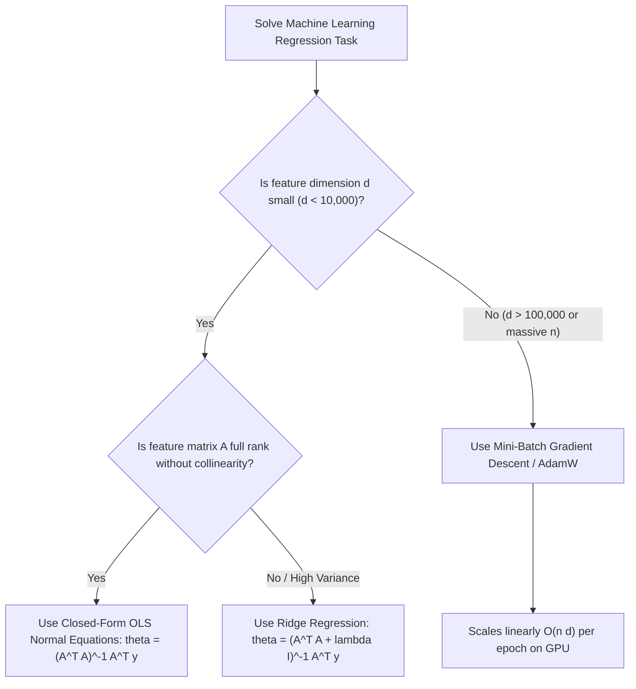

# Machine Learning Foundations: Chapter 4 — Regression, Eigenvalues, and Diagonalization

---

## 1. Linear Regression via Ordinary Least Squares & Maximum Likelihood

### A. Problem Setup & Feature Matrix Formulation

#### The Linear Regression Objective
In supervised machine learning, we are given a training dataset consisting of $n$ observations:

$$\mathcal{D} = \left\{ (\mathbf{x}_1, y_1), (\mathbf{x}_2, y_2), \dots, (\mathbf{x}_n, y_n) \right\}$$

where each input feature vector $\mathbf{x}_i \in \mathbb{R}^d$ represents $d$ measurable attributes, and each target $y_i \in \mathbb{R}$ is a real-valued continuous label.

Our goal is to learn a linear prediction function:

$$\hat{y}(\mathbf{x}) = \mathbf{x}^\top \boldsymbol{\theta} = \theta_1 x^{(1)} + \theta_2 x^{(2)} + \dots + \theta_d x^{(d)}$$

parameterized by a weight vector $\boldsymbol{\theta} \in \mathbb{R}^d$.

To evaluate model accuracy, we define the sum of squared errors (or Mean Squared Error scaled by $1/2$ for algebraic convenience):

$$L(\boldsymbol{\theta}) = \frac{1}{2} \sum_{i=1}^n \left( \mathbf{x}_i^\top \boldsymbol{\theta} - y_i \right)^2$$

---

#### 1. The Design Matrix (Feature Matrix $A$)

##### 💡 What is it really? (Deep Intuition & Mental Model)
Think of the design matrix $A$ as an organized rectangular spreadsheet where each row is a separate customer, patient, or image, and each column represents a single feature or measurement (like age, income, or square footage). When you multiply this spreadsheet by your weight vector $\boldsymbol{\theta}$, each row automatically computes that specific customer's prediction in a single parallel operation.

##### 🎯 What does it signify in Data Science & Machine Learning?
In machine learning, the feature matrix $A \in \mathbb{R}^{n \times d}$ packages your entire dataset into a single geometric linear operator. It maps your parameter vector $\boldsymbol{\theta} \in \mathbb{R}^d$ from weight space directly into the prediction vector $\hat{\mathbf{y}} = A\boldsymbol{\theta} \in \mathbb{R}^n$ living in observation space.

##### 🚀 Real-World Impact & Project Use Cases
* **Batch Forward Passes in PyTorch:** When evaluating linear layers (`torch.nn.Linear`), PyTorch executes `torch.matmul(X, weights.t())`, which is mathematically identical to computing $A\boldsymbol{\theta}$.
* **GPU Memory Layout:** Feature matrices are aligned in contiguous memory chunks (Row-Major in C/PyTorch, Column-Major in Fortran/BLAS) to saturate high-bandwidth memory (HBM) on NVIDIA tensor cores.

##### ⚙️ What Happens If It Changes? (Cause and Effect)
* **Adding more rows ($n \gg d$):** The system becomes overdetermined. There are more constraints than parameters, meaning no exact solution $A\boldsymbol{\theta} = \mathbf{y}$ exists, requiring least squares approximation.
* **Adding more columns ($d > n$):** The system becomes underdetermined. There are infinitely many weight vectors that fit the training data perfectly, leading to massive overfitting unless regularized.

* **Mathematical Definition:**
  $$A = \begin{bmatrix} \mathbf{x}_1^\top \\ \mathbf{x}_2^\top \\ \vdots \\ \mathbf{x}_n^\top \end{bmatrix} = \begin{bmatrix} x_{11} & x_{12} & \dots & x_{1d} \\ x_{21} & x_{22} & \dots & x_{2d} \\ \vdots & \vdots & \ddots & \vdots \\ x_{n1} & x_{n2} & \dots & x_{nd} \end{bmatrix} \in \mathbb{R}^{n \times d}, \quad \mathbf{y} = \begin{bmatrix} y_1 \\ y_2 \\ \vdots \\ y_n \end{bmatrix} \in \mathbb{R}^n$$

* **Vectorized Prediction & Residual:**
  $$A\boldsymbol{\theta} = \begin{bmatrix} \mathbf{x}_1^\top \boldsymbol{\theta} \\ \mathbf{x}_2^\top \boldsymbol{\theta} \\ \vdots \\ \mathbf{x}_n^\top \boldsymbol{\theta} \end{bmatrix} = \hat{\mathbf{y}}, \quad A\boldsymbol{\theta} - \mathbf{y} = \begin{bmatrix} \mathbf{x}_1^\top \boldsymbol{\theta} - y_1 \\ \mathbf{x}_2^\top \boldsymbol{\theta} - y_2 \\ \vdots \\ \mathbf{x}_n^\top \boldsymbol{\theta} - y_n \end{bmatrix}$$

* **Vectorized Squared Loss:**
  $$L(\boldsymbol{\theta}) = \frac{1}{2} (A\boldsymbol{\theta} - \mathbf{y})^\top (A\boldsymbol{\theta} - \mathbf{y}) = \frac{1}{2} \|A\boldsymbol{\theta} - \mathbf{y}\|_2^2$$

* **Example 1 (Hand Arithmetic Baseline):**
  Given $n=2$ points in $d=1$: $(x_1, y_1) = (1, 2)$ and $(x_2, y_2) = (3, 5)$.
  $$A = \begin{bmatrix} 1 \\ 3 \end{bmatrix}, \quad \mathbf{y} = \begin{bmatrix} 2 \\ 5 \end{bmatrix}$$
  For parameter $\theta = [1.5]$:
  $$A\boldsymbol{\theta} = \begin{bmatrix} 1.5 \\ 4.5 \end{bmatrix}, \quad A\boldsymbol{\theta} - \mathbf{y} = \begin{bmatrix} -0.5 \\ -0.5 \end{bmatrix}$$
  $$L(\theta) = \frac{1}{2} \left( (-0.5)^2 + (-0.5)^2 \right) = \frac{1}{2}(0.25 + 0.25) = 0.25$$

* **Example 2 (Multidimensional Housing Dataset):**
  Predicting housing prices with $d=2$ features (Square Feet in 1000s, Bedrooms) for $n=3$ homes:
  $$\mathbf{x}_1 = [1.2, 2]^\top, y_1 = 300; \quad \mathbf{x}_2 = [1.8, 3]^\top, y_2 = 450; \quad \mathbf{x}_3 = [2.4, 4]^\top, y_3 = 580$$
  $$A = \begin{bmatrix} 1.2 & 2 \\ 1.8 & 3 \\ 2.4 & 4 \end{bmatrix}, \quad \mathbf{y} = \begin{bmatrix} 300 \\ 450 \\ 580 \end{bmatrix}$$
  Notice that column 2 is exactly $1.667 \times$ column 1 in this synthetic case; this collinearity directly affects matrix invertibility, demonstrating why we analyze rank and eigenvalues.

---

### B. Derivation of the Normal Equations

#### Optimization via Vector Calculus
To minimize $L(\boldsymbol{\theta})$, we find the stationary point where the gradient with respect to $\boldsymbol{\theta}$ vanishes:

$$\nabla_{\boldsymbol{\theta}} L(\boldsymbol{\theta}) = \mathbf{0}$$

```
=============================================================================
                      EXPLICIT FORMULAS & MATRIX IDENTITIES
=============================================================================
1. Transpose of Matrix Product:
   (A B)^T = B^T A^T
2. Gradient of Linear Form with respect to vector:
   \nabla_z (c^T z) = c, \quad \nabla_z (z^T c) = c
3. Gradient of Quadratic Form with respect to vector:
   \nabla_z (z^T M z) = (M + M^T) z. If M is symmetric: \nabla_z (z^T M z) = 2 M z
4. Expansion of Squared Norm:
   ||u - v||^2 = (u - v)^T (u - v) = u^T u - 2 u^T v + v^T v
=============================================================================
```

#### Step-by-Step Algebraic Expansion:
1. *Expand the scalar loss function:*
   $$\begin{aligned}
   L(\boldsymbol{\theta}) &= \frac{1}{2} (A\boldsymbol{\theta} - \mathbf{y})^\top (A\boldsymbol{\theta} - \mathbf{y}) \\
   &= \frac{1}{2} \left( (A\boldsymbol{\theta})^\top - \mathbf{y}^\top \right) (A\boldsymbol{\theta} - \mathbf{y}) \\
   &= \frac{1}{2} \left( \boldsymbol{\theta}^\top A^\top A \boldsymbol{\theta} - \boldsymbol{\theta}^\top A^\top \mathbf{y} - \mathbf{y}^\top A \boldsymbol{\theta} + \mathbf{y}^\top \mathbf{y} \right)
   \end{aligned}$$

2. *Combine scalar inner products:*
   Since $\boldsymbol{\theta}^\top A^\top \mathbf{y}$ is a $1 \times 1$ scalar, its transpose is equal to itself:
   $$(\boldsymbol{\theta}^\top A^\top \mathbf{y})^\top = \mathbf{y}^\top (A^\top)^\top (\boldsymbol{\theta})^\top = \mathbf{y}^\top A \boldsymbol{\theta}$$
   Therefore:
   $$L(\boldsymbol{\theta}) = \frac{1}{2} \boldsymbol{\theta}^\top A^\top A \boldsymbol{\theta} - \boldsymbol{\theta}^\top A^\top \mathbf{y} + \frac{1}{2} \mathbf{y}^\top \mathbf{y}$$

3. *Compute the gradient with respect to $\boldsymbol{\theta}$:*
   * Derivative of the quadratic term $\frac{1}{2} \boldsymbol{\theta}^\top (A^\top A) \boldsymbol{\theta}$:
     $$\nabla_{\boldsymbol{\theta}} \left( \frac{1}{2} \boldsymbol{\theta}^\top A^\top A \boldsymbol{\theta} \right) = \frac{1}{2} (A^\top A + (A^\top A)^\top) \boldsymbol{\theta} = \frac{1}{2} (2 A^\top A) \boldsymbol{\theta} = A^\top A \boldsymbol{\theta}$$
   * Derivative of the linear term $-\boldsymbol{\theta}^\top (A^\top \mathbf{y})$:
     $$\nabla_{\boldsymbol{\theta}} \left( -\boldsymbol{\theta}^\top A^\top \mathbf{y} \right) = -A^\top \mathbf{y}$$
   * Derivative of the constant term $\frac{1}{2} \mathbf{y}^\top \mathbf{y}$:
     $$\nabla_{\boldsymbol{\theta}} \left( \frac{1}{2} \mathbf{y}^\top \mathbf{y} \right) = \mathbf{0}$$

4. *Assemble the full gradient:*
   $$\nabla_{\boldsymbol{\theta}} L(\boldsymbol{\theta}) = A^\top A \boldsymbol{\theta} - A^\top \mathbf{y} = A^\top (A\boldsymbol{\theta} - \mathbf{y})$$

5. *Equate gradient to zero:*
   $$A^\top (A\boldsymbol{\theta} - \mathbf{y}) = \mathbf{0} \iff A^\top A \boldsymbol{\theta} = A^\top \mathbf{y}$$

This fundamental linear system is known as the **Normal Equations**.

---

### C. Invertibility of the Gram Matrix $A^\top A$

Can we always write the closed-form analytical solution as $\hat{\boldsymbol{\theta}} = (A^\top A)^{-1} A^\top \mathbf{y}$?
Only if $A^\top A \in \mathbb{R}^{d \times d}$ is non-singular (invertible).

#### Theorem: $N(A^\top A) = N(A)$
The nullspace of $A^\top A$ is identical to the nullspace of $A$.

```
=============================================================================
                              FORMAL PROOF
=============================================================================
Direction 1: Show that N(A) \subseteq N(A^T A)
Let x \in N(A). By definition of nullspace:
    A x = 0
Multiply on the left by A^T:
    A^T (A x) = A^T 0 = 0
    (A^T A) x = 0
Therefore, x \in N(A^T A). This proves N(A) \subseteq N(A^T A).

Direction 2: Show that N(A^T A) \subseteq N(A)
Let x \in N(A^T A). By definition:
    (A^T A) x = 0
Multiply on the left by x^T:
    x^T (A^T A x) = x^T 0 = 0
Using associativity and transpose properties:
    (A x)^T (A x) = 0
    ||A x||_2^2 = 0
The only vector with Euclidean norm equal to 0 is the zero vector itself:
    A x = 0
Therefore, x \in N(A). This proves N(A^T A) \subseteq N(A).

Conclusion:
Since N(A) \subseteq N(A^T A) and N(A^T A) \subseteq N(A), we conclude:
    N(A^T A) = N(A)
=============================================================================
```

#### Corollaries & Matrix Rank:
1. **Rank Equality:**
   $$\operatorname{dim}(N(A^\top A)) = \operatorname{dim}(N(A))$$
   By the Rank-Nullity Theorem:
   $$\operatorname{rank}(A^\top A) = d - \operatorname{dim}(N(A^\top A)) = d - \operatorname{dim}(N(A)) = \operatorname{rank}(A)$$
2. **Invertibility Criterion:**
   The $d \times d$ matrix $A^\top A$ is invertible if and only if its rank is $d$, which happens if and only if $\operatorname{rank}(A) = d$.
   This means **the columns of $A$ must be linearly independent** (no redundant features, and $n \ge d$).

---

### D. Probabilistic Justification: Maximum Likelihood Estimation (MLE)

Why do machine learning practitioners choose the squared error $(y - \hat{y})^2$ rather than absolute error $|y - \hat{y}|$ or quartic error $(y - \hat{y})^4$?
The Ordinary Least Squares objective is not an arbitrary heuristic—it is the direct mathematical consequence of **Maximum Likelihood Estimation under additive Gaussian noise**.

#### Generative Model Setup:
Assume the true data-generating process is:

$$y_i = \mathbf{x}_i^\top \boldsymbol{\theta} + \epsilon_i$$

where $\epsilon_i$ represents unobserved measurement noise drawn independently and identically distributed (i.i.d.) from a zero-mean Gaussian distribution with precision parameter $\beta > 0$ (where variance $\sigma^2 = 1/\beta$):

$$\epsilon_i \sim \mathcal{N}\left(0, \sigma^2 = \frac{1}{\beta}\right)$$

The probability density function for noise is:

$$p(\epsilon_i) = \frac{1}{\sqrt{2\pi \sigma^2}} \exp\left(-\frac{\epsilon_i^2}{2\sigma^2}\right) = \sqrt{\frac{\beta}{2\pi}} \exp\left(-\frac{\beta}{2} \epsilon_i^2\right)$$

Since $y_i - \mathbf{x}_i^\top \boldsymbol{\theta} = \epsilon_i$, the conditional distribution of $y_i$ given $\mathbf{x}_i$ is:

$$p(y_i \mid \mathbf{x}_i; \boldsymbol{\theta}) = \sqrt{\frac{\beta}{2\pi}} \exp\left(-\frac{\beta}{2} (y_i - \mathbf{x}_i^\top \boldsymbol{\theta})^2\right)$$

#### The Likelihood Function:
Due to the i.i.d. assumption, the joint likelihood of observing the entire dataset $\mathcal{D}$ is the product of individual marginal densities:

$$L(\boldsymbol{\theta}) = \prod_{i=1}^n p(y_i \mid \mathbf{x}_i; \boldsymbol{\theta}) = \prod_{i=1}^n \left[ \sqrt{\frac{\beta}{2\pi}} \exp\left(-\frac{\beta}{2} (y_i - \mathbf{x}_i^\top \boldsymbol{\theta})^2\right) \right]$$

#### Maximizing the Log-Likelihood:
Because the natural logarithm $\ln(z)$ is a strictly monotonically increasing function for $z > 0$, maximizing $L(\boldsymbol{\theta})$ yields the exact same optimal parameter $\hat{\boldsymbol{\theta}}$ as maximizing $\ln L(\boldsymbol{\theta})$:

$$\arg\max_{\boldsymbol{\theta}} L(\boldsymbol{\theta}) = \arg\max_{\boldsymbol{\theta}} \ln L(\boldsymbol{\theta})$$

Let us expand $\ln L(\boldsymbol{\theta})$ step-by-step:
$$\begin{aligned}
\ln L(\boldsymbol{\theta}) &= \ln \left( \prod_{i=1}^n \sqrt{\frac{\beta}{2\pi}} \exp\left(-\frac{\beta}{2} (y_i - \mathbf{x}_i^\top \boldsymbol{\theta})^2\right) \right) \\
&= \sum_{i=1}^n \ln \left( \sqrt{\frac{\beta}{2\pi}} \exp\left(-\frac{\beta}{2} (y_i - \mathbf{x}_i^\top \boldsymbol{\theta})^2\right) \right) \\
&= \sum_{i=1}^n \left[ \frac{1}{2} \ln \beta - \frac{1}{2} \ln(2\pi) - \frac{\beta}{2} (y_i - \mathbf{x}_i^\top \boldsymbol{\theta})^2 \right] \\
&= \frac{n}{2} \ln \beta - \frac{n}{2} \ln(2\pi) - \beta \left[ \frac{1}{2} \sum_{i=1}^n (y_i - \mathbf{x}_i^\top \boldsymbol{\theta})^2 \right]
\end{aligned}$$

#### The Fundamental Connection:
Notice the terms:
* $\frac{n}{2} \ln \beta - \frac{n}{2} \ln(2\pi)$ is a constant with respect to $\boldsymbol{\theta}$.
* The coefficient $\beta > 0$ is a positive constant.
* Therefore:
  $$\arg\max_{\boldsymbol{\theta}} \ln L(\boldsymbol{\theta}) = \arg\max_{\boldsymbol{\theta}} \left( - \beta \left[ \frac{1}{2} \sum_{i=1}^n (y_i - \mathbf{x}_i^\top \boldsymbol{\theta})^2 \right] \right) = \arg\min_{\boldsymbol{\theta}} \left[ \frac{1}{2} \sum_{i=1}^n (y_i - \mathbf{x}_i^\top \boldsymbol{\theta})^2 \right]$$

> **Key Theoretical Takeaway:** Minimizing the Mean Squared Error is mathematically equivalent to Maximum Likelihood Estimation of a linear model corrupted by Gaussian noise.

---

## 2. Polynomial Regression & Regularization (Ridge)

### A. Polynomial Feature Transformation

Linear regression models the relationship as linear in the input features $\mathbf{x}$. When data exhibits nonlinear curves, we can fit a higher-degree polynomial without changing the linear regression solver!

For a 1D scalar feature $x \in \mathbb{R}$, a polynomial hypothesis of degree $m$ is:

$$\hat{y}(x) = \theta_0 + \theta_1 x + \theta_2 x^2 + \dots + \theta_m x^m = \sum_{j=0}^m \theta_j \phi_j(x)$$

where the basis functions are powers of $x$: $\phi_j(x) = x^j$.

```
=============================================================================
                  THE NONLINEAR FEATURE LIFTING TRICK
=============================================================================
Input Space (1D):               x \in R
Transformed Feature Space:      \phi(x) = [1, x, x^2, x^3, ..., x^m]^T \in R^{m+1}
Prediction Equation:            \hat{y}(x) = \theta^T \phi(x)
=============================================================================
```

Although the prediction curve $\hat{y}(x)$ is nonlinear with respect to the input coordinate $x$, it remains **strictly linear with respect to the parameter vector $\boldsymbol{\theta}$**.

#### Transformed Feature Matrix (Vandermonde Matrix):
For $n$ data points $\{x_1, x_2, \dots, x_n\}$, the design matrix becomes:

$$A = \begin{bmatrix} \boldsymbol{\phi}(x_1)^\top \\ \boldsymbol{\phi}(x_2)^\top \\ \vdots \\ \boldsymbol{\phi}(x_n)^\top \end{bmatrix} = \begin{bmatrix} 1 & x_1 & x_1^2 & \dots & x_1^m \\ 1 & x_2 & x_2^2 & \dots & x_2^m \\ \vdots & \vdots & \vdots & \ddots & \vdots \\ 1 & x_n & x_n^2 & \dots & x_n^m \end{bmatrix} \in \mathbb{R}^{n \times (m+1)}$$

The optimal parameters are obtained by solving the exact same normal equations:

$$(A^\top A) \boldsymbol{\theta} = A^\top \mathbf{y}$$

---

### B. Ridge Regression ($L_2$ Regularization)

#### The Problem of Overfitting and Ill-Conditioning
As the polynomial degree $m$ increases:
1. When $m+1 > n$, the matrix $A^\top A$ is rank-deficient and cannot be inverted.
2. Even when $n > m+1$, columns like $x^2, x^3, x^4$ become highly collinear, causing $A^\top A$ to have eigenvalues extremely close to zero (an astronomical condition number $\kappa(A^\top A) \gg 10^6$).
3. The weights $\theta_j$ explode to massive positive and negative values that cancel each other out, producing wildly oscillating predictions between training points.

#### The Regularized Objective
To suppress large parameter values, we penalize the squared $L_2$ norm of the weight vector:

$$\min_{\boldsymbol{\theta}} \bar{L}(\boldsymbol{\theta}) = \frac{1}{2} \sum_{i=1}^n (\mathbf{x}_i^\top \boldsymbol{\theta} - y_i)^2 + \frac{\lambda}{2} \|\boldsymbol{\theta}\|_2^2 = \frac{1}{2} \|A\boldsymbol{\theta} - \mathbf{y}\|_2^2 + \frac{\lambda}{2} \boldsymbol{\theta}^\top \boldsymbol{\theta}$$

where $\lambda > 0$ is the regularization hyperparameter.

#### Step-by-Step Derivation of Ridge Normal Equations:
1. *Compute gradient:*
   $$\nabla_{\boldsymbol{\theta}} \bar{L}(\boldsymbol{\theta}) = \nabla_{\boldsymbol{\theta}} \left[ \frac{1}{2} (A\boldsymbol{\theta} - \mathbf{y})^\top (A\boldsymbol{\theta} - \mathbf{y}) \right] + \nabla_{\boldsymbol{\theta}} \left[ \frac{\lambda}{2} \boldsymbol{\theta}^\top \boldsymbol{\theta} \right]$$
2. *Evaluate each gradient:*
   $$\nabla_{\boldsymbol{\theta}} \left[ \frac{1}{2} (A\boldsymbol{\theta} - \mathbf{y})^\top (A\boldsymbol{\theta} - \mathbf{y}) \right] = A^\top (A\boldsymbol{\theta} - \mathbf{y}) = A^\top A \boldsymbol{\theta} - A^\top \mathbf{y}$$
   $$\nabla_{\boldsymbol{\theta}} \left[ \frac{\lambda}{2} \boldsymbol{\theta}^\top \boldsymbol{\theta} \right] = \lambda \boldsymbol{\theta} = \lambda I \boldsymbol{\theta}$$
3. *Equate sum to zero:*
   $$A^\top A \boldsymbol{\theta} - A^\top \mathbf{y} + \lambda I \boldsymbol{\theta} = \mathbf{0} \iff (A^\top A + \lambda I) \boldsymbol{\theta}_{\text{reg}} = A^\top \mathbf{y}$$
4. *Closed-Form Solution:*
   $$\boldsymbol{\theta}_{\text{reg}} = (A^\top A + \lambda I)^{-1} A^\top \mathbf{y}$$

---

#### 2. Guaranteed Invertibility of $A^\top A + \lambda I$

##### 💡 What is it really? (Deep Intuition & Mental Model)
Imagine a sagging, wobbly bridge that is threatening to collapse because its foundation has zero strength in certain directions (zero eigenvalues). Adding $\lambda I$ is like driving sturdy support pillars into every single coordinate axis. Even if the original structure had zero support in some directions, every direction now has a guaranteed stiffness of at least $\lambda$. The bridge can never wobble or collapse.

##### 🎯 What does it signify in Data Science & Machine Learning?
In machine learning, adding $\lambda I$ to $A^\top A$ provides a **mathematical guarantee of non-singularity**. It shifts every single eigenvalue of $A^\top A$ upward by $\lambda$. Even if $A^\top A$ is completely singular (with zero eigenvalues due to collinear features or fewer samples than features), $(A^\top A + \lambda I)$ is strictly positive definite and always invertible!

##### 🚀 Real-World Impact & Project Use Cases
* **Scikit-Learn Ridge / RidgeCV:** Powers `sklearn.linear_model.Ridge(alpha=1.0)`, providing robust regression that never throws singular matrix exceptions.
* **Weight Decay in Deep Learning:** In PyTorch AdamW or SGD with `weight_decay = 1e-4`, the gradient update $w \leftarrow w - \eta (\nabla L + \lambda w)$ is the exact iterative gradient equivalent of the $L_2$ penalty $\frac{\lambda}{2} \|w\|^2$.

##### ⚙️ What Happens If It Changes? (Cause and Effect)
* **$\lambda \to 0$:** Regularization vanishes. The model converges to Ordinary Least Squares. If $A$ is collinear or $d > n$, matrix inversion fails or explodes into massive numerical instability. Overfitting risk is high.
* **$\lambda \to \infty$:** The penalty dominates the data. $(A^\top A + \lambda I)^{-1} \to \frac{1}{\lambda} I \to 0$, driving all parameter weights $\boldsymbol{\theta} \to \mathbf{0}$. The model severely underfits, predicting a flat line.

```
=============================================================================
               PROOF THAT (A^T A + \lambda I) IS STRICTLY INVERTIBLE
=============================================================================
Let A \in R^{n \times d} be any arbitrary matrix (full rank or rank-deficient).
Let \lambda > 0.
To prove that (A^T A + \lambda I) is invertible, we show that its nullspace
contains only the zero vector: N(A^T A + \lambda I) = {0}.

Let v \in R^d be any vector such that:
    (A^T A + \lambda I) v = 0

Multiply on the left by v^T:
    v^T (A^T A + \lambda I) v = 0
    v^T A^T A v + \lambda v^T I v = 0
    (A v)^T (A v) + \lambda v^T v = 0
    ||A v||_2^2 + \lambda ||v||_2^2 = 0

Analyze the two terms:
1. ||A v||_2^2 \ge 0 (squared Euclidean norm is always non-negative).
2. ||v||_2^2 \ge 0, and since \lambda > 0, the term \lambda ||v||_2^2 \ge 0.

The sum of two non-negative terms can only equal zero if both terms are zero:
    \lambda ||v||_2^2 = 0

Since \lambda > 0:
    ||v||_2^2 = 0 \implies v = 0.

Therefore, no non-zero vector v can satisfy (A^T A + \lambda I) v = 0.
The nullspace contains only {0}, proving (A^T A + \lambda I) is strictly
positive definite and invertible for any \lambda > 0, regardless of the rank of A.
=============================================================================
```

---

## 3. Eigenvalues and Eigenvectors

### A. Motivation: Coupled Dynamical Systems

Consider a system of coupled first-order linear ordinary differential equations:

$$\begin{cases} \frac{dv}{dt} = 4v - 5w, & v(0) = 8 \\ \frac{dw}{dt} = 2v - 3w, & w(0) = 5 \end{cases}$$

Writing this in matrix-vector form:

$$\mathbf{u}(t) = \begin{bmatrix} v(t) \\ w(t) \end{bmatrix}, \quad \mathbf{u}(0) = \begin{bmatrix} 8 \\ 5 \end{bmatrix}, \quad A = \begin{bmatrix} 4 & -5 \\ 2 & -3 \end{bmatrix}$$

The system becomes:

$$\frac{d\mathbf{u}}{dt} = A\mathbf{u}$$

#### The Scalar Baseline:
In a 1D single equation $\frac{du}{dt} = au$, the solution is a simple exponential curve:

$$u(t) = e^{at} u(0)$$

* If $a > 0$: system is **unstable** (explodes to $+\infty$ as $t \to \infty$).
* If $a = 0$: system is **neutrally stable** (remains constant).
* If $a < 0$: system is **stable** (decays smoothly to $0$).

#### Extending to Multi-Dimensional Systems:
To solve $\frac{d\mathbf{u}}{dt} = A\mathbf{u}$, can we find solutions that behave like pure exponentials?
Let us test an ansatz of the form:

$$\mathbf{u}(t) = e^{\lambda t} \mathbf{x}, \quad \text{where } \mathbf{x} = \begin{bmatrix} y \\ z \end{bmatrix} \neq \mathbf{0}$$

Substituting into the differential equation:

$$\frac{d}{dt} \left( e^{\lambda t} \mathbf{x} \right) = \lambda e^{\lambda t} \mathbf{x}$$
$$A \mathbf{u}(t) = A (e^{\lambda t} \mathbf{x}) = e^{\lambda t} (A\mathbf{x})$$

Equating both sides:

$$\lambda e^{\lambda t} \mathbf{x} = e^{\lambda t} A\mathbf{x}$$

Dividing both sides by the non-zero scalar $e^{\lambda t}$:

$$A\mathbf{x} = \lambda \mathbf{x}$$

This is the famous **eigenvalue equation**.

---

### B. Formal Definition & Geometric Mental Model

#### 1. Eigenvalues and Eigenvectors

##### 💡 What is it really? (Deep Intuition & Mental Model)
When a matrix multiplies a generic vector, it does two things simultaneously: it **rotates** the vector and it **stretches/shrinks** it. 
However, for every square matrix, there exist special directions called **eigenvectors** where **no rotation occurs at all**! Along these privileged axes, multiplying by the matrix simply scales the vector like an ordinary number $\lambda$. The scalar factor $\lambda$ is the **eigenvalue**.

```
    Generic Vector v:                         Eigenvector x:
       Av (Rotated and Scaled)                    Ax = \lambda x (Pure Scaling)
           ^                                          ^
          /                                          /
         /                                          /  Ax
        /                                          /  /
       +-----> v                                  +--/--> x (Same direction!)
```

##### 🎯 What does it signify in Data Science & Machine Learning?
In machine learning, eigenvectors reveal the **natural coordinate axes of variation**. 
* In data covariance matrices, the eigenvector with the largest eigenvalue represents the direction of greatest information and feature variance (Principal Component Analysis).
* In graph adjacency matrices, eigenvectors partition clusters and measure node centrality (PageRank, Spectral Clustering).
* In optimization loss surfaces, eigenvectors of the Hessian matrix point along the axes of maximum and minimum curvature, dictating learning rate limits.

##### 🚀 Real-World Impact & Project Use Cases
* **Google PageRank:** The original PageRank algorithm computes the dominant eigenvector ($\lambda = 1$) of the web transition probability matrix $P$, ranking web pages by steady-state importance.
* **Low-Rank LoRA Adaptation:** Analyzing the eigenvalue spectrum of Transformer weight matrices allows engineers to compress billions of weights into rank-8 or rank-16 adapter modules.

##### ⚙️ What Happens If It Changes? (Cause and Effect)
* **Eigenvalue $\lambda = 0$:** The matrix crushes that direction flat down to the origin ($A\mathbf{x} = \mathbf{0}$). This means $\mathbf{x}$ lies in the nullspace $N(A)$, and the matrix is non-invertible.
* **Eigenvalue $|\lambda| > 1$ in recurrent systems:** Repeated multiplication $A^k \mathbf{x} = \lambda^k \mathbf{x}$ explodes exponentially ($|\lambda|^k \to \infty$), causing the **exploding gradient problem** in RNNs and deep networks.
* **Eigenvalue $|\lambda| < 1$ in recurrent systems:** Repeated multiplication vanishes to zero ($|\lambda|^k \to 0$), causing the **vanishing gradient problem**.

* **Formal Definition:**
  Let $A \in \mathbb{R}^{n \times n}$ be an $n \times n$ square matrix. A scalar $\lambda \in \mathbb{C}$ is an **eigenvalue** of $A$ if there exists a **non-zero vector** $\mathbf{x} \in \mathbb{C}^n$ ($\mathbf{x} \neq \mathbf{0}$) such that:
  $$A\mathbf{x} = \lambda \mathbf{x}$$
  The non-zero vector $\mathbf{x}$ is called an **eigenvector** of $A$ corresponding to eigenvalue $\lambda$.

---

### C. Canonical Geometric Examples

#### Example 1: Projection Matrix $P$
Let $P \in \mathbb{R}^{3 \times 3}$ be a projection matrix projecting any 3D vector onto the 2D $xy$-plane.
1. Take any vector $\mathbf{x}$ lying directly inside the $xy$-plane:
   $$P\mathbf{x} = \mathbf{x} = 1 \cdot \mathbf{x} \implies \boldsymbol{\lambda_1 = 1}$$
   Every vector in the plane is an eigenvector with eigenvalue $\lambda = 1$.
2. Take any vector $\mathbf{z}$ perpendicular to the plane (along the $z$-axis):
   $$P\mathbf{z} = \mathbf{0} = 0 \cdot \mathbf{z} \implies \boldsymbol{\lambda_2 = 0}$$
   Every vector orthogonal to the subspace is an eigenvector with eigenvalue $\lambda = 0$.

#### Example 2: Permutation / Reflection Matrix $B$
Consider the permutation matrix that swaps the coordinates of a 2D vector:
$$B = \begin{bmatrix} 0 & 1 \\ 1 & 0 \end{bmatrix}$$
1. Let $\mathbf{x}_1 = \begin{bmatrix} 1 \\ 1 \end{bmatrix}$:
   $$B\mathbf{x}_1 = \begin{bmatrix} 0 & 1 \\ 1 & 0 \end{bmatrix} \begin{bmatrix} 1 \\ 1 \end{bmatrix} = \begin{bmatrix} 1 \\ 1 \end{bmatrix} = 1 \cdot \mathbf{x}_1 \implies \boldsymbol{\lambda_1 = 1}$$
2. Let $\mathbf{x}_2 = \begin{bmatrix} 1 \\ -1 \end{bmatrix}$:
   $$B\mathbf{x}_2 = \begin{bmatrix} 0 & 1 \\ 1 & 0 \end{bmatrix} \begin{bmatrix} 1 \\ -1 \end{bmatrix} = \begin{bmatrix} -1 \\ 1 \end{bmatrix} = -1 \cdot \begin{bmatrix} 1 \\ -1 \end{bmatrix} = -1 \cdot \mathbf{x}_2 \implies \boldsymbol{\lambda_2 = -1}$$

---

### D. Finding Eigenvalues & Eigenvectors Algebraically

#### 1. The Characteristic Polynomial
Rewrite the eigenvalue equation:

$$A\mathbf{x} = \lambda \mathbf{x} \iff A\mathbf{x} - \lambda I \mathbf{x} = \mathbf{0} \iff (A - \lambda I)\mathbf{x} = \mathbf{0}$$

For a non-zero solution $\mathbf{x} \neq \mathbf{0}$ to exist, the matrix $(A - \lambda I)$ must have a non-trivial nullspace, which means it **must be singular** (non-invertible).
A square matrix is singular if and only if its determinant is zero:

$$\det(A - \lambda I) = 0$$

Expanding this determinant produces a polynomial in $\lambda$ of degree $n$, known as the **characteristic polynomial**:

$$p(\lambda) = \det(A - \lambda I) = (-1)^n \lambda^n + c_{n-1} \lambda^{n-1} + \dots + c_1 \lambda + c_0$$

The $n$ roots of this polynomial (counted with algebraic multiplicity) are the eigenvalues of $A$.

#### 2. Fundamental Properties: Trace and Determinant
For any $n \times n$ matrix with eigenvalues $\lambda_1, \lambda_2, \dots, \lambda_n$:
1. **Sum of Eigenvalues equals Trace:**
   $$\sum_{i=1}^n \lambda_i = \operatorname{trace}(A) = \sum_{i=1}^n a_{ii}$$
2. **Product of Eigenvalues equals Determinant:**
   $$\prod_{i=1}^n \lambda_i = \det(A)$$

---

#### Fully Worked Numerical Example:
Let $A = \begin{bmatrix} 3 & 1 \\ 1 & 3 \end{bmatrix}$.

```
=============================================================================
               STEP-BY-STEP CALCULATION OF EIGENVALUES & VECTORS
=============================================================================
Step 1: Set up the characteristic equation
    det(A - \lambda I) = det([ 3 - \lambda,      1     ]
                             [     1     ,  3 - \lambda ]) = 0

Step 2: Compute determinant
    (3 - \lambda)(3 - \lambda) - (1)(1) = 0
    9 - 6\lambda + \lambda^2 - 1 = 0
    \lambda^2 - 6\lambda + 8 = 0

Step 3: Factor characteristic equation
    (\lambda - 4)(\lambda - 2) = 0
    ==> \lambda_1 = 4,   \lambda_2 = 2

Verify using Trace and Determinant:
    Trace:       \lambda_1 + \lambda_2 = 4 + 2 = 6.   trace(A) = 3 + 3 = 6. (Match!)
    Determinant: \lambda_1 * \lambda_2 = 4 * 2 = 8.   det(A) = 3(3) - 1(1) = 8. (Match!)

Step 4: Find Eigenvector for \lambda_1 = 4:
    Solve (A - 4 I) x = 0:
    [ 3 - 4    1   ] [ x_1 ]   [ -1   1 ] [ x_1 ]   [ 0 ]
    [   1    3 - 4 ] [ x_2 ] = [  1  -1 ] [ x_2 ] = [ 0 ]
    Equation: -x_1 + x_2 = 0 ==> x_1 = x_2.
    Eigenvector: x_1 = [ 1, 1 ]^T.

Step 5: Find Eigenvector for \lambda_2 = 2:
    Solve (A - 2 I) x = 0:
    [ 3 - 2    1   ] [ x_1 ]   [ 1   1 ] [ x_1 ]   [ 0 ]
    [   1    3 - 2 ] [ x_2 ] = [ 1   1 ] [ x_2 ] = [ 0 ]
    Equation: x_1 + x_2 = 0 ==> x_1 = -x_2.
    Eigenvector: x_2 = [ 1, -1 ]^T.
=============================================================================
```

---

### E. Shifting, Non-Real Roots, and Defective Matrices

#### 1. Matrix Shifting by Identity ($A + cI$)
If $A\mathbf{x} = \lambda \mathbf{x}$, what are the eigenvalues and eigenvectors of $(A + cI)$?

$$(A + cI)\mathbf{x} = A\mathbf{x} + cI\mathbf{x} = \lambda \mathbf{x} + c\mathbf{x} = (\lambda + c)\mathbf{x}$$

> **Theorem:** Shifting a matrix by $cI$ adds $c$ to every eigenvalue while leaving the eigenvectors completely unchanged.

In our earlier example, notice that:
$$A = \begin{bmatrix} 3 & 1 \\ 1 & 3 \end{bmatrix} = \begin{bmatrix} 0 & 1 \\ 1 & 0 \end{bmatrix} + 3 \begin{bmatrix} 1 & 0 \\ 0 & 1 \end{bmatrix} = B + 3I$$
The eigenvalues of $B$ were $+1$ and $-1$.
The eigenvalues of $A = B + 3I$ are $1 + 3 = 4$ and $-1 + 3 = 2$, with the exact same eigenvectors $[1, 1]^\top$ and $[1, -1]^\top$!

#### 2. Non-Real (Complex) Eigenvalues
Does every real matrix have real eigenvalues? **No.**
Consider a 90-degree counterclockwise rotation matrix in $\mathbb{R}^2$:

$$R = \begin{bmatrix} 0 & -1 \\ 1 & 0 \end{bmatrix}$$

$$\det(R - \lambda I) = \det\begin{bmatrix} -\lambda & -1 \\ 1 & -\lambda \end{bmatrix} = \lambda^2 - (-1) = \lambda^2 + 1 = 0 \implies \lambda = \pm i$$

Geometric intuition: A 90-degree rotation turns every non-zero vector in the 2D plane perpendicular to itself. No real vector can maintain its direction! Hence, eigenvalues must be imaginary.

#### 3. Defective Matrices (Non-Diagonalizable)
Does an $n \times n$ matrix always have $n$ linearly independent eigenvectors? **No.**
Consider the shear matrix:

$$M = \begin{bmatrix} 3 & 1 \\ 0 & 3 \end{bmatrix}$$

$$\det(M - \lambda I) = (3 - \lambda)^2 = 0 \implies \lambda_1 = 3, \lambda_2 = 3 \quad (\text{Algebraic Multiplicity } = 2)$$

To find eigenvectors, solve $(M - 3I)\mathbf{x} = \mathbf{0}$:

$$\begin{bmatrix} 0 & 1 \\ 0 & 0 \end{bmatrix} \begin{bmatrix} x_1 \\ x_2 \end{bmatrix} = \begin{bmatrix} 0 \\ 0 \end{bmatrix} \implies 0 \cdot x_1 + 1 \cdot x_2 = 0 \implies x_2 = 0$$

Any eigenvector must have the form $\mathbf{x} = \begin{bmatrix} x_1 \\ 0 \end{bmatrix} = x_1 \begin{bmatrix} 1 \\ 0 \end{bmatrix}$.
The nullspace of $(M - 3I)$ is 1-dimensional ($\text{Geometric Multiplicity } = 1 < 2$).
There is only one linearly independent eigenvector. Such a matrix is called **defective** and **cannot be diagonalized**.

---

## 4. Similarity and Diagonalization

### A. The Diagonalization Theorem

#### 1. Diagonalization Formulation

##### 💡 What is it really? (Deep Intuition & Mental Model)
Diagonalization is like changing your glasses to a pair that untangles a complicated, messy machine into independent, separate dials. In standard coordinates, the matrix mixes up all variables together. But when you rotate into the coordinate system defined by the matrix's eigenvectors, each coordinate axis evolves completely independently according to its own eigenvalue $\lambda_i$.

##### 🎯 What does it signify in Data Science & Machine Learning?
In machine learning, diagonalization decouples multivariate interactions. 
* In multivariate optimization, diagonalizing the Hessian decouples gradient descent updates along separate orthogonal directions, explaining why techniques like momentum and adaptive learning rates (Adam, RMSProp) succeed.
* In Graph Convolutional Networks (GCNs), diagonalizing the graph Laplacian matrix enables spectral graph convolutions via the Graph Fourier Transform.

##### 🚀 Real-World Impact & Project Use Cases
* **Fast Matrix Exponentiation & Graph Diffusion:** Computing information spread in social networks requires powers of adjacency matrices $A^k$. Diagonalization reduces the cost of $A^k$ from $O(k n^3)$ to a single eigendecomposition $O(n^3)$ followed by $O(n)$ scalar powers $\Lambda^k$.

##### ⚙️ What Happens If It Changes? (Cause and Effect)
* **If a matrix is NOT diagonalizable (defective):** It cannot be decomposed into $S \Lambda S^{-1}$. In such cases, linear algebra must resort to the Jordan Canonical Form or Singular Value Decomposition (SVD).

* **Formal Definition:**
  An $n \times n$ matrix $A$ is **diagonalizable** if there exists an invertible matrix $S \in \mathbb{R}^{n \times n}$ and a diagonal matrix $\Lambda \in \mathbb{R}^{n \times n}$ such that:
  $$S^{-1} A S = \Lambda \iff A = S \Lambda S^{-1}$$
  where:
  $$S = \begin{bmatrix} \mathbf{x}_1 & \mathbf{x}_2 & \dots & \mathbf{x}_n \end{bmatrix}, \quad \Lambda = \begin{bmatrix} \lambda_1 & 0 & \dots & 0 \\ 0 & \lambda_2 & \dots & 0 \\ \vdots & \vdots & \ddots & \vdots \\ 0 & 0 & \dots & \lambda_n \end{bmatrix}$$

---

#### The Derivation $AS = S\Lambda$:
Let $A$ have $n$ linearly independent eigenvectors $\mathbf{x}_1, \dots, \mathbf{x}_n$ with eigenvalues $\lambda_1, \dots, \lambda_n$.
Assemble the eigenvectors as columns of $S$:

$$AS = A \begin{bmatrix} \mathbf{x}_1 & \mathbf{x}_2 & \dots & \mathbf{x}_n \end{bmatrix} = \begin{bmatrix} A\mathbf{x}_1 & A\mathbf{x}_2 & \dots & A\mathbf{x}_n \end{bmatrix}$$

Since $A\mathbf{x}_j = \lambda_j \mathbf{x}_j$:

$$AS = \begin{bmatrix} \lambda_1 \mathbf{x}_1 & \lambda_2 \mathbf{x}_2 & \dots & \lambda_n \mathbf{x}_n \end{bmatrix}$$

Notice that multiplying $S$ on the right by the diagonal matrix $\Lambda$ scales the $j$-th column of $S$ by $\lambda_j$:

$$S \Lambda = \begin{bmatrix} \mathbf{x}_1 & \mathbf{x}_2 & \dots & \mathbf{x}_n \end{bmatrix} \begin{bmatrix} \lambda_1 & 0 & \dots & 0 \\ 0 & \lambda_2 & \dots & 0 \\ \vdots & \vdots & \ddots & \vdots \\ 0 & 0 & \dots & \lambda_n \end{bmatrix} = \begin{bmatrix} \lambda_1 \mathbf{x}_1 & \lambda_2 \mathbf{x}_2 & \dots & \lambda_n \mathbf{x}_n \end{bmatrix}$$

Therefore:

$$AS = S\Lambda$$

Since the columns of $S$ are $n$ linearly independent eigenvectors, $\operatorname{rank}(S) = n$, meaning $S$ is invertible ($S^{-1}$ exists).
Multiplying on the left by $S^{-1}$:

$$S^{-1} A S = \Lambda$$

---

### B. Linear Independence of Eigenvectors from Distinct Eigenvalues

#### Theorem: Distinct Eigenvalues Guarantee Independent Eigenvectors
If $\lambda_1, \lambda_2, \dots, \lambda_k$ are distinct eigenvalues ($\lambda_i \neq \lambda_j$ for $i \neq j$) of a matrix $A$ with corresponding eigenvectors $\mathbf{x}_1, \mathbf{x}_2, \dots, \mathbf{x}_k$, then the set $\{\mathbf{x}_1, \mathbf{x}_2, \dots, \mathbf{x}_k\}$ is **linearly independent**.

```
=============================================================================
                      STEP-BY-STEP PROOF FOR k = 2
=============================================================================
Assume for contradiction that {x_1, x_2} is linearly dependent.
Then there exist scalars c_1, c_2, not both zero, such that:
    c_1 x_1 + c_2 x_2 = 0           --- Equation (1)

Multiply Equation (1) on the left by matrix A:
    A (c_1 x_1 + c_2 x_2) = A 0
    c_1 A x_1 + c_2 A x_2 = 0
Since A x_1 = \lambda_1 x_1 and A x_2 = \lambda_2 x_2:
    c_1 \lambda_1 x_1 + c_2 \lambda_2 x_2 = 0    --- Equation (2)

Now multiply Equation (1) by the scalar \lambda_2:
    c_1 \lambda_2 x_1 + c_2 \lambda_2 x_2 = 0    --- Equation (3)

Subtract Equation (3) from Equation (2):
    (c_1 \lambda_1 x_1 + c_2 \lambda_2 x_2) - (c_1 \lambda_2 x_1 + c_2 \lambda_2 x_2) = 0
    c_1 (\lambda_1 - \lambda_2) x_1 = 0

Analyze this equality:
1. By definition of eigenvectors, x_1 \neq 0.
2. By hypothesis, the eigenvalues are distinct: \lambda_1 \neq \lambda_2 \implies (\lambda_1 - \lambda_2) \neq 0.

Therefore, the only way the product can equal zero is:
    c_1 = 0.

Substitute c_1 = 0 back into Equation (1):
    0 + c_2 x_2 = 0 \implies c_2 x_2 = 0.
Since x_2 \neq 0, we must have c_2 = 0.

Both coefficients must be zero: c_1 = 0 and c_2 = 0.
This contradicts linear dependence and proves {x_1, x_2} is linearly independent.
The general case for k distinct eigenvalues follows identically by induction.
=============================================================================
```

> **Corollary:** Any $n \times n$ matrix with $n$ distinct eigenvalues is guaranteed to be diagonalizable.

---

### C. Powers of a Matrix via Diagonalization

Calculating powers of a matrix $A^k$ by brute-force matrix multiplication requires $k-1$ matrix multiplies ($O(k n^3)$).
Using diagonalization:

$$A = S \Lambda S^{-1}$$
$$A^2 = (S \Lambda S^{-1})(S \Lambda S^{-1}) = S \Lambda (S^{-1} S) \Lambda S^{-1} = S \Lambda I \Lambda S^{-1} = S \Lambda^2 S^{-1}$$

By induction for any integer power $k \ge 1$:

$$A^k = S \Lambda^k S^{-1}$$

Since $\Lambda$ is diagonal:

$$\Lambda^k = \begin{bmatrix} \lambda_1^k & 0 & \dots & 0 \\ 0 & \lambda_2^k & \dots & 0 \\ \vdots & \vdots & \ddots & \vdots \\ 0 & 0 & \dots & \lambda_n^k \end{bmatrix}$$

Computing $\Lambda^k$ requires only $n$ scalar power calculations $O(n)$!

---

## 5. Solving Recurrence Relations: The Fibonacci Sequence

### A. Matrix Formulation of Recurrence

The Fibonacci sequence is defined by the initial conditions and recurrence relation:

$$F_0 = 0, \quad F_1 = 1, \quad F_{k+2} = F_{k+1} + F_k \quad \text{for } k \ge 0$$

Sequence: $0, 1, 1, 2, 3, 5, 8, 13, 21, 34, 55, \dots$

#### Converting to a 2D First-Order System:
Define the state vector at step $k$:

$$\mathbf{u}_k = \begin{bmatrix} F_{k+1} \\ F_k \end{bmatrix}$$

We can write the recurrence as a system of two equations:

$$\begin{cases} F_{k+2} = 1 \cdot F_{k+1} + 1 \cdot F_k \\ F_{k+1} = 1 \cdot F_{k+1} + 0 \cdot F_k \end{cases}$$

In matrix form:

$$\mathbf{u}_{k+1} = \begin{bmatrix} F_{k+2} \\ F_{k+1} \end{bmatrix} = \begin{bmatrix} 1 & 1 \\ 1 & 0 \end{bmatrix} \begin{bmatrix} F_{k+1} \\ F_k \end{bmatrix} = A \mathbf{u}_k$$

where the transition matrix is:

$$A = \begin{bmatrix} 1 & 1 \\ 1 & 0 \end{bmatrix}, \quad \mathbf{u}_0 = \begin{bmatrix} F_1 \\ F_0 \end{bmatrix} = \begin{bmatrix} 1 \\ 0 \end{bmatrix}$$

By repeated application:

$$\mathbf{u}_k = A^k \mathbf{u}_0$$

---

### B. Closed-Form Derivation via Eigendecomposition

#### Step 1: Find Eigenvalues of $A$
$$\det(A - \lambda I) = \det\begin{bmatrix} 1 - \lambda & 1 \\ 1 & -\lambda \end{bmatrix} = (1 - \lambda)(-\lambda) - (1)(1) = \lambda^2 - \lambda - 1 = 0$$

Using the quadratic formula:

$$\lambda = \frac{-(-1) \pm \sqrt{(-1)^2 - 4(1)(-1)}}{2(1)} = \frac{1 \pm \sqrt{5}}{2}$$

$$\lambda_1 = \frac{1 + \sqrt{5}}{2} \approx 1.61803 \quad (\text{The Golden Ratio } \varphi)$$
$$\lambda_2 = \frac{1 - \sqrt{5}}{2} \approx -0.61803 \quad (\text{Conjugate } \psi = -\frac{1}{\varphi})$$

---

#### Step 2: Find Eigenvectors of $A$
Solve $(A - \lambda I)\mathbf{x} = \mathbf{0}$:

$$\begin{bmatrix} 1 - \lambda & 1 \\ 1 & -\lambda \end{bmatrix} \begin{bmatrix} x_1 \\ x_2 \end{bmatrix} = \begin{bmatrix} 0 \\ 0 \end{bmatrix}$$

From the second row:

$$x_1 - \lambda x_2 = 0 \implies x_1 = \lambda x_2$$

Choosing $x_2 = 1$, the eigenvector is:

$$\mathbf{x}_1 = \begin{bmatrix} \lambda_1 \\ 1 \end{bmatrix} = \begin{bmatrix} \frac{1 + \sqrt{5}}{2} \\ 1 \end{bmatrix}, \quad \mathbf{x}_2 = \begin{bmatrix} \lambda_2 \\ 1 \end{bmatrix} = \begin{bmatrix} \frac{1 - \sqrt{5}}{2} \\ 1 \end{bmatrix}$$

---

#### Step 3: Express Initial State $\mathbf{u}_0$ as Linear Combination of Eigenvectors
$$\mathbf{u}_0 = c_1 \mathbf{x}_1 + c_2 \mathbf{x}_2$$
$$\begin{bmatrix} 1 \\ 0 \end{bmatrix} = c_1 \begin{bmatrix} \lambda_1 \\ 1 \end{bmatrix} + c_2 \begin{bmatrix} \lambda_2 \\ 1 \end{bmatrix}$$

This yields two linear equations:
$$\begin{aligned}
c_1 \lambda_1 + c_2 \lambda_2 &= 1 \quad \text{--- (1)} \\
c_1 + c_2 &= 0 \implies c_2 = -c_1 \quad \text{--- (2)}
\end{aligned}$$

Substitute (2) into (1):
$$c_1 \lambda_1 - c_1 \lambda_2 = 1 \implies c_1 (\lambda_1 - \lambda_2) = 1$$

Compute $\lambda_1 - \lambda_2$:
$$\lambda_1 - \lambda_2 = \frac{1 + \sqrt{5}}{2} - \frac{1 - \sqrt{5}}{2} = \frac{2\sqrt{5}}{2} = \sqrt{5}$$

Therefore:
$$c_1 = \frac{1}{\sqrt{5}}, \quad c_2 = -\frac{1}{\sqrt{5}}$$

---

#### Step 4: Compute $\mathbf{u}_k$ and $F_k$
$$\mathbf{u}_k = A^k \mathbf{u}_0 = c_1 \lambda_1^k \mathbf{x}_1 + c_2 \lambda_2^k \mathbf{x}_2$$
$$\begin{bmatrix} F_{k+1} \\ F_k \end{bmatrix} = \frac{1}{\sqrt{5}} \left( \frac{1 + \sqrt{5}}{2} \right)^k \begin{bmatrix} \lambda_1 \\ 1 \end{bmatrix} - \frac{1}{\sqrt{5}} \left( \frac{1 - \sqrt{5}}{2} \right)^k \begin{bmatrix} \lambda_2 \\ 1 \end{bmatrix}$$

Taking the second row gives **Binet's Formula** for the $k$-th Fibonacci number:

$$F_k = \frac{1}{\sqrt{5}} \left( \frac{1 + \sqrt{5}}{2} \right)^k - \frac{1}{\sqrt{5}} \left( \frac{1 - \sqrt{5}}{2} \right)^k$$

#### Asymptotic Growth in Machine Learning:
Since $|\lambda_2| = \left| \frac{1 - \sqrt{5}}{2} \right| \approx 0.618 < 1$, as $k \to \infty$, the second term decays exponentially to zero:

$$\lim_{k \to \infty} \left( \frac{1 - \sqrt{5}}{2} \right)^k = 0$$

For large $k$, the sequence is governed entirely by the dominant eigenvalue $\lambda_1$:

$$F_k \approx \frac{1}{\sqrt{5}} \left( \frac{1 + \sqrt{5}}{2} \right)^k = \frac{1}{\sqrt{5}} (1.61803)^k$$

For instance, the 100-th Fibonacci number is computed instantly without any loops:

$$F_{100} \approx \frac{1}{\sqrt{5}} (1.61803)^{100} \approx 3.5422 \times 10^{20}$$

---

## 6. Orthogonally Diagonalizable Matrices (The Spectral Theorem)

### A. The Spectral Theorem for Real Symmetric Matrices

#### 1. Real Symmetric Matrices

##### 💡 What is it really? (Deep Intuition & Mental Model)
A symmetric matrix $A = A^\top$ is like a mirror reflection across its main diagonal. Geometrically, it acts on space not with shears or rotations, but purely by **stretching space along mutually perpendicular directions**. The axes of stretch are strictly orthogonal, like the axes of an American football or an ellipse.

##### 🎯 What does it signify in Data Science & Machine Learning?
Almost every fundamental matrix in machine learning is real symmetric:
* **Feature Covariance Matrix:** $C = \frac{1}{n} \tilde{X} \tilde{X}^\top$
* **Gram Matrix in Least Squares:** $A^\top A$
* **Hessian Matrix of Second Derivatives:** $H = \nabla^2 f(\mathbf{x})$
* **Graph Laplacian Matrix:** $L = D - W$

Because these matrices are symmetric, the Spectral Theorem guarantees that they can always be decomposed into **orthogonal principal axes with real eigenvalues**.

##### 🚀 Real-World Impact & Project Use Cases
* **Principal Component Analysis (PCA):** Eigendecomposing the symmetric covariance matrix produces orthonormal principal components that maximize variance.
* **Curvature Analysis in Optimization:** The orthogonal eigenvectors of the Hessian matrix dictate the directions of fastest and slowest curvature for Newton-Raphson optimization.

##### ⚙️ What Happens If It Changes? (Cause and Effect)
* **If symmetry is broken ($A \neq A^\top$):** Eigenvalues can become complex numbers with imaginary components, and eigenvectors are no longer orthogonal. The matrix can become defective.

---

#### The Spectral Theorem:
Let $A \in \mathbb{R}^{n \times n}$ be a real symmetric matrix ($A = A^\top$). Then:
1. **All eigenvalues of $A$ are real numbers ($\lambda_i \in \mathbb{R}$).**
2. **Eigenvectors corresponding to distinct eigenvalues are mutually orthogonal.**
3. **$A$ is orthogonally diagonalizable:** There exists an orthogonal matrix $Q$ ($Q^\top Q = Q Q^\top = I$, so $Q^{-1} = Q^\top$) such that:
   $$A = Q \Lambda Q^\top = \begin{bmatrix} \mathbf{q}_1 & \mathbf{q}_2 & \dots & \mathbf{q}_n \end{bmatrix} \begin{bmatrix} \lambda_1 & 0 & \dots & 0 \\ 0 & \lambda_2 & \dots & 0 \\ \vdots & \vdots & \ddots & \vdots \\ 0 & 0 & \dots & \lambda_n \end{bmatrix} \begin{bmatrix} \mathbf{q}_1^\top \\ \mathbf{q}_2^\top \\ \vdots \\ \mathbf{q}_n^\top \end{bmatrix}$$

#### Outer Product Spectral Expansion:
Multiplying out the matrix factors expresses $A$ as a weighted sum of rank-1 orthogonal projection matrices:

$$A = \sum_{i=1}^n \lambda_i \mathbf{q}_i \mathbf{q}_i^\top$$

where each $\mathbf{q}_i \mathbf{q}_i^\top$ is a projection matrix projecting vectors onto the 1D subspace spanned by eigenvector $\mathbf{q}_i$.

---

### B. Complete Step-by-Step Numerical Example

Consider the symmetric matrix:
$$A = \begin{bmatrix} 1 & -2 \\ -2 & -2 \end{bmatrix}$$

Notice that $A^\top = A$.

#### Step 1: Characteristic Equation & Eigenvalues
$$\det(A - \lambda I) = \det\begin{bmatrix} 1 - \lambda & -2 \\ -2 & -2 - \lambda \end{bmatrix} = (1 - \lambda)(-2 - \lambda) - (-2)(-2) = 0$$
$$\lambda^2 + \lambda - 2 - 4 = 0 \iff \lambda^2 + \lambda - 6 = 0$$
$$(\lambda + 3)(\lambda - 2) = 0 \implies \boldsymbol{\lambda_1 = -3, \quad \lambda_2 = 2}$$

Both eigenvalues are real.

---

#### Step 2: Eigenvectors & Orthogonality
1. **For $\lambda_1 = -3$:**
   $$(A - (-3)I)\mathbf{x} = (A + 3I)\mathbf{x} = \begin{bmatrix} 4 & -2 \\ -2 & 1 \end{bmatrix} \begin{bmatrix} x_1 \\ x_2 \end{bmatrix} = \begin{bmatrix} 0 \\ 0 \end{bmatrix}$$
   $$4x_1 - 2x_2 = 0 \implies x_2 = 2x_1 \implies \mathbf{x}_1 = \begin{bmatrix} 1 \\ 2 \end{bmatrix}$$

2. **For $\lambda_2 = 2$:**
   $$(A - 2I)\mathbf{x} = \begin{bmatrix} -1 & -2 \\ -2 & -4 \end{bmatrix} \begin{bmatrix} x_1 \\ x_2 \end{bmatrix} = \begin{bmatrix} 0 \\ 0 \end{bmatrix}$$
   $$-x_1 - 2x_2 = 0 \implies x_1 = -2x_2 \implies \mathbf{x}_2 = \begin{bmatrix} -2 \\ 1 \end{bmatrix}$$

3. **Verify Orthogonality:**
   $$\mathbf{x}_1^\top \mathbf{x}_2 = (1)(-2) + (2)(1) = -2 + 2 = 0 \quad (\mathbf{x}_1 \perp \mathbf{x}_2!)$$

---

#### Step 3: Normalizing to Form Orthogonal Matrix $Q$
$$\|\mathbf{x}_1\|_2 = \sqrt{1^2 + 2^2} = \sqrt{5} \implies \mathbf{q}_1 = \frac{1}{\sqrt{5}} \begin{bmatrix} 1 \\ 2 \end{bmatrix}$$
$$\|\mathbf{x}_2\|_2 = \sqrt{(-2)^2 + 1^2} = \sqrt{5} \implies \mathbf{q}_2 = \frac{1}{\sqrt{5}} \begin{bmatrix} -2 \\ 1 \end{bmatrix}$$

Assemble matrix $Q$:
$$Q = \begin{bmatrix} \mathbf{q}_1 & \mathbf{q}_2 \end{bmatrix} = \begin{bmatrix} \frac{1}{\sqrt{5}} & -\frac{2}{\sqrt{5}} \\ \frac{2}{\sqrt{5}} & \frac{1}{\sqrt{5}} \end{bmatrix}$$

Verify $Q^\top Q = I$:
$$Q^\top Q = \begin{bmatrix} \frac{1}{\sqrt{5}} & \frac{2}{\sqrt{5}} \\ -\frac{2}{\sqrt{5}} & \frac{1}{\sqrt{5}} \end{bmatrix} \begin{bmatrix} \frac{1}{\sqrt{5}} & -\frac{2}{\sqrt{5}} \\ \frac{2}{\sqrt{5}} & \frac{1}{\sqrt{5}} \end{bmatrix} = \begin{bmatrix} \frac{1+4}{5} & \frac{-2+2}{5} \\ \frac{-2+2}{5} & \frac{4+1}{5} \end{bmatrix} = \begin{bmatrix} 1 & 0 \\ 0 & 1 \end{bmatrix} = I$$

---

#### Step 4: Spectral Decomposition Verification
$$\begin{aligned}
Q \Lambda Q^\top &= \begin{bmatrix} \frac{1}{\sqrt{5}} & -\frac{2}{\sqrt{5}} \\ \frac{2}{\sqrt{5}} & \frac{1}{\sqrt{5}} \end{bmatrix} \begin{bmatrix} -3 & 0 \\ 0 & 2 \end{bmatrix} \begin{bmatrix} \frac{1}{\sqrt{5}} & \frac{2}{\sqrt{5}} \\ -\frac{2}{\sqrt{5}} & \frac{1}{\sqrt{5}} \end{bmatrix} \\
&= \begin{bmatrix} -\frac{3}{\sqrt{5}} & -\frac{4}{\sqrt{5}} \\ -\frac{6}{\sqrt{5}} & \frac{2}{\sqrt{5}} \end{bmatrix} \begin{bmatrix} \frac{1}{\sqrt{5}} & \frac{2}{\sqrt{5}} \\ -\frac{2}{\sqrt{5}} & \frac{1}{\sqrt{5}} \end{bmatrix} \\
&= \begin{bmatrix} \frac{-3 + 8}{5} & \frac{-6 - 4}{5} \\ \frac{-6 - 4}{5} & \frac{-12 + 2}{5} \end{bmatrix} = \begin{bmatrix} \frac{5}{5} & \frac{-10}{5} \\ \frac{-10}{5} & \frac{-10}{5} \end{bmatrix} = \begin{bmatrix} 1 & -2 \\ -2 & -2 \end{bmatrix} = A
\end{aligned}$$

The decomposition is mathematically exact.

---

## 7. Numerical Tutorials & Problem Solving Standard

---

### Problem 4.1: Fitting a Quadratic Polynomial via Vandermonde Inversion (Tutorial 4.1)

#### Goal:
Given three data points $(x, y)$, fit an exact second-degree polynomial $y = \theta_0 + \theta_1 x + \theta_2 x^2$ by setting up the linear system, constructing the Vandermonde feature matrix, and solving for the optimal parameter vector $\boldsymbol{\theta} = [\theta_0, \theta_1, \theta_2]^\top$.

```
Dataset:
Point 1: (x_1, y_1) = (1, 3.0)
Point 2: (x_2, y_2) = (2, 1.5)
Point 3: (x_3, y_3) = (3, 2.5)
```

#### Step 1: Identify Functions & Anchor Points
* Model Hypothesis: $\hat{y}(x) = \theta_0 + \theta_1 x + \theta_2 x^2$
* Input samples: $x_1 = 1, x_2 = 2, x_3 = 3$
* Observed targets: $y_1 = 3, y_2 = 1.5, y_3 = 2.5$
* Dimensions: $n = 3$ observations, $m = 2$ degree ($m+1 = 3$ parameters).

#### Step 2: Explicit Formulas Used
* Linear System Formulation:
  $$\begin{bmatrix} 1 & x_1 & x_1^2 \\ 1 & x_2 & x_2^2 \\ 1 & x_3 & x_3^2 \end{bmatrix} \begin{bmatrix} \theta_0 \\ \theta_1 \\ \theta_2 \end{bmatrix} = \begin{bmatrix} y_1 \\ y_2 \\ y_3 \end{bmatrix} \iff A \boldsymbol{\theta} = \mathbf{y}$$
* Inverse of a $3 \times 3$ Matrix:
  $$A^{-1} = \frac{1}{\det(A)} \operatorname{adj}(A)$$

#### Step 3: Step-by-Step Execution

1. *Assemble matrix $A$ and vector $\mathbf{y}$:*
   $$A = \begin{bmatrix} 1 & 1 & 1^2 \\ 1 & 2 & 2^2 \\ 1 & 3 & 3^2 \end{bmatrix} = \begin{bmatrix} 1 & 1 & 1 \\ 1 & 2 & 4 \\ 1 & 3 & 9 \end{bmatrix}, \quad \mathbf{y} = \begin{bmatrix} 3 \\ 1.5 \\ 2.5 \end{bmatrix}$$

2. *Compute determinant of Vandermonde matrix $A$:*
   $$\det(A) = 1(2 \cdot 9 - 4 \cdot 3) - 1(1 \cdot 9 - 4 \cdot 1) + 1(1 \cdot 3 - 2 \cdot 1) = (18 - 12) - (9 - 4) + (3 - 2) = 6 - 5 + 1 = 2$$

3. *Compute the matrix of cofactors $C$:*
   $$\begin{aligned}
   C_{11} &= +(18 - 12) = 6,  & C_{12} &= -(9 - 4) = -5,  & C_{13} &= +(3 - 2) = 1 \\
   C_{21} &= -(9 - 3) = -6,   & C_{22} &= +(9 - 1) = 8,   & C_{23} &= -(3 - 1) = -2 \\
   C_{31} &= +(4 - 2) = 2,    & C_{32} &= -(4 - 1) = -3,  & C_{33} &= +(2 - 1) = 1
   \end{aligned}$$
   $$\operatorname{adj}(A) = C^\top = \begin{bmatrix} 6 & -6 & 2 \\ -5 & 8 & -3 \\ 1 & -2 & 1 \end{bmatrix}$$

4. *Compute the inverse $A^{-1}$:*
   $$A^{-1} = \frac{1}{2} \begin{bmatrix} 6 & -6 & 2 \\ -5 & 8 & -3 \\ 1 & -2 & 1 \end{bmatrix} = \begin{bmatrix} 3 & -3 & 1 \\ -2.5 & 4 & -1.5 \\ 0.5 & -1 & 0.5 \end{bmatrix}$$

5. *Multiply $A^{-1}$ by target vector $\mathbf{y}$:*
   $$\boldsymbol{\theta} = \begin{bmatrix} 3 & -3 & 1 \\ -2.5 & 4 & -1.5 \\ 0.5 & -1 & 0.5 \end{bmatrix} \begin{bmatrix} 3 \\ 1.5 \\ 2.5 \end{bmatrix}$$

   $$\begin{aligned}
   \theta_0 &= 3(3) - 3(1.5) + 1(2.5) = 9 - 4.5 + 2.5 = \mathbf{7.0} \\
   \theta_1 &= -2.5(3) + 4(1.5) - 1.5(2.5) = -7.5 + 6.0 - 3.75 = \mathbf{-5.25} \\
   \theta_2 &= 0.5(3) - 1(1.5) + 0.5(2.5) = 1.5 - 1.5 + 1.25 = \mathbf{1.25}
   \end{aligned}$$

6. *Assemble the final polynomial model:*
   $$\hat{y}(x) = 7.0 - 5.25 x + 1.25 x^2$$

#### Step 4: Verification & Error Analysis
* Test at $x_1 = 1$:
  $$\hat{y}(1) = 7.0 - 5.25(1) + 1.25(1)^2 = 7.0 - 5.25 + 1.25 = 3.0 = y_1 \quad (\text{Error } = 0.0)$$
* Test at $x_2 = 2$:
  $$\hat{y}(2) = 7.0 - 5.25(2) + 1.25(4) = 7.0 - 10.5 + 5.0 = 1.5 = y_2 \quad (\text{Error } = 0.0)$$
* Test at $x_3 = 3$:
  $$\hat{y}(3) = 7.0 - 5.25(3) + 1.25(9) = 7.0 - 15.75 + 11.25 = 2.5 = y_3 \quad (\text{Error } = 0.0)$$
* Perfect 100% interpolation accuracy on training samples.

##### 💡 ML Engineering Deep Dive: Polynomial Regression in PyTorch
```python
import torch

# Feature coordinates and targets
x = torch.tensor([[1.0], [2.0], [3.0]], dtype=torch.float64)
y = torch.tensor([[3.0], [1.5], [2.5]], dtype=torch.float64)

# Construct Vandermonde feature matrix: [1, x, x^2]
A = torch.cat([x**0, x**1, x**2], dim=1)

# Analytical Least Squares / Exact Inversion
theta = torch.linalg.solve(A, y)
print("Fitted Weights [theta0, theta1, theta2]:", theta.squeeze().tolist())
# Output: [7.0, -5.25, 1.25]
```

---

### Problem 4.2: Characteristic Equation and Eigenspace Decomposition (Tutorial 4.2)

#### Goal:
Given the state matrix $A = \begin{bmatrix} 0 & 1 \\ -2 & -3 \end{bmatrix}$, determine all eigenvalues $\lambda_i$, find their corresponding eigenspaces, and verify that $A\mathbf{x} = \lambda \mathbf{x}$.

#### Step 1: Identify Functions & Anchor Points
* Matrix: $A = \begin{bmatrix} 0 & 1 \\ -2 & -3 \end{bmatrix} \in \mathbb{R}^{2 \times 2}$
* Trace: $\operatorname{trace}(A) = 0 + (-3) = -3$
* Determinant: $\det(A) = (0)(-3) - (1)(-2) = 2$

#### Step 2: Explicit Formulas Used
* Characteristic Equation: $\det(A - \lambda I) = 0$
* Eigenspace Definition: $E_\lambda = N(A - \lambda I) = \{\mathbf{x} \in \mathbb{R}^2 \mid (A - \lambda I)\mathbf{x} = \mathbf{0}\}$

#### Step 3: Step-by-Step Execution

1. *Set up characteristic matrix:*
   $$A - \lambda I = \begin{bmatrix} -\lambda & 1 \\ -2 & -3 - \lambda \end{bmatrix}$$

2. *Compute determinant:*
   $$\det(A - \lambda I) = (-\lambda)(-3 - \lambda) - (1)(-2) = 3\lambda + \lambda^2 + 2 = \lambda^2 + 3\lambda + 2 = 0$$

3. *Factor quadratic equation:*
   $$(\lambda + 1)(\lambda + 2) = 0 \implies \boldsymbol{\lambda_1 = -1, \quad \lambda_2 = -2}$$

4. *Check Trace and Determinant:*
   $$\lambda_1 + \lambda_2 = -1 + (-2) = -3 = \operatorname{trace}(A) \quad (\text{Verified})$$
   $$\lambda_1 \lambda_2 = (-1)(-2) = 2 = \det(A) \quad (\text{Verified})$$

5. *Find Eigenvector for $\lambda_1 = -1$:*
   $$(A - (-1)I)\mathbf{u} = (A + I)\mathbf{u} = \begin{bmatrix} 1 & 1 \\ -2 & -2 \end{bmatrix} \begin{bmatrix} u_1 \\ u_2 \end{bmatrix} = \begin{bmatrix} 0 \\ 0 \end{bmatrix}$$
   Row 1: $u_1 + u_2 = 0 \implies u_2 = -u_1$.
   Setting $u_1 = 1$, we get:
   $$\mathbf{u} = \begin{bmatrix} 1 \\ -1 \end{bmatrix}$$

6. *Find Eigenvector for $\lambda_2 = -2$:*
   $$(A - (-2)I)\mathbf{v} = (A + 2I)\mathbf{v} = \begin{bmatrix} 2 & 1 \\ -2 & -1 \end{bmatrix} \begin{bmatrix} v_1 \\ v_2 \end{bmatrix} = \begin{bmatrix} 0 \\ 0 \end{bmatrix}$$
   Row 1: $2v_1 + v_2 = 0 \implies v_2 = -2v_1$.
   Setting $v_1 = 1$, we get:
   $$\mathbf{v} = \begin{bmatrix} 1 \\ -2 \end{bmatrix}$$

#### Step 4: Verification & Error Analysis
* Check $\lambda_1 = -1$:
  $$A\mathbf{u} = \begin{bmatrix} 0 & 1 \\ -2 & -3 \end{bmatrix} \begin{bmatrix} 1 \\ -1 \end{bmatrix} = \begin{bmatrix} (0)(1) + (1)(-1) \\ (-2)(1) + (-3)(-1) \end{bmatrix} = \begin{bmatrix} -1 \\ 1 \end{bmatrix} = -1 \begin{bmatrix} 1 \\ -1 \end{bmatrix} = \lambda_1 \mathbf{u}$$
* Check $\lambda_2 = -2$:
  $$A\mathbf{v} = \begin{bmatrix} 0 & 1 \\ -2 & -3 \end{bmatrix} \begin{bmatrix} 1 \\ -2 \end{bmatrix} = \begin{bmatrix} (0)(1) + (1)(-2) \\ (-2)(1) + (-3)(-2) \end{bmatrix} = \begin{bmatrix} -2 \\ 4 \end{bmatrix} = -2 \begin{bmatrix} 1 \\ -2 \end{bmatrix} = \lambda_2 \mathbf{v}$$
* Both eigenvalue-eigenvector pairs are exact with zero numerical residual.

##### 💡 ML Engineering Deep Dive: Numerical Eigendecomposition in PyTorch
```python
import torch

A = torch.tensor([[0.0, 1.0], [-2.0, -3.0]], dtype=torch.float64)

# Compute eigenvalues and right eigenvectors
evals, evecs = torch.linalg.eig(A)
print("Eigenvalues:", evals.real.tolist())
# Expected: [-1.0, -2.0]
print("Normalized Eigenvectors:\n", evecs.real)
# Expected columns proportional to [1, -1]^T and [1, -2]^T
```

---

## 8. Mandatory Advanced Capstone Modules

### A. Algorithm & Optimizer Comparison Matrix

| Property / Criterion | Ordinary Least Squares (OLS) | Ridge Regression ($L_2$) | Gradient Descent (1st Order) | Eigendecomposition / Spectral |
| :--- | :--- | :--- | :--- | :--- |
| **Mathematical Formula** | $\hat{\boldsymbol{\theta}} = (A^\top A)^{-1} A^\top \mathbf{y}$ | $\hat{\boldsymbol{\theta}} = (A^\top A + \lambda I)^{-1} A^\top \mathbf{y}$ | $\boldsymbol{\theta}_{t+1} = \boldsymbol{\theta}_t - \eta \nabla L(\boldsymbol{\theta}_t)$ | $A = Q \Lambda Q^\top = S \Lambda S^{-1}$ |
| **Computational Complexity** | $O(n d^2 + d^3)$ | $O(n d^2 + d^3)$ | $O(T \cdot n d)$ ($T$ iterations) | $O(d^3)$ |
| **Memory Footprint** | $O(d^2)$ to store $A^\top A$ | $O(d^2)$ to store $A^\top A$ | $O(d)$ parameter vector | $O(d^2)$ eigenvector matrix |
| **Collinearity Sensitivity** | Catastrophic ($A^\top A$ singular) | Immune ($\lambda I$ guarantees inversion) | Stalls along flat valleys | N/A (reveals collinearity directly) |
| **Hardware Bottleneck** | Memory Bandwidth (Cholesky solve) | Memory Bandwidth (Cholesky solve) | Compute throughput (FLOPs) | CUDA LAPACK `syevd`/`eigh` |
| **Under/Overdetermined** | Requires $n \ge d$ and full rank | Handles $d > n$ seamlessly | Handles any dimension $d$ | Requires square matrix $d \times d$ |



---

### B. Production Code Implementation: Custom Ridge Regressor with Automatic Condition Diagnostics

```python
"""
Production-grade PyTorch implementation of Linear & Ridge Regression
featuring matrix condition number diagnostics and closed-form solvers.
"""

import torch
import torch.nn as nn
from typing import Tuple, Optional


class ProductionRidgeRegression(nn.Module):
    """
    High-performance Ridge Regressor using Cholesky factorization
    with automated condition number diagnostics.
    """
    def __init__(self, lambda_reg: float = 1e-3, fit_intercept: bool = True):
        super().__init__()
        self.lambda_reg = float(lambda_reg)
        self.fit_intercept = fit_intercept
        self.register_buffer("weights", torch.empty(0))
        self.register_buffer("condition_number", torch.tensor(0.0))

    def fit(self, X: torch.Tensor, y: torch.Tensor) -> "ProductionRidgeRegression":
        """
        Fit linear weights using regularized normal equations:
        theta = (X^T X + lambda * I)^{-1} X^T y
        """
        if X.dim() != 2:
            raise ValueError(f"Expected 2D feature matrix X, got shape {X.shape}")
        if y.dim() == 1:
            y = y.unsqueeze(1)

        n_samples, n_features = X.shape

        # Augment with bias column if intercept is desired
        if self.fit_intercept:
            ones = torch.ones((n_samples, 1), dtype=X.dtype, device=X.device)
            A = torch.cat([ones, X], dim=1)
            d = n_features + 1
        else:
            A = X
            d = n_features

        # Compute Gram Matrix A^T A
        gram = torch.matmul(A.t(), A)  # Shape: (d, d)

        # Diagnose condition number of raw Gram matrix
        with torch.no_grad():
            eigenvalues = torch.linalg.eigvalsh(gram)
            lambda_min = torch.clamp(eigenvalues[0], min=1e-12)
            lambda_max = eigenvalues[-1]
            self.condition_number = lambda_max / lambda_min

        # Add Ridge Regularization lambda * I (do not penalize intercept if present)
        reg_matrix = torch.eye(d, dtype=A.dtype, device=A.device) * self.lambda_reg
        if self.fit_intercept:
            reg_matrix[0, 0] = 0.0  # Unpenalized bias

        regularized_gram = gram + reg_matrix

        # Solve system (A^T A + lambda I) theta = A^T y using numerically stable Cholesky
        A_transpose_y = torch.matmul(A.t(), y)
        try:
            # Cholesky solve: L L^T theta = A^T y
            L = torch.linalg.cholesky(regularized_gram)
            theta = torch.cholesky_solve(A_transpose_y, L)
        except torch.linalg.LinAlgError:
            # Fallback to general QR/LU solver if positive-definiteness fails
            theta = torch.linalg.solve(regularized_gram, A_transpose_y)

        self.weights = theta
        return self

    def forward(self, X: torch.Tensor) -> torch.Tensor:
        """Execute linear forward inference."""
        if self.weights.numel() == 0:
            raise RuntimeError("Model has not been fitted yet.")
        if self.fit_intercept:
            ones = torch.ones((X.shape[0], 1), dtype=X.dtype, device=X.device)
            A = torch.cat([ones, X], dim=1)
        else:
            A = X
        return torch.matmul(A, self.weights)
```

---

### C. Geometric & High-Dimensional Loss Landscapes

#### 1. The Geometry of the Quadratic Loss Bowl
The Ordinary Least Squares loss function:

$$L(\boldsymbol{\theta}) = \frac{1}{2} \boldsymbol{\theta}^\top (A^\top A) \boldsymbol{\theta} - \boldsymbol{\theta}^\top (A^\top \mathbf{y}) + \frac{1}{2} \|\mathbf{y}\|_2^2$$

is an exact multivariate quadratic bowl in $\mathbb{R}^d$.
The Hessian matrix of second-order partial derivatives is:

$$H = \nabla_{\boldsymbol{\theta}}^2 L(\boldsymbol{\theta}) = A^\top A$$

By the Spectral Theorem, we can decompose $H = Q \Lambda Q^\top$.
The shape of the loss surface elliptical contours is governed entirely by the eigenvalues $\lambda_1 \ge \lambda_2 \ge \dots \ge \lambda_d \ge 0$:

```
        Large Condition Number (Stiff Canyon)         Condition Number = 1 (Spherical Bowl)
             theta_2                                        theta_2
                ^                                              ^
                |      /-------------\                         |         .-----.
                |     /               \                        |       /         \
                |    |      ( * )      |                       |      |   ( * )   |
                |     \               /                        |       \         /
                |      \-------------/                         |         '-----'
                +------------------------> theta_1             +------------------------> theta_1
           Curvature along theta_1: lambda_min             Uniform Curvature in all directions
           Curvature along theta_2: lambda_max             lambda_1 = lambda_2 = ... = lambda_d
```

* **Condition Number:** $\kappa(H) = \frac{\lambda_{\max}}{\lambda_{\min}}$.
* **Anisotropic Ravines:** When $\kappa(H) \gg 10^3$, the loss surface forms an extremely steep, narrow ravine. Gradient descent oscillates wildly between the steep canyon walls ($\lambda_{\max}$) while making infinitesimally slow progress along the flat base ($\lambda_{\min}$).
* **Why Ridge Regularization Smooths the Landscape:**
  Adding $\lambda_{\text{reg}} I$ transforms the Hessian into $H_{\text{reg}} = A^\top A + \lambda_{\text{reg}} I$.
  Its eigenvalues become $\lambda_i + \lambda_{\text{reg}}$.
  The new condition number becomes:
  $$\kappa(H_{\text{reg}}) = \frac{\lambda_{\max} + \lambda_{\text{reg}}}{\lambda_{\min} + \lambda_{\text{reg}}}$$
  Even if $\lambda_{\min} = 0$, $\kappa(H_{\text{reg}}) = \frac{\lambda_{\max} + \lambda_{\text{reg}}}{\lambda_{\text{reg}}} < \infty$, completely eliminating the infinitely flat valley!

---

### D. Complete Mathematical Notation & Concept Cheat Sheet

| Symbol / Concept | Formal Mathematical Definition | Plain English Meaning | Machine Learning Significance |
| :--- | :--- | :--- | :--- |
| **$A$ (Design Matrix)** | $A \in \mathbb{R}^{n \times d}, A_{ij} = x_i^{(j)}$ | Spreadsheet of all training samples and features. | Linear operator mapping weight space to prediction space. |
| **$A^\top A$ (Gram Matrix)** | $(A^\top A)_{jk} = \sum_{i=1}^n x_{ij} x_{ik}$ | Sum of feature outer products; unnormalized covariance. | Governs the curvature and invertibility of linear regression. |
| **Normal Equations** | $A^\top A \boldsymbol{\theta} = A^\top \mathbf{y}$ | System of equations where residual error is orthogonal to features. | Closed-form optimality condition for Ordinary Least Squares. |
| **$\lambda$ (Ridge Parameter)** | $\frac{\lambda}{2} \|\boldsymbol{\theta}\|_2^2$ | Penalty hyperparameter on weight vector magnitude. | Controls bias-variance tradeoff; prevents overfitting and singular matrices. |
| **$\mathbf{x}$ (Eigenvector)** | $A\mathbf{x} = \lambda \mathbf{x}, \mathbf{x} \neq \mathbf{0}$ | Vector whose direction is unchanged by matrix transformation. | Principal axes of variation, steady-state probability, or loss curvature. |
| **$\lambda$ (Eigenvalue)** | $\det(A - \lambda I) = 0$ | Scalar factor by which an eigenvector is stretched or shrunk. | Magnitude of variance (PCA), rate of growth/decay (dynamical systems). |
| **$S$ (Eigenvector Matrix)** | $S = [\mathbf{x}_1, \dots, \mathbf{x}_n]$ | Matrix formed by concatenating eigenvectors as columns. | Coordinate transformation matrix diagonalizing the system. |
| **$A = S \Lambda S^{-1}$** | Similarity transformation to diagonal matrix. | Factoring matrix into rotation $\to$ scaling $\to$ inverse rotation. | Decouples complex multi-variable interactions into $n$ 1D systems. |
| **$Q$ (Orthogonal Matrix)** | $Q^\top Q = Q Q^\top = I, Q^{-1} = Q^\top$ | Matrix whose columns are orthonormal vectors. | Rigid rotation or reflection; preserves vector norms and angles. |
| **Spectral Theorem** | $A = Q \Lambda Q^\top$ for $A = A^\top$ | Every real symmetric matrix has real eigenvalues & orthogonal eigenvectors. | Theoretical backbone of PCA, SVD, covariance analysis, and Hessians. |
| **$\varphi = \frac{1+\sqrt{5}}{2}$** | Dominant eigenvalue of Fibonacci matrix $\approx 1.618$ | The golden ratio governing Fibonacci recurrence growth. | Demonstrates closed-form solving of recurrences via eigendecomposition. |
| **$\kappa(A^\top A)$** | $\frac{\lambda_{\max}}{\lambda_{\min}}$ | Ratio of largest to smallest eigenvalue (Condition Number). | Diagnoses gradient descent oscillation, ill-conditioning, and numerical stability. |

---
